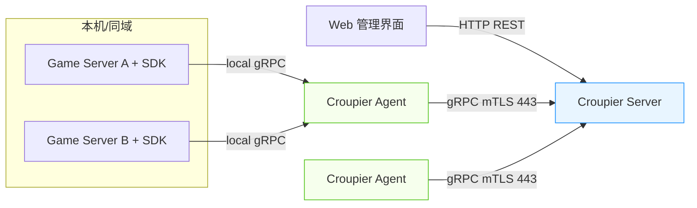
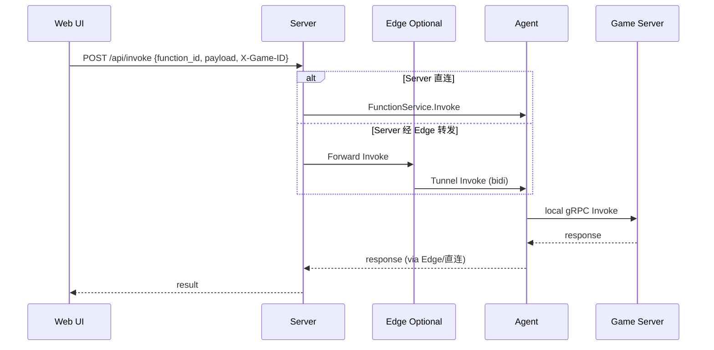
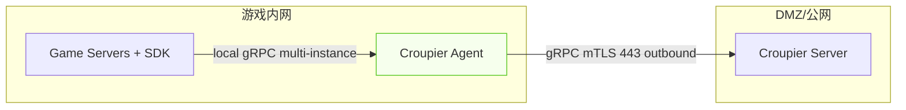
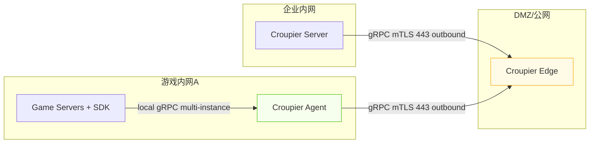

# Croupier - 游戏GM后台系统


Croupier 是一个专为游戏运营设计的通用 GM 后台系统，支持多语言游戏服务器接入，提供统一的管理界面与强大的扩展能力。

本 README 描述的是推荐的 vNext 架构：gRPC + mTLS、Descriptor 驱动 UI、Agent 外连拓扑。与现有实现兼容演进（现有 `croupier-proxy` 在本文中称为 Agent）。本文中原“Core”统一改称“Server”（croupier-server）。

## 📦 SDKs

- Go SDK（推荐优先）
  - 仓库：https://github.com/cuihairu/croupier-sdk-go
  - 子模块路径：`sdks/go`（已在本仓库引入）
  - 文档：`sdks/go/README.md`
  - 能力：注册本地函数到 Agent、承载 FunctionService、JSON 编解码、简单超时/重试拦截器
- C++ SDK（WIP）
  - 仓库：https://github.com/cuihairu/croupier-sdk-cpp
  - 子模块路径：`sdks/cpp`
  - 状态：占位，优先完成 Go 版本后逐步实现
- Java SDK（WIP）
  - 仓库：https://github.com/cuihairu/croupier-sdk-java
  - 子模块路径：`sdks/java`
  - 状态：占位，优先保证 Go 版本稳定后实现

使用建议
- 生产接入建议以 IDL 生成多语言 SDK；当前阶段 Go SDK 为最优先完善路径，其他语言逐步跟进。

## 🎯 核心特性

- 🔐 gRPC + mTLS：双向身份与加密传输（HTTP/2/443），内置重试/流控
- 🧩 IDL 生成：以 Proto 定义服务与消息，生成多语言 SDK（Go/Java/C++/Python）
- 🧱 Descriptor 驱动 UI：函数入参/出参、校验、敏感字段、超时等描述，自动生成表单与结果展示
- 📡 实时流式：支持长任务进度/日志流、订阅/推送
- 🛰️ Agent 外连：内网仅出站至 DMZ/Server，无需内网入站；多服务多路复用一条长连
- 🔑 细粒度权限：功能级/资源级/环境级 RBAC/ABAC，支持高危操作双人审批与审计
- 🧪 易扩展：Function 版本化与兼容协商、幂等键、灰度/回滚

## 🏗️ 系统架构

### 整体架构图（vNext）



### 调用与数据流
- Query（查询）同步返回；Command（命令）异步返回 `job_id`
- 长任务通过流式接口返回进度/日志，可取消/重试，保证幂等（`idempotency-key`）
- 所有函数字段由 Descriptor（JSON Schema/Proto 选其一）定义，UI/校验/鉴权共享同一描述
- Metadata：统一携带 `trace_id`（链路诊断）与 `game_id`/`env`（多游戏作用域）。HTTP 层通过 `X-Game-ID`/`X-Env` 透传至南向调用。
 
开发便捷性说明：骨架阶段为便于本地联调，Agent 在 `Register` 时会上报 `rpc_addr`，Server 通过该地址直连 Agent 完成调用（DEV ONLY）。生产将改为“Agent 外连双向流”模式，不需 Server 入内网。



## 🚀 快速开始

> 说明：如当前仓库仍提供 `croupier-proxy`，在落地 Agent 前，先以 `croupier-proxy` 作为 Agent 使用；命名将逐步迁移为 `croupier-agent`。

### 模式 1：同网部署（直连，简化）

适用于 Server 与 Game 在同一内网且允许直连的场景（仍建议使用 mTLS）。

```bash
# 1) 启动 Server（当前未实现 --config，直接使用显式参数）
./croupier server \
  --addr :8443 --http_addr :8080 \
  --rbac_config configs/rbac.json --games_config configs/games.json --users_config configs/users.json \
  --cert configs/dev/server.crt --key configs/dev/server.key --ca configs/dev/ca.crt

# 2) 游戏服务器 SDK 直接连接 Server（gRPC/mTLS）
./game-server
```

提示：
- 已支持使用 `--config` 指定 YAML 配置文件，或通过环境变量覆盖（前缀 `CROUPIER_SERVER_` 和 `CROUPIER_AGENT_`，例如 `CROUPIER_SERVER_ADDR=":8443"`、`CROUPIER_AGENT_SERVER_ADDR="127.0.0.1:8443"`）。
- 日志：新增 `--log.level`（debug|info|warn|error）、`--log.format`（console|json）与 `--log.file`（启用滚动日志：`--log.max_size`/`--log.max_backups`/`--log.max_age`/`--log.compress`）。
可参考 `configs/server.example.yaml` 与 `configs/agent.example.yaml`。

### 模式 2：Agent 外连（推荐）

Server 位于 DMZ/公网，Agent 在游戏内网，仅出站到 Server。游戏服只连本机/就近 Agent。

```bash
# 1) DMZ 启动 Server（显式参数）
./croupier-server \
  --addr :8443 --http_addr :8080 \
  --rbac_config configs/rbac.json --games_config configs/games.json --users_config configs/users.json \
  --cert configs/dev/server.crt --key configs/dev/server.key --ca configs/dev/ca.crt

# 2) 内网启动 Agent（显式参数；若二进制名仍为 proxy，请先用 proxy）
./croupier agent \
  --local_addr :19090 --core_addr 127.0.0.1:8443 --game_id default --env dev \
  --cert configs/dev/agent.crt --key configs/dev/agent.key --ca configs/dev/ca.crt
# 注：从此版本起，`--server_addr` 为 `--core_addr` 的别名（推荐使用 `--server_addr`），`--core_addr` 保留兼容并打印弃用提示。
# 或（历史命名）
./croupier-proxy \
  --local_addr :19090 --core_addr 127.0.0.1:8443 --game_id default --env dev \
  --cert configs/dev/agent.crt --key configs/dev/agent.key --ca configs/dev/ca.crt

# 3) 游戏服务器连接本机 Agent（gRPC）
./game-server
```


### 模式 3：Edge 转发（Server 在内网）

适用于 Server 无法部署在 DMZ/公网、又需要管理多条游戏内网的场景。

思路：在 DMZ/公网部署轻量 Edge，所有 Agent 主动外连 Edge；Server 从企业内网“仅出站”连到 Edge（mTLS/443），由 Edge 转发请求与路由。



运行流程（PoC 设计）：
- Edge：监听 9443，接受 Agent 外连并注册（ControlService）；同时暴露 FunctionService，对 Server 作为调用入口并转发到 Agent。
- Server：使用 `--edge_addr` 将 FunctionService 调用转发到 Edge；HTTP/UI 不变。
- Agent：将 `--core_addr` 指向 Edge 地址，实现“仅外连”注册。


### SDK 集成示例

以 Go 为例（通过 Proto 生成的 SDK）。

```proto
// proto/gm/function.proto
service FunctionService {
  rpc Invoke(InvokeRequest) returns (InvokeResponse);          // 短任务/查询
  rpc StartJob(InvokeRequest) returns (StartJobResponse);      // 长任务/命令
  rpc StreamJob(JobStreamRequest) returns (stream JobEvent);   // 进度/日志
}
```

```json
// descriptors/player.ban.json - 函数描述符（驱动 UI/校验/鉴权）
{
  "id": "player.ban",
  "version": "1.2.0",
  "category": "player",
  "risk": "high",
  "auth": { "permission": "player.ban", "two_person_rule": true },
  "params": {
    "$schema": "https://json-schema.org/draft/2020-12/schema",
    "type": "object",
    "properties": {
      "player_id": { "type": "string" },
      "reason": { "type": "string" }
    },
    "required": ["player_id"]
  },
  "semantics": {
    "mode": "command",
    "idempotency_key": true,
    "timeout": "30s",
    "returns": "job"
  }
}
```

```go
// examples/go-server/main.go（最小示例，已在仓库提供）
// 1) 连接本机 Agent 2) 注册函数 3) 启动本地服务并向 Agent 报到
cli := sdk.NewClient(sdk.ClientConfig{Addr: "127.0.0.1:19090", LocalListen: "127.0.0.1:0"})
_ = cli.RegisterFunction(sdk.Function{ID: "player.ban", Version: "1.2.0"}, handler)
_ = cli.Connect(context.Background())
```

访问 `http://localhost:8080` 可使用由 Descriptor 自动生成的管理界面。

### 命令行快速验证（示例）

```bash
# 登录获取 token（默认示例用户）
curl -sS http://localhost:8080/api/auth/login \
  -H 'Content-Type: application/json' \
  -d '{"username":"admin","password":"admin123"}' | jq -r .token | tee /tmp/token

# 查看当前用户
curl -sS http://localhost:8080/api/auth/me \
  -H "Authorization: Bearer $(cat /tmp/token)" | jq

# 查看可用的函数描述符
curl -sS http://localhost:8080/api/descriptors \
  -H "Authorization: Bearer $(cat /tmp/token)" | jq '.[] | {id,version}'

#（可选）查看某函数的实例列表（用于 targeted 路由）
curl -sS "http://localhost:8080/api/function_instances?function_id=player.ban&game_id=default" \
  -H "Authorization: Bearer $(cat /tmp/token)" | jq

# 执行函数（lb 路由）
curl -sS http://localhost:8080/api/invoke \
  -H "Authorization: Bearer $(cat /tmp/token)" \
  -H 'Content-Type: application/json' \
  -H 'X-Game-ID: default' \
  -d '{"function_id":"player.ban","payload":{"player_id":"1001","reason":"test"},"route":"lb"}' | jq

# 执行函数（broadcast，对所有实例执行并聚合结果）
curl -sS http://localhost:8080/api/invoke \
  -H "Authorization: Bearer $(cat /tmp/token)" \
  -H 'Content-Type: application/json' \
  -H 'X-Game-ID: default' \
  -d '{"function_id":"player.ban","payload":{"player_id":"1002"},"route":"broadcast"}' | jq

# 执行函数（targeted，定向到目标实例，需要先查询 service_id）
TARGET=$(curl -sS "http://localhost:8080/api/function_instances?function_id=player.ban&game_id=default" \
  -H "Authorization: Bearer $(cat /tmp/token)" | jq -r '.instances[0].service_id')
curl -sS http://localhost:8080/api/invoke \
  -H "Authorization: Bearer $(cat /tmp/token)" \
  -H 'Content-Type: application/json' \
  -H 'X-Game-ID: default' \
  -d '{"function_id":"player.ban","payload":{"player_id":"1003"},"route":"targeted","target_service_id":"'"$TARGET"'"}' | jq

# 执行函数（hash，基于字段稳定路由到实例；需提供 hash_key）
curl -sS http://localhost:8080/api/invoke \\
  -H "Authorization: Bearer $(cat /tmp/token)" \\
  -H 'Content-Type: application/json' \\
  -H 'X-Game-ID: default' \\
  -d '{"function_id":"player.ban","payload":{"player_id":"1004"},"route":"hash","hash_key":"1004"}' | jq
```

更多接口（示例）
```bash
# 查看注册表（Agent 概览与函数覆盖）
curl -sS http://localhost:8080/api/registry \
  -H "Authorization: Bearer $(cat /tmp/token)" | jq

# 查询审计（可带 game_id/env/actor/kind）
curl -sS "http://localhost:8080/api/audit?game_id=default&limit=50" \
  -H "Authorization: Bearer $(cat /tmp/token)" | jq '.events[-5:]'

# 健康与指标（Server/Edge/Agent）
curl -sS http://localhost:8080/healthz && echo
curl -sS http://localhost:8080/metrics | jq
curl -sS http://localhost:9080/metrics | jq   # Edge
curl -sS http://localhost:19091/metrics | jq  # Agent

# 查询作业结果（Server 直连模式与 Edge 转发模式均可用）
curl -sS "http://localhost:8080/api/job_result?id=<job_id>" \
  -H "Authorization: Bearer $(cat /tmp/token)" | jq
```

## 🧭 多游戏管理（Game/Env 作用域）

为支持一个 Server 管理多款游戏/多环境，引入作用域并贯穿全链路。

- 作用域字段
  - `game_id`：必填，游戏标识（示例：`game_kr`、`game_en`、`game_x`）
  - `env`：可选，环境（`prod`/`stage`/`test`）
  - `cluster`/`region`：可选标签，便于进一步路由与展示

- 协议与注册（建议）
  - Control.RegisterRequest：新增 `game_id`、`env`（Agent 注册时上报自身作用域）
  - Function.InvokeRequest：`Metadata["game_id"]`/`Metadata["env"]` 作为路由依据

- 路由与索引
  - Registry 改为“按 (game_id, function_id)”索引 Agent；pickAgent 时需传入 `game_id`
  - Job 路由：记录 job_id → (game_id, agent_addr) 映射

- HTTP & UI
  - HTTP 请求头：`X-Game-ID`、`X-Env`；后端透传到 `InvokeRequest.Metadata`
  - 前端提供 Game/Env 切换器（全局状态），所有 API 自动附带头信息

- SDK
  - 增加全局默认 `game_id` 与每次调用覆盖的能力；或在注册阶段绑定作用域

- RBAC 与审计
  - RBAC：支持作用域的细粒度控制（示例：`game:<game_id>:function:<id>` 或 ABAC 属性匹配）
  - 审计：记录 `game_id`/`env`，查询时按作用域过滤

## 📋 项目结构（建议）

```
croupier/
├── cmd/
│   ├── server/               # Server 进程
│   ├── agent/                # Agent 进程（原 proxy）
│   └── cli/                  # 命令行工具
├── proto/                    # gRPC Proto（IDL 源）
├── descriptors/              # 函数描述符（JSON Schema/元数据）
├── internal/
│   ├── server/               # Server 业务
│   ├── agent/                # Agent 业务
│   ├── auth/                 # OIDC/mTLS/会话管理
│   ├── function/             # 路由、幂等、重试、版本协商
│   ├── jobs/                 # Job 状态机与队列
│   └── web/                  # Web 后端
├── pkg/
│   ├── protocol/             # 公共协议常量/拦截器（暂留）
│   └── types/                # 公共类型（暂留）
├── sdks/
│   └── go/                   # Go SDK 子模块（croupier-sdk-go）
│   └── cpp/                  # C++ SDK 子模块（croupier-sdk-cpp）（后续实现）
│   └── java/                 # Java SDK 子模块（croupier-sdk-java）（后续实现）
├── web/                      # 前端子模块（croupier-web）
├── configs/                  # 配置
├── scripts/                  # 部署脚本
├── docs/                     # 文档
└── examples/                 # 示例
```

## 🔐 安全与权限

### 认证与授权（MVP）
- 登录：POST `/api/auth/login`（Body: `{username,password}`）返回 `{token,user}`；前端保存 token 并通过 `Authorization: Bearer <token>` 访问 /api/*
- 会话：GET `/api/auth/me` 返回 `{username,roles}`；未登录 401
- 权限：RBAC 支持函数级 + 作用域（例如 `game:<game_id>:function:<id>`、`game:<game_id>:*`、`*`）；支持基于 `role:<role>` 的规则

### 传输与身份
- mTLS：Server/Edge/Agent 默认要求提供 `--cert/--key/--ca`，Agent 外连必须启用 mTLS；证书颁发与轮换可接入 SPIFFE/SPIRE、ACME 或企业 CA
- 出站：通信仅走 443/HTTP/2；Agent/SDK 统一出站（便于穿透防火墙/代理）

### 审计与防护
- 全量审计：功能 ID、调用人、参数摘要（敏感字段散列）、目标资源、结果、耗时、traceId
- 日志防篡改：链式哈希或外部归档；保留周期与合规策略可配置
- 限流与背压：连接数/并发/速率限制，超时与熔断策略

## 部署与配置（建议）

- TLS/mTLS（默认开启）
  - Server/Edge/Agent 均要求 `--cert/--key/--ca`（Agent 外连必须 mTLS）
  - 开发可使用 `./scripts/dev-certs.sh` 生成自签证书
  - 证书颁发建议 SPIFFE/SPIRE 或企业 CA，并定期轮换
- 认证与前端
  - 登录 `POST /api/auth/login` → 保存 token；前端请求自动附带 `Authorization: Bearer <token>`
  - 开发时 CORS 放开；生产建议反向代理或同域部署前端
- 多游戏作用域
  - 后台添加 game_id/env（`/api/games`）后，Agent 才能注册成功（白名单 Gate）
  - 所有调用带 `X-Game-ID`/`X-Env`，后端透传到元数据用于路由与审计
- 可观测与运行
  - Server/Edge/Agent 暴露 `/healthz` 与 `/metrics`（JSON）
  - Edge 指标包含隧道连接数/待处理/作业映射与累积事件计数
- 容器化
  - 提供 `Dockerfile.*` 与 `docker-compose.yml`，一键构建与运行（需先生成 dev 证书）

## ⚙️ 调用模型

- Query：同步调用，超时短；适用于查询/校验
- Command：异步调用，返回 `job_id`；支持取消/重试/进度/日志
- 幂等：以 `idempotency-key` 去重；服务端记录窗口以防重放
- 版本协商：函数 `id@semver`；Server/Agent/SDK 通过特性协商降级

## 🗺️ 演进与兼容

- 现有 `croupier-proxy` 可作为 Agent 使用；后续重命名为 `croupier-agent`
- 保持向后兼容：先引入 TLS 与 Descriptor，再平滑迁移到 gRPC 接口

## 🗓️ 开发计划（详细）

说明：以下为以“可运行骨架优先”的拆解，默认以周为单位推进，可并行的任务已标注。

- Phase 0：基础设施与脚手架（1 周）
  - 目标：统一 IDL/生成链路与目录结构，打通本地开发。
  - 任务：
    - 引入 Buf/Protobuf 工具链（`proto/` + `buf.yaml` + `buf.gen.yaml`）
    - 规划目录：`cmd/server`、`cmd/agent`、`pkg/sdk`、`internal/{server,agent,function,jobs}`、`descriptors/`
    - Make 目标与 CI（lint、build、unit、buf lint/breaking）
  - DoD：`make dev` 一键起本地开发；`buf lint`、`go test ./...` 通过

- Phase 1：gRPC + mTLS 南向最小骨架（2 周）
  - 目标：Server/Agent/Go SDK 直连，具备注册/调用/健康检查能力。
  - 任务：
    - 定义基础 Proto：`FunctionService.Invoke`、`ControlService.Register/Heartbeat`、标准错误码
    - mTLS：自签或 SPIFFE/SPIRE 接入；Keepalive/连接复用/超时配置
    - Agent：出站长连到 Server，承载多游戏服复用；本地 gRPC 监听供 SDK 使用
    - Go SDK：连接管理、拦截器（超时/重试/trace）与简单示例
  - DoD：示例游戏服通过 Agent 注册 1 个函数，并被 Server 端成功 Invoke；TLS 轮换演练通过；e2e 冒烟用例通过

- Phase 2：Descriptor 驱动 UI（2 周，可与 Phase 1 后半重叠）
  - 目标：由描述符自动生成参数表单与校验，实现从 UI 到后端的真实闭环。
  - 任务：
    - 定义 Descriptor Schema（JSON Schema + 元数据：风险、敏感字段、超时、幂等键等）
    - 后端提供 Descriptor 列表/详情 API；参数校验与错误返回标准化
    - 前端：动态表单渲染、字段级脱敏占位、结果展示
  - DoD：`player.ban` 通过 UI 表单执行成功，前后端共享同一 Schema 校验

- Phase 3：Job 模型与流式通道（2 周）
  - 目标：支持长任务异步执行、进度/日志流、取消与幂等。
  - 任务：
    - gRPC：`StartJob`、`StreamJob`、`CancelJob`；事件模型（进度、日志、完成、失败）
    - Job Store：内存实现 + 可插拔（后续 Redis/SQL）；并发/队列与背压控制
    - 幂等键与窗口；超时与重试策略；UI 进度条/日志流
  - DoD：10k+ 事件稳定流式播放；取消/重试可用；参数相同 + 幂等键重复提交不产生重复副作用

- Phase 4：认证与权限（2 周）
  - 目标：落地 OIDC 登录、细粒度授权、审批与审计。
  - 任务：
    - OIDC 登录 + 会话；角色与权限模型（功能/资源/环境 维度）
    - 高危操作双人审批；执行理由与变更单号记录
    - 审计：不可篡改（链式哈希/外部归档）；字段级脱敏
  - DoD：`player.ban@prod` 需审批方可执行；审计链完整且可校验

- Phase 5：多语言 SDK 生成与示例（2 周）
  - 目标：以 IDL 生成 Go/Java/Python/C++ 客户端，提供最小示例与文档。
  - 任务：
    - Buf 多语言生成；统一拦截器（鉴权/重试/trace）与示例工程（`examples/*`）
    - 文档：集成指南、错误码、超时/重试/幂等最佳实践
  - DoD：多语言 e2e 冒烟用例通过（注册 + 调用 + Job 流）

- Phase 6：可观测性与 SRE（1 周）
  - 目标：上线所需的观测与基线性能。
  - 任务：
    - 指标：QPS、P99、失败率、活动连接、队列长度；Tracing（OpenTelemetry）
    - Dashboards/Alerts；压测报告与基线（目标 P99/吞吐）
  - DoD：仪表盘与告警生效；压测指标达标

- Phase 7：兼容与迁移（1 周）
  - 目标：从现有 Proxy/TCP 迁移到 Agent/gRPC，保障平滑过渡。
  - 任务：
    - `croupier-proxy` 重命名与配置兼容；必要时提供桥接层
    - 迁移指引文档与回滚策略
  - DoD：试点业务零停机迁移，出现问题可一键回滚

- Phase 8：多游戏作用域（1 周）
  - 目标：引入 Game/Env 作用域，打通注册、路由、调用、审计
  - 任务：
    - 协议：Control.RegisterRequest 增 `game_id`/`env`；Invoke 元数据透传
    - Registry：按 (game_id,function_id) 索引；HTTP 透传 `X-Game-ID`/`X-Env`
    - UI：全局 Game/Env 切换器；RBAC 权限与审计增加作用域
  - DoD：不同 `game_id` 的函数路由隔离；审计可按 `game_id` 查询

- Phase 9：Edge PoC（1 周）
- 目标：在 Server 不出网场景，通过 Edge 转发实现 Server↔Agent 联通
  - 任务：
    - `cmd/edge` 进程：接收 Agent 外连；Server 出站连 Edge；双向流隧道
    - 转发：Function/Control 请求/响应的多路复用与路由
    - TLS 与鉴权：沿用 mTLS 身份，Edge 仅转发合法实体
  - DoD：Server 内网仅出站，Agent 外连 Edge，功能调用正常

里程碑验收清单（节选）
- e2e：`examples/go-server` 可注册/调用/长任务/取消/审计全链路跑通
- 安全：mTLS 双向认证；OIDC/MFA 登录；审批 + 审计链可验证
- 可靠性：连接保活/重连、限流背压、幂等去重；灰度与版本协商
- 观测：Tracing 贯通 Server/Agent/SDK；指标完整并可告警

## 🤝 贡献

```bash
# 克隆
git clone https://github.com/cuihairu/croupier.git
cd croupier

# Go 依赖（需网络）
go mod download

# 生成开发用 TLS 证书（本地自签，生成到 configs/dev/）
./scripts/dev-certs.sh

# 生成 Proto 代码（需安装 buf 与 protoc 插件，或在 CI 里跑；本地有手写 stub 可直接编译）
buf lint && buf generate

# 构建 Server 与 Agent
make build

# 本地运行（在两个终端中）：
# 1) Server（示例参数，需自备 TLS 证书）
./bin/croupier-server --addr :8443 --http_addr :8080 --rbac_config configs/rbac.json \
  --cert configs/dev/server.crt --key configs/dev/server.key --ca configs/dev/ca.crt
# 2) Agent（本地明文监听，mTLS 连接 Server）
./bin/croupier-agent --local_addr :19090 --core_addr 127.0.0.1:8443 --cert configs/dev/agent.crt --key configs/dev/agent.key --ca configs/dev/ca.crt
# 3) 示例游戏服连接 Agent
go run ./examples/go-server

# 4) 直连调用示例（Invoker）
go run ./examples/go-invoker

# 子模块（前端、SDK）
# 初始化/更新子模块
git submodule update --init --recursive

# 前端开发（在子模块仓库中运行；建议 antd-pro/umi 默认 8000 端口）
cd web
npm install
npm run dev  # 或 npm run start

# 生产构建
npm run build  # 产物到 web/dist，Server 会优先静态服务 web/dist

# Go SDK（子模块：sdks/go）
# 建议直接在业务工程中引用模块路径 github.com/cuihairu/croupier-sdk-go；
# 在本仓库内开发/联调时，可在 go.mod 用 replace 指向 ./sdks/go。

# C++ SDK（子模块：sdks/cpp）
# 当前仅添加为子模块占位，优先完成 Go 版本后再逐步实现 C++ 版本。

# Java SDK（子模块：sdks/java）
# 同上，作为占位先引入，优先保证 Go 版本稳定，随后实现 Java 版本。

CI 提示
- CI 已配置检出子模块（submodules: recursive）。如需在本地一键初始化，请运行：`make submodules`。

# 调用验证（浏览器访问）
# 开发：访问 http://localhost:8000（前端 dev server）
# 生产：构建后访问 http://localhost:8080（Server 静态服务 web/dist）；/api/* 为后端接口
# 前端请求默认附带 Authorization: Bearer <token>（登录后自动注入）
```

提交流程：Fork → 分支 → 提交 → 推送 → PR。

## 📖 文档

- docs/api.md
- docs/sdk-development.md
- docs/deployment.md
- docs/security.md

## 📄 许可证

本项目采用 MIT 许可证 - 详见 LICENSE。

---

Croupier - 让游戏运营变得简单而强大 🎮
# Edge PoC（Server 内网仅出站）
# 1) 启动 Edge
./croupier edge --addr :9443 --games_config configs/games.json \
  --cert configs/dev/server.crt --key configs/dev/server.key --ca configs/dev/ca.crt
# 2) Server 出站到 Edge（转发 Function 调用）
./croupier server --addr :8443 --http_addr :8080 --edge_addr 127.0.0.1:9443 \
  --rbac_config configs/rbac.json --games_config configs/games.json \
  --cert configs/dev/server.crt --key configs/dev/server.key --ca configs/dev/ca.crt
# 3) Agent 指向 Edge 外连
./croupier agent --local_addr :19090 --core_addr 127.0.0.1:9443 --game_id default --env dev \
  --cert configs/dev/agent.crt --key configs/dev/agent.key --ca configs/dev/ca.crt
### 容器化部署（示例）

```bash
# 准备开发证书
./scripts/dev-certs.sh

# 构建容器并启动（Server/Edge/Agent）
docker compose up --build

# Web 前端（子模块 web）单独启动 dev，或将构建产物挂载到 Server 静态目录
```

登录后获取 token，前端会自动附带 Authorization 进行调用。

### 路由策略（lb / broadcast / targeted / hash）
- 默认路由可在 `descriptors/*` 的 `semantics.route` 声明（如 `lb`）。
- 运行时可在 GM 界面选择 `lb` / `broadcast` / `targeted` / `hash`：
  - `lb`：轮询本地多实例
  - `broadcast`：对所有实例执行，结果聚合为 JSON 数组
  - `targeted`：需要选择目标实例（调用 `/api/function_instances` 获取实例列表），执行时会传 `target_service_id`
  - `hash`：对 `hash_key` 做一致性哈希（当前实现为简单 FNV32 模运算），用于基于字段（如 `player_id`）定向到固定实例
