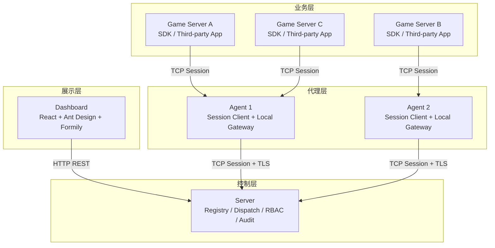

<p align="center">
  
</p>

# Croupier Platform

[](https://github.com/cuihairu/croupier/actions/workflows/ci.yml)
[](https://github.com/cuihairu/croupier/releases)
[](https://codecov.io/gh/cuihairu/croupier)
[](https://github.com/cuihairu/croupier/actions/workflows/docker.yml)


Croupier 是面向游戏运营与控制场景的 Server / Agent / SDK 平台。当前架构已经收敛到“统一 session 传输”方向：

- `Agent <-> Server`：默认采用 `TCP session`，默认启用 `TLS`
- `SDK <-> Agent`：默认采用 `TCP session`，默认不启用 `TLS`，按需开启
- 两条链路共享同一套 session 传输基座，只在首条握手消息和业务语义上区分子协议

## Highlights

- 统一的函数注册、调度、调用与作业模型
- 轻量 session 传输：单连接、双向请求、可重连、可背压、可摘流
- JSON payload + protobuf 信封，兼顾跨语言一致性与接入成本
- Formily + JSON Schema 驱动的控制台 UI

## SDK 生态

当前官方 SDK 仓库独立维护，主仓库提供协议、架构和统一接入规范。

### 主项目与协议

| 项目 | 描述 | 链接 |
| --- | --- | --- |
| **Croupier** | 游戏后端平台主项目 | [cuihairu/croupier](https://github.com/cuihairu/croupier) |
| **Croupier Proto** | 协议定义（Protobuf/gRPC） | [cuihairu/croupier-proto](https://github.com/cuihairu/croupier-proto) |

### 官方 SDK

| 语言 | 仓库 | Nightly | Release | Docs | Coverage |
| --- | --- | --- | --- | --- | --- |
| Go | [croupier-sdk-go](https://github.com/cuihairu/croupier-sdk-go) | [](https://github.com/cuihairu/croupier-sdk-go/actions/workflows/nightly.yml) | [](https://github.com/cuihairu/croupier-sdk-go/releases) | [](https://cuihairu.github.io/croupier-sdk-go/) | [](https://codecov.io/gh/cuihairu/croupier-sdk-go) |
| JS/TS | [croupier-sdk-js](https://github.com/cuihairu/croupier-sdk-js) | [](https://github.com/cuihairu/croupier-sdk-js/actions/workflows/nightly.yml) | [](https://github.com/cuihairu/croupier-sdk-js/releases) | [](https://cuihairu.github.io/croupier-sdk-js/) | [](https://codecov.io/gh/cuihairu/croupier-sdk-js) |
| Python | [croupier-sdk-python](https://github.com/cuihairu/croupier-sdk-python) | [](https://github.com/cuihairu/croupier-sdk-python/actions/workflows/nightly.yml) | [](https://github.com/cuihairu/croupier-sdk-python/releases) | [](https://cuihairu.github.io/croupier-sdk-python/) | [](https://codecov.io/gh/cuihairu/croupier-sdk-python) |
| Java | [croupier-sdk-java](https://github.com/cuihairu/croupier-sdk-java) | [](https://github.com/cuihairu/croupier-sdk-java/actions/workflows/nightly.yml) | [](https://github.com/cuihairu/croupier-sdk-java/releases) | [](https://cuihairu.github.io/croupier-sdk-java/) | [](https://codecov.io/gh/cuihairu/croupier-sdk-java) |
| C# | [croupier-sdk-csharp](https://github.com/cuihairu/croupier-sdk-csharp) | [](https://github.com/cuihairu/croupier-sdk-csharp/actions/workflows/nightly.yml) | [](https://github.com/cuihairu/croupier-sdk-csharp/releases) | [](https://cuihairu.github.io/croupier-sdk-csharp/) | [](https://codecov.io/gh/cuihairu/croupier-sdk-csharp) |
| C++ | [croupier-sdk-cpp](https://github.com/cuihairu/croupier-sdk-cpp) | [](https://github.com/cuihairu/croupier-sdk-cpp/actions/workflows/nightly.yml) | [](https://github.com/cuihairu/croupier-sdk-cpp/releases) | [](https://cuihairu.github.io/croupier-sdk-cpp/) | [](https://codecov.io/gh/cuihairu/croupier-sdk-cpp) |
| Lua | [croupier-sdk-cpp](https://github.com/cuihairu/croupier-sdk-cpp) | - | - | [](https://cuihairu.github.io/croupier-sdk-cpp/) | - |

## 当前架构


```mermaid
graph TB
  subgraph "展示层"
    UI[Dashboard<br/>React + Ant Design + Formily]
  end

  subgraph "控制层"
    Server[Server<br/>Registry / Dispatch / RBAC / Audit]
  end

  subgraph "代理层"
    Agent1[Agent 1<br/>Session Client + Local Gateway]
    Agent2[Agent 2<br/>Session Client + Local Gateway]
  end

  subgraph "业务层"
    GS1[Game Server A<br/>SDK / Third-party App]
    GS2[Game Server B<br/>SDK / Third-party App]
    GS3[Game Server C<br/>SDK / Third-party App]
  end

  UI -->|HTTP REST| Server
  Agent1 -->|TCP Session + TLS| Server
  Agent2 -->|TCP Session + TLS| Server
  GS1 -->|TCP Session| Agent1
  GS2 -->|TCP Session| Agent2
  GS3 -->|TCP Session| Agent1
```

关键边界说明：

- `Server` 不再依赖反向直连 `Agent` 暴露的 `rpc_addr`
- `Agent` 本地监听只服务 `GameServer / SDK / 第三方应用`
- `Server -> Agent` 的 `Invoke / StartJob / CancelJob / Ops` 都应复用既有 `Agent-Server` session

## Session 模型

Croupier 当前的核心传输抽象是轻量的应用层 session：

- 一条可靠长连接
- 首条消息完成身份与能力协商
- 同一连接上双向发起新请求
- 多个并发 in-flight 请求复用
- heartbeat / reconnect / drain / backpressure

这也是为什么当前文档中会出现两个术语：

- `shared session runtime`
  - 指共享的传输基座：`tcp/tls + framing + mux + reconnect + heartbeat + drain`
- `subprotocol`
  - 指运行在该基座上的不同子协议
  - 例如：
    - `sdk-agent subprotocol`
    - `agent-server subprotocol`

`subprotocol` 不是“个性化配置”，而是“共享同一套 session 运行时，但握手消息、注册内容和路由语义不同的应用层协议变体”。

## 文档入口

- 架构总览：[docs/architecture/README.md](docs/architecture/README.md)
- SDK-Agent 设计：[docs/architecture/sdk-agent-transport-redesign.md](docs/architecture/sdk-agent-transport-redesign.md)
- Agent-Server 设计：[docs/architecture/agent-server-session-transport-redesign.md](docs/architecture/agent-server-session-transport-redesign.md)
- Wire 协议：[docs/architecture/sdk-wire-protocol.md](docs/architecture/sdk-wire-protocol.md)
- SDK 规范：[docs/sdk/specification.md](docs/sdk/specification.md)
- SDK 汇总入口：[sdks/README.md](sdks/README.md)

## 仓库导航

| 组件 | 位置 | 说明 |
| --- | --- | --- |
| Server / Agent | `cmd/`, `internal/` | 控制面、代理、调度、审计、注册与作业 |
| Proto | `proto/` | protobuf 定义与生成入口 |
| Dashboard | `dashboard/` | Web 控制台 |
| Examples / Tools | `examples/`, `tools/` | 示例和辅助工具 |
| Docs | `docs/` | 架构、指南、API 与 SDK 文档 |

## 快速开始

1. 拉取代码与子模块

```bash
git clone git@github.com:cuihairu/croupier.git
cd croupier
git submodule update --init --recursive
```

2. 安装工具链

- Go 1.26+
- Node.js / pnpm
- `buf`
- `protoc`

3. 构建

```bash
make dev
```

4. 启动

```bash
./bin/croupier-server --config configs/server.yaml
./bin/croupier-agent --config configs/agent.example.yaml
```

5. 查看 Dashboard

```bash
cd dashboard
pnpm install
pnpm dev
```
