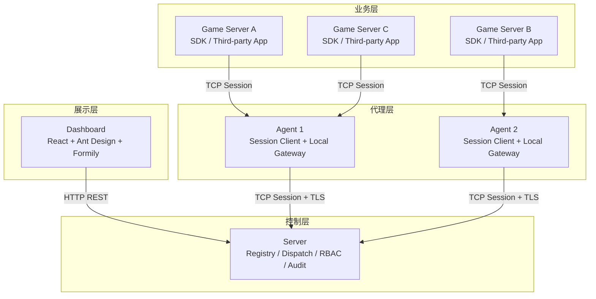

<p align="center">
  
</p>

# Croupier Platform

[](https://github.com/cuihairu/croupier/actions/workflows/ci.yml)
[](https://github.com/cuihairu/croupier/releases)
[](https://codecov.io/gh/cuihairu/croupier)
[](https://github.com/cuihairu/croupier/actions/workflows/docker.yml)


Croupier 是面向游戏运营与控制场景的 Server / Agent / SDK 平台。当前架构已经收敛到“统一 session 传输”方向：

- `Agent <-> Server`：默认采用 `TCP session`，默认启用 `TLS`
- `SDK <-> Agent`：默认采用 `TCP session`，默认不启用 `TLS`，按需开启
- 两条链路共享同一套 session 传输基座，只在首条握手消息和业务语义上区分子协议

## Highlights

- 统一的函数注册、调度、调用与作业模型
- 轻量 session 传输：单连接、双向请求、可重连、可背压、可摘流
- JSON payload + protobuf 信封，兼顾跨语言一致性与接入成本
- Formily + JSON Schema 驱动的控制台 UI

## SDK 生态

所有官方 SDK 已整合到 monorepo 的 `sdks/` 目录下统一维护。

### 官方 SDK

| 语言 | 目录 | Build | Coverage | Docs |
| --- | --- | --- | --- | --- |
| Go | `sdks/go/` | [](https://github.com/cuihairu/croupier/actions/workflows/ci-sdk-go.yml) | [](https://codecov.io/gh/cuihairu/croupier) | [README](sdks/go/README.md) |
| JS/TS | `sdks/js/` | [](https://github.com/cuihairu/croupier/actions/workflows/ci-sdk-js.yml) | [](https://codecov.io/gh/cuihairu/croupier) | [README](sdks/js/README.md) |
| Python | `sdks/python/` | [](https://github.com/cuihairu/croupier/actions/workflows/ci-sdk-python.yml) | [](https://codecov.io/gh/cuihairu/croupier) | [README](sdks/python/README.md) |
| Java | `sdks/java/` | [](https://github.com/cuihairu/croupier/actions/workflows/ci-sdk-java.yml) | [](https://codecov.io/gh/cuihairu/croupier) | [README](sdks/java/README.md) |
| C# | `sdks/csharp/` | [](https://github.com/cuihairu/croupier/actions/workflows/ci-sdk-csharp.yml) | [](https://codecov.io/gh/cuihairu/croupier) | [README](sdks/csharp/README.md) |
| C++ | `sdks/cpp/` | [](https://github.com/cuihairu/croupier/actions/workflows/ci-sdk-cpp.yml) | Not wired yet | [README](sdks/cpp/README.md) |

## 当前架构


```mermaid
graph TB
  subgraph "展示层"
    UI[Dashboard<br/>React + Ant Design + Formily]
  end

  subgraph "控制层"
    Server[Server<br/>Registry / Dispatch / RBAC / Audit]
  end

  subgraph "代理层"
    Agent1[Agent 1<br/>Session Client + Local Gateway]
    Agent2[Agent 2<br/>Session Client + Local Gateway]
  end

  subgraph "业务层"
    GS1[Game Server A<br/>SDK / Third-party App]
    GS2[Game Server B<br/>SDK / Third-party App]
    GS3[Game Server C<br/>SDK / Third-party App]
  end

  UI -->|HTTP REST| Server
  Agent1 -->|TCP Session + TLS| Server
  Agent2 -->|TCP Session + TLS| Server
  GS1 -->|TCP Session| Agent1
  GS2 -->|TCP Session| Agent2
  GS3 -->|TCP Session| Agent1
```

关键边界说明：

- `Server` 不再依赖反向直连 `Agent` 暴露的 `rpc_addr`
- `Agent` 本地监听只服务 `GameServer / SDK / 第三方应用`
- `Server -> Agent` 的 `Invoke / StartTask / CancelTask / Ops` 都应复用既有 `Agent-Server` session

## Session 模型

Croupier 当前的核心传输抽象不是 `历史消息模式`，而是轻量的应用层 session：

- 一条可靠长连接
- 首条消息完成身份与能力协商
- 同一连接上双向发起新请求
- 多个并发 in-flight 请求复用
- heartbeat / reconnect / drain / backpressure

这也是为什么当前文档中会出现两个术语：

- `shared session runtime`
  - 指共享的传输基座：`tcp/tls + framing + mux + reconnect + heartbeat + drain`
- `subprotocol`
  - 指运行在该基座上的不同子协议
  - 例如：
    - `sdk-agent subprotocol`
    - `agent-server subprotocol`

`subprotocol` 不是“个性化配置”，而是“共享同一套 session 运行时，但握手消息、注册内容和路由语义不同的应用层协议变体”。

## 文档入口

- 架构总览：[docs/architecture/README.md](docs/architecture/README.md)
- SDK-Agent 设计：[docs/architecture/sdk-agent-transport-redesign.md](docs/architecture/sdk-agent-transport-redesign.md)
- Agent-Server 设计：[docs/architecture/agent-server-session-transport-redesign.md](docs/architecture/agent-server-session-transport-redesign.md)
- Wire 协议：[docs/architecture/sdk-wire-protocol.md](docs/architecture/sdk-wire-protocol.md)
- SDK 规范：[docs/sdk/specification.md](docs/sdk/specification.md)
- SDK 汇总入口：[sdks/README.md](sdks/README.md)

## 仓库导航

| 组件 | 位置 | 说明 |
| --- | --- | --- |
| Server / Agent | `cmd/`, `internal/` | 控制面、代理、调度、审计、注册与作业 |
| Proto | `proto/` | protobuf 定义与生成入口（单源） |
| SDKs | `sdks/` | 多语言 SDK（go, js, python, java, csharp, cpp） |
| Dashboard | `web/` | Web 控制台（React + Ant Design） |
| Examples / Tools | `examples/`, `tools/` | 示例和辅助工具 |
| Docs | `docs/` | 架构、指南、API 与 SDK 文档 |

### SDK 目录结构

| 语言 | 目录 |
| --- | --- |
| Go | `sdks/go/` |
| JS/TS | `sdks/js/` |
| Python | `sdks/python/` |
| Java | `sdks/java/` |
| C# | `sdks/csharp/` |
| C++ | `sdks/cpp/` |

## 快速开始

1. 拉取代码

```bash
git clone https://github.com/cuihairu/croupier.git
cd croupier
```

2. 安装工具链

- Go 1.26+
- Node.js 22+ / pnpm
- `buf`
- `protoc`

3. 安装 pre-commit hook（推荐）

```bash
cp scripts/pre-commit .git/hooks/pre-commit && chmod +x .git/hooks/pre-commit
```

4. 构建

```bash
make dev
```

5. 启动

```bash
./bin/croupier-server --config configs/server.yaml
./bin/croupier-agent --config configs/agent.yaml
```

6. 查看 Dashboard

```bash
cd web
pnpm install
pnpm dev
```

## 说明

当前仓库中仍有部分历史文档引用 `gRPC`、`历史 REQ/REP`、`LocalControl`、`rpc_addr` 或 SDK 本地监听模型。
这些内容正在按“统一 TCP session + subprotocol”设计逐步清理，不应再作为新的实现依据。
