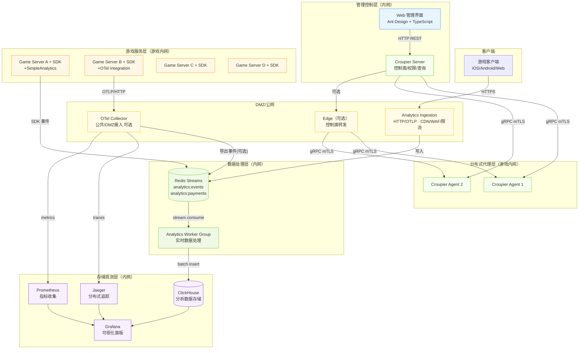
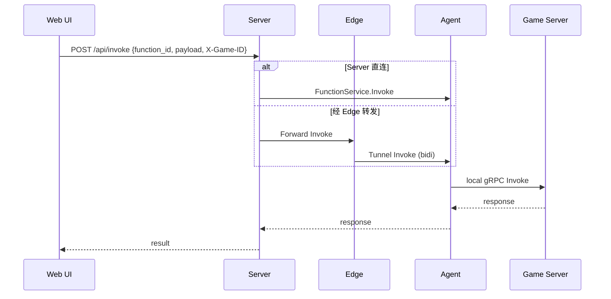

# Croupier Platform

[](https://github.com/cuihairu/croupier/actions/workflows/ci.yml)
[](https://codecov.io/gh/cuihairu/croupier)
[](https://github.com/cuihairu/croupier/actions/workflows/docker.yml)


统一的游戏运营控制面：Server / Agent / Edge 服务负责安全合规与函数路由，Dashboard 由 X‑Render 驱动自动生成 UI，SDK 覆盖多语言并保持 Nightly 构建。这个仓库承载主进程、示例与公共配置，其余组件拆分为独立仓库并通过子模块引用。

---

## ✨ Highlights
- **零信任安全**：gRPC+mTLS、细粒度 RBAC/ABAC、操作审批与审计日志。
- **函数注册控制**：游戏服务器通过 Agent 注册函数，控制面统一调用、可视化进度与日志。
- **Schema 驱动 UI**：X-Render + JSON Schema 自动生成表单、风控提示、参数校验。
- **可观测性解耦**：控制面与遥测面分离，Analytics Worker 通过 Redis Streams / ClickHouse 处理实时事件。
- **多语言 SDK**：Go / C++ / Java / JS / Python 设有独立仓库与 Nightly 构建。

---

## 📦 仓库导航
| 组件 | 仓库 | 在本仓库中的位置 | 说明 |
| --- | --- | --- | --- |
| Server / Agent / Edge | 本仓库 | 根目录 | 控制面、代理、审批、审计与示例 |
| Dashboard | [cuihairu/croupier-dashboard](https://github.com/cuihairu/croupier-dashboard) | `dashboard/` | Umi Max + Ant Design + X-Render，已纳入子模块 |
| Proto 定义 | [cuihairu/croupier-proto](https://github.com/cuihairu/croupier-proto) | `proto/` | 所有 gRPC/HTTP IDL，Server 与 SDK 共享 |
| Analytics Worker | 本仓库 | `services/analytics-worker` | 事件消费、指标写入、ClickHouse 入库 |
| 示例 / 工具 | 本仓库 | `examples/`, `tools/`, `packs/` | Demo 游戏、Telemetry、打包脚本等 |

### SDK 一览
| 语言 | 仓库 | 子模块路径 | Nightly |
| --- | --- | --- | --- |
| Go | [cuihairu/croupier-sdk-go](https://github.com/cuihairu/croupier-sdk-go) | `sdks/go` | [](https://github.com/cuihairu/croupier-sdk-go/actions/workflows/nightly.yml) |
| C++ | [cuihairu/croupier-sdk-cpp](https://github.com/cuihairu/croupier-sdk-cpp) | `sdks/cpp` | [](https://github.com/cuihairu/croupier-sdk-cpp/actions/workflows/nightly.yml) |
| Java | [cuihairu/croupier-sdk-java](https://github.com/cuihairu/croupier-sdk-java) | `sdks/java` | [](https://github.com/cuihairu/croupier-sdk-java/actions/workflows/nightly.yml) |
| JS/TS | [cuihairu/croupier-sdk-js](https://github.com/cuihairu/croupier-sdk-js) | `sdks/js` | [](https://github.com/cuihairu/croupier-sdk-js/actions/workflows/nightly.yml) |
| Python | [cuihairu/croupier-sdk-python](https://github.com/cuihairu/croupier-sdk-python) | `sdks/python` | [](https://github.com/cuihairu/croupier-sdk-python/actions/workflows/nightly.yml) |

> SDK README 内包含语言特定的安装与示例；IDL 统一由 `croupier-proto` 仓库维护。

---

## 🧠 设计理念与架构

### 分层理念
1. **权限控制层（安全基座）**：独立的 RBAC/ABAC 模型，统一的审批、审计与风控策略。
2. **函数控制层（函数注册驱动）**：游戏服务器通过 Agent 注册函数，控制面统一管理、路由与幂等处理。
3. **动态展示层（X-Render）**：基于 JSON Schema 自动生成 UI，包含风险提示、敏感字段脱敏及进度追踪。

### 系统架构（控制面 & 采集面）

```mermaid
graph TB
  subgraph "客户端"
    Client[游戏客户端<br/>iOS/Android/Web]
  end

  subgraph "管理控制层（内网）"
    UI[Web 管理界面<br/>Ant Design + TypeScript]
    Server[Croupier Server<br/>控制面/权限/查询]
  end

  subgraph "DMZ/公网"
    Edge[Edge（可选）<br/>控制面转发]
    Ingest[Analytics Ingestion<br/>HTTP/OTLP · CDN/WAF/限流]
    OtelColPub[OTel Collector<br/>公共/DMZ接入 可选]
  end

  subgraph "分布式代理层（游戏内网）"
    A1[Croupier Agent 1]
    A2[Croupier Agent 2]
  end

  subgraph "游戏服务层（游戏内网）"
    GS1[Game Server A + SDK<br/>+SimpleAnalytics]
    GS2[Game Server B + SDK<br/>+OTel Integration]
    GS3[Game Server C + SDK]
    GS4[Game Server D + SDK]
  end

  subgraph "数据处理层（内网）"
    Redis[(Redis Streams<br/>analytics:events<br/>analytics:payments)]
    Worker[Analytics Worker Group<br/>实时数据处理]
  end

  subgraph "存储观测层（内网）"
    ClickHouse[(ClickHouse<br/>分析数据存储)]
    Jaeger[Jaeger<br/>分布式追踪]
    Prometheus[Prometheus<br/>指标收集]
    Grafana[Grafana<br/>可视化面板]
  end

  UI -->|HTTP REST| Server
  Server -->|gRPC mTLS| A1
  Server -->|gRPC mTLS| A2
  Server -->|可选| Edge
  Edge -->|gRPC mTLS| A1
  Edge -->|gRPC mTLS| A2
  Client -->|HTTPS| Ingest
  GS1 -->|SDK 事件| Redis
  GS2 -->|OTLP/HTTP| OtelColPub
  Ingest -->|写入| Redis
  OtelColPub -- "导出事件(可选)" --> Redis
  Redis -->|stream consume| Worker
  Worker -->|batch insert| ClickHouse
  OtelColPub -->|traces| Jaeger
  OtelColPub -->|metrics| Prometheus
  Prometheus --> Grafana
  Jaeger --> Grafana
  ClickHouse --> Grafana

  classDef ui fill:#e8f5ff,stroke:#1890ff
  classDef server fill:#f6ffed,stroke:#52c41a
  classDef agent fill:#f6ffed,stroke:#52c41a
  classDef game fill:#fff7e6,stroke:#fa8c16
  classDef data fill:#f0f9e6,stroke:#52c41a
  classDef storage fill:#f9f0ff,stroke:#722ed1
  classDef dmz fill:#fffbe6,stroke:#faad14

  class UI ui
  class Server server
  class A1,A2 agent
  class GS1,GS2,GS3,GS4 game
  class Redis,Worker data
  class ClickHouse,Jaeger,Prometheus,Grafana storage
  class Edge,Ingest,OtelColPub dmz
```

#### 调用与数据流

```mermaid
sequenceDiagram
  participant UI as Web UI
  participant Server as Server
  participant Edge as Edge
  participant Agent as Agent
  participant GS as Game Server

  UI->>Server: POST /api/invoke {function_id, payload, X-Game-ID}
  alt Server 直连
    Server->>Agent: FunctionService.Invoke
  else 经 Edge 转发
    Server->>Edge: Forward Invoke
    Edge->>Agent: Tunnel Invoke (bidi)
  end
  Agent->>GS: local gRPC Invoke
  GS-->>Agent: response
  Agent-->>Server: response
  Server-->>UI: result
```

---

## 🚀 快速起步
1. **拉取代码 & 子模块**
   ```bash
   git clone git@github.com:cuihairu/croupier.git
   cd croupier
   git submodule update --init --recursive
   ```
2. **安装工具链**：Go 1.25+、pnpm、buf、protoc（详见 [AGENTS.md](AGENTS.md)）。
3. **一键构建**：`make dev` 会生成协议、构建 server/agent/edge。
4. **运行服务**：
   ```bash
   ./bin/croupier-server --config configs/server.example.yaml
   ./bin/croupier-agent  --config configs/agent.example.yaml
   ```
5. **Dashboard**：
   ```bash
   cd dashboard
   pnpm install && pnpm dev   # http://localhost:8000
   pnpm build                 # dist/ 可由 server 静态托管
   ```
6. **接入 SDK**：根据所需语言切换到对应仓库，参考 README / 示例。

---

## 📚 文档入口
- [AGENTS.md](AGENTS.md)：本仓库编码规范、目录结构、CI 说明。
- [docs/](docs/) & [configs/](configs/)：架构详解、配置样例、部署建议。
- [proto/](proto/)：IDL + `buf` 配置，可运行 `buf lint` / `buf generate`。
- [dashboard/README.md](dashboard/README.md)：Web Console、X-Render 用法。
- 各 SDK README：语言特定的安装与示例。

---

## 🤝 社区与贡献
- 提交 PR 前请阅读 [AGENTS.md](AGENTS.md)。
- Server/Agent 变更请附 `make lint` + `make test` 结果；Dashboard/SDK 改动在对应仓库提 PR。
- Issues / Discussions 可按组件在各仓库发起，我们欢迎任何反馈。

如果需要更全面的架构背景、审批机制或数据链路，请查阅 `docs/` 目录或 Dashboard / SDK 的 README。欢迎在 Issues 中交流！
