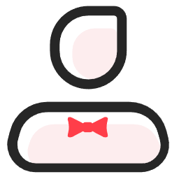

[English](README.md) | [中文](README.zh.md)

<p align="center">
  
</p>

<h1 align="center">Croupier</h1>

<p align="center">
  
  
  
  
</p>

Croupier is a Server / Agent / SDK platform for game operations and control, designed to serve multiple games and multiple environments within a single game company. The current architecture has converged on a unified session transport:

- `Agent <-> Server`: `TCP session` by default, `TLS` enabled by default
- `SDK <-> Agent`: `TCP session` by default, `TLS` off by default and enabled on demand
- Both links share the same session transport foundation and differ only in the first handshake message and business semantics (subprotocols)

## Online Demo

URL: https://croupier.cuihairu.site/

| Account | Password   |
| ------- | ---------- |
| `admin` | `admin123` |

> [Demo environment. All data is fake and may be reset at any time. Do not enter any real information.]

## Highlights

- Single-company, multi-game, multi-environment scope model: the standard business boundary is `gameId + env`
- Business scope separated from runtime target: `scope` expresses ownership, `target` expresses where things are deployed and executed
- A unified model for function registration, scheduling, invocation, and jobs
- Lightweight session transport: single connection, bidirectional requests, reconnect, backpressure, and drain
- JSON payloads with protobuf envelopes, balancing cross-language consistency against integration cost
- JSON Schema capability contracts plus a generated console UI driven by Ant Design Pro / ProComponents

## Supported Databases

| Database   | Driver                     | Use case                              |
| ---------- | -------------------------- | ------------------------------------- |
| SQLite     | `glebarez/sqlite`          | Development, testing, small deployments |
| MySQL      | `gorm.io/driver/mysql`     | Production (recommended)              |
| PostgreSQL | `gorm.io/driver/postgres`  | Production                            |
| SQL Server | `gorm.io/driver/sqlserver` | Enterprise environments               |

For DSN configuration examples for each database, see [Server Configuration](docs/operations/config-server.md).

## SDK Ecosystem

All official SDKs are maintained together under the monorepo's `sdks/` directory.

### Official SDKs

| Language | Directory      | Build                                                                                                                                                                    | Coverage                                                                                                                                    | Docs                            |
| -------- | -------------- | ------------------------------------------------------------------------------------------------------------------------------------------------------------------------ | ------------------------------------------------------------------------------------------------------------------------------------------- | ------------------------------- |
| Go       | `sdks/go/`     | [](https://github.com/cuihairu/croupier/actions/workflows/ci-sdk-go.yml)         | [](https://codecov.io/gh/cuihairu/croupier)     | [README](sdks/go/README.md)     |
| C#       | `sdks/csharp/` | [](https://github.com/cuihairu/croupier/actions/workflows/ci-sdk-csharp.yml) | [](https://codecov.io/gh/cuihairu/croupier) | [README](sdks/csharp/README.md) |
| Java     | `sdks/java/`   | [](https://github.com/cuihairu/croupier/actions/workflows/ci-sdk-java.yml)     | [](https://codecov.io/gh/cuihairu/croupier)   | [README](sdks/java/README.md)   |
| C++      | `sdks/cpp/`    | [](https://github.com/cuihairu/croupier/actions/workflows/ci-sdk-cpp.yml)       | [](https://codecov.io/gh/cuihairu/croupier)    | [README](sdks/cpp/README.md)    |
| Python   | `sdks/python/` | [](https://github.com/cuihairu/croupier/actions/workflows/ci-sdk-python.yml) | [](https://codecov.io/gh/cuihairu/croupier) | [README](sdks/python/README.md) |
| JS/TS    | `sdks/js/`     | [](https://github.com/cuihairu/croupier/actions/workflows/ci-sdk-js.yml)         | [](https://codecov.io/gh/cuihairu/croupier)     | [README](sdks/js/README.md)     |

### Web Console (Dashboard)

| Module    | Directory | Build                                                                                                                                                                  | Coverage                                                                                                                                       |
| --------- | --------- | ---------------------------------------------------------------------------------------------------------------------------------------------------------------------- | ---------------------------------------------------------------------------------------------------------------------------------------------- |
| Dashboard | `web/`    | [](https://github.com/cuihairu/croupier/actions/workflows/ci-dashboard.yml) | [](https://codecov.io/gh/cuihairu/croupier) |

## Architecture

Three tiers: Console (Web) → Server (control plane, multi-instance HA capable) → Agent (proxy inside the game VPC) → Game Server / SDK.
Entry points are separated by audience: the web console goes over L7 (HTTP API / SSE), agents over internal L4 (persistent TCP connections).

See the [System Architecture Overview](docs/architecture/index.md) and [Load Balancing](docs/operations/load-balancing.md) for details.

## Open Source Foundation

Croupier is not a fork; it is a control-plane business layer built entirely on open-source components (versions as pinned in `go.mod` / `web/package.json`):

- Server: Go 1.26, HTTP via [Gin](https://github.com/gin-gonic/gin), ORM via [GORM](https://gorm.io) (four drivers: MySQL / PostgreSQL / SQL Server / glebarez SQLite), authorization via [Casbin](https://casbin.org), versioned migrations via goose
- Transport: the Agent↔Server and SDK↔Agent TCP sessions are implemented on the Go standard library `net` + `crypto/tls` (length-prefix framing, protobuf envelopes); no gRPC is introduced — see [transport-no-grpc.md](docs/architecture/transport-no-grpc.md) for the trade-off
- Observability: [OpenTelemetry](https://opentelemetry.io) Go SDK with OTLP HTTP exporter reporting
- Console: built on [Umi Max](https://umijs.org) and [Ant Design](https://ant.design) / ProComponents; JSON Schema forms powered by [RJSF](https://rjsf.github.io/react-jsonschema-form/), editor provided by [Monaco](https://microsoft.github.io/monaco-editor/)
- Protocol and toolchain: [protobuf](https://protobuf.dev) (fully local protoc generation) + [buf](https://buf.build) lint
- Six-language SDKs (go / js / python / java / csharp / cpp) implemented on each language's standard library; wire contract in [sdk-wire-protocol.md](docs/architecture/sdk-wire-protocol.md)

## Session Model

The core transport abstraction in Croupier today is not a `message-history model`; it is a lightweight application-layer session:

- One reliable long-lived connection
- The first message negotiates identity and capabilities
- New requests can be initiated in both directions on the same connection
- Multiple concurrent in-flight requests are multiplexed
- heartbeat / reconnect / drain / backpressure

This is why two terms appear in the current documentation:

- `shared session runtime`
  - Refers to the shared transport foundation: `tcp/tls + framing + mux + reconnect + heartbeat + drain`
- `subprotocol`
  - Refers to the different subprotocols running on that foundation
  - For example:
    - `sdk-agent subprotocol`
    - `agent-server subprotocol`

A `subprotocol` is not a per-client customization; it is an application-layer protocol variant that shares the same session runtime but differs in handshake message, registration content, and routing semantics.

## Scope Model

Croupier does not adopt a SaaS multi-tenant abstraction. The standard business scope is:

- `gameId`: game identifier. Layered forms: REST/SDK contract key `gameId`, HTTP header `X-Game-ID`, proto field and DB column `game_id`
- `env`: logical environment identifier, such as `dev`, `staging`, `prod`

Here `env` expresses a lifecycle stage; it does not directly equal a specific database, cluster, or node. Physical deployment and execution location should be expressed through separate abstractions such as `target`, `node`, and `agent`, not mixed into `env`.

## Documentation

- Architecture overview: [docs/architecture/index.md](docs/architecture/index.md)
- Game and environment scope: [docs/architecture/game-environment-scope.md](docs/architecture/game-environment-scope.md)
- SDK–Agent design: [docs/architecture/sdk-agent-transport-redesign.md](docs/architecture/sdk-agent-transport-redesign.md)
- Agent–Server design: [docs/architecture/agent-server-session-transport-redesign.md](docs/architecture/agent-server-session-transport-redesign.md)
- Wire protocol: [docs/architecture/sdk-wire-protocol.md](docs/architecture/sdk-wire-protocol.md)
- Unified SDK documentation: [docs/sdks/index.md](docs/sdks/index.md)
- SDK capability matrix: [docs/sdks/sdk-parity-matrix.md](docs/sdks/sdk-parity-matrix.md)
- SDK code entry point: [sdks/README.md](sdks/README.md)

## Release Conventions

- Server / Agent release tags use `v*`, for example `v0.2.0`
- SDK release tags use a language-prefixed format:
  - `sdk-js-v0.1.0`
  - `sdk-python-v0.1.0`
  - `sdk-go-v0.1.0`
  - `sdk-java-v0.1.0`
  - `sdk-cpp-v0.1.0`
- This prevents a single tag in the monorepo from accidentally triggering every release workflow

## Repository Map

| Component        | Location              | Description                                     |
| ---------------- | --------------------- | ----------------------------------------------- |
| Server / Agent   | `cmd/`, `internal/`   | Control plane, proxy, scheduling, audit, registry, and jobs |
| Proto            | `proto/`              | protobuf definitions and generation entry point (single source) |
| SDKs             | `sdks/`               | Multi-language SDKs (go, js, python, java, csharp, cpp) |
| Dashboard        | `web/`                | Web console (React + Ant Design)                |
| Examples / Tools | `examples/`, `tools/` | Examples and helper tools                       |
| Docs             | `docs/`               | Architecture, guides, API and SDK documentation |

## One-Command Agent Install

Install croupier-agent on a game server with a single command (auto-detects OS and CPU architecture, downloads artifacts anonymously, and re-running upgrades in place):

Linux (x86_64 / ARM64 / ARMv7):

```bash
curl -fsSL https://raw.githubusercontent.com/cuihairu/croupier/main/scripts/install.sh | bash -s --
```

macOS (Intel / Apple Silicon):

```bash
curl -fsSL https://raw.githubusercontent.com/cuihairu/croupier/main/scripts/install.sh | bash -s --
```

Windows (PowerShell 5.1+, x64):

```powershell
& ([scriptblock]::Create((irm https://raw.githubusercontent.com/cuihairu/croupier/main/scripts/install.ps1)))
```

The latest stable release is installed by default; `--version nightly` installs the daily build, `--with-service` registers a boot-time autostart service (systemd / launchd / Windows service), and `--uninstall` removes it. Full usage: [Agent Install](docs/operations/agent-install.md).

## Docker Compose Deployment

Start a minimal stack (server + agent + dashboard + postgres/redis) from prebuilt images with one command — no local build required:

```bash
cd docker
docker compose -f docker-compose.quickstart.yml up -d
```

Common operations:

```bash
docker compose -f docker-compose.quickstart.yml logs -f server   # view logs
docker compose -f docker-compose.quickstart.yml down             # stop
docker compose -f docker-compose.quickstart.yml pull && \
docker compose -f docker-compose.quickstart.yml up -d            # upgrade
docker compose -f docker-compose.quickstart.yml down -v          # ⚠️ wipes data (volumes included)
```

Optional components (six-language SDK examples / analytics pipeline) are brought up with `--profile` and kept out of the default stack. For secrets, ports, multi-game/single-database switching, and the pitfall of "`--profile` pull cascading into a full-stack rebuild", see the header comments of [docker-compose.quickstart.yml](docker/docker-compose.quickstart.yml) and the [Docker Deployment Guide](docs/operations/deploy-docker.md).

## Quick Start

1. Clone the code

```bash
git clone https://github.com/cuihairu/croupier.git
cd croupier
```

2. Install the toolchain

- Go 1.26.6+
- Node.js 22+ / pnpm
- `buf`
- `protoc`

3. Install the pre-commit hook (recommended)

```bash
cp scripts/pre-commit .git/hooks/pre-commit && chmod +x .git/hooks/pre-commit
```

4. Build

```bash
make proto && make build
```

5. Start

```bash
./bin/croupier-server --config configs/server.yaml
./bin/croupier-agent --config configs/agent.yaml
```

6. View the Dashboard

```bash
cd web
pnpm install
pnpm dev
```

## Notes

Some historical documents in this repository still reference `gRPC`, `legacy REQ/REP`, `LocalControl`, `rpc_addr`, or the SDK local-listener model.
These are being cleaned up step by step under the "unified TCP session + subprotocol" design and should no longer be used as the basis for new implementations.
