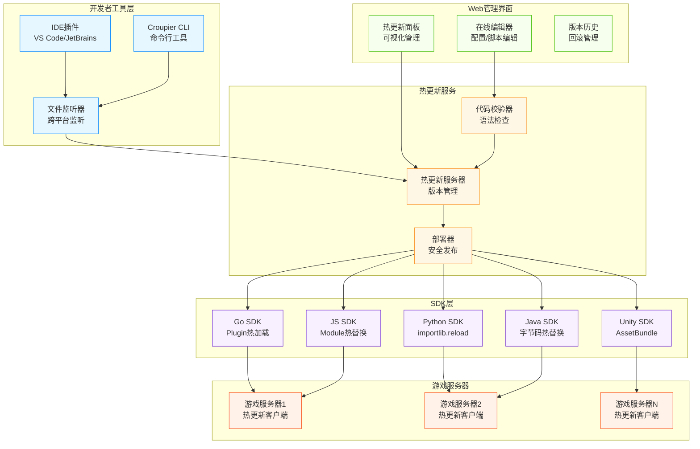

# 🔥 游戏开发热更新方案总览

## 📊 各语言热更新技术对比

### **Go语言热更新**

| 方案 | 类型 | 性能 | 易用性 | 生产适用 | 特点 |
|------|------|------|--------|----------|------|
| **Air** | 进程重启 | 中 | 高 | 否 | 配置简单，开发常用 |
| **Realize** | 进程重启 | 中 | 高 | 否 | 功能丰富，支持多项目 |
| **Plugin热加载** | 动态库 | 高 | 低 | 是 | 真正热更新，但复杂 |
| **配置热载** | 配置刷新 | 高 | 高 | 是 | 仅配置，不涉及代码 |

```go
// Air 配置示例
// .air.toml
[build]
cmd = "go build -o ./bin/game-server ./cmd/server"
bin = "bin/game-server"
include_ext = ["go", "yaml", "json"]
exclude_dir = ["bin", "vendor"]
```

### **JavaScript/Node.js热更新**

| 方案 | 类型 | 性能 | 易用性 | 生产适用 | 特点 |
|------|------|------|--------|----------|------|
| **Nodemon** | 进程重启 | 中 | 高 | 否 | 经典方案，开发必备 |
| **PM2 Reload** | 无缝重启 | 高 | 中 | 是 | 零停机时间重启 |
| **Module热替换** | 模块替换 | 高 | 低 | 是 | 真正的热更新 |
| **Webpack HMR** | 模块热替换 | 高 | 中 | 否 | 前端开发利器 |

```javascript
// Nodemon 配置
// nodemon.json
{
  "watch": ["src"],
  "ext": "js,json",
  "exec": "node server.js",
  "env": {
    "NODE_ENV": "development"
  }
}
```

### **Python热更新**

| 方案 | 类型 | 性能 | 易用性 | 生产适用 | 特点 |
|------|------|------|--------|----------|------|
| **Watchdog** | 文件监听 | 中 | 中 | 否 | 灵活的文件系统监听 |
| **Uvicorn --reload** | 进程重启 | 中 | 高 | 否 | ASGI服务器自动重载 |
| **importlib.reload** | 模块重载 | 高 | 低 | 是 | 运行时模块重新加载 |
| **Django Auto-reload** | 进程重启 | 中 | 高 | 否 | Django开发服务器 |

```python
# Watchdog 示例
from watchdog.observers import Observer
from watchdog.events import FileSystemEventHandler

class ReloadHandler(FileSystemEventHandler):
    def on_modified(self, event):
        if event.src_path.endswith('.py'):
            reload_module(event.src_path)
```

### **Java热更新**

| 方案 | 类型 | 性能 | 易用性 | 生产适用 | 特点 |
|------|------|------|--------|----------|------|
| **JRebel** | 字节码替换 | 高 | 高 | 是 | 商业产品，功能最强 |
| **Spring DevTools** | 类重载 | 中 | 高 | 否 | Spring生态首选 |
| **HotSwapAgent** | JVM增强 | 高 | 中 | 是 | 开源JRebel替代 |
| **DCEVM** | JVM修改 | 高 | 低 | 是 | 需要特殊JVM |

```java
// Spring DevTools 配置
// application.yml
spring:
  devtools:
    restart:
      enabled: true
      additional-paths: src/main/java
    livereload:
      enabled: true
```

### **C#/.NET热更新**

| 方案 | 类型 | 性能 | 易用性 | 生产适用 | 特点 |
|------|------|------|--------|----------|------|
| **.NET Hot Reload** | 运行时编译 | 高 | 高 | 是 | .NET 6+原生支持 |
| **dotnet watch** | 进程重启 | 中 | 高 | 否 | 开发时自动重启 |
| **Assembly热替换** | 程序集替换 | 高 | 低 | 是 | 高级技术，需要架构支持 |

```csharp
// dotnet watch 使用
// 命令行
dotnet watch run --project GameServer.csproj
```

### **Unity游戏引擎**

| 方案 | 类型 | 性能 | 易用性 | 生产适用 | 特点 |
|------|------|------|--------|----------|------|
| **Unity域重载** | 域重载 | 中 | 高 | 否 | Unity Editor内置 |
| **AssetBundle** | 资源热更 | 高 | 中 | 是 | 资源和代码热更新 |
| **Lua热更新** | 脚本热更 | 高 | 中 | 是 | XLua/ToLua方案 |
| **C#反射热更** | 反射调用 | 低 | 低 | 是 | HybridCLR方案 |

### **Unreal Engine**

| 方案 | 类型 | 性能 | 易用性 | 生产适用 | 特点 |
|------|------|------|--------|----------|------|
| **Live Coding** | 增量编译 | 高 | 高 | 否 | UE4/5内置开发功能 |
| **Blueprint热编译** | 可视化脚本 | 高 | 高 | 是 | 蓝图系统天然支持 |
| **Plugin热加载** | 插件系统 | 高 | 中 | 是 | 模块化热替换 |

## 🎯 游戏开发热更新需求分析

### **开发期热更新**
- ✅ **代码逻辑** - 游戏规则、AI逻辑
- ✅ **配置参数** - 数值平衡、关卡配置
- ✅ **脚本文件** - Lua/Python脚本
- ✅ **资源文件** - 图片、音频、模型

### **生产环境热更新**
- ✅ **配置热更** - 不停服调整参数
- ✅ **脚本热更** - 活动逻辑、运营脚本
- ✅ **内容热更** - 新关卡、新功能
- ⚠️ **核心热更** - 核心逻辑（高风险）

## 🏗️ Croupier热更新架构设计



## 🔧 热更新类型设计

### **1. 配置热更新（最安全）**
```yaml
# 游戏配置
game_balance:
  player_hp: 100
  enemy_damage: 25
  level_rewards:
    level_1: 100
    level_2: 200
```

### **2. 脚本热更新（常用）**
```lua
-- 游戏逻辑脚本
function calculate_damage(base_damage, level)
    return base_damage * (1 + level * 0.1)
end
```

### **3. 函数热更新（高级）**
```go
// Go Plugin热更新
//go:build plugin

package main

func CalculateReward(level int, score int) int {
    return score * level * 10
}
```

### **4. 资源热更新**
```json
{
  "version": "1.0.1",
  "assets": {
    "textures/ui_button.png": "hash123",
    "sounds/click.wav": "hash456"
  }
}
```

## 🚀 SDK集成策略

### **通用热更新接口**
```go
// 统一的热更新接口
type HotReloader interface {
    // 注册热更新回调
    RegisterHandler(pattern string, handler ReloadHandler) error

    // 启动热更新监听
    StartWatching() error

    // 手动触发重载
    Reload(path string) error

    // 停止监听
    Stop() error
}
```

### **语言特定实现**
```go
// Go实现 - Plugin机制
type GoHotReloader struct {
    plugins map[string]*plugin.Plugin
    watchers map[string]*fsnotify.Watcher
}

func (r *GoHotReloader) Reload(path string) error {
    // 重新加载Go插件
    return r.reloadPlugin(path)
}
```

```javascript
// JavaScript实现 - require缓存清除
class JSHotReloader {
    reload(path) {
        delete require.cache[require.resolve(path)];
        return require(path);
    }
}
```

```python
# Python实现 - importlib
import importlib
import sys

class PythonHotReloader:
    def reload(self, module_name):
        if module_name in sys.modules:
            return importlib.reload(sys.modules[module_name])
```

## 🎮 游戏引擎特殊支持

### **Unity集成**
```csharp
// Unity热更新管理器
public class CroupierHotReloader : MonoBehaviour
{
    public async void ReloadAssetBundle(string bundleName)
    {
        await AssetBundle.LoadFromFileAsync(bundleName);
        // 通知相关系统重新加载
        GameEventSystem.Trigger("AssetReloaded", bundleName);
    }
}
```

### **Unreal集成**
```cpp
// Unreal热更新系统
class GAME_API UCroupierHotReloader : public USubsystem
{
public:
    UFUNCTION(BlueprintCallable)
    bool ReloadBlueprint(const FString& BlueprintPath);

    UFUNCTION(BlueprintCallable)
    bool ReloadGameplayScript(const FString& ScriptPath);
};
```

---

*接下来我将详细实现各语言的SDK和Web管理界面。这个热更新系统将大大提升游戏开发效率！*