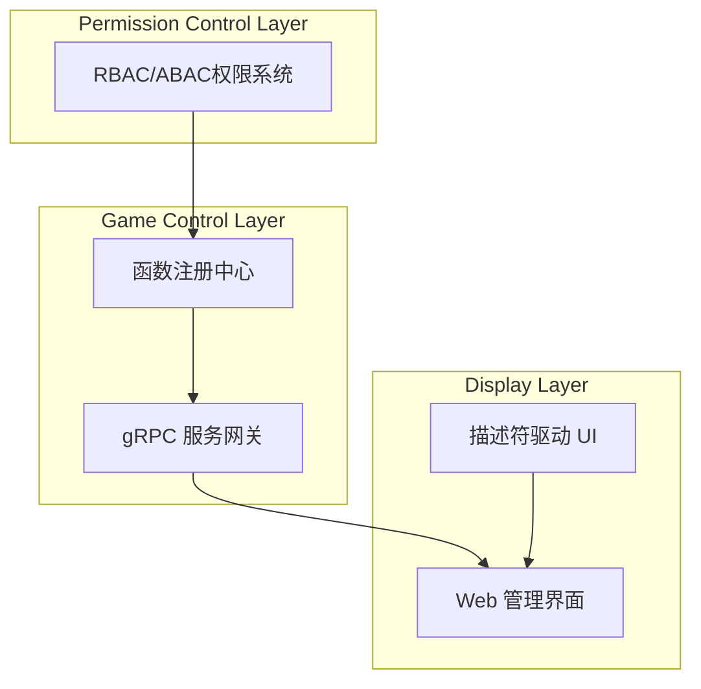

# Croupier 文档首页

[](https://github.com/cuihairu/croupier)
[](https://github.com/cuihairu/croupier/blob/main/LICENSE)
[](https://golang.org/)

欢迎来到 **Croupier** - 新一代分布式游戏管理系统！

## 🎯 项目概述

Croupier 是一个现代化的**三层分布式 GM 后台系统**，专为游戏运营和管理而设计。它采用协议驱动的开发模式，提供强大的功能注册、权限控制和实时监控能力。

### 核心特性

- 🎮 **虚拟对象系统** - 四层架构：Function → Entity → Resource → Component
- 🔐 **精细权限控制** - 基于 RBAC/ABAC 的权限管理，独立于游戏逻辑
- 🚀 **函数注册驱动** - 基于 gRPC 的动态函数注册和调用
- 📊 **描述符驱动 UI** - 根据协议定义自动生成表单和界面
- 🔄 **实时双向通信** - 支持隧道和双向流式通信
- 📦 **多语言 SDK** - 支持 C++、Go、Java、JavaScript、Python
- 🌐 **Web 管理界面** - 基于 React + Ant Design 的现代化界面

## 🏗️ 系统架构



### 组件架构

- **Server** (`internal/server/`) - 中央控制平面，gRPC(8443) + HTTP REST(8080)
- **Agent** (`internal/agent/`) - 分布式代理，部署在游戏网络中
- **Edge** (`internal/edge/`) - DMZ 代理，桥接内外网络
- **Dashboard** (`dashboard/`) - Web 管理界面
- **SDKs** (`sdks/`) - 多语言客户端 SDK

## 🚀 快速开始

### 环境要求

- Go 1.21+
- Node.js 18+
- Docker (可选)
- CMake 3.20+ (C++ SDK)

### 本地开发

```bash
# 1. 克隆仓库
git clone https://github.com/cuihairu/croupier.git
cd croupier

# 2. 安装依赖
go mod download

# 3. 生成协议代码
make proto

# 4. 构建所有组件
make all
```

### 组件构建

```bash
# 构建服务端组件
make build          # server + agent + edge

# 构建 SDK
make build-sdks     # 所有 SDK
make build-sdks-cpp # 仅 C++ SDK

# 构建和启动前端
make dev-dashboard  # 启动 dashboard 开发服务器

# 构建文档
make build-docs     # 构建 Docusaurus 文档
```

## 📚 核心文档

### 架构设计

- [系统架构概览](ARCHITECTURE.md) - 整体架构设计
- [虚拟对象设计](VIRTUAL_OBJECT_DESIGN.md) - 四层对象模型
- 函数管理系统（此章节当前为草稿，稍后发布）

### SDK 开发

- [C++ SDK 文档](CPP_SDK_DOCS_INDEX.md) - C++ 客户端开发
- [SDK 开发指南](sdk-development.md) - 多语言 SDK 开发

### 配置和部署

- [配置管理](config.md) - 系统配置说明
- [部署指南](deployment.md) - 生产环境部署
- [安全配置](security.md) - 安全相关配置

### 热重载系统

- [热重载方案](HOT_RELOAD_SOLUTIONS.md) - 热重载技术方案
- [最佳实践](HOTRELOAD_BEST_PRACTICES.md) - 热重载最佳实践

## 🎯 关键概念

### 虚拟对象系统

Croupier 采用四层虚拟对象模型：

1. **Function** - 函数定义层
2. **Entity** - 实体抽象层
3. **Resource** - 资源管理层
4. **Component** - 组件实现层

### 协议驱动开发

- 所有 API 通过 Protocol Buffers 定义
- 使用 Buf 工具链管理协议
- 自定义 `protoc-gen-croupier` 插件生成功能包

### 数据流模式

```
Web UI → Server (HTTP) → Load Balancer → Agent → Game Server
                ↓
            Edge (optional tunnel)
```

## 🛠️ 开发工具

- **Buf** - Protocol Buffers 工具链
- **Wire** - 依赖注入代码生成
- **Docusaurus** - 文档站点（React 技术栈）
- **GitHub Actions** - CI/CD 流水线

## 🤝 贡献指南

我们欢迎社区贡献！请查看我们的贡献指南：

1. Fork 项目仓库
2. 创建功能分支
3. 提交代码变更
4. 创建 Pull Request

## 📄 许可证

本项目采用 [MIT 许可证](https://github.com/cuihairu/croupier/blob/main/LICENSE)。

## 🔗 相关链接

- [GitHub 仓库](https://github.com/cuihairu/croupier)
- [问题跟踪](https://github.com/cuihairu/croupier/issues)
- [发布页面](https://github.com/cuihairu/croupier/releases)

---

**欢迎探索 Croupier 的强大功能，开始您的游戏管理系统之旅！** 🎮✨
