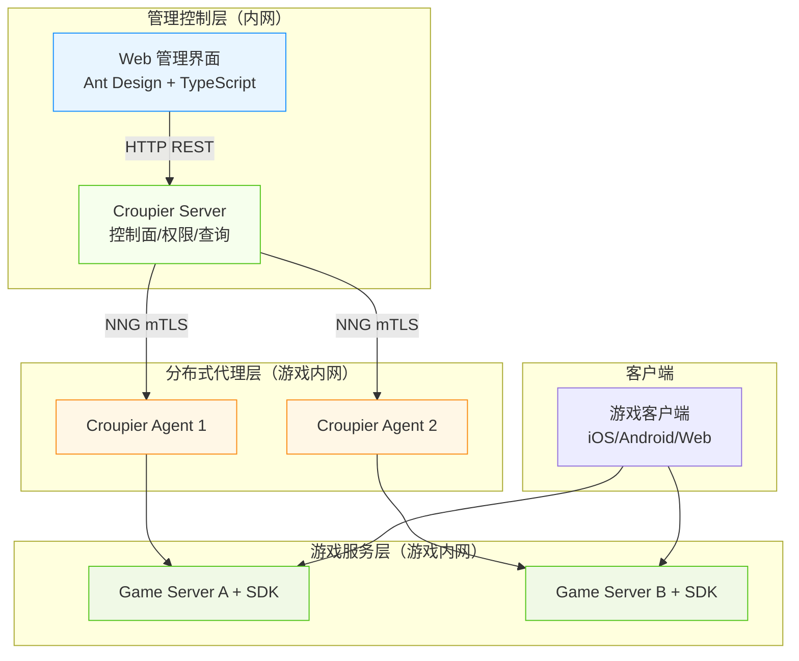

## 项目结构

```
croupier/
├── cmd/                 # 程序入口
├── proto/               # Protobuf 定义（子模块）
├── internal/            # 内部实现
│   ├── server/          # 服务端核心逻辑
│   ├── agent/           # 代理实现
│   ├── auth/            # 认证授权
│   ├── function/        # 函数管理
│   ├── jobs/            # 作业系统
│   └── loadbalancer/    # 负载均衡
├── sdks/                # 多语言 SDK（子模块）
│   ├── go/
│   ├── cpp/
│   ├── java/
│   ├── js/
│   └── python/
├── dashboard/           # Web 管理界面（子模块）
├── configs/             # 配置文件示例
├── examples/            # 示例代码
├── packs/               # 函数包示例
└── docs/                # 项目文档
```

## 快速开始

### 1. 克隆仓库

```bash
git clone --recursive https://github.com/cuihairu/croupier.git
cd croupier
```

### 2. 安装依赖并构建

```bash
# 安装 Go 依赖
go mod download

# 生成协议代码
make proto

# 构建所有组件
make build
```

### 3. 运行服务

```bash
# 启动 Server
./bin/croupier-server --config configs/server.example.yaml

# 启动 Agent
./bin/croupier-agent --config configs/agent.example.yaml
```

## 系统架构


```mermaid
graph TB
  subgraph "客户端"
    Client[游戏客户端<br/>iOS/Android/Web]
  end

  subgraph "管理控制层（内网）"
    UI[Web 管理界面<br/>Ant Design + TypeScript]
    Server[Croupier Server<br/>控制面/权限/查询]
  end

  subgraph "分布式代理层（游戏内网）"
    A1[Croupier Agent 1]
    A2[Croupier Agent 2]
  end

  subgraph "游戏服务层（游戏内网）"
    GS1[Game Server A + SDK]
    GS2[Game Server B + SDK]
  end

  UI -->|HTTP REST| Server
  Server -->|NNG mTLS| A1
  Server -->|NNG mTLS| A2
  A1 --> GS1
  A2 --> GS2
  Client --> GS1
  Client --> GS2

  classDef ui fill:#e8f5ff,stroke:#1890ff
  classDef server fill:#f6ffed,stroke:#52c41a
  classDef agent fill:#fff7e6,stroke:#fa8c16
  classDef game fill:#f0f9e6,stroke:#52c41a

  class UI ui
  class Server server
  class A1,A2 agent
  class GS1,GS2 game
```

## 核心文档

### 入门指南

- [快速开始](/guide/quick-start/) - 快速搭建开发环境
- [安装指南](/guide/installation/) - 详细的安装说明
- [配置管理](/guide/configuration/) - 系统配置详解
- [部署指南](/guide/deployment/) - 生产环境部署

### 核心概念

- [系统概览](/guide/concepts/overview/) - 系统设计理念
- [虚拟对象系统](/guide/concepts/virtual-objects/) - 四层对象模型
- [函数管理](/guide/concepts/function-management/) - 函数注册与调用
- [权限控制](/guide/concepts/permissions/) - RBAC/ABAC 权限模型

### 架构设计

- [系统架构](/architecture/) - 整体架构设计
- [分层设计](/architecture/layers/) - 三层架构详解
- [数据流](/architecture/data-flow/) - 调用与数据流

### API 参考

- [API 概览](/api/) - API 总览
- [REST API](/api/rest/) - HTTP REST 接口
- [消息协议](/api/protocol/) - NNG 消息协议定义

### SDK 文档

- [C++ SDK](https://github.com/cuihairu/croupier-sdk-cpp) - C++ 客户端开发
- [Go SDK](https://github.com/cuihairu/croupier-sdk-go) - Go 客户端开发
- [Java SDK](https://github.com/cuihairu/croupier-sdk-java) - Java 客户端开发
- [JavaScript SDK](https://github.com/cuihairu/croupier-sdk-js) - JS/TS 客户端开发
- [Python SDK](https://github.com/cuihairu/croupier-sdk-python) - Python 客户端开发

### 分析系统

- [分析系统概览](/analytics/) - 游戏分析系统
- [快速开始](/analytics/quick-start/) - 分析系统入门

## 核心特性

| 特性 | 说明 |
|------|------|
| **零信任安全** | NNG+mTLS、细粒度 RBAC/ABAC、操作审批与审计日志 |
| **函数注册驱动** | 游戏服务器通过 Agent 注册函数，控制面统一管理 |
| **Schema 驱动 UI** | X-Render + JSON Schema 自动生成表单和界面 |
| **可观测性解耦** | 控制面与遥测面分离，支持实时事件处理 |
| **多语言 SDK** | Go / C++ / Java / JS / Python 全覆盖 |
| **协议优先** | 所有 API 通过 Protocol Buffers 定义 |

## 相关仓库

| 组件 | 仓库 | 说明 |
|------|------|------|
| Server / Agent | [cuihairu/croupier](https://github.com/cuihairu/croupier) | 主仓库（包含 Proto 定义） |
| Dashboard | [cuihairu/croupier-dashboard](https://github.com/cuihairu/croupier-dashboard) | Web 管理界面 |
| Proto 定义 | [proto/](https://github.com/cuihairu/croupier/tree/main/proto) | Protocol Buffers 定义 |
| Go SDK | [cuihairu/croupier-sdk-go](https://github.com/cuihairu/croupier-sdk-go) | Go 客户端 |
| C++ SDK | [cuihairu/croupier-sdk-cpp](https://github.com/cuihairu/croupier-sdk-cpp) | C++ 客户端 |
| Java SDK | [cuihairu/croupier-sdk-java](https://github.com/cuihairu/croupier-sdk-java) | Java 客户端 |
| JS/TS SDK | [cuihairu/croupier-sdk-js](https://github.com/cuihairu/croupier-sdk-js) | JavaScript/TypeScript |
| Python SDK | [cuihairu/croupier-sdk-python](https://github.com/cuihairu/croupier-sdk-python) | Python 客户端 |

## 许可证

Apache License 2.0

## 链接

- [GitHub 仓库](https://github.com/cuihairu/croupier)
- [问题跟踪](https://github.com/cuihairu/croupier/issues)
- [更新日志](https://github.com/cuihairu/croupier/releases)
