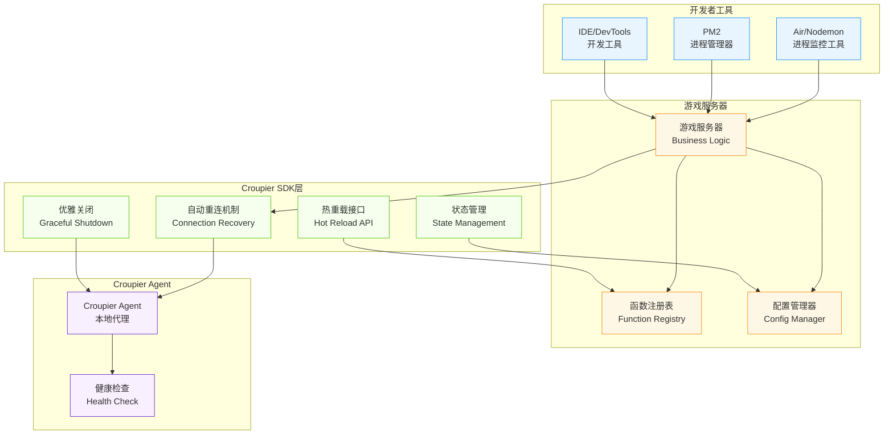

# 🔥 Croupier SDK 热更新方案支持策略

## 📋 主流热更新方案分析

### **Go语言生态**

| 方案 | 原理 | SDK支持策略 | 实现要点 |
|------|------|------------|----------|
| **Air** | 进程重启 | ✅ 自动重连 | 检测连接断开→重新注册函数→恢复服务 |
| **Realize** | 进程重启 | ✅ 自动重连 | 同Air，支持多项目监控 |
| **Go Plugin** | 动态库热载 | 🔧 插件接口 | 提供热插拔函数注册API |
| **配置热载** | 配置刷新 | ✅ 配置监听 | 文件监听+回调机制 |

### **JavaScript/Node.js生态**

| 方案 | 原理 | SDK支持策略 | 实现要点 |
|------|------|------------|----------|
| **Nodemon** | 进程重启 | ✅ 自动重连 | 进程退出时优雅关闭连接 |
| **PM2 Reload** | 无缝重启 | 🚀 零停机 | 新进程启动后老进程退出 |
| **Module热替换** | require缓存清除 | 🔧 模块重载 | 清除SDK模块缓存并重新注册 |
| **Webpack HMR** | 前端热替换 | ❌ 不适用 | 主要用于前端，服务端不推荐 |

### **Python生态**

| 方案 | 原理 | SDK支持策略 | 实现要点 |
|------|------|------------|----------|
| **Watchdog** | 文件监听 | ✅ 文件监听 | SDK提供文件变更回调 |
| **Uvicorn --reload** | 进程重启 | ✅ 自动重连 | ASGI框架集成 |
| **importlib.reload** | 模块重载 | 🔧 模块热替换 | 动态重载SDK模块 |
| **Django Auto-reload** | 进程重启 | ✅ 框架集成 | Django开发服务器适配 |

### **Java生态**

| 方案 | 原理 | SDK支持策略 | 实现要点 |
|------|------|------------|----------|
| **JRebel** | 字节码替换 | 🚀 类热替换 | 支持函数定义动态更新 |
| **Spring DevTools** | 类重载 | ✅ 框架集成 | Spring生态原生支持 |
| **HotSwapAgent** | JVM增强 | 🔧 字节码操作 | 深度JVM集成 |
| **DCEVM** | JVM修改 | 🔧 特殊JVM | 需要特殊JVM支持 |

## 🏗️ SDK 热更新支持架构



## 🔧 SDK 核心支持功能

### **1. 自动重连机制（适配进程重启型热更新）**

```go
// Go SDK 示例
type SDKConfig struct {
    AutoReconnect    bool          `yaml:"auto_reconnect"`
    ReconnectDelay   time.Duration `yaml:"reconnect_delay"`
    MaxRetryAttempts int           `yaml:"max_retry_attempts"`
    HealthCheckInterval time.Duration `yaml:"health_check_interval"`
}

type Client struct {
    config       SDKConfig
    isConnected  bool
    functions    map[string]Function
    reconnectCh  chan struct{}
}

func (c *Client) startAutoReconnect() {
    go func() {
        for {
            if !c.isConnected {
                c.logger.Info("Attempting to reconnect to Agent...")
                if err := c.connect(); err != nil {
                    c.logger.Error("Reconnection failed", "error", err)
                    time.Sleep(c.config.ReconnectDelay)
                    continue
                }
                // 重新注册所有函数
                c.reregisterAllFunctions()
            }
            time.Sleep(c.config.HealthCheckInterval)
        }
    }()
}
```

### **2. 优雅关闭机制**

```go
// Go SDK 优雅关闭
func (c *Client) GracefulShutdown(timeout time.Duration) error {
    ctx, cancel := context.WithTimeout(context.Background(), timeout)
    defer cancel()

    // 1. 停止接收新请求
    c.stopAcceptingRequests()

    // 2. 等待现有请求完成
    c.waitForActiveRequests(ctx)

    // 3. 通知Agent准备下线
    c.notifyAgentShutdown()

    // 4. 关闭连接
    return c.conn.Close()
}
```

### **3. 函数热重载接口**

```go
// 热重载API设计
type HotReloadable interface {
    // 重新加载函数定义
    ReloadFunction(functionID string, newImpl Function) error

    // 批量重载
    ReloadFunctions(functions map[string]Function) error

    // 配置热更新
    ReloadConfig(config interface{}) error

    // 获取重载状态
    GetReloadStatus() ReloadStatus
}

// 使用示例
func (c *Client) ReloadFunction(functionID string, newImpl Function) error {
    // 1. 验证新函数
    if err := c.validateFunction(newImpl); err != nil {
        return err
    }

    // 2. 平滑替换
    c.mu.Lock()
    defer c.mu.Unlock()

    oldImpl := c.functions[functionID]
    c.functions[functionID] = newImpl

    // 3. 重新注册到Agent
    if err := c.registerFunction(functionID, newImpl); err != nil {
        // 回滚
        c.functions[functionID] = oldImpl
        return err
    }

    return nil
}
```

## 📝 各语言SDK具体支持策略

### **Go SDK 热更新支持**

```yaml
# SDK配置文件
croupier_sdk:
  hotreload:
    enabled: true
    auto_reconnect: true
    reconnect_delay: 5s
    max_retry_attempts: 10
    graceful_shutdown_timeout: 30s

    # Air集成
    air:
      detect_restart: true
      pre_build_hook: "echo 'Building...'"
      post_build_hook: "echo 'Build complete'"

    # Plugin支持
    plugins:
      enabled: true
      watch_dir: "./plugins"
      reload_on_change: true
```

```go
// Air工具集成
//go:build !release

package main

import (
    "github.com/cuihairu/croupier-sdk-go"
    "github.com/fsnotify/fsnotify"
)

func main() {
    sdk := croupier.NewClient(croupier.Config{
        HotReload: croupier.HotReloadConfig{
            Enabled:       true,
            AutoReconnect: true,
        },
    })

    // Air会重启进程，SDK自动重连
    sdk.RegisterFunction("player.ban", handlePlayerBan)
    sdk.Connect()

    // 等待重启信号
    sdk.WaitForShutdown()
}
```

### **JavaScript SDK 热更新支持**

```javascript
// Nodemon集成
const { CroupierClient } = require('croupier-sdk-js');

class HotReloadableClient extends CroupierClient {
  constructor(config) {
    super({
      ...config,
      autoReconnect: true,
      gracefulShutdown: true
    });

    // Nodemon重启检测
    this.setupNodemonSupport();
  }

  setupNodemonSupport() {
    // 监听SIGUSR2信号（Nodemon发送）
    process.once('SIGUSR2', () => {
      this.gracefulShutdown().then(() => {
        process.kill(process.pid, 'SIGUSR2');
      });
    });

    // 模块热替换支持
    if (process.env.NODE_ENV === 'development') {
      this.enableModuleHotReload();
    }
  }

  enableModuleHotReload() {
    const chokidar = require('chokidar');

    chokidar.watch('./functions/**/*.js').on('change', (path) => {
      // 清除require缓存
      delete require.cache[require.resolve(path)];

      // 重新加载函数
      this.reloadFunction(path);
    });
  }
}
```

### **Python SDK 热更新支持**

```python
# Python SDK with Uvicorn支持
import asyncio
import importlib
import sys
from watchdog.observers import Observer
from watchdog.events import FileSystemEventHandler

class CroupierSDKHotReload:
    def __init__(self, client):
        self.client = client
        self.observer = None

    def enable_watchdog_support(self, watch_path="./functions"):
        """支持Watchdog文件监听"""
        class ReloadHandler(FileSystemEventHandler):
            def __init__(self, sdk_client):
                self.sdk_client = sdk_client

            def on_modified(self, event):
                if event.src_path.endswith('.py'):
                    self.reload_module(event.src_path)

            def reload_module(self, path):
                module_name = self.path_to_module(path)
                if module_name in sys.modules:
                    importlib.reload(sys.modules[module_name])
                    # 重新注册函数
                    self.sdk_client.reregister_functions()

        self.observer = Observer()
        self.observer.schedule(ReloadHandler(self.client), watch_path, recursive=True)
        self.observer.start()

    def enable_uvicorn_support(self):
        """Uvicorn开发服务器集成"""
        import signal

        def graceful_shutdown(signum, frame):
            asyncio.create_task(self.client.graceful_shutdown())

        signal.signal(signal.SIGTERM, graceful_shutdown)
```

### **Java SDK 热更新支持**

```java
// Spring DevTools集成
@Component
@ConditionalOnProperty("croupier.hotreload.enabled")
public class CroupierSDKHotReload {

    @Autowired
    private CroupierClient client;

    @EventListener
    public void onContextRefresh(ContextRefreshedEvent event) {
        // Spring DevTools重启后重新注册函数
        client.reconnectAndReregister();
    }

    @EventListener
    public void onContextClose(ContextClosedEvent event) {
        // 优雅关闭
        client.gracefulShutdown(Duration.ofSeconds(30));
    }
}

// JRebel支持
@Component
public class JRebelFunctionRegistry {

    private final Map<String, Method> functionMethods = new HashMap<>();

    @PostConstruct
    public void setupJRebelSupport() {
        if (isJRebelEnabled()) {
            // JRebel类重载回调
            JRebelFactory.getInstance().addClassReloadListener(
                (className, newClass) -> {
                    reloadClassFunctions(newClass);
                }
            );
        }
    }

    private void reloadClassFunctions(Class<?> clazz) {
        // 重新扫描并注册函数
        for (Method method : clazz.getDeclaredMethods()) {
            if (method.isAnnotationPresent(CroupierFunction.class)) {
                String functionId = method.getAnnotation(CroupierFunction.class).value();
                functionMethods.put(functionId, method);
                client.reregisterFunction(functionId, method);
            }
        }
    }
}
```

## 🎯 热更新最佳实践

### **1. 配置文件支持**

```yaml
# 统一的热更新配置
hotreload:
  # 全局开关
  enabled: true

  # 重连配置
  reconnection:
    auto_reconnect: true
    max_retries: 10
    retry_delay: 5s
    exponential_backoff: true

  # 优雅关闭
  graceful_shutdown:
    enabled: true
    timeout: 30s
    wait_for_requests: true

  # 工具集成
  tools:
    air: true       # Go Air
    nodemon: true   # Node.js Nodemon
    uvicorn: true   # Python Uvicorn
    spring: true    # Java Spring DevTools

  # 文件监听
  file_watching:
    enabled: true
    patterns:
      - "*.go"
      - "*.js"
      - "*.py"
      - "*.java"
    ignore_patterns:
      - "*.tmp"
      - "*.log"
```

### **2. 监控和调试**

```go
// 热更新状态监控
type HotReloadMetrics struct {
    ReconnectCount    int64     `json:"reconnect_count"`
    LastReconnectTime time.Time `json:"last_reconnect_time"`
    FunctionReloads   int64     `json:"function_reloads"`
    ConfigReloads     int64     `json:"config_reloads"`
    FailedReloads     int64     `json:"failed_reloads"`
}

func (c *Client) GetHotReloadMetrics() HotReloadMetrics {
    return HotReloadMetrics{
        ReconnectCount:    atomic.LoadInt64(&c.reconnectCount),
        LastReconnectTime: c.lastReconnectTime,
        FunctionReloads:   atomic.LoadInt64(&c.functionReloads),
        ConfigReloads:     atomic.LoadInt64(&c.configReloads),
        FailedReloads:     atomic.LoadInt64(&c.failedReloads),
    }
}
```

### **3. 开发环境集成示例**

```bash
# Air配置 (.air.toml)
[build]
cmd = "go build -o ./bin/game-server ./cmd/server"
bin = "bin/game-server"
include_ext = ["go", "yaml", "json"]
exclude_dir = ["bin", "vendor", "tmp"]

[log]
main_only = true

[misc]
clean_on_exit = true

# 自定义命令
[[build.pre_build_cmd]]
name = "notify-croupier-sdk"
cmd = "curl -X POST http://localhost:8080/api/dev/prepare-reload"

[[build.post_build_cmd]]
name = "health-check"
cmd = "curl http://localhost:8080/health || true"
```

```json
// Nodemon配置 (nodemon.json)
{
  "watch": ["src", "functions"],
  "ext": "js,json",
  "exec": "node server.js",
  "env": {
    "NODE_ENV": "development",
    "CROUPIER_HOTRELOAD": "true"
  },
  "events": {
    "start": "echo 'Starting game server with hot reload...'",
    "restart": "echo 'Restarting due to file changes...'"
  }
}
```

## 🔍 集成验证测试

### **测试脚本示例**

```bash
#!/bin/bash
# 热更新集成测试脚本

echo "🔥 测试Croupier SDK热更新支持..."

# 1. 测试Air集成
echo "1. 测试Air集成..."
cd examples/go-hotreload
air &
sleep 5

# 修改函数文件，触发重新加载
echo 'package main; func newFunction() { return "updated" }' >> functions.go
sleep 3

# 验证函数是否重新注册
curl -s "http://localhost:8080/api/functions" | jq '.functions[].id'

# 2. 测试Nodemon集成
echo "2. 测试Nodemon集成..."
cd ../js-hotreload
npm run dev &
sleep 5

# 修改JS文件
echo 'exports.newFunction = () => "updated";' >> functions.js
sleep 3

# 验证重载
curl -s "http://localhost:8080/api/functions" | jq '.functions[].id'

echo "✅ 热更新集成测试完成！"
```

## 📊 支持矩阵总览

| 语言/框架 | 热更新工具 | SDK支持级别 | 实现难度 | 生产可用性 |
|----------|-----------|-----------|----------|-----------|
| Go + Air | ⭐⭐⭐⭐⭐ | 完全支持 | 低 | 开发环境 |
| Go + Plugin | ⭐⭐⭐⭐ | 高级支持 | 高 | 生产环境 |
| Node + Nodemon | ⭐⭐⭐⭐⭐ | 完全支持 | 低 | 开发环境 |
| Node + PM2 | ⭐⭐⭐⭐⭐ | 零停机 | 中 | 生产环境 |
| Python + Uvicorn | ⭐⭐⭐⭐ | 框架集成 | 中 | 开发环境 |
| Python + importlib | ⭐⭐⭐⭐ | 模块重载 | 高 | 生产环境 |
| Java + Spring DevTools | ⭐⭐⭐⭐⭐ | 原生支持 | 低 | 开发环境 |
| Java + JRebel | ⭐⭐⭐⭐⭐ | 深度集成 | 中 | 生产环境 |

---

*🎯 通过支持主流热更新工具，Croupier SDK让游戏开发更加高效！*