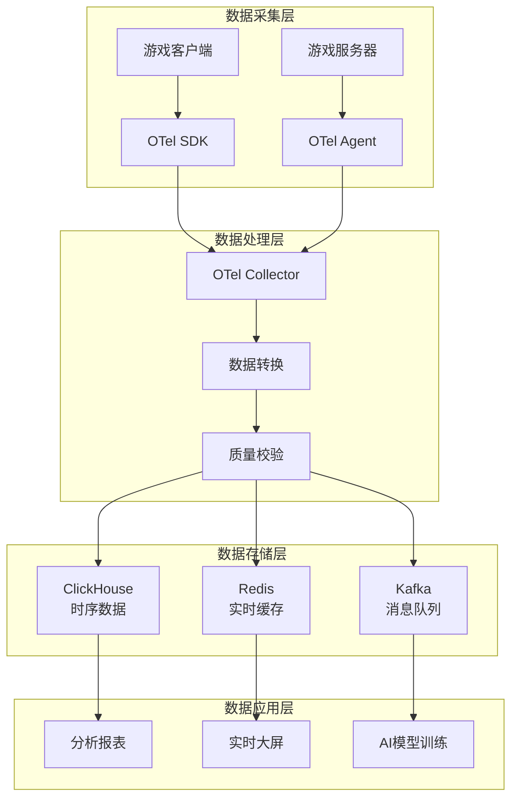

# 游戏数据分析系统文档

欢迎使用 Croupier 游戏数据分析系统！本文档将帮助您了解如何构建现代化的游戏数据分析平台。

## 📚 文档导航

### 🎯 核心概念
- [游戏指标全景图](./game-metrics-overview.md) - 完整的游戏数据指标体系
- [数据采集架构](./data-collection-architecture.md) - 客户端vs服务器端采集策略
- [游戏类型适配](./game-type-adaptation.md) - 不同游戏类型的指标选择

### 🛠️ 技术实施
- [OpenTelemetry集成指南](./opentelemetry-integration.md) - 现代化遥测解决方案
- [当前系统分析](./current-system-analysis.md) - 现有Analytics系统详解
- [系统增强方案](./enhancement-plan.md) - 完整的系统升级路线图

### 🚀 实施指南
- [快速开始](./quick-start.md) - 5分钟上手指南
- [最佳实践](./best-practices.md) - 生产环境部署建议
- [故障排除](./troubleshooting.md) - 常见问题解决方案

### 📊 指标参考
- [指标词典](./metrics-dictionary.md) - 所有指标的详细定义
- [API参考](./api-reference.md) - 完整的API文档
- [SDK参考](./sdk-reference.md) - 多语言SDK使用指南

## 🎮 支持的游戏类型

| 游戏类型 | 核心指标 | 特殊需求 | 文档链接 |
|---------|---------|---------|---------|
| **休闲游戏** | 留存率、广告收益、Session时长 | 碎片化指标、上手难度 | [休闲游戏指标](./casual-games.md) |
| **重度RPG** | 成长体系、付费深度、社交粘性 | 养成投入度、数值平衡 | [RPG游戏指标](./rpg-games.md) |
| **竞技游戏** | 竞技平衡、技能成长、匹配质量 | 作弊检测、网络体验 | [竞技游戏指标](./competitive-games.md) |
| **策略游戏** | 策略深度、时间投入、META演化 | 决策分析、学习曲线 | [策略游戏指标](./strategy-games.md) |

## 🔧 技术架构



## 🌟 核心优势

### 标准化数据模型
- 基于 OpenTelemetry 行业标准
- 统一的 Traces、Metrics、Logs 数据格式
- 多语言SDK支持 (Go/Java/C++/JavaScript/Python)

### 灵活的部署方式
- 云原生架构，支持容器化部署
- 多种后端存储选择 (ClickHouse/Prometheus/Elasticsearch)
- 水平扩展，支持高并发数据处理

### 游戏业务深度优化
- 游戏特有的语义标准化
- 完整的用户行为链路追踪
- 实时性能监控和异常检测

## 📈 业务价值

### 运营优化
- **用户获取成本降低 15-25%** - 精准渠道投放分析
- **用户留存提升 10-15%** - 流失预警和干预
- **活动ROI提升 30-50%** - 数据驱动的活动优化

### 技术提升
- **开发效率提升 70%** - 标准化SDK和工具链
- **故障定位速度提升 80%** - 分布式链路追踪
- **运维成本降低 50%** - 自动化监控和告警

## 🚀 快速开始

1. **环境准备**
   ```bash
   # 克隆项目
   git clone https://github.com/cuihairu/croupier.git
   cd croupier

   # 启动基础服务
   docker-compose up -d clickhouse redis
   ```

2. **启动分析服务**
   ```bash
   # 编译并启动
   make build
   ./bin/croupier server --config configs/server.yaml
   ```

3. **查看分析面板**
   ```
   打开浏览器访问: http://localhost:8080/analytics
   ```

## 📞 获取支持

- **文档问题**: [文档Issue](https://github.com/cuihairu/croupier/issues)
- **技术讨论**: [GitHub Discussions](https://github.com/cuihairu/croupier/discussions)
- **Bug报告**: [Bug Report Template](https://github.com/cuihairu/croupier/issues/new?template=bug_report.md)

---

> 💡 **提示**: 建议先阅读[游戏指标全景图](./game-metrics-overview.md)了解整体框架，再根据您的游戏类型选择对应的实施方案。