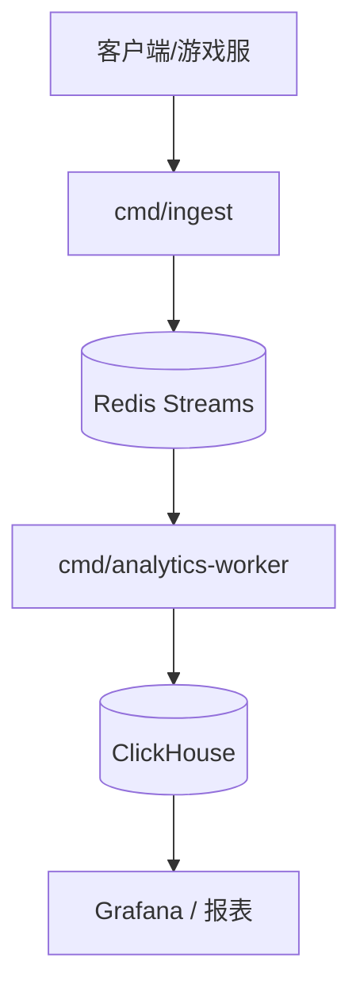

# 游戏数据分析系统文档

本节只保留与当前仓库内分析链路实现对应的说明：`cmd/ingest`、`cmd/analytics-worker`、`configs/analytics/*`、Redis、ClickHouse。

## 文档导航

### 核心概念

- [游戏指标全景图](./game-metrics-overview.md)
- [数据采集架构](./data-collection-architecture.md)
- [游戏类型适配](./game-type-adaptation.md)

### 技术实施

- [OpenTelemetry 集成](./opentelemetry-integration.md)
- [系统增强方案](./enhancement-plan.md)
- [ClickHouse 表结构](./clickhouse-schema.md)

### 快速落地

- [快速开始](./quick-start.md)
- [最佳实践](./best-practices.md)
- [故障排除](./troubleshooting.md)

## 当前链路


```mermaid
graph TB
    Client[客户端/游戏服] --> Ingest[cmd/ingest]
    Ingest --> Redis[(Redis Streams)]
    Redis --> Worker[cmd/analytics-worker]
    Worker --> CH[(ClickHouse)]
    CH --> Dashboard[Grafana / 报表]
```

## 启动顺序

```bash
docker compose up -d redis clickhouse
make server
make worker
make ingest
./bin/croupier-server --config configs/server.yaml
ANALYTICS_INGEST_SECRET=dev-secret ./bin/ingest --addr :8088 --secret dev-secret
./bin/analytics-worker
```
