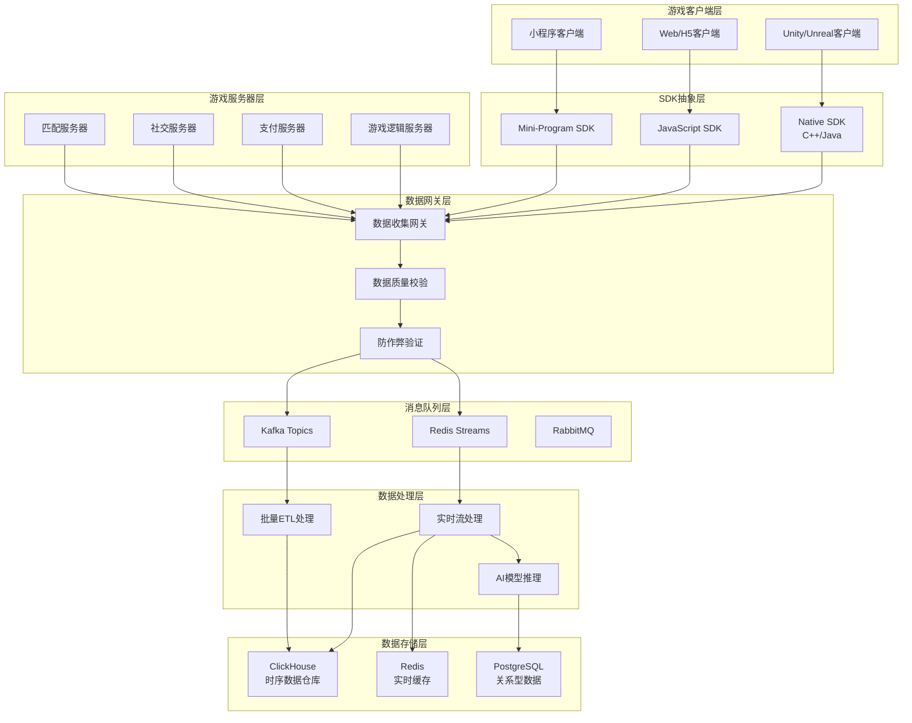

# 数据采集架构设计

本文档详细描述了游戏数据采集的技术架构，包括客户端、服务器端和混合采集策略的最佳实践。

## 🏗️ 总体架构图



## 📱 客户端采集策略

### 一、Unity客户端SDK设计

#### 1.1 核心接口设计

```csharp
using System;
using System.Collections.Generic;
using UnityEngine;

namespace Croupier.Analytics
{
    public class CroupierSDK : MonoBehaviour
    {
        private static CroupierSDK instance;
        public static CroupierSDK Instance => instance;

        [Header("配置")]
        public string gameId;
        public string environment = "production";
        public string collectorEndpoint = "https://analytics.game.com";

        private void Awake()
        {
            if (instance == null)
            {
                instance = this;
                DontDestroyOnLoad(gameObject);
                Initialize();
            }
            else
            {
                Destroy(gameObject);
            }
        }

        #region 用户生命周期
        /// <summary>
        /// 设置用户ID
        /// </summary>
        public void SetUserID(string userID)
        {
            UserContext.SetUserID(userID);
            TrackEvent("user.identify", new Dictionary<string, object>
            {
                {"user_id", userID},
                {"timestamp", DateTimeOffset.UtcNow.ToUnixTimeMilliseconds()}
            });
        }

        /// <summary>
        /// 设置用户属性
        /// </summary>
        public void SetUserProperties(Dictionary<string, object> properties)
        {
            UserContext.SetProperties(properties);
        }

        /// <summary>
        /// 用户登录
        /// </summary>
        public void TrackLogin(string method = "password")
        {
            TrackEvent("user.login", new Dictionary<string, object>
            {
                {"login_method", method},
                {"device_id", SystemInfo.deviceUniqueIdentifier},
                {"platform", Application.platform.ToString()}
            });
        }
        #endregion

        #region 游戏行为追踪
        /// <summary>
        /// 关卡开始
        /// </summary>
        public void TrackLevelStart(string levelId, int difficulty = 1)
        {
            var context = new Dictionary<string, object>
            {
                {"level_id", levelId},
                {"difficulty", difficulty},
                {"user_level", UserContext.GetUserLevel()},
                {"start_time", DateTimeOffset.UtcNow.ToUnixTimeMilliseconds()}
            };

            TrackEvent("gameplay.level.start", context);

            // 开启关卡性能监控
            PerformanceMonitor.StartLevelTrace(levelId);
        }

        /// <summary>
        /// 关卡完成
        /// </summary>
        public void TrackLevelComplete(string levelId, bool success, float duration, int attempts = 1)
        {
            var context = new Dictionary<string, object>
            {
                {"level_id", levelId},
                {"success", success},
                {"duration_seconds", duration},
                {"attempts", attempts},
                {"score", GameManager.Instance.CurrentScore}
            };

            TrackEvent(success ? "gameplay.level.complete" : "gameplay.level.fail", context);

            // 结束关卡性能监控
            PerformanceMonitor.EndLevelTrace(levelId);
        }

        /// <summary>
        /// 技能使用
        /// </summary>
        public void TrackSkillUse(string skillId, string target = null)
        {
            TrackEvent("gameplay.skill.use", new Dictionary<string, object>
            {
                {"skill_id", skillId},
                {"target", target},
                {"user_mp", GameManager.Instance.GetUserMP()},
                {"battle_context", BattleContext.GetCurrentContext()}
            });
        }
        #endregion

        #region 经济行为追踪
        /// <summary>
        /// 货币获得
        /// </summary>
        public void TrackCurrencyEarn(string currencyType, long amount, string source)
        {
            TrackEvent("economy.currency.earn", new Dictionary<string, object>
            {
                {"currency_type", currencyType},
                {"amount", amount},
                {"source", source},
                {"balance_before", UserContext.GetCurrencyBalance(currencyType)},
                {"balance_after", UserContext.GetCurrencyBalance(currencyType) + amount}
            });
        }

        /// <summary>
        /// 货币消费
        /// </summary>
        public void TrackCurrencySpend(string currencyType, long amount, string purpose, string itemId = null)
        {
            TrackEvent("economy.currency.spend", new Dictionary<string, object>
            {
                {"currency_type", currencyType},
                {"amount", amount},
                {"purpose", purpose},
                {"item_id", itemId},
                {"balance_before", UserContext.GetCurrencyBalance(currencyType)},
                {"balance_after", UserContext.GetCurrencyBalance(currencyType) - amount}
            });
        }

        /// <summary>
        /// 内购开始
        /// </summary>
        public void TrackPurchaseStart(string productId, decimal price, string currency)
        {
            var transactionId = System.Guid.NewGuid().ToString();
            TrackEvent("economy.purchase.start", new Dictionary<string, object>
            {
                {"transaction_id", transactionId},
                {"product_id", productId},
                {"price", price},
                {"currency", currency},
                {"payment_method", "app_store"}
            });
        }
        #endregion

        #region UI交互追踪
        /// <summary>
        /// 页面浏览
        /// </summary>
        public void TrackPageView(string pageName, Dictionary<string, object> properties = null)
        {
            var context = new Dictionary<string, object>
            {
                {"page_name", pageName},
                {"enter_time", DateTimeOffset.UtcNow.ToUnixTimeMilliseconds()},
                {"referrer", NavigationContext.GetPreviousPage()}
            };

            if (properties != null)
            {
                foreach (var prop in properties)
                {
                    context[prop.Key] = prop.Value;
                }
            }

            TrackEvent("ui.page_view", context);
        }

        /// <summary>
        /// 按钮点击
        /// </summary>
        public void TrackButtonClick(string buttonName, string pageName = null)
        {
            TrackEvent("ui.button_click", new Dictionary<string, object>
            {
                {"button_name", buttonName},
                {"page_name", pageName ?? NavigationContext.GetCurrentPage()},
                {"click_time", DateTimeOffset.UtcNow.ToUnixTimeMilliseconds()}
            });
        }
        #endregion

        #region 性能监控
        private void Update()
        {
            // 每秒采样一次性能数据
            if (Time.time - lastPerformanceSample >= 1.0f)
            {
                SamplePerformanceMetrics();
                lastPerformanceSample = Time.time;
            }
        }

        private void SamplePerformanceMetrics()
        {
            var metrics = new Dictionary<string, object>
            {
                {"fps", 1.0f / Time.deltaTime},
                {"memory_usage", UnityEngine.Profiling.Profiler.GetTotalAllocatedMemory(false)},
                {"draw_calls", UnityStats.drawCalls},
                {"triangles", UnityStats.triangles},
                {"battery_level", SystemInfo.batteryLevel}
            };

            TrackEvent("performance.sample", metrics);
        }
        #endregion

        #region 核心事件发送
        /// <summary>
        /// 通用事件追踪
        /// </summary>
        public void TrackEvent(string eventName, Dictionary<string, object> properties = null)
        {
            var eventData = new AnalyticsEvent
            {
                EventName = eventName,
                GameID = gameId,
                Environment = environment,
                UserID = UserContext.GetUserID(),
                SessionID = SessionContext.GetSessionID(),
                DeviceID = SystemInfo.deviceUniqueIdentifier,
                Platform = Application.platform.ToString(),
                AppVersion = Application.version,
                Timestamp = DateTimeOffset.UtcNow.ToUnixTimeMilliseconds(),
                Properties = properties ?? new Dictionary<string, object>()
            };

            // 添加设备上下文
            eventData.Properties["device_model"] = SystemInfo.deviceModel;
            eventData.Properties["os_version"] = SystemInfo.operatingSystem;
            eventData.Properties["screen_resolution"] = $"{Screen.width}x{Screen.height}";

            // 发送到队列
            EventQueue.Enqueue(eventData);
        }
        #endregion
    }
}
```

#### 1.2 数据上传机制

```csharp
public class EventQueue : MonoBehaviour
{
    private Queue<AnalyticsEvent> eventQueue = new Queue<AnalyticsEvent>();
    private Coroutine uploadCoroutine;

    [Header("上传配置")]
    public int batchSize = 50;
    public float uploadInterval = 30f; // 30秒
    public int maxRetryAttempts = 3;

    public void Enqueue(AnalyticsEvent eventData)
    {
        eventQueue.Enqueue(eventData);

        // 队列满时立即上传
        if (eventQueue.Count >= batchSize)
        {
            StartUpload();
        }
    }

    private void Start()
    {
        // 定时上传
        uploadCoroutine = StartCoroutine(PeriodicUpload());

        // 应用暂停时上传
        Application.focusChanged += OnApplicationFocus;
    }

    private void OnApplicationFocus(bool hasFocus)
    {
        if (!hasFocus)
        {
            StartUpload();
        }
    }

    private IEnumerator PeriodicUpload()
    {
        while (true)
        {
            yield return new WaitForSeconds(uploadInterval);

            if (eventQueue.Count > 0)
            {
                StartUpload();
            }
        }
    }

    private void StartUpload()
    {
        if (eventQueue.Count == 0) return;

        var events = new List<AnalyticsEvent>();
        int count = Mathf.Min(batchSize, eventQueue.Count);

        for (int i = 0; i < count; i++)
        {
            events.Add(eventQueue.Dequeue());
        }

        StartCoroutine(UploadEvents(events));
    }

    private IEnumerator UploadEvents(List<AnalyticsEvent> events)
    {
        string json = JsonConvert.SerializeObject(events);
        byte[] bodyRaw = System.Text.Encoding.UTF8.GetBytes(json);

        using (UnityWebRequest request = new UnityWebRequest(CroupierSDK.Instance.collectorEndpoint + "/api/analytics/ingest", "POST"))
        {
            request.uploadHandler = new UploadHandlerRaw(bodyRaw);
            request.downloadHandler = new DownloadHandlerBuffer();
            request.SetRequestHeader("Content-Type", "application/json");
            request.SetRequestHeader("X-Game-ID", CroupierSDK.Instance.gameId);
            request.SetRequestHeader("X-Env", CroupierSDK.Instance.environment);

            yield return request.SendWebRequest();

            if (request.result == UnityWebRequest.Result.Success)
            {
                Debug.Log($"上传成功: {events.Count} 个事件");
            }
            else
            {
                Debug.LogError($"上传失败: {request.error}");
                // 失败的事件重新放回队列
                foreach (var evt in events)
                {
                    eventQueue.Enqueue(evt);
                }
            }
        }
    }
}
```

### 二、客户端采集优势与限制

#### 2.1 适合客户端采集的指标

| 指标类别 | 具体指标 | 采集优势 | 实现方式 |
|---------|---------|---------|---------|
| **UI/UX体验** | 按钮点击、页面停留时长 | 精确的交互时序 | UI事件监听 |
| **性能监控** | FPS、内存使用、加载时间 | 客户端独有数据 | 系统API调用 |
| **设备环境** | 设备型号、OS版本、网络状态 | 硬件信息获取 | 平台API |
| **操作行为** | 手势轨迹、操作序列 | 完整操作链条 | 输入系统监听 |
| **崩溃异常** | 崩溃堆栈、ANR | 异常现场信息 | 异常处理器 |

#### 2.2 客户端采集挑战与解决方案

| 挑战 | 问题描述 | 解决方案 | 实施要点 |
|-----|---------|---------|---------|
| **防作弊** | 客户端数据可能被篡改 | 数字签名+服务器验证 | 关键数据双重验证 |
| **网络依赖** | 离线状态下数据丢失 | 本地存储+断线重连 | 队列持久化 |
| **性能影响** | 频繁采集影响游戏性能 | 智能采样+批量上传 | 采样率动态调整 |
| **隐私合规** | 用户隐私保护 | 数据脱敏+用户授权 | 合规性检查 |

```csharp
// 防作弊签名实现
public class SecurityUtils
{
    public static string SignEvent(AnalyticsEvent eventData, string secretKey)
    {
        var payload = $"{eventData.UserID}|{eventData.EventName}|{eventData.Timestamp}|{JsonConvert.SerializeObject(eventData.Properties)}";
        return ComputeHMACSHA256(payload, secretKey);
    }

    private static string ComputeHMACSHA256(string message, string secret)
    {
        var keyBytes = Encoding.UTF8.GetBytes(secret);
        var messageBytes = Encoding.UTF8.GetBytes(message);

        using (var hmac = new System.Security.Cryptography.HMACSHA256(keyBytes))
        {
            var hashBytes = hmac.ComputeHash(messageBytes);
            return Convert.ToBase64String(hashBytes);
        }
    }
}
```

## 🖥️ 服务器端采集策略

### 一、服务器端数据源

#### 1.1 游戏逻辑服务器

```go
package analytics

import (
    "context"
    "encoding/json"
    "log"
    "time"

    "go.opentelemetry.io/otel"
    "go.opentelemetry.io/otel/attribute"
    "go.opentelemetry.io/otel/metric"
)

type GameEventCollector struct {
    tracer otel.Tracer
    meter  otel.Meter

    // 核心指标
    userLoginCounter     metric.Int64Counter
    levelCompleteCounter metric.Int64Counter
    currencyEarnCounter  metric.Int64Counter
    currencySpendCounter metric.Int64Counter
}

func NewGameEventCollector() *GameEventCollector {
    tracer := otel.Tracer("game.server")
    meter := otel.Meter("game.server")

    return &GameEventCollector{
        tracer: tracer,
        meter:  meter,
        userLoginCounter: meter.Int64Counter("game.user.login.total"),
        levelCompleteCounter: meter.Int64Counter("game.level.complete.total"),
        currencyEarnCounter: meter.Int64Counter("game.currency.earn.total"),
        currencySpendCounter: meter.Int64Counter("game.currency.spend.total"),
    }
}

// 用户登录事件
func (g *GameEventCollector) TrackUserLogin(ctx context.Context, req UserLoginRequest) {
    ctx, span := g.tracer.Start(ctx, "user.login")
    defer span.End()

    span.SetAttributes(
        attribute.String("user.id", req.UserID),
        attribute.String("login.method", req.Method),
        attribute.String("client.ip", req.ClientIP),
        attribute.String("device.platform", req.Platform),
    )

    g.userLoginCounter.Add(ctx, 1, metric.WithAttributes(
        attribute.String("game.id", req.GameID),
        attribute.String("game.env", req.Environment),
        attribute.String("login.method", req.Method),
    ))

    // 发送到消息队列
    event := GameEvent{
        EventType: "user.login",
        UserID:    req.UserID,
        GameID:    req.GameID,
        Timestamp: time.Now(),
        Properties: map[string]interface{}{
            "login_method": req.Method,
            "client_ip":   req.ClientIP,
            "platform":    req.Platform,
            "server_time": time.Now().Unix(),
        },
    }

    g.publishEvent(ctx, event)
}

// 关卡完成事件
func (g *GameEventCollector) TrackLevelComplete(ctx context.Context, req LevelCompleteRequest) {
    ctx, span := g.tracer.Start(ctx, "gameplay.level.complete")
    defer span.End()

    completionRate := 0.0
    if req.Success {
        completionRate = 1.0
    }

    span.SetAttributes(
        attribute.String("user.id", req.UserID),
        attribute.String("level.id", req.LevelID),
        attribute.Bool("level.success", req.Success),
        attribute.Float64("level.duration", req.Duration.Seconds()),
        attribute.Int("level.attempts", req.Attempts),
    )

    g.levelCompleteCounter.Add(ctx, 1, metric.WithAttributes(
        attribute.String("level.id", req.LevelID),
        attribute.Bool("success", req.Success),
    ))

    // 服务器权威数据验证
    if err := g.validateLevelCompletion(ctx, req); err != nil {
        log.Printf("关卡完成数据异常: %v", err)
        span.SetAttributes(attribute.Bool("validation.failed", true))
        return
    }

    event := GameEvent{
        EventType: "gameplay.level.complete",
        UserID:    req.UserID,
        GameID:    req.GameID,
        Timestamp: time.Now(),
        Properties: map[string]interface{}{
            "level_id":        req.LevelID,
            "success":         req.Success,
            "duration":        req.Duration.Seconds(),
            "attempts":        req.Attempts,
            "completion_rate": completionRate,
            "score":          req.Score,
            "server_validated": true,
        },
    }

    g.publishEvent(ctx, event)
}

// 经济系统事件
func (g *GameEventCollector) TrackEconomyTransaction(ctx context.Context, transaction EconomyTransaction) {
    ctx, span := g.tracer.Start(ctx, "economy.transaction")
    defer span.End()

    span.SetAttributes(
        attribute.String("user.id", transaction.UserID),
        attribute.String("transaction.type", transaction.Type),
        attribute.String("currency.type", transaction.CurrencyType),
        attribute.Int64("amount", transaction.Amount),
        attribute.String("source", transaction.Source),
    )

    if transaction.Type == "earn" {
        g.currencyEarnCounter.Add(ctx, transaction.Amount, metric.WithAttributes(
            attribute.String("currency.type", transaction.CurrencyType),
            attribute.String("source", transaction.Source),
        ))
    } else {
        g.currencySpendCounter.Add(ctx, transaction.Amount, metric.WithAttributes(
            attribute.String("currency.type", transaction.CurrencyType),
            attribute.String("purpose", transaction.Purpose),
        ))
    }

    event := GameEvent{
        EventType: fmt.Sprintf("economy.%s", transaction.Type),
        UserID:    transaction.UserID,
        GameID:    transaction.GameID,
        Timestamp: time.Now(),
        Properties: map[string]interface{}{
            "currency_type":    transaction.CurrencyType,
            "amount":          transaction.Amount,
            "source":          transaction.Source,
            "purpose":         transaction.Purpose,
            "balance_before":  transaction.BalanceBefore,
            "balance_after":   transaction.BalanceAfter,
            "server_authoritative": true,
        },
    }

    g.publishEvent(ctx, event)
}

// 数据校验逻辑
func (g *GameEventCollector) validateLevelCompletion(ctx context.Context, req LevelCompleteRequest) error {
    // 校验关卡是否存在
    if !g.levelExists(req.LevelID) {
        return fmt.Errorf("关卡不存在: %s", req.LevelID)
    }

    // 校验完成时间合理性
    minDuration := g.getLevelMinDuration(req.LevelID)
    if req.Success && req.Duration < minDuration {
        return fmt.Errorf("完成时间异常: %v < %v", req.Duration, minDuration)
    }

    // 校验分数合理性
    maxScore := g.getLevelMaxScore(req.LevelID)
    if req.Score > maxScore {
        return fmt.Errorf("分数异常: %d > %d", req.Score, maxScore)
    }

    return nil
}
```

#### 1.2 支付服务器

```go
type PaymentEventCollector struct {
    tracer otel.Tracer
    meter  otel.Meter

    revenueCounter     metric.Float64Counter
    transactionCounter metric.Int64Counter
}

func (p *PaymentEventCollector) TrackPayment(ctx context.Context, payment PaymentEvent) {
    ctx, span := p.tracer.Start(ctx, "economy.payment")
    defer span.End()

    span.SetAttributes(
        attribute.String("user.id", payment.UserID),
        attribute.String("order.id", payment.OrderID),
        attribute.String("product.id", payment.ProductID),
        attribute.Float64("amount", payment.Amount),
        attribute.String("currency", payment.Currency),
        attribute.String("status", payment.Status),
        attribute.String("payment.method", payment.PaymentMethod),
    )

    // 只有成功支付才计入收入
    if payment.Status == "success" {
        p.revenueCounter.Add(ctx, payment.Amount, metric.WithAttributes(
            attribute.String("product.id", payment.ProductID),
            attribute.String("currency", payment.Currency),
            attribute.String("payment.method", payment.PaymentMethod),
        ))
    }

    p.transactionCounter.Add(ctx, 1, metric.WithAttributes(
        attribute.String("status", payment.Status),
        attribute.String("payment.method", payment.PaymentMethod),
    ))

    event := GameEvent{
        EventType: "economy.payment",
        UserID:    payment.UserID,
        GameID:    payment.GameID,
        Timestamp: time.Now(),
        Properties: map[string]interface{}{
            "order_id":       payment.OrderID,
            "product_id":     payment.ProductID,
            "amount":         payment.Amount,
            "currency":       payment.Currency,
            "status":         payment.Status,
            "payment_method": payment.PaymentMethod,
            "platform_fee":   payment.PlatformFee,
            "net_revenue":    payment.Amount - payment.PlatformFee,
            "verified":       true,
        },
    }

    p.publishEvent(ctx, event)
}
```

### 二、服务器端采集优势

#### 2.1 权威性数据指标

| 指标类别 | 具体指标 | 权威性价值 | 防作弊机制 |
|---------|---------|-----------|-----------|
| **经济系统** | 货币获得/消费、道具交易 | 服务器权威状态 | 余额双重验证 |
| **游戏进度** | 关卡完成、任务状态 | 逻辑校验 | 时间/分数合理性检查 |
| **社交行为** | 好友关系、公会操作 | 关系数据完整性 | 操作权限验证 |
| **战斗数据** | 伤害计算、技能冷却 | 数值计算准确性 | 服务器端计算 |
| **支付数据** | 充值记录、消费记录 | 财务级别准确性 | 三方平台验证 |

#### 2.2 实时聚合能力

```go
// 实时指标计算
type RealTimeAggregator struct {
    redis    *redis.Client
    interval time.Duration
}

func (r *RealTimeAggregator) UpdateDAU(ctx context.Context, gameID, env, userID string) {
    key := fmt.Sprintf("dau:%s:%s:%s", gameID, env, time.Now().Format("2006-01-02"))

    // 使用HyperLogLog进行去重统计
    r.redis.PFAdd(ctx, key, userID)
    r.redis.Expire(ctx, key, 48*time.Hour) // 保留2天
}

func (r *RealTimeAggregator) GetCurrentDAU(ctx context.Context, gameID, env string) (int64, error) {
    key := fmt.Sprintf("dau:%s:%s:%s", gameID, env, time.Now().Format("2006-01-02"))
    return r.redis.PFCount(ctx, key).Result()
}

func (r *RealTimeAggregator) UpdateRevenue(ctx context.Context, gameID, env string, amount float64) {
    key := fmt.Sprintf("revenue:%s:%s:%s", gameID, env, time.Now().Format("2006-01-02"))

    // 累计收入
    r.redis.IncrByFloat(ctx, key, amount)
    r.redis.Expire(ctx, key, 7*24*time.Hour) // 保留7天
}
```

## ⚖️ 混合采集策略

### 一、数据源协调

#### 1.1 双重验证机制

```go
type HybridEventValidator struct {
    clientEvents map[string]ClientEvent
    serverEvents map[string]ServerEvent
    tolerance    time.Duration // 时间容忍度
}

func (h *HybridEventValidator) ValidateEvent(clientEvent ClientEvent) ValidationResult {
    // 查找对应的服务器事件
    serverEvent, exists := h.serverEvents[clientEvent.TransactionID]

    if !exists {
        return ValidationResult{
            Status: "server_missing",
            Action: "discard", // 丢弃客户端事件
            Reason: "服务器无对应事件",
        }
    }

    // 时间差验证
    timeDiff := abs(clientEvent.Timestamp - serverEvent.Timestamp)
    if timeDiff > h.tolerance {
        return ValidationResult{
            Status: "time_mismatch",
            Action: "flag_suspicious",
            Reason: fmt.Sprintf("时间差异过大: %v", timeDiff),
        }
    }

    // 关键数据一致性验证
    if clientEvent.UserID != serverEvent.UserID {
        return ValidationResult{
            Status: "user_mismatch",
            Action: "discard",
            Reason: "用户ID不匹配",
        }
    }

    // 业务逻辑验证
    if err := h.validateBusinessLogic(clientEvent, serverEvent); err != nil {
        return ValidationResult{
            Status: "business_logic_error",
            Action: "use_server_data",
            Reason: err.Error(),
        }
    }

    return ValidationResult{
        Status: "validated",
        Action: "merge",
        Reason: "验证通过",
    }
}

func (h *HybridEventValidator) MergeEvents(clientEvent ClientEvent, serverEvent ServerEvent) MergedEvent {
    return MergedEvent{
        // 使用服务器权威数据
        UserID:    serverEvent.UserID,
        EventType: serverEvent.EventType,
        Timestamp: serverEvent.Timestamp,

        // 合并业务数据
        GameData: serverEvent.GameData,

        // 添加客户端体验数据
        ClientMetrics: ClientMetrics{
            FPS:          clientEvent.FPS,
            LoadTime:     clientEvent.LoadTime,
            NetworkRTT:   clientEvent.NetworkRTT,
            BatteryLevel: clientEvent.BatteryLevel,
        },

        // 标记数据来源
        DataSources: []string{"client", "server"},
        Validated:   true,
    }
}
```

#### 1.2 数据补强策略

```yaml
数据补强规则:
  客户端独有数据:
    - UI交互事件: 直接使用，但需要签名验证
    - 性能指标: 直接使用，异常值标记
    - 设备信息: 直接使用，定期校验

  服务器独有数据:
    - 经济事务: 权威数据，客户端仅用于体验优化
    - 游戏状态: 权威数据，客户端提供操作上下文
    - 社交关系: 权威数据，客户端提供交互细节

  双方都有数据:
    - 游戏行为: 服务器为准，客户端补强体验数据
    - 时间戳: 服务器时间为准，客户端时间用于延迟计算
    - 用户属性: 服务器状态为准，客户端提供环境信息
```

### 二、智能路由策略

```go
type EventRouter struct {
    rules map[string]RoutingRule
}

type RoutingRule struct {
    DataSource   string        // "client", "server", "hybrid"
    Importance   int           // 1-5，重要性等级
    SamplingRate float64       // 0-1，采样率
    QualityCheck bool          // 是否需要质量检查
    RealTime     bool          // 是否需要实时处理
}

func (e *EventRouter) RouteEvent(event BaseEvent) RoutingDecision {
    rule, exists := e.rules[event.EventType]
    if !exists {
        rule = e.getDefaultRule()
    }

    // 根据重要性调整采样率
    samplingRate := rule.SamplingRate
    if event.UserVIPLevel > 0 {
        samplingRate = math.Min(1.0, samplingRate * 2) // VIP用户提高采样率
    }

    // 随机采样决策
    if rand.Float64() > samplingRate {
        return RoutingDecision{
            Action: "discard",
            Reason: "sampling_filtered",
        }
    }

    return RoutingDecision{
        Action:       "process",
        DataSource:   rule.DataSource,
        QualityCheck: rule.QualityCheck,
        RealTime:     rule.RealTime,
        Priority:     rule.Importance,
    }
}

// 事件重要性规则配置
var defaultEventRules = map[string]RoutingRule{
    "user.login":           {DataSource: "server", Importance: 5, SamplingRate: 1.0, RealTime: true},
    "user.register":        {DataSource: "server", Importance: 5, SamplingRate: 1.0, RealTime: true},
    "economy.payment":      {DataSource: "server", Importance: 5, SamplingRate: 1.0, QualityCheck: true},
    "gameplay.level.complete": {DataSource: "hybrid", Importance: 4, SamplingRate: 1.0, RealTime: true},
    "ui.button_click":      {DataSource: "client", Importance: 2, SamplingRate: 0.1, RealTime: false},
    "performance.sample":   {DataSource: "client", Importance: 3, SamplingRate: 0.05, RealTime: false},
}
```

## 🔄 数据流处理管道

### 一、数据收集网关

```go
type DataCollectionGateway struct {
    rateLimiter  *rate.Limiter
    validator    *EventValidator
    router       *EventRouter
    queue        MessageQueue
}

func (d *DataCollectionGateway) ProcessEvent(ctx context.Context, rawEvent RawEvent) error {
    // 1. 频率限制
    if !d.rateLimiter.Allow() {
        return errors.New("rate limit exceeded")
    }

    // 2. 数据验证
    validationResult := d.validator.Validate(rawEvent)
    if !validationResult.Valid {
        return fmt.Errorf("validation failed: %s", validationResult.Error)
    }

    // 3. 事件路由
    routingDecision := d.router.RouteEvent(rawEvent)
    if routingDecision.Action == "discard" {
        return nil // 正常丢弃，不算错误
    }

    // 4. 数据丰富化
    enrichedEvent := d.enrichEvent(rawEvent)

    // 5. 发送到消息队列
    return d.queue.Publish(ctx, enrichedEvent, QueueOptions{
        Priority:  routingDecision.Priority,
        RealTime:  routingDecision.RealTime,
        Retry:     3,
    })
}

func (d *DataCollectionGateway) enrichEvent(rawEvent RawEvent) EnrichedEvent {
    enrichedEvent := EnrichedEvent{
        RawEvent:  rawEvent,
        Timestamp: time.Now(),
        GatewayID: "gateway-001",
    }

    // IP地理位置解析
    if rawEvent.ClientIP != "" {
        geoInfo := d.geoResolver.Resolve(rawEvent.ClientIP)
        enrichedEvent.GeoInfo = geoInfo
    }

    // 用户画像数据补充
    if rawEvent.UserID != "" {
        userProfile := d.userProfileService.GetProfile(rawEvent.UserID)
        enrichedEvent.UserProfile = userProfile
    }

    // 设备指纹分析
    if rawEvent.DeviceInfo != nil {
        deviceFingerprint := d.deviceAnalyzer.Analyze(rawEvent.DeviceInfo)
        enrichedEvent.DeviceFingerprint = deviceFingerprint
    }

    return enrichedEvent
}
```

### 二、消息队列设计

```yaml
消息队列配置:
  实时处理队列:
    type: Redis Streams
    topics:
      - analytics.realtime.high    # 高优先级实时事件
      - analytics.realtime.normal  # 普通实时事件
    retention: 1h
    consumer_groups:
      - realtime-processor-1
      - realtime-processor-2

  批量处理队列:
    type: Kafka
    topics:
      - analytics.batch.core       # 核心业务事件
      - analytics.batch.behavior   # 用户行为事件
      - analytics.batch.performance # 性能数据
    retention: 7d
    partitions: 12
    consumer_groups:
      - batch-processor
      - ml-trainer

  长期存储队列:
    type: Kafka
    topics:
      - analytics.archive.raw      # 原始数据归档
      - analytics.archive.cleaned  # 清洗后数据
    retention: 90d
    compression: gzip
```

## 📊 采集策略建议

### 一、按游戏类型的采集策略

#### 1.1 休闲游戏

```yaml
采集重点:
  客户端 (70%):
    - UI交互: 100%采样，实时处理
    - 广告曝光: 100%采样，实时计费
    - 性能监控: 10%采样，异常100%
    - 关卡操作: 50%采样，失败100%

  服务器 (30%):
    - 用户注册: 100%采样，实时处理
    - 内购支付: 100%采样，实时验证
    - 成就解锁: 100%采样，延迟处理

数据管道:
  实时指标: DAU, 广告收益, 崩溃率
  批量分析: 用户路径, 留存分析, A/B测试
```

#### 1.2 重度RPG

```yaml
采集重点:
  服务器 (80%):
    - 经济事务: 100%采样，实时处理
    - 战斗数据: 100%采样，实时反作弊
    - 社交行为: 100%采样，延迟处理
    - 进度数据: 100%采样，实时同步

  客户端 (20%):
    - 操作行为: 5%采样，专家用户100%
    - 性能数据: 10%采样，异常100%
    - UI交互: 1%采样，新功能100%

数据管道:
  实时指标: 在线人数, 收入, 作弊检测
  批量分析: 数值平衡, 社交网络, 用户分群
```

### 二、数据质量保障

#### 2.1 数据一致性检查

```go
type ConsistencyChecker struct {
    clientDataWindow time.Duration
    serverDataWindow time.Duration
    tolerance        float64
}

func (c *ConsistencyChecker) CheckDailyConsistency(date time.Time) ConsistencyReport {
    // 获取客户端和服务器的DAU数据
    clientDAU := c.getClientDAU(date)
    serverDAU := c.getServerDAU(date)

    // 计算差异百分比
    diff := math.Abs(float64(clientDAU-serverDAU)) / float64(serverDAU)

    report := ConsistencyReport{
        Date:      date,
        ClientDAU: clientDAU,
        ServerDAU: serverDAU,
        Difference: diff,
        Status:    "normal",
    }

    if diff > c.tolerance {
        report.Status = "anomaly"
        report.Alert = true
        report.Reason = fmt.Sprintf("DAU差异过大: %.2f%%", diff*100)
    }

    return report
}
```

#### 2.2 异常检测

```go
type AnomalyDetector struct {
    models map[string]*TimeSeriesModel
}

func (a *AnomalyDetector) DetectAnomaly(metric string, value float64, timestamp time.Time) bool {
    model, exists := a.models[metric]
    if !exists {
        return false // 无基线数据
    }

    // 预测期望值
    expected := model.Predict(timestamp)

    // 计算标准差
    stdDev := model.GetStandardDeviation()

    // 3-sigma规则检测异常
    return math.Abs(value-expected) > 3*stdDev
}
```

---

> 💡 **最佳实践**:
> 1. 关键业务数据以服务器端为准，客户端数据用于体验优化
> 2. 建立多层防作弊机制，包括数字签名、行为模式分析等
> 3. 根据数据重要性制定不同的采样策略，平衡性能和数据完整性
> 4. 定期进行数据一致性检查，及时发现和修复数据质量问题