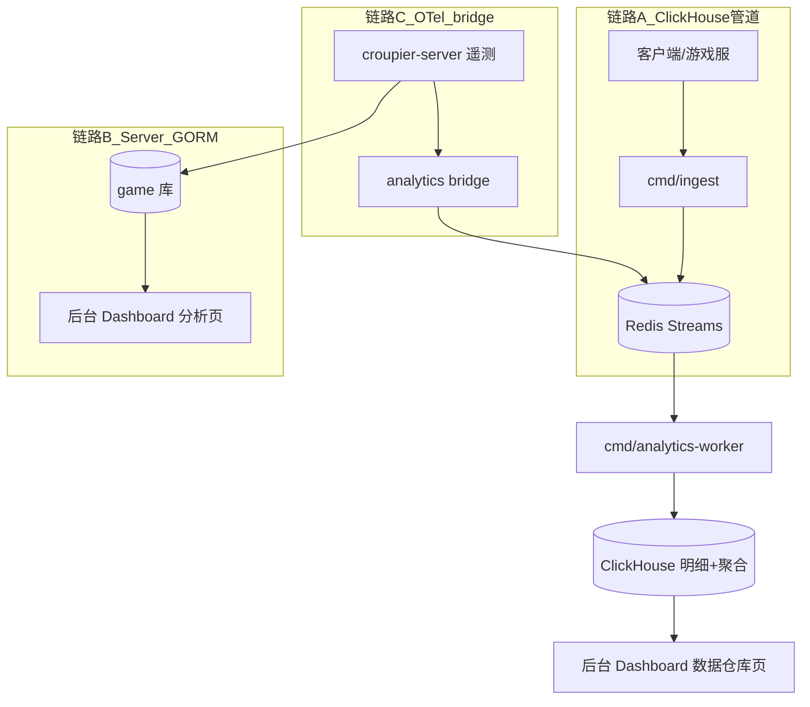
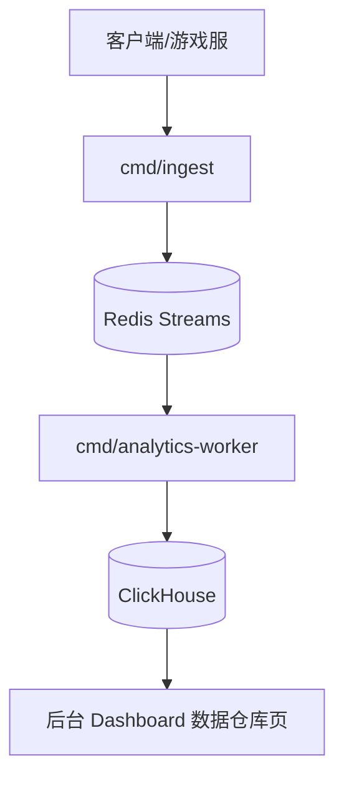

# 游戏数据分析系统文档

本节只保留与当前仓库内分析链路实现对应的说明：`cmd/ingest`、`cmd/analytics-worker`、`configs/analytics/*`、Redis、ClickHouse。

## 文档导航

### 核心概念

- [游戏指标全景图](./game-metrics-overview.md)
- [数据采集架构](./data-collection-architecture.md)
- [游戏类型适配](./game-type-adaptation.md)

### 技术实施

- [OpenTelemetry 集成](./opentelemetry-integration.md)
- [系统增强方案](./enhancement-plan.md)
- [ClickHouse 表结构](./clickhouse-schema.md)

### 快速落地

- [快速开始](./quick-start.md)
- [最佳实践](./best-practices.md)
- [故障排除](./troubleshooting.md)

## 数据链路拓扑

三条链路各有分工，查询出口统一收敛到后台 Dashboard（Analytics 分组）：

| 链路                   | 数据来源                                           | 存储                                                                                     | 查询出口                                          | 适用场景                                   |
| ---------------------- | -------------------------------------------------- | ---------------------------------------------------------------------------------------- | ------------------------------------------------- | ------------------------------------------ |
| **A：ClickHouse 管道** | 客户端/游戏服 → `cmd/ingest`（HMAC 签名上报）      | Redis Streams → `cmd/analytics-worker` → ClickHouse（events/payments 明细 + 3 张聚合表） | **数据仓库页**（`/api/v1/analytics/warehouse/*`） | 玩家行为、DAU/在线、收入等大规模明细与聚合 |
| **B：Server GORM**     | Server 自身业务模型（玩家、支付、关卡等游戏库表）  | 各 game 库（`internal/model`）                                                           | 概览/留存/行为/支付/关卡页                        | 中低数据量、需与业务实体 join 的统计       |
| **C：OTel bridge**     | Server 进程内遥测事件（OTel 语义命名，点号事件名） | bridge XAdd → `analytics:events` → 同管道 A                                              | 同 A（事件归流后与 A 合并）                       | 服务端自动埋点，无需游戏侧改造             |



> 历史出口 Grafana（`configs/grafana/` 空骨架）已随 P2 出口改造删除；需要自建可视化的部署可自行接 ClickHouse 数据源。

## 当前链路



## 启动顺序

```bash
docker compose up -d redis clickhouse
make server
make worker
make ingest
./bin/croupier-server --config configs/server.yaml
ANALYTICS_INGEST_SECRET=dev-secret ./bin/ingest --addr :8088 --secret dev-secret
./bin/analytics-worker
```
