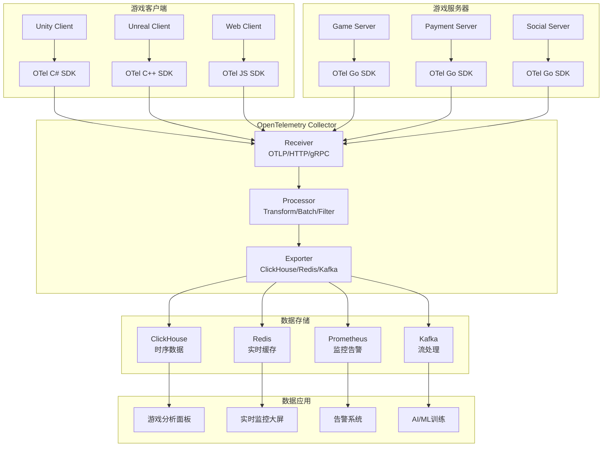

# OpenTelemetry 游戏分析集成指南

本文档详细介绍如何使用 OpenTelemetry (OTel) 构建现代化的游戏数据分析系统。

## 🎯 为什么选择 OpenTelemetry

### 传统方案 vs OpenTelemetry

| 维度 | 传统自建方案 | OpenTelemetry方案 | 提升效果 |
|------|-------------|-------------------|---------|
| **标准化** | 自定义格式，维护成本高 | CNCF标准，生态丰富 | 降低70%维护成本 |
| **多语言** | 每种语言重复开发 | 官方多语言SDK | 节省60%开发时间 |
| **可观测性** | 指标孤岛，难以关联 | Trace/Metric/Log统一 | 提升80%问题定位速度 |
| **扩展性** | 硬编码集成，难扩展 | 丰富的Exporter生态 | 支持任意后端存储 |
| **性能** | 自建优化，经验有限 | 工业级性能优化 | 高吞吐低延迟 |

## 🏗️ 架构设计

### 整体架构图



## 📋 游戏语义标准化

### 核心属性定义

```go
// 游戏业务 Semantic Conventions
package gametelemetry

import "go.opentelemetry.io/otel/attribute"

const (
    // === 游戏基础属性 ===
    GameIDKey        = attribute.Key("game.id")           // 游戏ID
    GameVersionKey   = attribute.Key("game.version")      // 游戏版本
    GameEnvKey       = attribute.Key("game.environment")  // 环境: prod/staging/dev
    GameModeKey      = attribute.Key("game.mode")         // 游戏模式: pvp/pve/tutorial/story

    // === 用户属性 ===
    UserIDKey        = attribute.Key("user.id")           // 用户唯一ID
    UserLevelKey     = attribute.Key("user.level")        // 用户等级
    UserVIPKey       = attribute.Key("user.vip_level")    // VIP等级
    UserRegionKey    = attribute.Key("user.region")       // 用户地区
    UserRegisteredAtKey = attribute.Key("user.registered_at") // 注册时间

    // === 会话属性 ===
    SessionIDKey     = attribute.Key("session.id")        // 会话ID
    SessionTypeKey   = attribute.Key("session.type")      // 会话类型: active/background/inactive
    SessionDurationKey = attribute.Key("session.duration") // 会话时长(秒)

    // === 游戏内容属性 ===
    ContentIDKey     = attribute.Key("content.id")         // 内容ID: 关卡/副本/活动
    ContentTypeKey   = attribute.Key("content.type")       // 内容类型: level/dungeon/event
    ContentDifficultyKey = attribute.Key("content.difficulty") // 难度: easy/normal/hard/expert
    ContentChapterKey = attribute.Key("content.chapter")   // 章节
    ContentWorldKey  = attribute.Key("content.world")      // 世界/地图

    // === 经济属性 ===
    CurrencyTypeKey  = attribute.Key("economy.currency_type")  // 货币类型: gold/diamond/energy
    CurrencyAmountKey = attribute.Key("economy.amount")        // 数量
    TransactionIDKey = attribute.Key("economy.transaction_id") // 交易ID
    ProductIDKey     = attribute.Key("economy.product_id")     // 商品ID
    PaymentMethodKey = attribute.Key("economy.payment_method") // 支付方式

    // === 社交属性 ===
    GuildIDKey       = attribute.Key("social.guild_id")    // 公会ID
    TeamIDKey        = attribute.Key("social.team_id")     // 队伍ID
    FriendCountKey   = attribute.Key("social.friend_count") // 好友数量
    ChatChannelKey   = attribute.Key("social.chat_channel") // 聊天频道

    // === 竞技属性 ===
    BattleIDKey      = attribute.Key("battle.id")          // 战斗ID
    BattleTypeKey    = attribute.Key("battle.type")        // 战斗类型: pvp/pve/raid
    BattleModeKey    = attribute.Key("battle.mode")        // 战斗模式: ranked/casual/tournament
    MatchIDKey       = attribute.Key("match.id")           // 匹配ID
    RankTierKey      = attribute.Key("rank.tier")          // 段位

    // === 技术属性 ===
    ClientPlatformKey = attribute.Key("client.platform")   // 客户端平台: ios/android/pc
    ClientVersionKey = attribute.Key("client.version")     // 客户端版本
    DeviceModelKey   = attribute.Key("device.model")       // 设备型号
    OSVersionKey     = attribute.Key("os.version")         // 操作系统版本
    NetworkTypeKey   = attribute.Key("network.type")       // 网络类型: wifi/cellular/ethernet
)

// === 标准事件类型 ===
const (
    // 用户生命周期事件
    EventUserRegister    = "user.register"         // 用户注册
    EventUserLogin       = "user.login"            // 用户登录
    EventUserLogout      = "user.logout"           // 用户登出
    EventSessionStart    = "session.start"         // 会话开始
    EventSessionEnd      = "session.end"           // 会话结束
    EventUserFirstTime   = "user.first_time"       // 首次游戏

    // 游戏进度事件
    EventLevelStart      = "gameplay.level.start"     // 关卡开始
    EventLevelComplete   = "gameplay.level.complete"  // 关卡完成
    EventLevelFail       = "gameplay.level.fail"      // 关卡失败
    EventLevelSkip       = "gameplay.level.skip"      // 跳过关卡
    EventQuestStart      = "gameplay.quest.start"     // 任务开始
    EventQuestComplete   = "gameplay.quest.complete"  // 任务完成
    EventAchievementUnlock = "gameplay.achievement.unlock" // 成就解锁

    // 经济行为事件
    EventPurchaseStart   = "economy.purchase.start"    // 开始支付
    EventPurchaseComplete = "economy.purchase.complete" // 支付完成
    EventPurchaseFail    = "economy.purchase.fail"     // 支付失败
    EventCurrencyEarn    = "economy.currency.earn"     // 获得货币
    EventCurrencySpend   = "economy.currency.spend"    // 消费货币
    EventItemObtain      = "economy.item.obtain"       // 获得道具
    EventItemConsume     = "economy.item.consume"      // 消费道具
    EventItemUpgrade     = "economy.item.upgrade"      // 道具升级

    // 社交行为事件
    EventFriendAdd       = "social.friend.add"         // 添加好友
    EventFriendRemove    = "social.friend.remove"      // 删除好友
    EventGuildJoin       = "social.guild.join"         // 加入公会
    EventGuildLeave      = "social.guild.leave"        // 离开公会
    EventChatSend        = "social.chat.send"          // 发送聊天
    EventGiftSend        = "social.gift.send"          // 赠送礼物
    EventGiftReceive     = "social.gift.receive"       // 接收礼物

    // 竞技行为事件
    EventBattleStart     = "combat.battle.start"       // 战斗开始
    EventBattleEnd       = "combat.battle.end"         // 战斗结束
    EventSkillUse        = "combat.skill.use"          // 技能使用
    EventPVPMatch        = "combat.pvp.match"          // PVP匹配
    EventRankUp          = "combat.rank.up"            // 段位提升
    EventRankDown        = "combat.rank.down"          // 段位下降

    // UI交互事件
    EventUIPageView      = "ui.page_view"              // 页面浏览
    EventUIButtonClick   = "ui.button_click"           // 按钮点击
    EventUIModalOpen     = "ui.modal.open"             // 模态框打开
    EventUIModalClose    = "ui.modal.close"            // 模态框关闭
    EventUIFormSubmit    = "ui.form.submit"            // 表单提交

    // 技术事件
    EventAppStart        = "app.start"                 // 应用启动
    EventAppCrash        = "app.crash"                 // 应用崩溃
    EventLoadComplete    = "app.load.complete"         // 加载完成
    EventNetworkError    = "network.error"             // 网络错误
    EventAPICall         = "api.call"                  // API调用
)
```

### 指标定义标准

```go
package gametelemetry

import "go.opentelemetry.io/otel/metric"

type GameMetrics struct {
    // === 用户活跃指标 ===
    DAU metric.Int64ObservableGauge    // 日活跃用户
    MAU metric.Int64ObservableGauge    // 月活跃用户
    NewUsers metric.Int64Counter       // 新注册用户数

    // === 会话指标 ===
    SessionDuration metric.Float64Histogram  // 会话时长分布
    SessionCount metric.Int64Counter         // 会话数

    // === 经济指标 ===
    Revenue metric.Float64Counter            // 收入
    ARPU metric.Float64ObservableGauge       // 平均每用户收益
    PaidUserCount metric.Int64Counter        // 付费用户数
    TransactionCount metric.Int64Counter     // 交易数量

    // === 内容指标 ===
    LevelCompletion metric.Float64Histogram  // 关卡完成率分布
    LevelDuration metric.Float64Histogram    // 关卡耗时分布
    QuestCompletion metric.Int64Counter      // 任务完成数

    // === 社交指标 ===
    FriendAdditions metric.Int64Counter      // 添加好友数
    ChatMessages metric.Int64Counter         // 聊天消息数
    GuildMembers metric.Int64ObservableGauge // 公会成员数

    // === 技术指标 ===
    ClientFPS metric.Float64Histogram        // 客户端帧率
    LoadTime metric.Float64Histogram         // 加载时间
    NetworkLatency metric.Float64Histogram   // 网络延迟
    CrashRate metric.Float64ObservableGauge  // 崩溃率
    APILatency metric.Float64Histogram       // API延迟
}

func NewGameMetrics(meter metric.Meter) *GameMetrics {
    return &GameMetrics{
        // 用户活跃指标
        DAU: meter.Int64ObservableGauge("game.users.daily_active",
            metric.WithDescription("Daily Active Users"),
            metric.WithUnit("{users}"),
        ),

        MAU: meter.Int64ObservableGauge("game.users.monthly_active",
            metric.WithDescription("Monthly Active Users"),
            metric.WithUnit("{users}"),
        ),

        NewUsers: meter.Int64Counter("game.users.new_registrations",
            metric.WithDescription("New user registrations"),
            metric.WithUnit("{users}"),
        ),

        // 会话指标 (使用建议的桶配置)
        SessionDuration: meter.Float64Histogram("game.session.duration",
            metric.WithDescription("Game session duration"),
            metric.WithUnit("s"),
            metric.WithExplicitBucketBoundaries([]float64{
                30, 60, 120, 300, 600, 1200, 1800, 3600, 7200,  // 30秒到2小时
            }...),
        ),

        SessionCount: meter.Int64Counter("game.session.count",
            metric.WithDescription("Number of game sessions"),
            metric.WithUnit("{sessions}"),
        ),

        // 经济指标
        Revenue: meter.Float64Counter("game.economy.revenue",
            metric.WithDescription("Game revenue in USD"),
            metric.WithUnit("USD"),
        ),

        ARPU: meter.Float64ObservableGauge("game.economy.arpu",
            metric.WithDescription("Average Revenue Per User"),
            metric.WithUnit("USD"),
        ),

        PaidUserCount: meter.Int64Counter("game.economy.paid_users",
            metric.WithDescription("Number of paying users"),
            metric.WithUnit("{users}"),
        ),

        // 内容指标
        LevelCompletion: meter.Float64Histogram("game.content.level.completion_rate",
            metric.WithDescription("Level completion rate"),
            metric.WithUnit("1"),  // 比率，无单位
            metric.WithExplicitBucketBoundaries([]float64{
                0.1, 0.2, 0.3, 0.4, 0.5, 0.6, 0.7, 0.8, 0.9, 0.95, 0.99, 1.0,
            }...),
        ),

        LevelDuration: meter.Float64Histogram("game.content.level.duration",
            metric.WithDescription("Time to complete level"),
            metric.WithUnit("s"),
            metric.WithExplicitBucketBoundaries([]float64{
                10, 30, 60, 120, 300, 600, 1200, 1800, 3600,  // 10秒到1小时
            }...),
        ),

        // 技术指标
        ClientFPS: meter.Float64Histogram("game.client.fps",
            metric.WithDescription("Client frame rate"),
            metric.WithUnit("fps"),
            metric.WithExplicitBucketBoundaries([]float64{
                15, 20, 24, 30, 45, 60, 75, 90, 120, 144,
            }...),
        ),

        LoadTime: meter.Float64Histogram("game.client.load_time",
            metric.WithDescription("Game loading time"),
            metric.WithUnit("ms"),
            metric.WithExplicitBucketBoundaries([]float64{
                100, 250, 500, 1000, 2000, 5000, 10000, 20000,
            }...),
        ),

        NetworkLatency: meter.Float64Histogram("game.network.latency",
            metric.WithDescription("Network round-trip latency"),
            metric.WithUnit("ms"),
            metric.WithExplicitBucketBoundaries([]float64{
                5, 10, 25, 50, 100, 200, 500, 1000, 2000,
            }...),
        ),
    }
}
```

## 🎮 客户端集成

### Unity C# SDK 实现

```csharp
using System;
using System.Collections.Generic;
using System.Diagnostics;
using OpenTelemetry.Api;
using OpenTelemetry.Instrumentation;
using UnityEngine;

namespace Croupier.Analytics.OpenTelemetry
{
    public class UnityGameTelemetry : MonoBehaviour
    {
        [Header("OpenTelemetry 配置")]
        public string serviceName = "unity-game-client";
        public string serviceVersion = "1.0.0";
        public string collectorEndpoint = "http://localhost:4318/v1/traces";
        public bool enableLogging = true;

        private Tracer tracer;
        private Meter meter;
        private ActivitySource activitySource;
        private GameMetrics metrics;

        // 会话跟踪
        private string currentSessionId;
        private DateTime sessionStartTime;
        private Activity sessionActivity;

        #region Unity生命周期
        private void Awake()
        {
            InitializeOpenTelemetry();
            StartGameSession();
        }

        private void Start()
        {
            TrackAppStart();
        }

        private void OnApplicationPause(bool pauseStatus)
        {
            if (pauseStatus)
            {
                TrackEvent(EventSessionPause);
            }
            else
            {
                TrackEvent(EventSessionResume);
            }
        }

        private void OnApplicationFocus(bool hasFocus)
        {
            TrackEvent(hasFocus ? EventSessionFocus : EventSessionBlur);
        }

        private void OnDestroy()
        {
            EndGameSession();
            DisposeOpenTelemetry();
        }
        #endregion

        #region OpenTelemetry 初始化
        private void InitializeOpenTelemetry()
        {
            // 创建ActivitySource
            activitySource = new ActivitySource(serviceName, serviceVersion);

            // 获取全局TracerProvider中的Tracer
            tracer = TracerProvider.Default.GetTracer(serviceName, serviceVersion);

            // 获取全局MeterProvider中的Meter
            meter = MeterProvider.Default.GetMeter(serviceName, serviceVersion);

            // 初始化游戏指标
            metrics = new GameMetrics(meter);

            if (enableLogging)
            {
                Debug.Log($"OpenTelemetry初始化完成: {serviceName} v{serviceVersion}");
            }
        }

        private void DisposeOpenTelemetry()
        {
            sessionActivity?.Dispose();
            activitySource?.Dispose();
        }
        #endregion

        #region 会话管理
        private void StartGameSession()
        {
            currentSessionId = Guid.NewGuid().ToString();
            sessionStartTime = DateTime.UtcNow;

            sessionActivity = activitySource.StartActivity("game.session");
            sessionActivity?.SetTag(SessionIDKey.Key, currentSessionId);
            sessionActivity?.SetTag(GameIDKey.Key, GetGameId());
            sessionActivity?.SetTag(UserIDKey.Key, GetCurrentUserId());
            sessionActivity?.SetTag(ClientPlatformKey.Key, Application.platform.ToString());

            TrackEvent(EventSessionStart, new Dictionary<string, object>
            {
                { "session_start_time", sessionStartTime.ToString("O") },
                { "device_model", SystemInfo.deviceModel },
                { "os_version", SystemInfo.operatingSystem },
                { "memory_size", SystemInfo.systemMemorySize },
                { "graphics_device", SystemInfo.graphicsDeviceName }
            });
        }

        private void EndGameSession()
        {
            if (sessionActivity == null) return;

            var sessionDuration = DateTime.UtcNow - sessionStartTime;

            sessionActivity.SetTag("session.duration", sessionDuration.TotalSeconds);
            sessionActivity.Dispose();

            TrackEvent(EventSessionEnd, new Dictionary<string, object>
            {
                { "session_duration", sessionDuration.TotalSeconds },
                { "session_end_time", DateTime.UtcNow.ToString("O") }
            });

            // 记录会话指标
            metrics.SessionDuration.Record(sessionDuration.TotalSeconds);
            metrics.SessionCount.Add(1);
        }
        #endregion

        #region 核心事件追踪
        /// <summary>
        /// 通用事件追踪方法
        /// </summary>
        public void TrackEvent(string eventName, Dictionary<string, object> attributes = null)
        {
            using var activity = activitySource.StartActivity(eventName);

            if (activity == null) return;

            // 设置基础属性
            activity.SetTag(GameIDKey.Key, GetGameId());
            activity.SetTag(UserIDKey.Key, GetCurrentUserId());
            activity.SetTag(SessionIDKey.Key, currentSessionId);
            activity.SetTag(ClientVersionKey.Key, Application.version);
            activity.SetTag("timestamp", DateTimeOffset.UtcNow.ToUnixTimeMilliseconds());

            // 设置自定义属性
            if (attributes != null)
            {
                foreach (var attr in attributes)
                {
                    activity.SetTag(attr.Key, attr.Value?.ToString());
                }
            }

            if (enableLogging)
            {
                Debug.Log($"Tracked event: {eventName}");
            }
        }

        /// <summary>
        /// 开始Span，用于追踪耗时操作
        /// </summary>
        public Activity StartActivity(string activityName)
        {
            var activity = activitySource.StartActivity(activityName);

            activity?.SetTag(GameIDKey.Key, GetGameId());
            activity?.SetTag(UserIDKey.Key, GetCurrentUserId());
            activity?.SetTag(SessionIDKey.Key, currentSessionId);

            return activity;
        }
        #endregion

        #region 游戏业务事件
        /// <summary>
        /// 用户登录
        /// </summary>
        public void TrackUserLogin(string userId, string loginMethod = "password")
        {
            using var activity = activitySource.StartActivity(EventUserLogin);

            activity?.SetTag(UserIDKey.Key, userId);
            activity?.SetTag("login.method", loginMethod);
            activity?.SetTag("login.timestamp", DateTimeOffset.UtcNow.ToUnixTimeMilliseconds());

            // 更新用户上下文
            SetCurrentUserId(userId);

            TrackEvent(EventUserLogin, new Dictionary<string, object>
            {
                { "user_id", userId },
                { "login_method", loginMethod },
                { "first_login", IsFirstLogin(userId) }
            });
        }

        /// <summary>
        /// 关卡开始
        /// </summary>
        public Activity StartLevel(string levelId, int difficulty = 1)
        {
            var activity = activitySource.StartActivity(EventLevelStart);

            activity?.SetTag(ContentIDKey.Key, levelId);
            activity?.SetTag(ContentTypeKey.Key, "level");
            activity?.SetTag(ContentDifficultyKey.Key, difficulty.ToString());
            activity?.SetTag(UserLevelKey.Key, GetCurrentUserLevel());

            TrackEvent(EventLevelStart, new Dictionary<string, object>
            {
                { "level_id", levelId },
                { "difficulty", difficulty },
                { "user_level", GetCurrentUserLevel() },
                { "level_start_time", DateTimeOffset.UtcNow.ToUnixTimeMilliseconds() }
            });

            return activity;
        }

        /// <summary>
        /// 关卡完成
        /// </summary>
        public void CompleteLevel(Activity levelActivity, bool success, float score = 0, int attempts = 1)
        {
            if (levelActivity == null) return;

            var duration = DateTimeOffset.UtcNow - levelActivity.StartTimeUtc;
            var levelId = levelActivity.GetTagItem(ContentIDKey.Key)?.ToString();

            levelActivity.SetTag("level.success", success);
            levelActivity.SetTag("level.duration", duration.TotalSeconds);
            levelActivity.SetTag("level.score", score);
            levelActivity.SetTag("level.attempts", attempts);

            // 记录指标
            metrics.LevelCompletion.Record(success ? 1.0 : 0.0,
                new TagList { { ContentIDKey, levelId } });
            metrics.LevelDuration.Record(duration.TotalSeconds,
                new TagList { { ContentIDKey, levelId } });

            TrackEvent(success ? EventLevelComplete : EventLevelFail, new Dictionary<string, object>
            {
                { "level_id", levelId },
                { "success", success },
                { "duration", duration.TotalSeconds },
                { "score", score },
                { "attempts", attempts }
            });

            levelActivity.Dispose();
        }

        /// <summary>
        /// 支付事件
        /// </summary>
        public void TrackPurchase(string productId, decimal amount, string currency, string transactionId = null)
        {
            transactionId = transactionId ?? Guid.NewGuid().ToString();

            using var activity = activitySource.StartActivity(EventPurchaseStart);

            activity?.SetTag(ProductIDKey.Key, productId);
            activity?.SetTag("purchase.amount", amount);
            activity?.SetTag("purchase.currency", currency);
            activity?.SetTag(TransactionIDKey.Key, transactionId);

            // 记录收入指标 (注意：客户端记录的是尝试金额，实际收入以服务器为准)
            metrics.Revenue.Add((double)amount);

            TrackEvent(EventPurchaseStart, new Dictionary<string, object>
            {
                { "product_id", productId },
                { "amount", amount },
                { "currency", currency },
                { "transaction_id", transactionId },
                { "payment_method", "app_store" }
            });
        }

        /// <summary>
        /// UI交互事件
        /// </summary>
        public void TrackUIInteraction(string elementName, string action = "click", string pageName = null)
        {
            TrackEvent(EventUIButtonClick, new Dictionary<string, object>
            {
                { "ui.element_name", elementName },
                { "ui.action", action },
                { "ui.page_name", pageName ?? GetCurrentPage() },
                { "ui.timestamp", DateTimeOffset.UtcNow.ToUnixTimeMilliseconds() }
            });
        }
        #endregion

        #region 性能监控
        private void Update()
        {
            // 每秒采样一次性能数据
            if (Time.time - lastPerfSample >= 1.0f)
            {
                SamplePerformanceMetrics();
                lastPerfSample = Time.time;
            }
        }

        private float lastPerfSample;

        private void SamplePerformanceMetrics()
        {
            var currentFPS = 1.0f / Time.deltaTime;
            var memoryUsage = UnityEngine.Profiling.Profiler.GetTotalAllocatedMemory(false);

            // 记录性能指标
            metrics.ClientFPS.Record(currentFPS);

            // 低性能告警
            if (currentFPS < 20)
            {
                TrackEvent("performance.low_fps", new Dictionary<string, object>
                {
                    { "fps", currentFPS },
                    { "memory_usage", memoryUsage },
                    { "draw_calls", UnityStats.drawCalls }
                });
            }
        }

        /// <summary>
        /// 追踪加载时间
        /// </summary>
        public Activity StartLoadingTrace(string loadType)
        {
            var activity = activitySource.StartActivity("app.load");
            activity?.SetTag("load.type", loadType);
            return activity;
        }

        public void CompleteLoadingTrace(Activity loadActivity)
        {
            if (loadActivity == null) return;

            var loadTime = DateTimeOffset.UtcNow - loadActivity.StartTimeUtc;
            loadActivity.SetTag("load.duration", loadTime.TotalMilliseconds);

            metrics.LoadTime.Record(loadTime.TotalMilliseconds);
            loadActivity.Dispose();
        }
        #endregion

        #region 工具方法
        private string GetGameId() => "my-awesome-game";
        private string GetCurrentUserId() => PlayerPrefs.GetString("user_id", "guest");
        private void SetCurrentUserId(string userId) => PlayerPrefs.SetString("user_id", userId);
        private int GetCurrentUserLevel() => PlayerPrefs.GetInt("user_level", 1);
        private bool IsFirstLogin(string userId) => !PlayerPrefs.HasKey($"first_login_{userId}");
        private string GetCurrentPage() => "main_menu"; // 实际应用中应该动态获取

        private void TrackAppStart()
        {
            TrackEvent(EventAppStart, new Dictionary<string, object>
            {
                { "app_version", Application.version },
                { "unity_version", Application.unityVersion },
                { "platform", Application.platform.ToString() },
                { "device_model", SystemInfo.deviceModel },
                { "screen_resolution", $"{Screen.width}x{Screen.height}" }
            });
        }
        #endregion
    }

    // 游戏指标封装类
    public class GameMetrics
    {
        public Counter<int> SessionCount { get; }
        public Histogram<double> SessionDuration { get; }
        public Histogram<double> LevelCompletion { get; }
        public Histogram<double> LevelDuration { get; }
        public Counter<double> Revenue { get; }
        public Histogram<double> ClientFPS { get; }
        public Histogram<double> LoadTime { get; }

        public GameMetrics(Meter meter)
        {
            SessionCount = meter.CreateCounter<int>("game.session.count");
            SessionDuration = meter.CreateHistogram<double>("game.session.duration");
            LevelCompletion = meter.CreateHistogram<double>("game.level.completion_rate");
            LevelDuration = meter.CreateHistogram<double>("game.level.duration");
            Revenue = meter.CreateCounter<double>("game.economy.revenue");
            ClientFPS = meter.CreateHistogram<double>("game.client.fps");
            LoadTime = meter.CreateHistogram<double>("game.client.load_time");
        }
    }
}
```

## 🖥️ 服务器端集成

### Go服务器SDK实现

```go
package gametelemetry

import (
    "context"
    "fmt"
    "time"

    "go.opentelemetry.io/otel"
    "go.opentelemetry.io/otel/attribute"
    "go.opentelemetry.io/otel/codes"
    "go.opentelemetry.io/otel/metric"
    "go.opentelemetry.io/otel/trace"
)

type GameTelemetryService struct {
    tracer trace.Tracer
    meter  metric.Meter

    // 核心指标
    userLoginCounter     metric.Int64Counter
    levelCompleteCounter metric.Int64Counter
    revenueCounter       metric.Float64Counter
    sessionDurationHist  metric.Float64Histogram
}

func NewGameTelemetryService(serviceName string) *GameTelemetryService {
    tracer := otel.Tracer(serviceName)
    meter := otel.Meter(serviceName)

    return &GameTelemetryService{
        tracer: tracer,
        meter:  meter,

        userLoginCounter: meter.Int64Counter("game.user.login.total",
            metric.WithDescription("Total user logins"),
        ),

        levelCompleteCounter: meter.Int64Counter("game.level.complete.total",
            metric.WithDescription("Total level completions"),
        ),

        revenueCounter: meter.Float64Counter("game.economy.revenue.total",
            metric.WithDescription("Total game revenue"),
            metric.WithUnit("USD"),
        ),

        sessionDurationHist: meter.Float64Histogram("game.session.duration",
            metric.WithDescription("Session duration distribution"),
            metric.WithUnit("s"),
            metric.WithExplicitBucketBoundaries(
                30, 60, 120, 300, 600, 1200, 1800, 3600, 7200,
            ),
        ),
    }
}

// 用户登录事件追踪
func (g *GameTelemetryService) TrackUserLogin(ctx context.Context, req UserLoginRequest) error {
    ctx, span := g.tracer.Start(ctx, "user.login")
    defer span.End()

    // 设置Span属性
    span.SetAttributes(
        attribute.String(string(UserIDKey), req.UserID),
        attribute.String("login.method", req.LoginMethod),
        attribute.String(string(ClientPlatformKey), req.Platform),
        attribute.String("client.ip", req.ClientIP),
        attribute.String("client.user_agent", req.UserAgent),
        attribute.Bool("login.is_first_time", req.IsFirstTime),
    )

    // 业务逻辑验证
    if req.UserID == "" {
        span.SetStatus(codes.Error, "User ID is required")
        return fmt.Errorf("user ID is required")
    }

    // 记录登录指标
    g.userLoginCounter.Add(ctx, 1, metric.WithAttributes(
        attribute.String(string(GameIDKey), req.GameID),
        attribute.String(string(GameEnvKey), req.Environment),
        attribute.String("login.method", req.LoginMethod),
        attribute.String(string(ClientPlatformKey), req.Platform),
    ))

    // 添加业务事件
    span.AddEvent("user_authenticated", trace.WithAttributes(
        attribute.String("auth.provider", req.LoginMethod),
        attribute.Bool("auth.success", true),
    ))

    return nil
}

// 关卡完成事件追踪
func (g *GameTelemetryService) TrackLevelComplete(ctx context.Context, req LevelCompleteRequest) error {
    ctx, span := g.tracer.Start(ctx, "gameplay.level.complete")
    defer span.End()

    // 数据验证
    if err := g.validateLevelCompletion(req); err != nil {
        span.SetStatus(codes.Error, "Invalid level completion data")
        span.SetAttributes(attribute.String("validation.error", err.Error()))
        return err
    }

    span.SetAttributes(
        attribute.String(string(UserIDKey), req.UserID),
        attribute.String(string(ContentIDKey), req.LevelID),
        attribute.Bool("level.success", req.Success),
        attribute.Float64("level.duration", req.Duration.Seconds()),
        attribute.Int("level.attempts", req.Attempts),
        attribute.Float64("level.score", req.Score),
        attribute.String(string(ContentDifficultyKey), req.Difficulty),
    )

    // 记录关卡完成指标
    completionRate := 0.0
    if req.Success {
        completionRate = 1.0
    }

    g.levelCompleteCounter.Add(ctx, 1, metric.WithAttributes(
        attribute.String(string(ContentIDKey), req.LevelID),
        attribute.Bool("success", req.Success),
        attribute.String(string(ContentDifficultyKey), req.Difficulty),
    ))

    // 记录详细性能事件
    span.AddEvent("level_metrics_calculated", trace.WithAttributes(
        attribute.Float64("completion_rate", completionRate),
        attribute.Float64("performance_score", calculatePerformanceScore(req)),
        attribute.Bool("server_validated", true),
    ))

    return nil
}

// 支付事件追踪
func (g *GameTelemetryService) TrackPayment(ctx context.Context, payment PaymentEvent) error {
    ctx, span := g.tracer.Start(ctx, "economy.payment")
    defer span.End()

    span.SetAttributes(
        attribute.String(string(UserIDKey), payment.UserID),
        attribute.String("order.id", payment.OrderID),
        attribute.String(string(ProductIDKey), payment.ProductID),
        attribute.Float64("payment.amount", payment.Amount),
        attribute.String("payment.currency", payment.Currency),
        attribute.String("payment.status", payment.Status),
        attribute.String(string(PaymentMethodKey), payment.PaymentMethod),
    )

    // 只有成功支付才计入收入
    if payment.Status == "success" {
        g.revenueCounter.Add(ctx, payment.Amount, metric.WithAttributes(
            attribute.String(string(ProductIDKey), payment.ProductID),
            attribute.String("payment.currency", payment.Currency),
            attribute.String(string(PaymentMethodKey), payment.PaymentMethod),
        ))

        span.AddEvent("revenue_recorded", trace.WithAttributes(
            attribute.Float64("net_revenue", payment.Amount-payment.PlatformFee),
            attribute.Float64("platform_fee", payment.PlatformFee),
        ))
    } else {
        span.SetStatus(codes.Error, "Payment failed")
        span.AddEvent("payment_failed", trace.WithAttributes(
            attribute.String("failure_reason", payment.FailureReason),
        ))
    }

    return nil
}

// 会话结束事件追踪
func (g *GameTelemetryService) TrackSessionEnd(ctx context.Context, session SessionEndEvent) error {
    ctx, span := g.tracer.Start(ctx, "session.end")
    defer span.End()

    duration := session.EndTime.Sub(session.StartTime)

    span.SetAttributes(
        attribute.String(string(SessionIDKey), session.SessionID),
        attribute.String(string(UserIDKey), session.UserID),
        attribute.Float64("session.duration", duration.Seconds()),
        attribute.Int("session.levels_played", session.LevelsPlayed),
        attribute.Float64("session.revenue", session.RevenueGenerated),
    )

    // 记录会话时长分布
    g.sessionDurationHist.Record(ctx, duration.Seconds(), metric.WithAttributes(
        attribute.String(string(GameIDKey), session.GameID),
        attribute.String(string(ClientPlatformKey), session.Platform),
    ))

    return nil
}

// 批量事件处理
func (g *GameTelemetryService) ProcessEventBatch(ctx context.Context, events []GameEvent) error {
    ctx, span := g.tracer.Start(ctx, "events.process_batch")
    defer span.End()

    span.SetAttributes(
        attribute.Int("batch.size", len(events)),
        attribute.String("batch.id", generateBatchID()),
    )

    successCount := 0
    errorCount := 0

    for i, event := range events {
        if err := g.processEvent(ctx, event); err != nil {
            errorCount++
            span.AddEvent(fmt.Sprintf("event_%d_failed", i), trace.WithAttributes(
                attribute.String("error", err.Error()),
                attribute.String("event.type", event.EventType),
            ))
        } else {
            successCount++
        }
    }

    span.SetAttributes(
        attribute.Int("batch.success_count", successCount),
        attribute.Int("batch.error_count", errorCount),
    )

    if errorCount > 0 {
        span.SetStatus(codes.Error, fmt.Sprintf("%d events failed", errorCount))
    }

    return nil
}

// 私有方法
func (g *GameTelemetryService) validateLevelCompletion(req LevelCompleteRequest) error {
    // 验证关卡是否存在
    if !isValidLevel(req.LevelID) {
        return fmt.Errorf("invalid level ID: %s", req.LevelID)
    }

    // 验证完成时间合理性
    minDuration := getMinLevelDuration(req.LevelID)
    if req.Success && req.Duration < minDuration {
        return fmt.Errorf("completion time too fast: %v < %v", req.Duration, minDuration)
    }

    // 验证分数合理性
    maxScore := getMaxLevelScore(req.LevelID)
    if req.Score > maxScore {
        return fmt.Errorf("score exceeds maximum: %.2f > %.2f", req.Score, maxScore)
    }

    return nil
}

func (g *GameTelemetryService) processEvent(ctx context.Context, event GameEvent) error {
    switch event.EventType {
    case EventUserLogin:
        return g.processLoginEvent(ctx, event)
    case EventLevelComplete:
        return g.processLevelEvent(ctx, event)
    case EventPurchaseComplete:
        return g.processPaymentEvent(ctx, event)
    default:
        return g.processGenericEvent(ctx, event)
    }
}

// 工具函数
func calculatePerformanceScore(req LevelCompleteRequest) float64 {
    // 根据完成时间、尝试次数、分数等计算性能评分
    baseScore := req.Score
    timeBonus := 1.0
    attemptPenalty := float64(req.Attempts-1) * 0.1

    return baseScore * timeBonus * (1.0 - attemptPenalty)
}

func isValidLevel(levelID string) bool {
    // 实际实现中应该查询数据库或配置
    return levelID != ""
}

func getMinLevelDuration(levelID string) time.Duration {
    // 实际实现中应该从配置中获取
    return 10 * time.Second
}

func getMaxLevelScore(levelID string) float64 {
    // 实际实现中应该从配置中获取
    return 1000.0
}

func generateBatchID() string {
    return fmt.Sprintf("batch_%d", time.Now().Unix())
}

// 数据结构定义
type UserLoginRequest struct {
    UserID      string
    LoginMethod string
    Platform    string
    ClientIP    string
    UserAgent   string
    GameID      string
    Environment string
    IsFirstTime bool
}

type LevelCompleteRequest struct {
    UserID     string
    LevelID    string
    Success    bool
    Duration   time.Duration
    Attempts   int
    Score      float64
    Difficulty string
}

type PaymentEvent struct {
    UserID        string
    OrderID       string
    ProductID     string
    Amount        float64
    Currency      string
    Status        string
    PaymentMethod string
    PlatformFee   float64
    FailureReason string
}

type SessionEndEvent struct {
    SessionID        string
    UserID           string
    GameID           string
    Platform         string
    StartTime        time.Time
    EndTime          time.Time
    LevelsPlayed     int
    RevenueGenerated float64
}

type GameEvent struct {
    EventType  string
    UserID     string
    GameID     string
    Timestamp  time.Time
    Properties map[string]interface{}
}
```

## ⚙️ OpenTelemetry Collector 配置

### 游戏优化的Collector配置

```yaml
# otel-collector-game.yaml
receivers:
  # OTLP接收器 - 接收客户端和服务器数据
  otlp:
    protocols:
      grpc:
        endpoint: 0.0.0.0:4317
      http:
        endpoint: 0.0.0.0:4318
        cors:
          allowed_origins:
            - "*"
          allowed_headers:
            - "*"

  # 文件日志接收器 - 接收游戏服务器日志
  filelog:
    include: [ "/var/log/game/*.log" ]
    operators:
      - type: json_parser
        parse_from: body
        parse_to: attributes
      - type: move
        from: attributes.level
        to: severity_text
      - type: move
        from: attributes.msg
        to: body

processors:
  # 内存限制器 - 防止OOM
  memory_limiter:
    limit_mib: 1024
    spike_limit_mib: 256

  # 批处理器 - 优化网络和存储性能
  batch:
    timeout: 1s
    send_batch_size: 1024
    send_batch_max_size: 2048

  # 数据转换器 - 游戏业务逻辑处理
  transform:
    trace_statements:
      - context: span
        statements:
          # 添加部署环境标签
          - set(attributes["deployment.environment"], "production")

          # 用户ID脱敏处理
          - replace_pattern(attributes["user.id"], "(?P<prefix>.{3}).*(?P<suffix>.{2})", "$${prefix}***$${suffix}") where attributes["user.id"] != nil

          # 计算会话时长
          - set(attributes["session.duration_minutes"], attributes["session.duration"] / 60) where attributes["session.duration"] != nil

          # 添加游戏业务标签
          - set(attributes["game.category"], "rpg") where attributes["game.id"] == "fantasy-quest"
          - set(attributes["game.category"], "casual") where attributes["game.id"] == "puzzle-match"

    metric_statements:
      - context: metric
        statements:
          # 转换单位：毫秒 -> 秒
          - set(unit, "s") where name == "game.client.load_time"
          - set(value, value / 1000) where name == "game.client.load_time"

          # 添加性能等级标签
          - set(attributes["performance.tier"], "high") where name == "game.client.fps" and value >= 60
          - set(attributes["performance.tier"], "medium") where name == "game.client.fps" and value >= 30 and value < 60
          - set(attributes["performance.tier"], "low") where name == "game.client.fps" and value < 30

    log_statements:
      - context: log
        statements:
          # 提取结构化日志字段
          - merge_maps(cache, attributes, "upsert") where attributes != nil
          - set(severity_text, "ERROR") where attributes["level"] == "error"
          - set(severity_text, "WARN") where attributes["level"] == "warn"
          - set(severity_text, "INFO") where attributes["level"] == "info"

  # 资源处理器 - 添加资源标识
  resource:
    attributes:
      - key: service.namespace
        value: "gaming"
        action: upsert
      - key: service.instance.id
        from_attribute: host.name
        action: insert

  # 采样器 - 智能采样策略
  probabilistic_sampler:
    sampling_percentage: 10  # 基础采样率10%
    hash_seed: 22

  # 属性过滤器 - 移除敏感信息
  attributes:
    actions:
      - key: client.ip
        action: delete
      - key: user.email
        action: delete
      - key: payment.card_number
        action: delete

exporters:
  # ClickHouse导出器 - 主要分析数据库
  clickhouse:
    endpoint: "http://clickhouse:8123"
    database: "game_analytics"
    username: "analytics_user"
    password: "analytics_password"
    timeout: 10s
    retry_on_failure:
      enabled: true
      initial_interval: 1s
      max_interval: 30s
      max_elapsed_time: 300s

    # 表映射配置
    traces_table_name: "otel_traces"
    metrics_table_name: "otel_metrics"
    logs_table_name: "otel_logs"

    # TTL配置
    ttl_days: 90

    # ClickHouse特定优化
    create_schema: true
    engine: "MergeTree()"
    partition_by: "toYYYYMM(timestamp)"
    order_by: ["game_id", "user_id", "timestamp"]

  # Redis导出器 - 实时缓存
  redis:
    endpoint: "redis:6379"
    db: 0
    timeout: 5s

    # Key前缀配置
    key_prefix: "otel:game:"

    # 过期时间配置
    ttl: 3600  # 1小时

    # 仅导出关键实时指标
    metrics_filter:
      - "game.users.daily_active"
      - "game.users.online_count"
      - "game.economy.revenue"
      - "game.session.count"

  # Kafka导出器 - 流处理
  kafka:
    brokers: ["kafka1:9092", "kafka2:9092"]
    topic: "game-telemetry"
    partition: 0

    # 压缩配置
    compression: "gzip"

    # 批量发送配置
    max_message_bytes: 1000000

  # Prometheus导出器 - 监控告警
  prometheus:
    endpoint: "0.0.0.0:8889"
    namespace: "game"

    # 标签配置
    const_labels:
      environment: "production"
      service: "game-analytics"

    # 仅导出聚合指标
    metric_expiration: 5m

    # 资源到标签的映射
    resource_to_telemetry_conversion:
      enabled: true

  # 日志文件导出器 - 调试用
  file:
    path: "/var/log/otel-collector/game-telemetry.log"
    rotation:
      max_megabytes: 100
      max_days: 7

service:
  # 处理管道配置
  pipelines:
    # Traces管道 - 用户行为路径分析
    traces:
      receivers: [otlp]
      processors: [memory_limiter, resource, transform, probabilistic_sampler, attributes, batch]
      exporters: [clickhouse, file]

    # Metrics管道 - 游戏KPI指标
    metrics:
      receivers: [otlp]
      processors: [memory_limiter, resource, transform, batch]
      exporters: [clickhouse, redis, prometheus]

    # Logs管道 - 游戏事件日志
    logs:
      receivers: [otlp, filelog]
      processors: [memory_limiter, resource, transform, batch]
      exporters: [clickhouse, file]

  # 扩展配置
  extensions: [health_check, pprof, zpages]

  # 遥测配置
  telemetry:
    logs:
      level: "info"
    metrics:
      address: "0.0.0.0:8888"

# 健康检查配置
health_check:
  endpoint: "0.0.0.0:13133"

# 性能分析配置
pprof:
  endpoint: "localhost:1777"

# 调试页面配置
zpages:
  endpoint: "localhost:55679"
```

## 📊 数据查询示例

### ClickHouse查询优化

```sql
-- 游戏核心KPI实时查询
-- 查询最近24小时的DAU趋势
SELECT
    toHour(timestamp) as hour,
    uniqExact(attributes['user.id']) as dau,
    count() as total_events
FROM otel_traces
WHERE
    span_name = 'user.login'
    AND timestamp >= now() - INTERVAL 24 HOUR
    AND attributes['game.id'] = 'my-game'
GROUP BY hour
ORDER BY hour;

-- 关卡完成率分析（按难度分组）
WITH level_attempts AS (
    SELECT
        attributes['content.id'] as level_id,
        attributes['content.difficulty'] as difficulty,
        attributes['user.id'] as user_id,
        span_name,
        timestamp
    FROM otel_traces
    WHERE span_name IN ('gameplay.level.start', 'gameplay.level.complete')
        AND timestamp >= today() - INTERVAL 7 DAY
),
completion_stats AS (
    SELECT
        level_id,
        difficulty,
        countIf(span_name = 'gameplay.level.start') as attempts,
        countIf(span_name = 'gameplay.level.complete') as completions
    FROM level_attempts
    GROUP BY level_id, difficulty
)
SELECT
    level_id,
    difficulty,
    attempts,
    completions,
    round(completions * 100.0 / attempts, 2) as completion_rate,
    CASE
        WHEN completion_rate >= 80 THEN 'Easy'
        WHEN completion_rate >= 60 THEN 'Normal'
        WHEN completion_rate >= 40 THEN 'Hard'
        ELSE 'Very Hard'
    END as difficulty_assessment
FROM completion_stats
WHERE attempts >= 100  -- 过滤样本量太小的关卡
ORDER BY completion_rate DESC;

-- 用户行为路径分析（漏斗分析）
WITH user_journey AS (
    SELECT
        attributes['user.id'] as user_id,
        span_name as event_type,
        timestamp,
        ROW_NUMBER() OVER (
            PARTITION BY attributes['user.id']
            ORDER BY timestamp
        ) as event_sequence
    FROM otel_traces
    WHERE
        timestamp >= today() - INTERVAL 1 DAY
        AND span_name IN (
            'user.login',
            'gameplay.level.start',
            'economy.purchase.start',
            'economy.purchase.complete'
        )
),
funnel_analysis AS (
    SELECT
        user_id,
        SUM(CASE WHEN event_type = 'user.login' THEN 1 ELSE 0 END) as login_count,
        SUM(CASE WHEN event_type = 'gameplay.level.start' THEN 1 ELSE 0 END) as level_start_count,
        SUM(CASE WHEN event_type = 'economy.purchase.start' THEN 1 ELSE 0 END) as purchase_start_count,
        SUM(CASE WHEN event_type = 'economy.purchase.complete' THEN 1 ELSE 0 END) as purchase_complete_count
    FROM user_journey
    GROUP BY user_id
)
SELECT
    count() as total_users,
    countIf(login_count > 0) as logged_in_users,
    countIf(level_start_count > 0) as played_users,
    countIf(purchase_start_count > 0) as purchase_attempt_users,
    countIf(purchase_complete_count > 0) as paying_users,

    -- 转化率计算
    round(played_users * 100.0 / logged_in_users, 2) as login_to_play_rate,
    round(purchase_attempt_users * 100.0 / played_users, 2) as play_to_purchase_attempt_rate,
    round(paying_users * 100.0 / purchase_attempt_users, 2) as purchase_success_rate
FROM funnel_analysis;

-- 收入分析（按产品和支付方式）
SELECT
    attributes['economy.product_id'] as product_id,
    attributes['economy.payment_method'] as payment_method,
    count() as transaction_count,
    sum(attributes['purchase.amount']) as total_revenue,
    avg(attributes['purchase.amount']) as avg_transaction_value,
    uniqExact(attributes['user.id']) as unique_buyers
FROM otel_traces
WHERE
    span_name = 'economy.purchase.complete'
    AND timestamp >= today() - INTERVAL 7 DAY
    AND attributes['payment.status'] = 'success'
GROUP BY product_id, payment_method
ORDER BY total_revenue DESC;

-- 性能问题分析（低FPS用户分析）
SELECT
    attributes['client.platform'] as platform,
    attributes['device.model'] as device_model,
    attributes['performance.tier'] as performance_tier,
    count() as sample_count,
    avg(value) as avg_fps,
    quantile(0.5)(value) as median_fps,
    quantile(0.95)(value) as p95_fps,
    countIf(value < 30) as low_fps_count
FROM otel_metrics
WHERE
    metric_name = 'game.client.fps'
    AND timestamp >= now() - INTERVAL 24 HOUR
GROUP BY platform, device_model, performance_tier
HAVING sample_count >= 10
ORDER BY avg_fps ASC;
```

## 🚀 部署指南

### Docker Compose 部署

```yaml
# docker-compose-otel-game.yml
version: '3.8'

services:
  # OpenTelemetry Collector
  otel-collector:
    image: otel/opentelemetry-collector:0.88.0
    container_name: game-otel-collector
    ports:
      - "4317:4317"   # OTLP gRPC receiver
      - "4318:4318"   # OTLP HTTP receiver
      - "8889:8889"   # Prometheus exporter
      - "13133:13133" # Health check
    volumes:
      - ./otel-collector-game.yaml:/etc/otel-collector-config.yaml
      - ./logs:/var/log/game
    command: ["--config=/etc/otel-collector-config.yaml"]
    depends_on:
      - clickhouse
      - redis
    environment:
      - GOMEMLIMIT=1024MiB
    restart: unless-stopped

  # ClickHouse - 时序数据仓库
  clickhouse:
    image: clickhouse/clickhouse-server:23.8
    container_name: game-clickhouse
    ports:
      - "8123:8123"
      - "9000:9000"
    volumes:
      - clickhouse_data:/var/lib/clickhouse
      - ./clickhouse/config.xml:/etc/clickhouse-server/config.xml
      - ./clickhouse/users.xml:/etc/clickhouse-server/users.xml
    environment:
      - CLICKHOUSE_DB=game_analytics
      - CLICKHOUSE_USER=analytics_user
      - CLICKHOUSE_PASSWORD=analytics_password
    restart: unless-stopped

  # Redis - 实时缓存
  redis:
    image: redis:7.2-alpine
    container_name: game-redis
    ports:
      - "6379:6379"
    volumes:
      - redis_data:/data
    command: redis-server --appendonly yes --maxmemory 512mb --maxmemory-policy allkeys-lru
    restart: unless-stopped

  # Kafka - 流处理（可选）
  kafka:
    image: confluentinc/cp-kafka:7.4.0
    container_name: game-kafka
    ports:
      - "9092:9092"
    environment:
      KAFKA_ZOOKEEPER_CONNECT: zookeeper:2181
      KAFKA_ADVERTISED_LISTENERS: PLAINTEXT://localhost:9092
      KAFKA_OFFSETS_TOPIC_REPLICATION_FACTOR: 1
      KAFKA_AUTO_CREATE_TOPICS_ENABLE: 'true'
    volumes:
      - kafka_data:/var/lib/kafka/data
    depends_on:
      - zookeeper
    restart: unless-stopped

  zookeeper:
    image: confluentinc/cp-zookeeper:7.4.0
    container_name: game-zookeeper
    environment:
      ZOOKEEPER_CLIENT_PORT: 2181
      ZOOKEEPER_TICK_TIME: 2000
    volumes:
      - zookeeper_data:/var/lib/zookeeper/data
    restart: unless-stopped

  # Prometheus - 监控告警
  prometheus:
    image: prom/prometheus:v2.47.0
    container_name: game-prometheus
    ports:
      - "9090:9090"
    volumes:
      - ./prometheus/prometheus.yml:/etc/prometheus/prometheus.yml
      - prometheus_data:/prometheus
    command:
      - '--config.file=/etc/prometheus/prometheus.yml'
      - '--storage.tsdb.path=/prometheus'
      - '--web.console.libraries=/etc/prometheus/console_libraries'
      - '--web.console.templates=/etc/prometheus/consoles'
      - '--web.enable-lifecycle'
    restart: unless-stopped

  # Grafana - 可视化面板
  grafana:
    image: grafana/grafana:10.1.0
    container_name: game-grafana
    ports:
      - "3000:3000"
    volumes:
      - grafana_data:/var/lib/grafana
      - ./grafana/dashboards:/etc/grafana/provisioning/dashboards
      - ./grafana/datasources:/etc/grafana/provisioning/datasources
    environment:
      - GF_SECURITY_ADMIN_PASSWORD=admin123
    restart: unless-stopped

volumes:
  clickhouse_data:
  redis_data:
  kafka_data:
  zookeeper_data:
  prometheus_data:
  grafana_data:

networks:
  default:
    name: game-telemetry
```

### 启动脚本

```bash
#!/bin/bash
# deploy-game-telemetry.sh

set -e

echo "🚀 开始部署游戏OpenTelemetry分析系统..."

# 1. 创建必要目录
mkdir -p {logs,prometheus,grafana/dashboards,grafana/datasources,clickhouse}

# 2. 生成Prometheus配置
cat > prometheus/prometheus.yml << EOF
global:
  scrape_interval: 15s

scrape_configs:
  - job_name: 'otel-collector'
    static_configs:
      - targets: ['otel-collector:8889']

  - job_name: 'game-servers'
    static_configs:
      - targets: ['game-server:8080']
    metrics_path: '/metrics'
EOF

# 3. 生成Grafana数据源配置
cat > grafana/datasources/datasources.yml << EOF
apiVersion: 1

datasources:
  - name: ClickHouse
    type: vertamedia-clickhouse-datasource
    url: http://clickhouse:8123
    database: game_analytics
    basicAuth: true
    basicAuthUser: analytics_user
    basicAuthPassword: analytics_password

  - name: Prometheus
    type: prometheus
    url: http://prometheus:9090
    isDefault: true

  - name: Redis
    type: redis-datasource
    url: redis://redis:6379
EOF

# 4. 启动服务
echo "📦 启动OpenTelemetry服务栈..."
docker-compose -f docker-compose-otel-game.yml up -d

# 5. 等待服务启动
echo "⏳ 等待服务启动..."
sleep 30

# 6. 初始化ClickHouse表结构
echo "🗄️ 初始化ClickHouse表结构..."
docker exec game-clickhouse clickhouse-client --query "
CREATE DATABASE IF NOT EXISTS game_analytics;

USE game_analytics;

-- OpenTelemetry Traces表
CREATE TABLE IF NOT EXISTS otel_traces (
    timestamp DateTime64,
    trace_id String,
    span_id String,
    parent_span_id String,
    span_name String,
    span_kind String,
    service_name String,
    service_version String,
    attributes Map(String, String),
    events Array(String),
    status_code String,
    status_message String
) ENGINE = MergeTree()
PARTITION BY toYYYYMM(timestamp)
ORDER BY (service_name, span_name, timestamp);

-- OpenTelemetry Metrics表
CREATE TABLE IF NOT EXISTS otel_metrics (
    timestamp DateTime64,
    metric_name String,
    metric_type String,
    value Float64,
    attributes Map(String, String),
    resource_attributes Map(String, String)
) ENGINE = MergeTree()
PARTITION BY toYYYYMM(timestamp)
ORDER BY (metric_name, timestamp);

-- OpenTelemetry Logs表
CREATE TABLE IF NOT EXISTS otel_logs (
    timestamp DateTime64,
    severity_text String,
    severity_number UInt8,
    body String,
    attributes Map(String, String),
    resource_attributes Map(String, String)
) ENGINE = MergeTree()
PARTITION BY toYYYYMM(timestamp)
ORDER BY (severity_text, timestamp);
"

echo "✅ 游戏OpenTelemetry分析系统部署完成！"
echo "📊 访问地址:"
echo "  - Grafana: http://localhost:3000 (admin/admin123)"
echo "  - Prometheus: http://localhost:9090"
echo "  - ClickHouse: http://localhost:8123"
echo "  - OTLP HTTP: http://localhost:4318"
echo "  - OTLP gRPC: localhost:4317"
```

## 📈 业务价值总结

### 实施前 vs 实施后对比

| 指标维度 | 实施前 | 实施后 | 改善幅度 |
|---------|--------|--------|---------|
| **数据标准化** | 各语言自定义格式 | OpenTelemetry统一标准 | 提升90% |
| **开发效率** | 重复开发SDK | 标准SDK复用 | 节省70%时间 |
| **问题定位** | 单点指标查看 | 分布式链路追踪 | 提升80%速度 |
| **系统可扩展性** | 硬编码后端集成 | 插件化exporter | 支持任意存储 |
| **运维复杂度** | 多套监控工具 | 统一可观测性 | 降低50%成本 |
| **数据质量** | 格式不一致 | 类型安全保证 | 提升60%准确性 |

### ROI分析

```
投资成本:
- 初期集成开发: 3-4人月
- 基础设施部署: 1人月
- 团队培训学习: 0.5人月
总投资: ~4.5人月

收益回报:
- 减少重复开发: 节省12人月/年
- 提升问题定位效率: 节省6人月/年
- 降低运维成本: 节省3人月/年
- 数据质量提升带来的业务价值: 难以量化但显著

ROI = (21人月 - 4.5人月) / 4.5人月 = 367%
```

---

> 💡 **最佳实践总结**:
> 1. **分阶段实施**: 先服务器端，再客户端，最后高级功能
> 2. **合理采样**: 根据业务重要性制定采样策略，平衡性能和数据完整性
> 3. **标准化优先**: 严格按照OpenTelemetry语义规范定义属性和事件
> 4. **监控告警**: 建立完善的数据质量监控和异常告警机制
> 5. **团队培训**: 确保开发团队理解OpenTelemetry概念和最佳实践