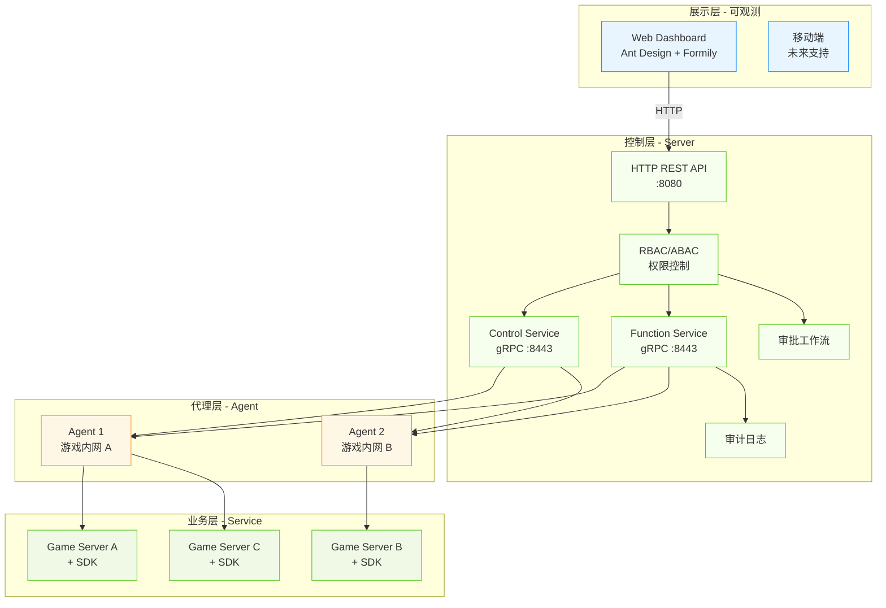

# 系统架构

Croupier 采用**四层分布式架构**，实现权限控制、函数路由和 UI 展示的完全分离。

## 架构图



## 分层说明

### 1. 展示层

**职责**: 用户界面、操作可视化、进度展示

**组件**:
- **Dashboard**: Web 管理界面，基于 React + Ant Design
- **未来**: 移动端支持

**特性**:
- Formily 驱动的表单自动生成
- 实时日志流式展示
- 审批流程可视化
- 响应式设计

### 2. 控制层

**职责**: 权限控制、函数路由、审计记录

**组件**:
- **HTTP API**: RESTful 接口 (8080)
- **Control Service**: Agent 注册与连接管理
- **Function Service**: 函数调用路由
- **RBAC/ABAC**: 权限控制引擎
- **审计日志**: 操作记录与追溯
- **审批工作流**: 高风险操作审批

**特性**:
- 负载均衡 (轮询/一致性哈希/最少连接)
- 幂等性保证
- 双人强制规则
- 敏感字段脱敏

### 3. 代理层

**职责**: 游戏内网代理、函数注册、调用转发

**组件**:
- **Agent**: 部署在游戏内网的代理进程

**特性**:
- 出站 mTLS 连接
- 本地 gRPC 监听 (19090)
- 函数自动注册
- 异步作业执行
- 作业取消与进度流

### 4. 业务层

**职责**: 业务逻辑实现

**组件**:
- **Game Server**: 游戏服务器进程
- **SDK**: 多语言客户端 SDK

**特性**:
- 函数实现与注册
- 类型安全的 API
- 热重载支持

## 核心设计模式

### 1. 协议优先开发

所有 API 通过 Protocol Buffers 定义：

```protobuf
// proto/croupier/control/v1/service.proto
service ControlService {
  rpc RegisterAgent(RegisterAgentRequest) returns (RegisterAgentResponse);
  rpc Heartbeat(HeartbeatRequest) returns (HeartbeatResponse);
}

// proto/croupier/function/v1/service.proto
service FunctionService {
  rpc InvokeFunction(InvokeFunctionRequest) returns (InvokeFunctionResponse);
  rpc StreamJobEvents(StreamJobEventsRequest) returns (stream JobEvent);
}
```

### 2. 描述符驱动 UI

基于 JSON Schema + UI Schema 自动生成 UI（Formily）：

```json
{
  "id": "player.ban",
  "params": {
    "type": "object",
    "properties": {
      "player_id": {"type": "string"},
      "duration": {"type": "integer", "minimum": 1}
    }
  },
  "ui": {
    "risk_warning": "高风险操作，需要审批"
  }
}
```

### 3. 作业模型

异步执行长时间任务：

```protobuf
message JobEvent {
  string job_id = 1;
  EventType type = 2;  // START, PROGRESS, DONE, ERROR
  string message = 3;
  double progress = 4;
}
```

## 安全架构

### 通信安全

| 连接 | 协议 | 安全方式 |
|------|------|----------|
| Dashboard → Server | HTTPS | TLS |
| Server → Agent | gRPC | mTLS |
| Agent → Game Server | gRPC | 可选 mTLS |

### 权限模型

```
用户 (User)
  ↓ 拥有
角色 (Role)
  ↓ 分配
权限 (Permission)
  ↓ 保护
函数 (Function)
  ↓ 关联
实体 (Entity)
```

### 审计日志

所有操作记录包含：

- 操作时间
- 操作用户
- 目标游戏/环境
- 函数与参数
- 审批信息
- 执行结果
- 哈希防篡改

## 可观测性

### 指标 (Metrics)

- Prometheus 格式输出
- `/metrics` 端点
- 按函数/游戏统计

### 日志 (Logging)

- 结构化日志 (JSON)
- 日志级别可配置
- 支持文件轮转

### 追踪 (Tracing)

- OpenTelemetry 集成
- Jaeger 导出
- 分布式调用链

## 部署架构

### 单机房部署

```
┌─────────────────────────────────────────┐
│           数据中心                       │
│  ┌─────────────────────────────────┐   │
│  │  管理网段 (内网)                │   │
│  │  Server + Dashboard            │   │
│  │         │                       │   │
│  │    Agent (游戏服务器旁)         │   │
│  └─────────────────────────────────┘   │
└─────────────────────────────────────────┘
```

### 多机房部署

```
┌──────────────┐       ┌──────────────┐
│  机房 A       │       │  机房 B       │
│  Server      │◄─────►│  Server      │
│  │           │       │  │           │
│  Agent       │       │  Agent       │
│  │           │       │  │           │
│  Game Server │       │  Game Server │
└──────────────┘       └──────────────┘
```

## 相关文档

- [分层设计](./layers.md)
- [数据流](./data-flow.md)
- [SDK-Agent 传输重构设计](./sdk-agent-transport-redesign.md)
- [核心与扩展边界映射](./core-extension-mapping.md)
- [扩展清单与安装模型](./extension-installation-model.md)
- [official.alerting 迁移草案](./official-alerting-migration-draft.md)
- [official.notification 迁移草案](./official-notification-migration-draft.md)
- [official.approval 迁移草案](./official-approval-migration-draft.md)
- [official.backup-advanced 迁移草案](./official-backup-advanced-migration-draft.md)
- [官方扩展统一模式](./official-extension-unified-pattern.md)
- [商店服务拆分方案](./marketplace-service-split-plan.md)
- [前后端 API 稳定化与前端重整计划](./frontend-api-stabilization-plan.md)
- [扩展域 API 契约基线（V1）](./extensions-api-contract-baseline.md)
- [前端 Adapter 分层模板](./frontend-adapter-layer-template.md)
- [Dashboard 仓库接入 Runbook](./dashboard-repo-integration-runbook.md)
