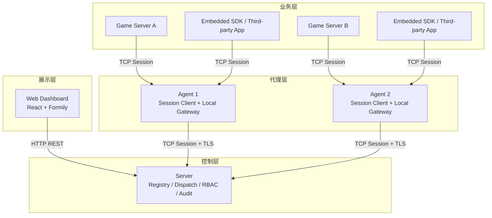

# 系统架构

Croupier 当前的目标架构已经从“多条回拨链路 + 历史 旧传输/gRPC 混合模型”收敛到“统一 session 传输”：

- `SDK <-> Agent`：`sdk-agent subprotocol`
- `Agent <-> Server`：`agent-server subprotocol`
- 两者共享同一套 `shared session runtime`

## 总体拓扑

## 核心结论

1. `Agent <-> Server` 不再以 `REQ/REP` 作为目标主模型，而是轻量双向 session。
2. `Server -> Agent` 的调用应复用既有 session，不再依赖 `rpc_addr` 反向回拨。
3. `Agent` 本地监听只服务 `GameServer / SDK / 第三方应用`。
4. `SDK <-> Agent` 与 `Agent <-> Server` 共享同一套 session 传输基座。

## shared session runtime

这里的 `shared session runtime` 指共享的传输与会话基座，至少包括：

- `tcp`
- 可选 `tls`
- `4-byte frame length + 8-byte croupier header + protobuf body`
- 双向 request/response 复用
- request id 管理
- heartbeat
- reconnect
- drain
- backpressure

它不等于具体业务协议，只是通用运行时。

## subprotocol 说明

这里的 `subprotocol` 不是“个性化配置”，而是“运行在同一套 session runtime 上的不同应用层子协议”。

当前有两套主要 `subprotocol`：

- `sdk-agent subprotocol`
  - 首条消息是 `ProviderConnectRequest`
  - 默认不启用 `tls`
  - 面向 provider session
- `agent-server subprotocol`
  - 首条消息是 `AgentConnectRequest` 或其兼容注册消息
  - 默认启用 `tls`
  - 面向 agent session

二者共享底层机制，但握手、注册内容和路由语义不同。

## 为什么不再以 历史消息模式 为中心

问题不在于 `旧传输` 没有长连接能力，而在于当前使用的 `REQ/REP` pattern 不适合：

- 在已有连接上由双方主动发新请求
- 多个并发 in-flight 请求复用
- session 级别的重连、背压、drain 和路由治理

因此当前架构收敛为“轻量 session 协议”，而不是继续围绕某个 `历史消息模式` 修补。

## 文档索引

- [分层设计](./layers.md)
- [术语与分层](./terms-and-layering.md)
- [数据流](./data-flow.md)
- [SDK-Agent 传输重构设计](./sdk-agent-transport-redesign.md)
- [Agent-Server TCP Session 重构设计](./agent-server-session-transport-redesign.md)
- [Session 生命周期](./session-lifecycle.md)
- [SDK Wire Protocol](./sdk-wire-protocol.md)
- [Session Runtime 参考实现](./session-runtime-landscape.md)
- [核心与扩展边界映射](./core-extension-mapping.md)
