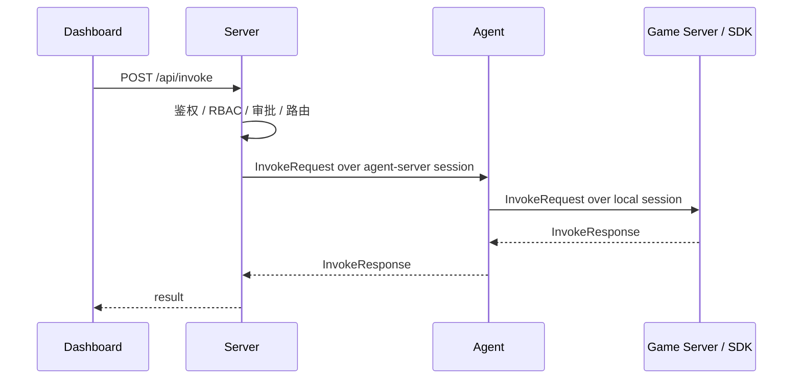
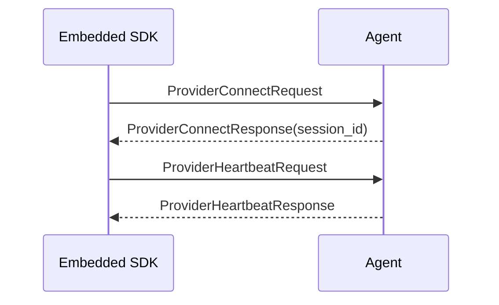
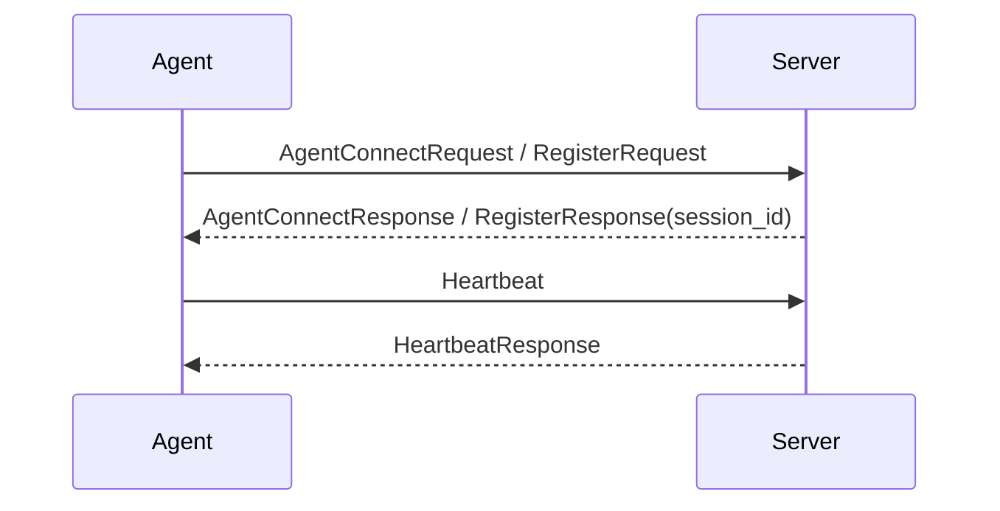
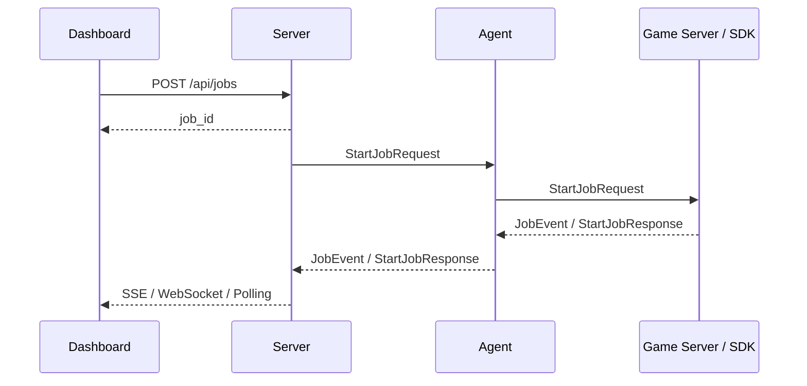

# 数据流

本文档只描述当前目标架构下的主要调用流，不再使用历史 `gRPC/NNG 回拨` 模型。

## 1. Dashboard 到业务函数

要点：

- `Server -> Agent` 不再新开一条回拨连接
- `Agent -> App` 由本地 session 边界处理
- 两段链路都遵循相同的 session runtime 思维

## 2. SDK 注册到 Agent

## 3. Agent 注册到 Server

## 4. 作业流

## 5. 核心原则

当前数据流遵循以下原则：

1. 控制面和调用面统一收敛到 session 复用，不再拆成“注册链路 + 回拨链路”。
2. `Agent` 本地监听只面向本地接入方。
3. `Server` 通过 session ownership 路由到对应 `Agent`，而不是直接拨 `Agent`。
4. 业务 payload 保持 JSON，平台控制字段保持 protobuf。
