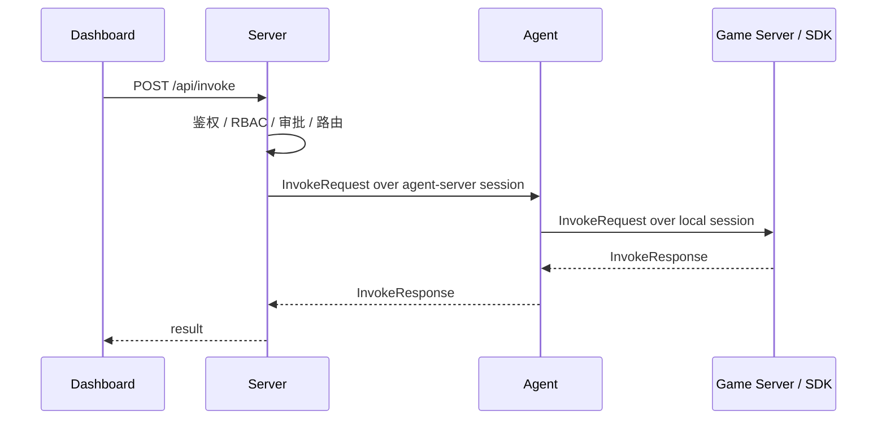
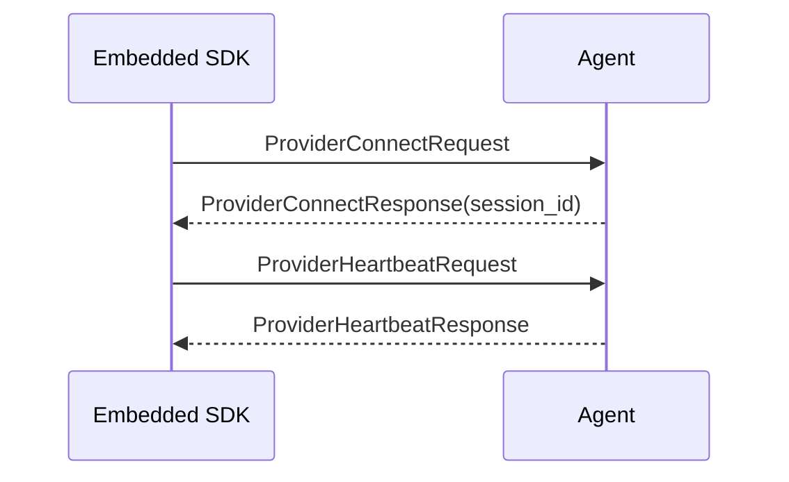
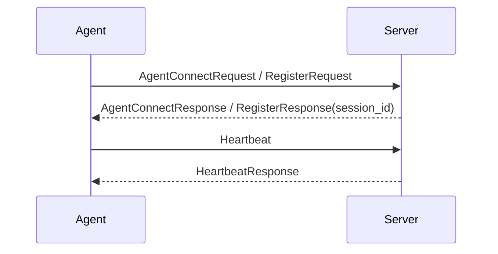
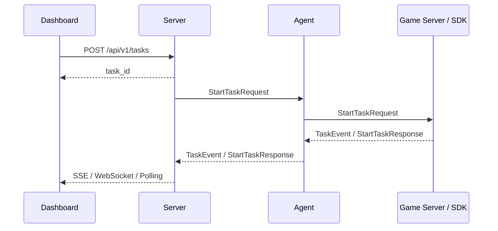

# 数据流

> **状态**：Current — 当前实现/规范，可作为实现依据。

本文档只描述当前目标架构下的主要调用流，不再使用历史 `gRPC/旧传输 回拨` 模型。

## 1. Dashboard 到业务函数

要点：

- `Server -> Agent` 不再新开一条回拨连接
- `Agent -> App` 由本地 session 边界处理
- 两段链路都遵循相同的 session runtime 思维

### invoke 路由：Provider/Instance 双索引

当一个 Agent 后挂多个游戏服务（service）时，Agent 内部按 **Nacos 风格的双层索引**选择目标实例：

- **注册期**：SDK 的 `ProviderConnectRequest` 携带 `service_id` 与 `Metadata`（`sdk_language`/`sdk_version`/`game_id`/`env` 等）。Agent 以 `functionId → serviceId → []Instance` 双层索引登记，实例带 `LastSeen` 用于健康判断（`internal/platform/agentlocal/store.go`）。
- **调用期**：`pickInstance`（`internal/agent/local_handler.go`）先按 `functionId` 取 service 索引；若 invoke metadata 带 `service_id` 则精确落到该 service 的实例集合，否则合并该函数下所有 service 的实例；再按 `LastSeen` 过滤健康实例并做负载均衡。
- `Instance.Metadata` 负责透传 SDK 元信息（`sdk_language`/`sdk_version` 等），最终经 `AgentProcess → ProviderSession` 暴露到 opsNodes。

## 2. SDK 注册到 Agent

## 3. Agent 注册到 Server

## 4. 作业流

## 5. 核心原则

当前数据流遵循以下原则：

1. 控制面和调用面统一收敛到 session 复用，不再拆成“注册链路 + 回拨链路”。
2. `Agent` 本地监听只面向本地接入方。
3. `Server` 通过 session ownership 路由到对应 `Agent`，而不是直接拨 `Agent`。
4. 业务 payload 保持 JSON，平台控制字段保持 protobuf。
