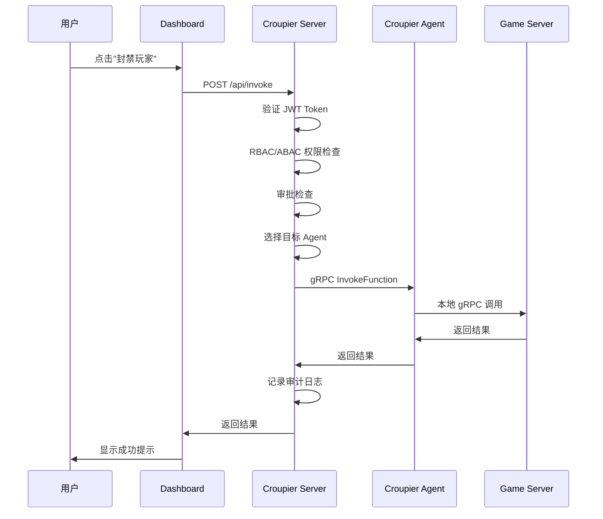
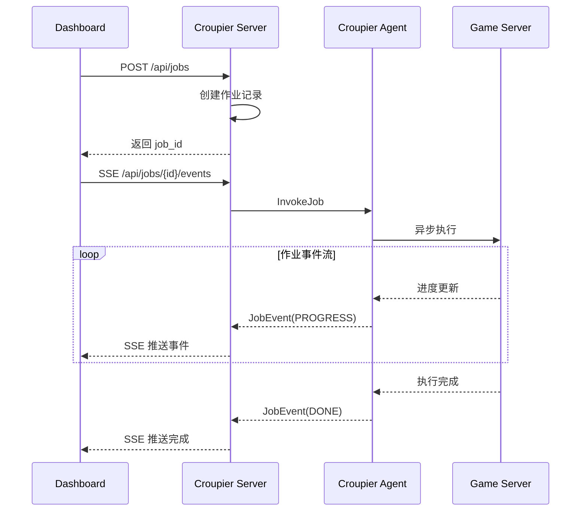
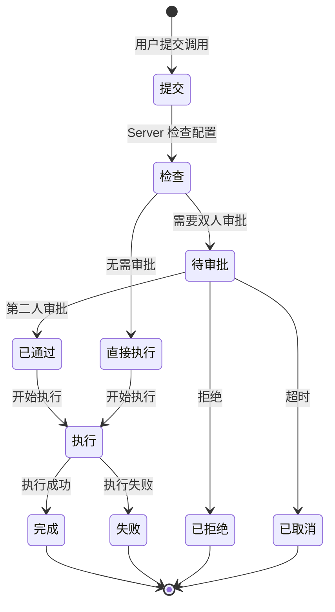
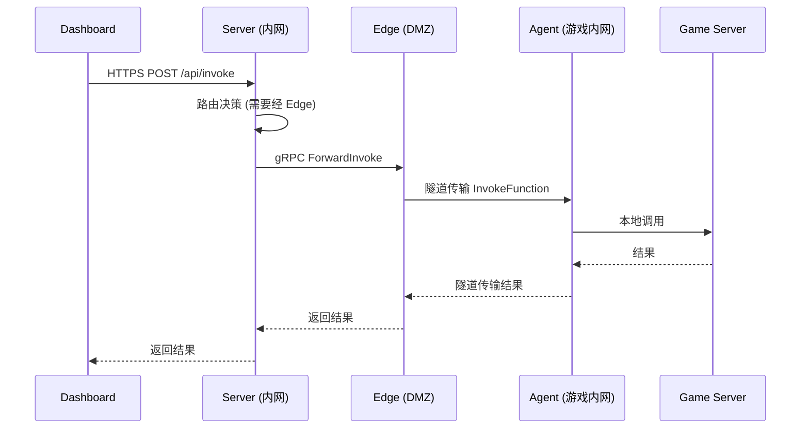
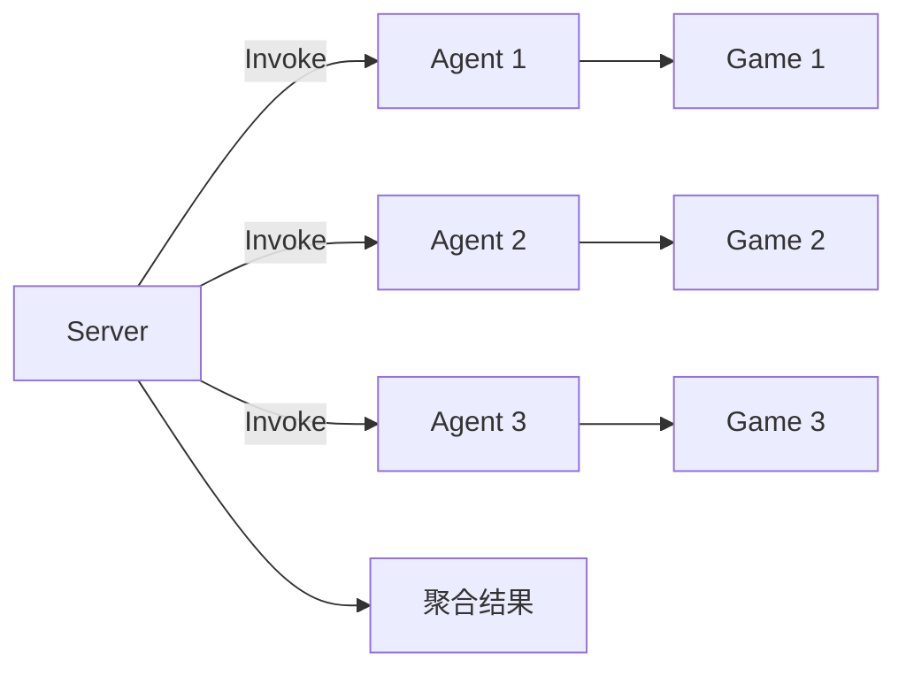
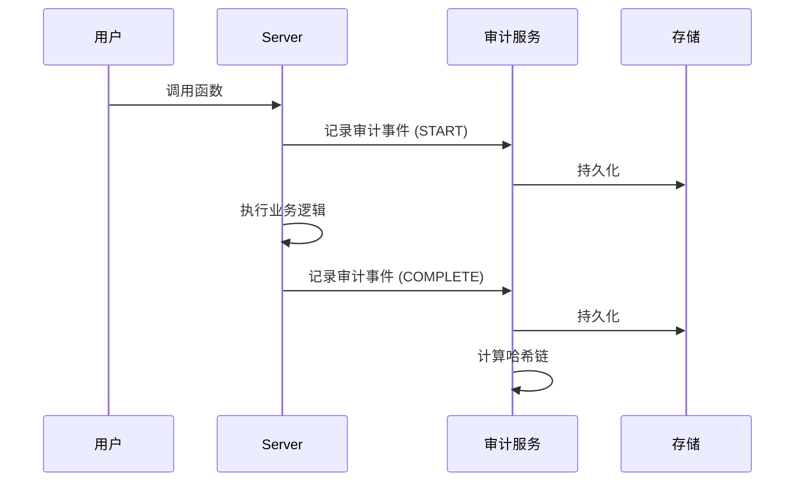
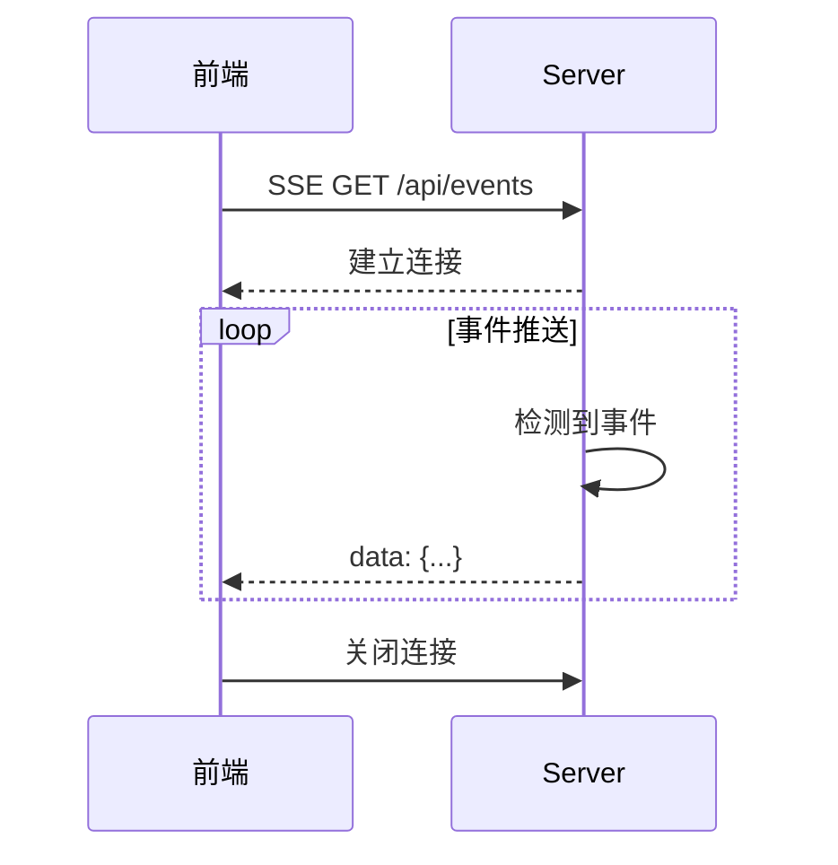
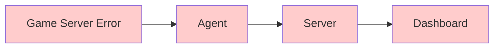

# 数据流

本文档详细说明 Croupier 系统中的调用流、数据流转和事件处理。

## 目录

[[toc]]

## 标准调用流程

### 端到端流程



### 详细步骤

| 步骤 | 操作 | 说明 |
|------|------|------|
| 1 | 用户操作 | 在 Dashboard 点击操作按钮 |
| 2 | HTTP 请求 | 发送 POST /api/invoke |
| 3 | 身份验证 | 验证 JWT Token |
| 4 | 权限检查 | RBAC/ABAC 验证 |
| 5 | 审批检查 | 检查是否需要审批 |
| 6 | 路由选择 | 选择目标 Agent |
| 7 | gRPC 调用 | 调用 Agent 的 InvokeFunction |
| 8 | 业务执行 | Game Server 执行业务逻辑 |
| 9 | 结果返回 | 逐层返回结果 |
| 10 | 审计记录 | 记录操作审计日志 |

## 同步调用流

### 请求格式

```json
POST /api/invoke
{
  "function_id": "player.ban",
  "game_id": "my-game",
  "env": "prod",
  "payload": {
    "player_id": "player_123",
    "duration": 24,
    "reason": "作弊"
  },
  "options": {
    "idempotency_key": "unique-key-123",
    "timeout": "30s"
  }
}
```

### 响应格式

**成功响应**：
```json
{
  "success": true,
  "result": {
    "ban_id": "ban_456",
    "expires_at": "2024-12-02T10:30:00Z"
  }
}
```

**需要审批**：
```json
{
  "success": false,
  "pending_approval": true,
  "approval_id": "approval_789",
  "message": "操作需要双人审批"
}
```

**权限拒绝**：
```json
{
  "success": false,
  "error": {
    "code": "PERMISSION_DENIED",
    "message": "没有权限执行该操作",
    "required_permission": "player.ban"
  }
}
```

## 异步调用流（作业）

### 异步调用流程



### 作业事件类型

```protobuf
enum EventType {
  START    = 0;  // 作业开始
  PROGRESS = 1;  // 进度更新
  LOG      = 2;  // 日志输出
  DONE     = 3;  // 作业完成
  ERROR    = 4;  // 作业错误
}

message JobEvent {
  string job_id = 1;
  EventType type = 2;
  string message = 3;
  double progress = 4;  // 0.0 - 1.0
  int64 timestamp = 5;
}
```

### 作业管理 API

```bash
# 创建异步作业
POST /api/jobs
{
  "function_id": "data.export",
  "payload": {...}
}
# 返回: {"job_id": "job_123"}

# 获取作业状态
GET /api/jobs/job_123
# 返回: {"status": "running", "progress": 0.5}

# 流式获取事件
GET /api/jobs/job_123/events
# SSE 流式事件

# 取消作业
DELETE /api/jobs/job_123
```

## 审批流程

### 审批数据流



### 审批请求格式

```json
POST /api/approvals
{
  "function_id": "player.ban",
  "game_id": "my-game",
  "env": "prod",
  "payload": {...},
  "reason": "玩家使用外挂",
  "requested_by": "user_123"
}
```

### 审批操作

```bash
# 审批通过
POST /api/approvals/{id}/approve
{
  "approved_by": "user_456"
}

# 审批拒绝
POST /api/approvals/{id}/reject
{
  "rejected_by": "user_456",
  "reason": "证据不足"
}
```

## 隧道模式（经 Edge）

### 隧道调用流程



### 隧道复用

```
单一隧道连接复用多个请求：

Server <---> Edge
    |
    +-- Tunnel 1 --> Agent 1 --> Game Server A
    |                       +--> Game Server B
    |
    +-- Tunnel 2 --> Agent 2 --> Game Server C
```

## 广播模式

### 广播调用流程



### 广播调用示例

```bash
POST /api/invoke
{
  "function_id": "config.reload",
  "routing": {
    "mode": "broadcast"
  }
}
```

## 审计数据流

### 审计记录流程



### 审计事件结构

```json
{
  "audit_id": "audit_20241201_001",
  "timestamp": "2024-12-01T10:30:00Z",
  "user_id": "user_123",
  "username": "admin",
  "action": "function.invoke",
  "game_id": "my-game",
  "env": "prod",
  "function_id": "player.ban",
  "payload_preview": {
    "player_id": "***",
    "duration": 24
  },
  "result": "success",
  "ip": "192.168.1.100",
  "ip_region": "中国 上海",
  "hash": "sha256(...)",
  "prev_hash": "sha256(...)"
}
```

## 实时数据流

### WebSocket / SSE



### 事件类型

| 事件类型 | 说明 | 示例 |
|----------|------|------|
| `function.called` | 函数被调用 | `{function_id, user, result}` |
| `job.progress` | 作业进度更新 | `{job_id, progress, message}` |
| `approval.pending` | 待审批请求 | `{approval_id, function_id}` |
| `agent.connected` | Agent 上线 | `{agent_id, game_id}` |
| `agent.disconnected` | Agent 下线 | `{agent_id, reason}` |

## 错误处理流

### 错误传播



### 错误响应格式

```json
{
  "success": false,
  "error": {
    "code": "PLAYER_NOT_FOUND",
    "message": "玩家不存在",
    "details": {
      "player_id": "player_123"
    },
    "trace_id": "trace_abc123",
    "timestamp": "2024-12-01T10:30:00Z"
  }
}
```

## 数据格式转换

### JSON ↔ Protobuf

```javascript
// HTTP JSON 请求
{
  "function_id": "player.ban",
  "payload": {"player_id": "123", "duration": 24}
}

// 转换为 gRPC Protobuf
InvokeFunctionRequest {
  function_id: "player.ban"
  payload {
    fields {
      key: "player_id"
      value { string_value: "123" }
    }
    fields {
      key: "duration"
      value { number_value: 24 }
    }
  }
}
```

## 相关文档

- [分层设计](./layers.md)
- [组件说明](./components.md)
- [API 参考](../api/README.md)
