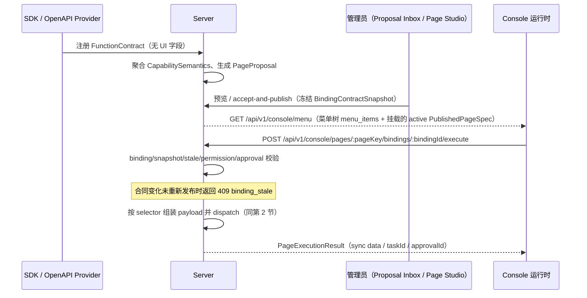
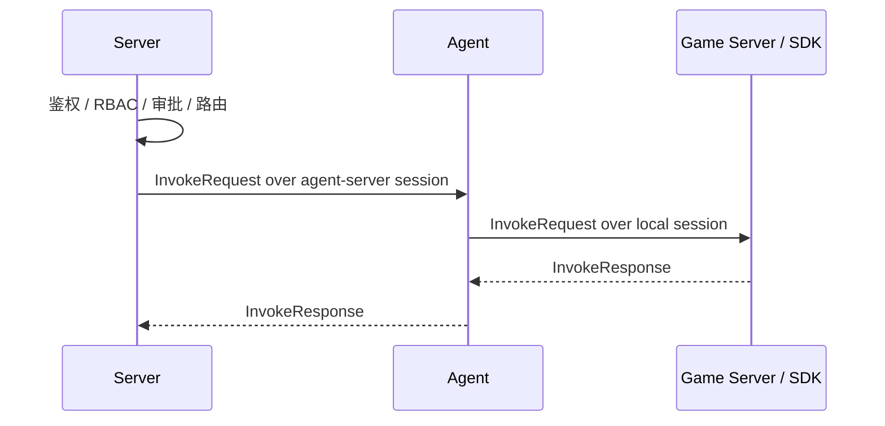
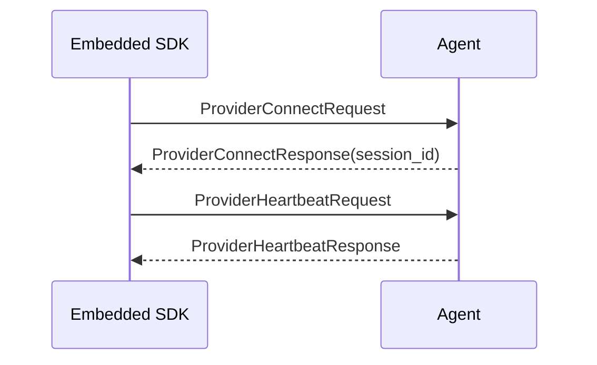
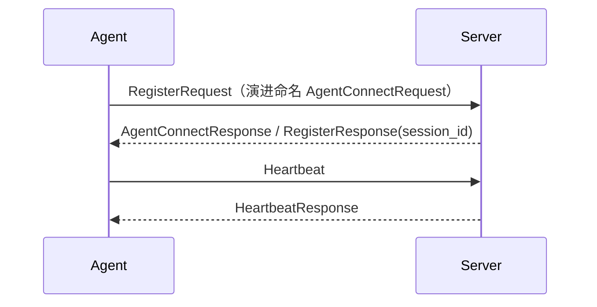
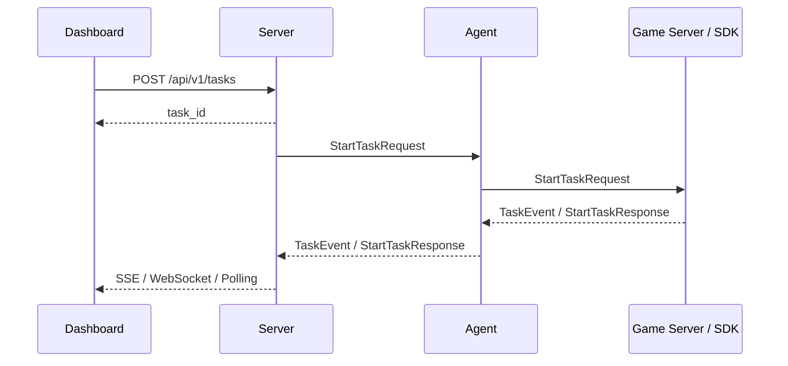

# 数据流

> **状态**：Current — 当前实现/规范，可作为实现依据。

本文档只描述当前目标架构下的主要调用流，不再使用历史 `gRPC/旧传输 回拨` 模型。

## 1. 页面发布与受控执行（vNext 主路径）

运营页面的执行主路径经过发布快照，而不是直接调用函数目录：



要点：

- 浏览器只提交 `bindingId` 与 selector context（form/row/selection/page state），不传 functionId、target、gameId、env。
- 发布快照冻结函数版本、schema digest、risk、permission、approval 与 renderer 版本；函数重注册只产生新 Proposal 与 stale 诊断，绝不静默改写已发布页面。
- 合同变化后的恢复路径：`GET /api/v1/versioning/pages/:pageKey/diff` → 三方合并（展示字段自动合并、执行字段人工决策）→ 重新发布。
- 函数直调 `POST /api/v1/functions/:id/invoke` 仍存在，但定位是调试/管理面路径，不是运营页面主路径。

## 2. Server 到业务函数（dispatch）



要点：

- `Server -> Agent` 不再新开一条回拨连接
- `Agent -> App` 由本地 session 边界处理
- 两段链路都遵循相同的 session runtime 思维

### invoke 路由：Provider/Instance 双索引

当一个 Agent 后挂多个游戏服务（service）时，Agent 内部按 **Nacos 风格的双层索引**选择目标实例：

- **注册期**：SDK 的 `ProviderConnectRequest` 携带 `service_id` 与 `Metadata`（proto 字段 `sdk_language`/`sdk_version`/`game_id`/`env` 等）。Agent 以 `functionId → serviceId → []Instance` 双层索引登记，实例带 `LastSeen` 用于健康判断（`internal/platform/agentlocal/store.go`）。
- **调用期**：`pickInstance`（`internal/agent/local_handler.go`）先按 `functionId` 取 service 索引；若 invoke metadata 带 `serviceId` 则精确落到该 service 的实例集合，否则合并该函数下所有 service 的实例；再按 `LastSeen` 过滤健康实例并做负载均衡。
- `Instance.Metadata` 负责透传 SDK 元信息（键为 `sdkLanguage`/`sdkVersion`/`gameId` 等小驼峰），最终经 `AgentProcess → ProviderSession` 暴露到 opsNodes。

## 3. SDK 注册到 Agent



## 4. Agent 注册到 Server



### SDK 滑动版本门槛（函数注册）

`RegisterRequest.processes` 各进程自报 `sdk_language`/`sdk_version`。Server 按 `(game_id, env, sdk_language)` 记录历史最高 SDK 版本（**高水位**，落各 game 库 `sdk_version_highwatermarks` 表，编号迁移 0028），注册时三档判定（`internal/platform/registry/sdkversion`）：

| 判定        | 条件                            | 行为                                                                                              |
| ----------- | ------------------------------- | ------------------------------------------------------------------------------------------------- |
| 放行        | 版本 ≥ 高水位                   | 注册成功后抬升高水位                                                                              |
| 放行 + 警告 | 同 major 且落后 1 个 minor      | 函数照常注册，写 `sdk_version_behind` 注册警告                                                    |
| 拒绝        | 落后 ≥2 个 minor 或 ≥1 个 major | 该进程独占声明的函数不进本次注册（会话函数表/契约均不物化），写 `sdk_version_floor_rejected` 警告 |

细节语义：

- **拒绝粒度是函数不是连接**：被拒进程的 provider 记录仍进会话（进程存在是事实；调度候选第一道门是 `agent.Functions`，不会误路由）。多进程交叉提供同一函数时，只要任一放行进程也声明了该函数就不剔除，拒绝不制造可用性缺口。
- **版本解析失败（`"unknown"`/空/非数字段）一律放行**，且不抬升高水位——门槛只在两端都是可解析的语义化版本时生效。
- 无 `sdk_language`/`sdk_version` 自报的进程（自定义游戏服直连）不参与门槛。
- 拒绝与落后警告同时随 `RegisterResponse.warnings` 返回，agent 侧日志可见；连接保持不断开。

#### 配置最低版本（绝对下限）

除自动高水位外，还可按语言配置**最低可注册版本**（`registry.sdkVersionMinimums`）：

```yaml
registry:
  sdkVersionMinimums:
    go: "0.3.0"
    python: "0.2.0"
```

自报版本低于配置值的 provider 其独占声明函数**不注册**（写 `sdk_version_below_minimum` 注册警告并随 `RegisterResponse.warnings` 返回，连接保持）。语义要点：

- 配置门槛是**绝对下限，优先于滑动高水位判定**——即使尚无高水位观测（首次注册）也生效；
- 未配置的语言仅走高水位门槛；语言键大小写不敏感；
- 与高水位门槛同样保守：自报版本或配置值解析失败时不触发；
- 交叉提供保护一致：任一放行进程也声明的函数不被剔除。

#### 函数级最低版本（UI 按函数配置）

除语言级 yaml 外，还可对**单个函数**设置最低可注册**函数版本**（比函数描述符自身的 `version`，与 SDK 版本无关）：函数详情页「变更历史」tab 顶部的「版本门槛」卡片，或函数目录勾选后「批量设置门槛」（`GET/PUT/DELETE /api/v1/functions/:id/version-floor` + 批量端点，写需 `functions:manage`），落 game 库 `function_version_floors` 表（编号迁移 0030）。

- **防契约回退**：滚动升级窗口里旧 game server 的重注册会把物化契约刷回旧版（契约振荡 → 页面 stale 的主要触发源）；低于配置值的旧版函数声明不物化，写 `function_version_below_minimum` 注册警告（随 `RegisterResponse.warnings` 返回），契约永不回退。
- **判定粒度是函数**：逐描述符判定（`req.Functions` 的 `version`），同请求里其他达标函数照常注册；不依赖进程自报（无 processes 的纯游戏服直连也生效）。
- **与 SDK 版本门槛正交**：SDK 门槛（高水位/语言级 yaml）管车队升级，函数版本门槛管契约不回退；语义化版本比较复用同一 `sdkversion` 包。
- 与注册物化解耦存独立表：函数行随重注册 upsert，平台设置不会被描述符回写冲掉；清空即物理删行（唯一索引不被软删残留占住）。
- 平台上函数版本恒为可解析 semver：上游注册校验已按 `invalid_version` 拒绝空/非法版本（根本到不了门槛）；配置值入库前服务端同样校验可解析（`sdkversion.Parseable`）。
- **已知边界**：唯一 provider 的版本低于门槛时函数不可用（警告可见），这是「低于配置值不注册」语义的直接结果。

**批量入口（函数目录页）**：典型场景是 SDK 全量升级后把一批函数的门槛统一收口，逐个进详情页不可接受。函数目录页表格支持勾选多函数后浮出批量操作条（「批量设置门槛」/「批量清除」），并新增「最低SDK版本」列回显当前门槛：

- 批量读：`GET /api/v1/functions/version-floors` → `{"floors": {functionId: minVersion}}`（当前 game/env 全量门槛）。
- 批量写：`POST /api/v1/functions/version-floor/batch`，body `{functionIds, minVersion}`；minVersion 非空时统一 upsert（服务端先整包校验可解析，非法 400 零写入），空串等价对每个函数执行 DELETE（物理删行）。写权限同单函数（`functions:manage`）。
- **部分成功语义**：逐函数循环 Set/Delete（均幂等，重试安全），响应 `{updated, failed, minVersion}`；failed 列出失败 functionId，前端 warning 提示明细。无事务包裹。
- 目录列拉取失败降级为不显示门槛（`.catch(() => ({}))`），不阻塞函数列表。

**已知边界**：

- 高水位是单调观测值：高版本 SDK 永久下线后，低版本会持续被拒，重置需手动 `DELETE FROM sdk_version_highwatermarks WHERE ...`。
- 内存 registry（无 DB）退化为进程内 map，重启丢失，重新从首次注册版本开始累积。
- 落后警告（`sdk_version_behind`）在 SDK 追赶后不自动清除（多语言 provider 共用 agent+code 维度无法精确按语言清理），人工删除兜底。
- 抬升高水位发生在 `UpsertAgent` 成功之后：注册链中途失败不会留下「未注册但已抬升」的状态；反之注册成功后进程崩溃在抬升之前，高水位少记一次，下次注册补记，无正确性影响。

## 5. 作业流



运营侧的 TaskPage 也走第 1 节的 binding execute：`task_status/task_events/task_result/task_cancel` 各自对应一个 binding，页面模型见 [Dashboard Resource/Page 模型](./dashboard-page-model.md)。

## 6. 核心原则

当前数据流遵循以下原则：

1. 控制面和调用面统一收敛到 session 复用，不再拆成“注册链路 + 回拨链路”。
2. `Agent` 本地监听只面向本地接入方。
3. `Server` 通过 session ownership 路由到对应 `Agent`，而不是直接拨 `Agent`。
4. 业务 payload 保持 JSON，平台控制字段保持 protobuf。
