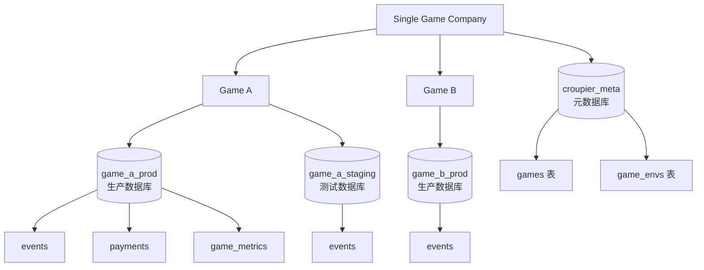
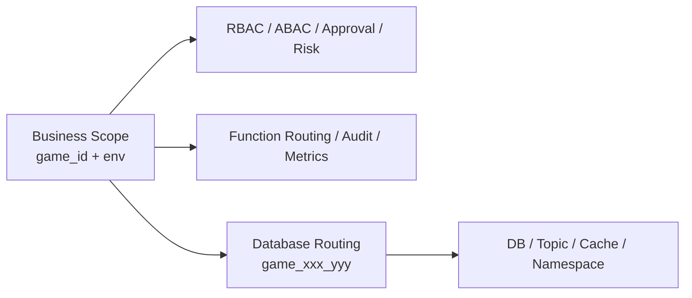

# 游戏与环境作用域

> **状态**：Target — 游戏环境 scope 的目标规范。实现完成前，代码现状不能反向改变本规范；迁移完成后应以本文的验收条件核验。

## 1. 设计前提

Croupier 不是一个 SaaS 多租户平台。

它默认服务于：

- 一个游戏公司
- 公司内部多个游戏
- 每个游戏下多个逻辑环境

因此，Croupier 的标准业务边界不是 `tenant`，而是：

```text
scope = game_id + env
```

> 命名分层：本文以 `game_id` 指代该字段的模型/存储语义（proto 字段与
> DB 列同名）。各契约面一律小驼峰 `gameId`（REST/SDK 契约键、wire
> metadata），HTTP 头为 `X-Game-ID`——见 CLAUDE.md 契约字段命名规则。

## 2. 为什么是 `game_id + env`

`game_id` 表达业务归属。

`env` 表达逻辑生命周期阶段，例如：

- `dev`
- `test`
- `staging`
- `prod`

这两个字段组合后，正好覆盖游戏运营平台最常见的隔离需求：

- 权限控制
- 审批策略
- 风控阈值
- 审计归档
- 灰度发布
- 告警与观测维度
- 函数路由

## 3. 数据库架构：按游戏环境路由

Croupier 的业务隔离单位始终是 `(game_id, env)`。部署可选择单库行级隔离或按游戏环境物理分库；两种模式不能改变 API、授权和审计的 scope 语义。

在 `multiGame: true` 时，采用 **database-per-game-environment 架构**，每个游戏环境使用独立物理数据库。

### 3.1 架构示意



### 3.2 数据库组织

```
croupier_meta (元数据库)
├─ user_accounts
├─ role_records
├─ user_role_records
├─ role_perm_records
├─ games (游戏注册表)
├─ game_envs (环境注册表)
├─ message_records
└─ broadcast_message_records

game_demo_prod (游戏数据库)
├─ events (游戏事件，game_id 和 env 在数据库名中)
├─ payments (支付数据)
├─ game_metrics (游戏指标)
└─ server_id 索引支持 MMORPG 多服务器

game_demo_staging
└─ (同样的表结构)

game_rpg_prod
└─ ...
```

### 3.3 按游戏分库的优势

- ✅ 物理隔离，完全独立
- ✅ 独立的容量规划和扩展
- ✅ 简化查询（不需要 WHERE game_id = 'xxx' AND env = 'prod'）
- ✅ 便于游戏迁移和归档
- ✅ 符合"通用平台 + 独立游戏数据"的理念
- ✅ 支持 MMORPG 多服务器架构（通过 server_id）

## 4. 为什么不做多租户

对 Croupier 当前场景来说，引入 `tenant` 这层抽象会带来几个问题：

- 会把"公司边界"和"游戏边界"混在一起
- 会误导后续权限、审批、路由设计向 SaaS 平台靠拢
- 会让 `game_id` 退化成二级概念，增加理解成本
- 会让很多本来应该直接按游戏治理的策略被迫绕一层

如果未来真的存在多个公司实例，应该通过独立部署或独立控制面解决，而不是在当前模型里预埋伪多租户。

## 5. 为什么不把 `game_id` 和 `env` 合并成一个字段

不建议把两者合并成单个 `scope_id` 或 `track_id` 作为主 API 字段。

原因：

- 权限表达式天然需要分别判断 `game_id` 和 `env`
- 审批、风控、观测通常按环境单独出策略
- 查询、筛选、索引、聚合时拆开的字段更自然
- Header、日志、审计链、告警标签也更适合独立字段

可以在存储键、缓存键或 topic key 中派生出组合键，例如：

```text
scope_key = game_id + ":" + env
database_name = "game_" + game_id + "_" + env
```

但它应该是派生值，不应替代主模型。

## 6. `env` 不等于部署位置

`env` 只表达逻辑环境，不直接等于：

- 数据库实例（现在通过 database_name 显式指定）
- Agent 节点
- Kubernetes namespace
- Redis DB
- MQ topic
- 物理机房

这些属于运行目标或基础设施边界，需要单独建模。

在按游戏分库架构下，每个 `(game_id, env)` 组合对应一个独立的物理数据库：

```text
game_id = "demo", env = "prod" → database = "game_demo_prod"
game_id = "demo", env = "staging" → database = "game_demo_staging"
game_id = "rpg", env = "prod" → database = "game_rpg_prod"
```

## 7. `scope` 与 `target` 分离

推荐模型：



含义是：

- `scope` 决定它属于哪个游戏、哪个环境
- 数据库路由根据 `game_id + env` 定位到具体数据库
- 基础设施策略再由具体数据库配置决定

## 8. MMORPG 多服务器支持

对于 MMORPG 游戏，同一游戏可能有多个服务器/大区。Croupier 通过 `server_id` 字段支持：

```sql
-- events 表中的 server_id
server_id LowCardinality(String) -- 例如 "s1", "s2", "asia1", "us_west_1"
```

查询时可以按 `server_id` 进行聚合：

```sql
SELECT server_id, count() AS player_count
FROM game_demo_prod.events
WHERE event = 'player.login'
  AND event_time >= today() - INTERVAL 7 DAY
GROUP BY server_id;
```

## 9. 与开源项目的共性

这类设计并不特殊，很多开源产品都采用类似模式：

- Unleash：`project + environment`
- Flagsmith：`project + environment`
- GrowthBook：`project + environment`
- Argo CD：业务归属与部署目标分离

共同点都是：

- 业务作用域独立建模
- 环境保留为逻辑生命周期概念
- 真实部署位置单独表达

## 10. 对 Croupier 的落地要求

仓库内应统一遵循这些规则：

1. 不再用 "tenant / multi-tenant" 描述 `game_id + env`
2. API、SDK、权限、审计统一以 `game_id + env` 为标准作用域
3. `multiGame: true` 时，数据库层按 `(game_id, env)` 路由到独立数据库；`multiGame: false` 时，使用单库行级隔离
4. 所有游戏业务记录都保留 `game_id` 和 `env` 两列；物理分库时它们是冗余校验与审计字段，单库时它们是隔离条件
5. **新增 `server_id` 作为核心字段**，支持 MMORPG 多服务器架构
6. 需要表达部署位置时，使用 `target`、`agent`、`node`、`cluster` 等单独字段

## 11. 双模式实现

Croupier 通过 `database.multiGame` 配置项支持两种运行模式：

### `multiGame: true`（生产推荐）

- 每个 `(game_id, env)` 对应独立物理数据库（如 `game_demo_prod`）
- `internal/db/router.Router` 懒加载、缓存 per-game `*gorm.DB` 连接
- `svc.GameDBMiddleware` 从 `X-Game-ID` / `X-Env` 头解析游戏作用域，将 DB 注入到 request context
- 游戏数据模型通过 `dbctx.Resolve(ctx, m.db)` 从 context 获取正确的 DB
- 游戏表中的 `game_id` / `env` 列为冗余（同库内值恒定），保留是为了代码统一性

### `multiGame: false`（默认，开发/CI）

- 所有表共存于单一配置数据库
- `game_id` / `env` 列提供行级隔离
- Router 为 nil，中间件 pass-through
- 游戏数据模型直接使用 ServiceContext.DB（meta DB 兼作 game DB）

两种模式下，API 层和模型层代码完全一致，差异仅在连接管理。

## 12. 授权与请求 scope 解析

### 12.1 授权的最小单位

管理员可访问范围以 `(admin_id, game_id, env)` 为最小授权单元。元数据库使用 `admin_game_env_scopes` 表作为唯一的环境级授权来源：

```sql
admin_game_env_scopes
├─ admin_id       -- admins.id
├─ game_id        -- games.game_id，业务游戏标识，和 API 中的 game_id 一致
├─ env
├─ created_at
└─ updated_at

UNIQUE (admin_id, game_id, env)
INDEX  (admin_id, game_id, env)
```

约束如下：

- `game_id` 使用稳定的业务标识，不使用容易与 API 含义混淆的内部游戏主键；如实现必须引用内部主键，应单独命名为 `game_pk`。
- `game_id` 和 `env` 必须都对应已登记、启用的游戏环境。
- 普通管理员没有授权记录即没有任何游戏环境访问权，**不得**以”没有记录”解释为”可访问全部”。
- 全局管理员访问权只能来自明确的全局角色或权限；其绕过授权表的规则必须集中在授权服务中，不能散落在 handler 或 SQL 的空记录分支中。
- 不引入 `env = '*'`、空 `env` 等通配语义。需要授予多个环境时，显式写入多个授权行，保持查询和撤权语义简单、可审计。

游戏级授权如果仍因管理界面而存在，只能作为批量维护 `admin_game_env_scopes` 的辅助数据，不能成为运行时授权的第二真相来源。

### 12.2 已确定方案：无状态 JWT 与持久化默认 scope

Croupier 采用 **无状态 JWT + 持久化默认 scope + 可选请求覆盖**，不引入服务端 session。

```text
登录 / 任意受保护请求
  → JWT 验签并解析 admin_id
  → 游戏环境相关请求：解析本次完整 header，或读取数据库默认 scope
  → 校验 (admin_id, game_id, env) 授权
  → 将 ResolvedScope 写入本次 request context
```

职责边界如下：

| 数据                           | 职责                                     | 生命周期                         |
| ------------------------------ | ---------------------------------------- | -------------------------------- |
| JWT                            | 认证调用方身份（`admin_id`、角色等）     | token 有效期内；服务端不保存会话 |
| `admin_game_env_scopes`        | 判断用户可访问哪些游戏环境               | 持久化授权数据                   |
| `admins.last_game_id/last_env` | 用户未显式指定时的默认 scope             | 持久化用户偏好，不授予权限       |
| `X-Game-ID` / `X-Env`          | 对单次请求显式覆盖默认 scope             | 仅当前 HTTP 请求                 |
| `ResolvedScope`                | 业务服务、审计和 DB 路由使用的唯一 scope | 仅当前 request context           |

该方案保持 HTTP/JWT 的无状态特性：服务端不在内存或 Redis 中维护”当前游戏环境”，因此可水平扩展且重启不丢失默认选择。持久化的是用户偏好，而不是会话状态。

不采用”仅依赖服务端唯一当前 scope”的原因是多标签页和多终端会互相覆盖：用户可以在标签页 A 查看 `game-a/prod`，同时在标签页 B 查看 `game-b/test`。可选的完整 header 仅描述本次请求，避免将该并发上下文写回用户默认选择。

### 12.3 备选方案比较

| 方案                                       | scope 来源                           | 优点                                           | 不采用或限制原因                                                                   |
| ------------------------------------------ | ------------------------------------ | ---------------------------------------------- | ---------------------------------------------------------------------------------- |
| 纯 header                                  | 每个请求的 `X-Game-ID/X-Env`         | 无服务端状态，便于单次切换                     | 默认选择只在前端，登录与跨设备恢复不可靠；每个请求都依赖客户端状态                 |
| 有状态 session                             | 内存或 Redis 中的用户当前 scope      | 客户端可以不发送 scope                         | 水平扩展需共享 session；重启与过期要恢复；多标签页/多终端的单一当前 scope 相互覆盖 |
| **已确定：JWT + 默认 scope + 可选 header** | 数据库默认 scope；完整 header 可覆盖 | 无服务端 session、可恢复、支持多标签页和多终端 | 需要一次授权校验与清晰的 header 优先级；这是可接受且必要的复杂度                   |

### 12.4 上次选择的持久化

`admins` 表增加可空字段：

```text
last_game_id
last_env
```

它们只表示用户界面上最近一次成功选择的 scope，不授予任何权限。必须满足以下不变量：

- 两字段要么同时为空，要么组成一个完整的 `(game_id, env)`；不得保存半个 scope。
- 保存前必须验证该 scope 仍在当前管理员的授权集合内。
- 撤销该 scope 的授权时，必须同步清空匹配的上次选择；即使清理遗漏，读取时也必须再次校验，不能恢复失效 scope。

登录响应返回已验证的上次选择：

```json
{
  “scope”: { “gameId”: “demo”, “env”: “prod” }
}
```

无有效上次选择时返回 `null`。切换成功后由 `PATCH /api/v1/profile/scope` 持久化，body 必须同时包含 `gameId` 与 `env`；接口在认证身份下重新校验授权后才更新这两个字段。

### 12.5 游戏环境接口的 scope 优先级

只有声明为”游戏环境相关”的接口才解析 scope。解析顺序固定为：

```text
完整 X-Game-ID + X-Env
  → 已授权的 last_game_id + last_env
  → 按稳定顺序（game_id, env）选择第一个已授权 scope
  → 无可访问 scope
```

规则：

- 两个 header 都存在时，必须作为一个整体校验其格式、环境登记状态和当前用户授权；通过后仅覆盖本次请求，**不**更新 `last_game_id/last_env`。校验失败返回 `403`，不泄露目标 scope 是否存在。
- 两个 header 都缺失时，才允许使用持久化的上次选择或首个已授权 scope。
- 只传其中一个 header 是不完整请求，返回 `400`；不得将 header 与上次选择拼接成一个 scope。
- 不从 query 参数或请求 body 补齐请求 scope。它们可以表达某个业务资源的标识，但不能替代本请求的访问上下文。
- 没有任何可访问 scope 时返回明确的无授权错误；前端据此显示无可访问游戏环境，而不是任选一个游戏。

解析器在认证之后执行，向 request context 写入唯一的 `ResolvedScope`；数据库路由、权限检查、审计标签和业务服务均只读取该值。数据库 Router 不应自行再解析 header，避免一个请求出现两个 scope 来源。

### 12.6 scope 中立接口

认证不等于必须解析游戏环境。接口按路由分组：

```text
所有受保护接口        → 认证中间件
游戏环境相关接口      → ScopeResolver → 授权校验 → 数据库路由
scope 中立接口        → 不读取、不恢复、不校验 game_id / env
```

登录、个人资料、可选游戏列表、授权管理、审计日志，以及全局通知流均为 scope 中立接口。即使客户端统一附带 scope header，这些接口也必须忽略它，不能因它触发数据库路由或授权失败。

scope 中立不等于绕过数据授权。`/api/v1/audit` 必须先校验 `audit:read`（或全局管理员权限）；全局管理员可读全部审计记录，普通用户只能读其全部 `admin_game_env_scopes` 对应的记录。`gameId`、`env` 在该接口中只是可选的审计记录筛选条件，不能作为请求 scope，也不能扩大可见范围。没有完整 `(game_id, env)` 归属的全局审计记录仅对全局管理员可见。

## 13. API 传输与 SSE

### 13.1 HTTP API

游戏环境相关 API 的请求上下文由 `ResolvedScope` 表达，服务层只从 request context 取值。`X-Game-ID` 和 `X-Env` 是可选的、成对出现的单次请求覆盖；两者缺失时，服务端使用已验证的默认 scope。

前端可以在当前页面需要固定 scope（特别是多标签页）时由 request interceptor 统一附带这两个 header，但不得把”每次必传 header”作为正确性前提。单标签页的默认流程可只使用服务端恢复的默认 scope。

不得为了兼容而同时在 query、body、header 重复传递同一个请求 scope。例外是”管理游戏或环境”这一类 scope 中立 API：其中的 `gameId`、`env` 是要操作的业务资源字段，不是调用方当前 scope，必须在 DTO 中以清晰的语义命名并单独授权。

前端在登录或刷新授权信息后，先恢复服务端返回的 scope，再发起游戏环境相关请求；没有可用 scope 时不得发起这类请求。scope 中立请求不依赖这一步。

### 13.2 SSE 不受当前 scope 限制

`/api/v1/messages/stream` 是 scope 中立接口：它需要认证，但**不读取** `X-Game-ID`、`X-Env`，也不使用上次选择回退。它返回当前用户在其全部授权游戏环境中的消息，而非仅返回当前选中游戏环境的消息。

通知消息保存在元数据库，避免为一条 SSE 连接跨多个游戏数据库聚合。消息需要具备以下归属语义：

- 游戏环境消息必须同时写入 `game_id` 与 `env`；推送和历史查询均按当前用户的授权 scope 集合过滤。
- 全局消息的 `game_id` 与 `env` 同时为空；其可见范围必须有明确策略（例如全体已认证管理员），不得把只缺一个字段的消息视作全局消息。
- 建议在数据库增加约束：两个字段要么同时为空，要么同时非空。

用户的游戏环境授权发生变化时，SSE 权限不能停留在建连时刻。授权变更必须使该用户的授权缓存失效，并主动断开其 SSE 连接；客户端重连后按新的授权集合重新订阅。消息 fan-out 也必须以当前授权集合过滤，不能仅依赖客户端传入的 scope。

原生浏览器 `EventSource` 不能自定义请求 header。SSE 认证应使用受保护的同源会话 Cookie 或项目统一的安全认证机制；不得将长期 JWT 放入 URL query。由于 SSE 不解析 scope，客户端无需也不应为它传递 scope。

## 14. Agent 的 scope 绑定（单 game + 单 env）

> **决策**：一个 Agent 实例绑定**一个** `game_id + env`。注册协议（`RegisterRequest`）与会话模型（registry session、集群归属表、审计）均为会话级单值。**Accepted——保持简单，不做多 game/env 绑定。**

### 14.1 为什么单值

| 维度          | 理由                                                                                                         |
| ------------- | ------------------------------------------------------------------------------------------------------------ |
| 网络拓扑      | Agent 部署在游戏网络里，游戏项目的网段/VPC/K8s 集群天然隔离——一个 Agent 的可达范围本来就限于一处             |
| 故障域/攻击面 | Agent 是指令执行端；一 game 一 Agent 使凭据泄露的爆炸半径最小化                                              |
| 审计与归属    | 归属表/审计链按 Agent → (game_id, env) 直查，单值模型让"谁在哪个环境"无歧义                                  |
| 运维自治      | 各游戏团队独立升级/排障自己的 Agent，互不干扰                                                                |
| 成本          | Agent 是轻量代理，容器化后多实例边际成本近零——多游戏就多部署 Agent（如 deploy compose 的 agent/agent2 形态） |

### 14.2 硬约束：env 永远单值

`dev/test/prod` 在数据库（per-game 路由）、权限策略、审批阈值、审计敏感度上完全不同。一个 Agent 混接多 env 意味着 prod 与非 prod 网络打通、一次凭据泄露暴露多环境——**任何演进都不得引入多 env 绑定**。

### 14.3 多游戏场景的标准做法

多游戏共享基础设施时，**部署多个 Agent 实例**（每游戏一个，可同机/同集群），而非让单 Agent 服务多 game。`docker-compose.deploy.yml` 的 `agent`/`agent2` 即此形态：独立 AgentID、独立配置、经 L4 LB 各自接入。

### 14.4 演进备选（记录，非当前路线）

协议层 `AgentProcess.game_id/env` 已为 per-provider scope 预留字段（"game scope the provider belongs to"）。若未来游戏数量大到共享集群内逐游戏部署 Agent 成为负担，可落地 provider 级 scope（函数路由已有 `(game_id, function_id)` 索引，改动集中在注册聚合与归属表粒度 Agent×game）。在此之前不启动。

### 14.5 Provider 注册的 scope 校验（业务层闭环）

SDK/自定义游戏服连接 Agent（ProviderConnect）与 Agent 注册（Register 的 Processes）时，provider 上报的 `game_id`/`env` 必须与 Agent 会话 scope 一致。不一致说明 SDK 侧配置错误（如连错环境的 agent）。

**分层原则（Accepted）**：平台信号按受众分两层，**同一事件不跨层双写**：

| 层     | 页面                                  | 受众        | 承载内容                                                                          | 生命周期                       |
| ------ | ------------------------------------- | ----------- | --------------------------------------------------------------------------------- | ------------------------------ |
| 业务层 | `/system/functions/warnings` 注册警告 | 研发/接入方 | 接入契约问题：`invalid_version`、`provider_scope_mismatch` 等 code 化注册校验警告 | 跟随注册行为：一致注册自动清除 |
| 支持层 | `/ops/alerts` 运维告警                | 运维        | 基础设施健康：资源阈值、dbmon 锁等待等                                            | firing→resolved 状态机 + 静默  |

理由：**运维不关注业务接入问题，研发不关注支持层信息**。scope mismatch 是业务接入错误，其"恢复"就是下一次注册一致——属业务层自身生命周期，在注册警告体系内闭环（一致注册清除历史警告），不借运维告警的状态机。

防线与规则：

- **Agent 启动硬校验**：`agent.gameId`/`agent.env` 必填，缺失启动失败
- **Agent 本地防线**：ProviderConnect 比对 provider scope vs agent 配置，警告回传 SDK
- **Server 业务层防线**：Register 的 `validateProviderScope` 比对 Processes scope vs agent 会话 scope，mismatch 写注册警告（`code=provider_scope_mismatch`），一致注册清除历史警告
- **硬切无兼容**：provider 未上报 scope（空值）同样视为 mismatch——SDK 必须显式携带 `game_id`/`env`；不保留任何空值跳过分支
- **心跳自愈（僵尸防线）**：本地 registry 会话意外丢失但 TCP 仍活时，此前心跳静默成功导致归属行冻结、agent 永不自愈——现在从共享归属表回读本实例持有的 scope 重建会话并重新 Claim（非本实例持有则拒绝），僵尸会话 ≤1 个 TTL 内收敛
- **路由语义不变**：ProviderSession 聚合仍按 agent 会话 scope（调用路由稳定），mismatch 只警告不改路由——修复手段是改 SDK 配置，不是平台迁就错误 scope

### 14.6 Review Checklist

- Agent 配置/注册不得出现 `games: []` 多值形态；新增能力不得绕过会话级单 scope
- 双 agent 部署模板（deploy compose）的 `gameId/env` 必须一致（同一环境的多个接入实例，见 deploy workflow 的 scope 同步逻辑）
- 集群归属表 `cluster_agent_owners` 保持 (agent_id → game_id, env) 单值语义
- provider scope mismatch 不得被静默改写或吞掉——必须进业务层注册警告（见 §14.5）；不得跨层写入运维告警
- 业务层/支持层信号不得双写：新增信号先判定受众（研发 or 运维）再落对应体系

## 15. 迁移与验收顺序

1. 建立 `admin_game_env_scopes` 的唯一约束和授权查询；迁移现有授权数据时，显式展开为环境级授权行。
2. 为 `admins` 增加 `last_game_id`、`last_env`，并清理不完整或不再授权的历史值。
3. 实现并测试 scope 中立路由组、`ScopeResolver`、授权校验和数据库路由的固定顺序。
4. 新增 `PATCH /api/v1/profile/scope`，登录响应返回已验证的 scope；验证完整、缺失、撤权和无授权用户的全部分支。
5. 将游戏环境相关 API 移除 request scope 的 query/body 重复传递；保留业务资源字段并明确命名。
6. 为消息增加 scope 归属规则，完成 SSE 的全授权范围过滤、撤权断连与重连测试。
7. 验收：伪造 header、半个 header、失效上次选择、撤权后 SSE、无授权用户、全局消息与跨多个授权环境的消息均必须有自动化测试。
