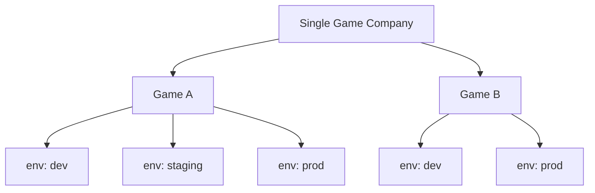

# 游戏与环境作用域

## 1. 设计前提

Croupier 不是一个 SaaS 多租户平台。

它默认服务于：

- 一个游戏公司
- 公司内部多个游戏
- 每个游戏下多个逻辑环境

因此，Croupier 的标准业务边界不是 `tenant`，而是：

```text
scope = game_id + env
```

## 2. 为什么是 `game_id + env`

`game_id` 表达业务归属。

`env` 表达逻辑生命周期阶段，例如：

- `dev`
- `test`
- `staging`
- `prod`

这两个字段组合后，正好覆盖游戏运营平台最常见的隔离需求：

- 权限控制
- 审批策略
- 风控阈值
- 审计归档
- 灰度发布
- 告警与观测维度
- 函数路由

## 3. 结构示意



## 4. 为什么不做多租户

对 Croupier 当前场景来说，引入 `tenant` 这层抽象会带来几个问题：

- 会把“公司边界”和“游戏边界”混在一起
- 会误导后续权限、审批、路由设计向 SaaS 平台靠拢
- 会让 `game_id` 退化成二级概念，增加理解成本
- 会让很多本来应该直接按游戏治理的策略被迫绕一层

如果未来真的存在多个公司实例，应该通过独立部署或独立控制面解决，而不是在当前模型里预埋伪多租户。

## 5. 为什么不把 `game_id` 和 `env` 合并成一个字段

不建议把两者合并成单个 `scope_id` 或 `track_id` 作为主 API 字段。

原因：

- 权限表达式天然需要分别判断 `game_id` 和 `env`
- 审批、风控、观测通常按环境单独出策略
- 查询、筛选、索引、聚合时拆开的字段更自然
- Header、日志、审计链、告警标签也更适合独立字段

可以在存储键、缓存键或 topic key 中派生出组合键，例如：

```text
scope_key = game_id + ":" + env
```

但它应该是派生值，不应替代主模型。

## 6. `env` 不等于部署位置

`env` 只表达逻辑环境，不直接等于：

- 数据库实例
- Agent 节点
- Kubernetes namespace
- Redis DB
- MQ topic
- 物理机房

这些属于运行目标或基础设施边界，需要单独建模。

## 7. `scope` 与 `target` 分离

推荐模型：


含义是：

- `scope` 决定它属于哪个游戏、哪个环境
- `target` 决定它实际运行在哪
- 基础设施策略再由 `target` 或独立配置决定

这和扩展安装模型里的 `scope` / `target` 区分是一致的。

## 8. 与开源项目的共性

这类设计并不特殊，很多开源产品都采用类似模式：

- Unleash：`project + environment`
- Flagsmith：`project + environment`
- GrowthBook：`project + environment`
- Argo CD：业务归属与部署目标分离

共同点都是：

- 业务作用域独立建模
- 环境保留为逻辑生命周期概念
- 真实部署位置单独表达

## 9. 对 Croupier 的落地要求

仓库内应统一遵循这些规则：

1. 不再用 “tenant / multi-tenant” 描述 `game_id + env`
2. API、SDK、权限、审计统一以 `game_id + env` 为标准作用域
3. 需要表达部署位置时，使用 `target`、`agent`、`node`、`cluster` 等单独字段
4. 需要表达物理存储隔离时，单独设计存储或部署策略，不把语义塞进 `env`
