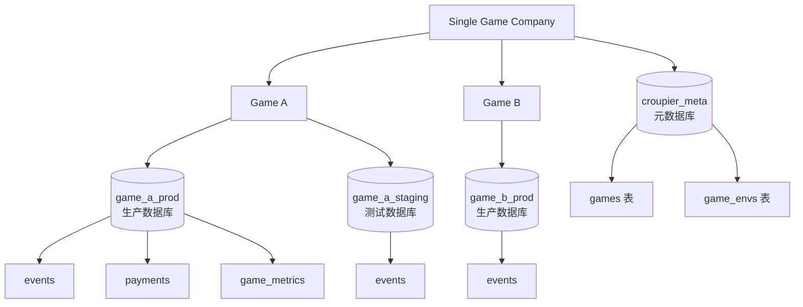
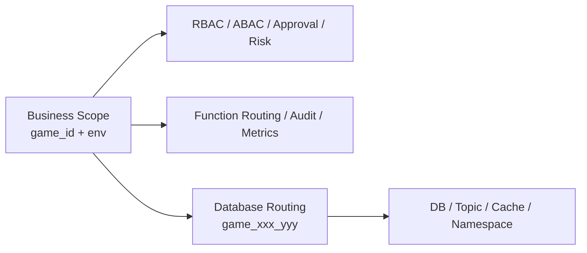

# 游戏与环境作用域

> **状态**：Current — 当前实现/规范，可作为实现依据。

## 1. 设计前提

Croupier 不是一个 SaaS 多租户平台。

它默认服务于：

- 一个游戏公司
- 公司内部多个游戏
- 每个游戏下多个逻辑环境

因此，Croupier 的标准业务边界不是 `tenant`，而是：

```text
scope = game_id + env
```

## 2. 为什么是 `game_id + env`

`game_id` 表达业务归属。

`env` 表达逻辑生命周期阶段，例如：

- `dev`
- `test`
- `staging`
- `prod`

这两个字段组合后，正好覆盖游戏运营平台最常见的隔离需求：

- 权限控制
- 审批策略
- 风控阈值
- 审计归档
- 灰度发布
- 告警与观测维度
- 函数路由

## 3. 数据库架构：按游戏分库

Croupier 采用 **数据库-per-game 架构**，每个游戏完全独立的数据库。

### 3.1 架构示意



### 3.2 数据库组织

```
croupier_meta (元数据库)
├─ user_accounts
├─ role_records
├─ user_role_records
├─ role_perm_records
├─ games (游戏注册表)
├─ game_envs (环境注册表)
├─ message_records
└─ broadcast_message_records

game_demo_prod (游戏数据库)
├─ events (游戏事件，game_id 和 env 在数据库名中)
├─ payments (支付数据)
├─ game_metrics (游戏指标)
└─ server_id 索引支持 MMORPG 多服务器

game_demo_staging
└─ (同样的表结构)

game_rpg_prod
└─ ...
```

### 3.3 按游戏分库的优势

- ✅ 物理隔离，完全独立
- ✅ 独立的容量规划和扩展
- ✅ 简化查询（不需要 WHERE game_id = 'xxx' AND env = 'prod'）
- ✅ 便于游戏迁移和归档
- ✅ 符合"通用平台 + 独立游戏数据"的理念
- ✅ 支持 MMORPG 多服务器架构（通过 server_id）

## 4. 为什么不做多租户

对 Croupier 当前场景来说，引入 `tenant` 这层抽象会带来几个问题：

- 会把"公司边界"和"游戏边界"混在一起
- 会误导后续权限、审批、路由设计向 SaaS 平台靠拢
- 会让 `game_id` 退化成二级概念，增加理解成本
- 会让很多本来应该直接按游戏治理的策略被迫绕一层

如果未来真的存在多个公司实例，应该通过独立部署或独立控制面解决，而不是在当前模型里预埋伪多租户。

## 5. 为什么不把 `game_id` 和 `env` 合并成一个字段

不建议把两者合并成单个 `scope_id` 或 `track_id` 作为主 API 字段。

原因：

- 权限表达式天然需要分别判断 `game_id` 和 `env`
- 审批、风控、观测通常按环境单独出策略
- 查询、筛选、索引、聚合时拆开的字段更自然
- Header、日志、审计链、告警标签也更适合独立字段

可以在存储键、缓存键或 topic key 中派生出组合键，例如：

```text
scope_key = game_id + ":" + env
database_name = "game_" + game_id + "_" + env
```

但它应该是派生值，不应替代主模型。

## 6. `env` 不等于部署位置

`env` 只表达逻辑环境，不直接等于：

- 数据库实例（现在通过 database_name 显式指定）
- Agent 节点
- Kubernetes namespace
- Redis DB
- MQ topic
- 物理机房

这些属于运行目标或基础设施边界，需要单独建模。

在按游戏分库架构下，每个 `(game_id, env)` 组合对应一个独立的物理数据库：

```text
game_id = "demo", env = "prod" → database = "game_demo_prod"
game_id = "demo", env = "staging" → database = "game_demo_staging"
game_id = "rpg", env = "prod" → database = "game_rpg_prod"
```

## 7. `scope` 与 `target` 分离

推荐模型：



含义是：

- `scope` 决定它属于哪个游戏、哪个环境
- 数据库路由根据 `game_id + env` 定位到具体数据库
- 基础设施策略再由具体数据库配置决定

## 8. MMORPG 多服务器支持

对于 MMORPG 游戏，同一游戏可能有多个服务器/大区。Croupier 通过 `server_id` 字段支持：

```sql
-- events 表中的 server_id
server_id LowCardinality(String) -- 例如 "s1", "s2", "asia1", "us_west_1"
```

查询时可以按 `server_id` 进行聚合：

```sql
SELECT server_id, count() AS player_count
FROM game_demo_prod.events
WHERE event = 'player.login'
  AND event_time >= today() - INTERVAL 7 DAY
GROUP BY server_id;
```

## 9. 与开源项目的共性

这类设计并不特殊，很多开源产品都采用类似模式：

- Unleash：`project + environment`
- Flagsmith：`project + environment`
- GrowthBook：`project + environment`
- Argo CD：业务归属与部署目标分离

共同点都是：

- 业务作用域独立建模
- 环境保留为逻辑生命周期概念
- 真实部署位置单独表达

## 10. 对 Croupier 的落地要求

仓库内应统一遵循这些规则：

1. 不再用 "tenant / multi-tenant" 描述 `game_id + env`
2. API、SDK、权限、审计统一以 `game_id + env` 为标准作用域
3. **数据库层采用按游戏分库架构，每个 `(game_id, env)` 对应独立数据库**
4. 存储层不需要 `game_id` 和 `env` 字段（已在数据库/表名称中体现）
5. **新增 `server_id` 作为核心字段**，支持 MMORPG 多服务器架构
6. 需要表达部署位置时，使用 `target`、`agent`、`node`、`cluster` 等单独字段

## 11. 双模式实现

Croupier 通过 `database.multiGame` 配置项支持两种运行模式：

### `multiGame: true`（生产推荐）

- 每个 `(game_id, env)` 对应独立物理数据库（如 `game_demo_prod`）
- `internal/db/router.Router` 懒加载、缓存 per-game `*gorm.DB` 连接
- `svc.GameDBMiddleware` 从 `X-Game-ID` / `X-Env` 头解析游戏作用域，将 DB 注入到 request context
- 游戏数据模型通过 `dbctx.Resolve(ctx, m.db)` 从 context 获取正确的 DB
- 游戏表中的 `game_id` / `env` 列为冗余（同库内值恒定），保留是为了代码统一性

### `multiGame: false`（默认，开发/CI）

- 所有表共存于单一配置数据库
- `game_id` / `env` 列提供行级隔离
- Router 为 nil，中间件 pass-through
- 游戏数据模型直接使用 ServiceContext.DB（meta DB 兼作 game DB）

两种模式下，API 层和模型层代码完全一致，差异仅在连接管理。

## 12. Scope 统一传递迁移方案

### 12.1 目标

前端统一通过 `X-Game-ID` / `X-Env` HTTP headers 传递 scope，由 request interceptor 自动添加。后端 handler 统一从 `GameScopeFromContext(ctx)` 读取，不再从 query params 或 request body 读取。

### 12.2 Scope 解析优先级

```
GameDBMiddleware 解析流程：
  1. 读取 X-Game-ID / X-Env headers
  2. 如果 header 为空 → 读取 admins.last_game_id / last_env（上次选择）
  3. 如果仍然为空 → 使用第一个授权的游戏/env
  4. 验证 (gameId, env) 是否在用户的授权范围内
  5. 写入 context → GameScopeFromContext(ctx) 获取
```

### 12.3 接口分类

**需要 scope 的接口**（必须有 X-Game-ID/X-Env）：
- functions, assignments, configs, analytics, players
- resource catalog, pages, approvals

**不需要 scope 的接口**（忽略 X-Game-ID/X-Env）：
- SSE: `/api/v1/messages/stream` — 拉取用户所有授权游戏的消息
- profile, auth, admin, roles — scope 无关

**可选 scope 的接口**（有 scope 则过滤，无 scope 则显示所有授权数据）：
- audit, tasks, function-calls

### 12.4 「上次选择」持久化

**admins 表新增字段：**
- `last_game_id VARCHAR(64)` — 上次选择的游戏 ID
- `last_env VARCHAR(64)` — 上次选择的环境

**API：**
- `PATCH /api/v1/profile/scope` — 持久化当前选择
- 登录响应增加 `lastGameId` / `lastEnv` 字段

**前端流程：**
1. 登录 → 获取 `lastGameId`/`lastEnv` → 恢复 scope
2. 用户切换 game/env → 调用 `PATCH /api/v1/profile/scope` 持久化
3. 页面加载 → request interceptor 从 `getScope()` 读取，通过 headers 发送

### 12.5 后端 handler 改造

所有 handler 从 `GameScopeFromContext(ctx)` 读取 scope，而非从 query params：

```go
// 改造前
func (h *Handler) List(c *gin.Context) {
    var req ListRequest
    c.ShouldBindQuery(&req) // req.GameID 从 query params 读取
    ...
}

// 改造后
func (h *Handler) List(c *gin.Context) {
    scope := svc.GameScopeFromContext(c.Request.Context())
    gameID := scope.GameID  // 从 context 读取（middleware 从 header 解析）
    env := scope.Env
    ...
}
```

保留 `form` tag 作为向后兼容（旧客户端），但 handler 优先使用 context 值。

### 12.6 SSE 不受 scope 限制

`/api/v1/messages/stream` 查询用户所有授权游戏的消息，不依赖 `X-Game-ID`/`X-Env`。后端根据 `admin_game_scopes` 表过滤消息。

### 12.7 前端统一改造

- 移除所有 API 函数中的 `gameId`/`env` query params 和 body 字段
- 统一由 request interceptor 通过 headers 发送
- `functions.ts` 已改用 `getScope()` 替代直接读 localStorage
- `scopeReady` 机制确保 GameSelector 验证后才发请求

### 12.8 迁移步骤

1. **后端**: Admin model 新增 `last_game_id`/`last_env`，migration
2. **后端**: `GameDBMiddleware` 增加 fallback 逻辑（header → last → first authorized）
3. **后端**: 新增 `PATCH /api/v1/profile/scope` API
4. **后端**: 登录响应增加 `lastGameId`/`lastEnv`
5. **后端**: handler 逐步改为从 context 读取 scope
6. **前端**: 登录后恢复 `lastGameId`/`lastEnv`
7. **前端**: scope 变更时调用 `PATCH /api/v1/profile/scope` 持久化
8. **前端**: 移除 API 函数中的 gameId/env query params
9. **前端**: SSE 接口确认不传 scope

### 12.9 潜在问题

- `admin_game_scopes` 使用 numeric GameID（DB 主键），而 headers 使用 string GameID（业务标识如 "demo_game"）。需要通过 `games` 表关联。
- 首次登录没有 `last_game_id`，需要 fallback 到第一个授权游戏。
- 授权变更后 `last_game_id` 可能失效，middleware 需要验证授权范围并 fallback。
- SSE 消息过滤需要后端根据用户授权的游戏列表实现，而非依赖 header。
