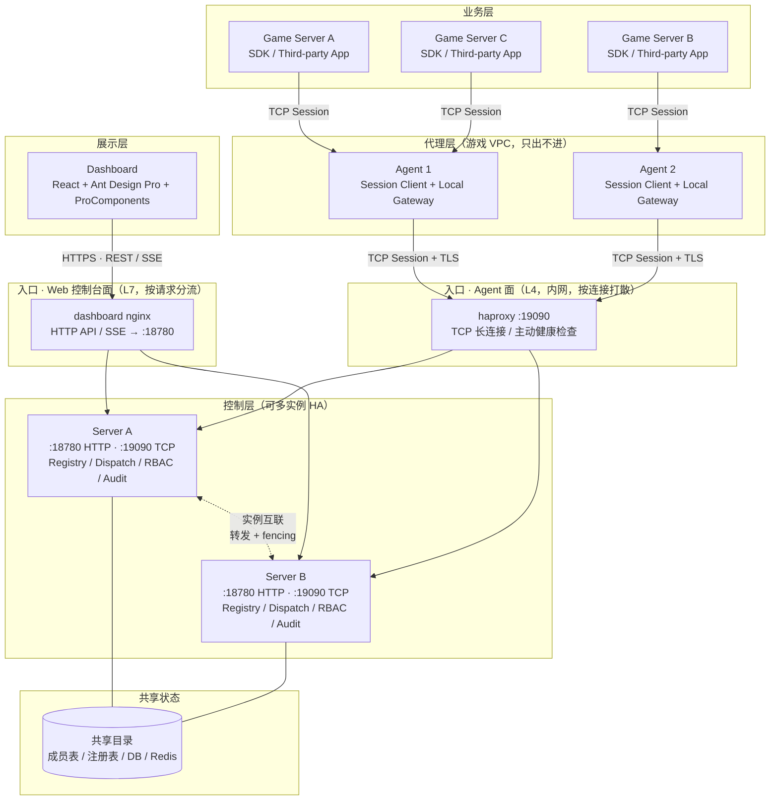

# 系统架构

> **状态**：Current — 当前实现/规范，架构导航中枢。

Croupier 当前的目标架构已经从"多条回拨链路 + 历史 旧传输/gRPC 混合模型"收敛到"统一 session 传输"：

- `Agent <-> Server`：默认采用 `TCP session`，默认启用 `TLS`
- `SDK <-> Agent`：默认采用 `TCP session`，默认不启用 `TLS`，按需开启
- 两条链路共享同一套 session 传输基座，只在首条握手消息和业务语义上区分子协议

在业务建模上，Croupier 同时采用单公司、多游戏、多环境的作用域模型：

- 标准业务边界是 `game_id + env`
- `env` 表达逻辑生命周期阶段，不直接表示物理部署位置
- `scope` 与 `target` 必须分离
- **数据库采用按游戏分库架构**
- **多服务可共享同一个 Agent**：一个 Agent 可接入多个 game service，函数路由按 `functionId → serviceId → Instance` 双层索引（Nacos 风格），invoke 可在 metadata 带 `serviceId` 精确路由

## 总体拓扑

入口按受众分为两个独立的面，不要合并成一个"负载均衡层"：

- **Web 控制台面**（面向运营/管理员，公网或办公网）：L7 `dashboard nginx`，按请求分流 HTTP API / SSE 到 Server 的 `:18780`
- **Agent 面**（内网，面向游戏 VPC 出站连接）：L4 `haproxy`（`:19090`），按 TCP 长连接打散到 Server 的 control listener；连接语义是"断线重连即漂移"，与 HTTP 的按请求分流完全不同



> 两个入口面互不共享：Web 面的 nginx 不碰 Agent 流量，Agent 面的 haproxy
> 不碰 HTTP。L4/L7 选型与 VRRP 消除 LB 单点的论证见
> [负载均衡](../operations/load-balancing.md)。

> Server 支持多实例高可用部署（`cluster.enabled`）：单实例默认关闭集群，零
> 开销。详见 [Server 多实例高可用设计](./server-ha-multi-instance.md)。

关键边界说明：

- `Server` 不再依赖反向直连 `Agent` 暴露的 `rpc_addr`
- `Agent` 本地监听只服务 `GameServer / SDK / 第三方应用`
- `Server -> Agent` 的 `Invoke / StartTask / CancelTask / Ops` 都应复用既有 `Agent-Server` session

## 核心结论

1. `Agent <-> Server` 不再以 `REQ/REP` 作为目标主模型，而是轻量双向 session。
2. `Server -> Agent` 的调用应复用既有 session，不再依赖 `rpc_addr` 反向回拨。
3. `Agent` 本地监听只服务 `GameServer / SDK / 第三方应用`。
4. `SDK <-> Agent` 与 `Agent <-> Server` 共享同一套 session 传输基座。
5. **每个游戏使用独立的数据库，实现物理隔离**。

## shared session runtime

这里的 `shared session runtime` 指共享的传输与会话基座，至少包括：

- `tcp`
- 可选 `tls`
- `4-byte frame length + 8-byte croupier header + protobuf body`
- 双向 request/response 复用
- request id 管理
- heartbeat
- reconnect
- drain
- backpressure

它不等于具体业务协议，只是通用运行时。

## subprotocol 说明

这里的 `subprotocol` 不是"个性化配置"，而是"运行在同一套 session runtime 上的不同应用层子协议"。

当前有两套主要 `subprotocol`：

- `sdk-agent subprotocol`
  - 首条消息是 `ProviderConnectRequest`
  - 默认不启用 `tls`
  - 面向 provider session
- `agent-server subprotocol`
  - 首条消息是 `RegisterRequest`（proto 现名；演进命名 AgentConnectRequest 见传输重设计文档）
  - 默认启用 `tls`
  - 面向 agent session

二者共享底层机制，但握手、注册内容和路由语义不同。

## 为什么不再以 历史消息模式 为中心

问题不在于 `旧传输` 没有长连接能力，而在于当前使用的 `REQ/REP` pattern 不适合：

- 在已有连接上由双方主动发新请求
- 多个并发 in-flight 请求复用
- session 级别的重连、背压、drain 和路由治理

因此当前架构收敛为"轻量 session 协议"，而不是继续围绕某个 `历史消息模式` 修补。

## 数据库架构

Croupier 采用 **数据库-per-game 架构**：

```
croupier_meta (元数据库)
├─ user_accounts
├─ role_records
├─ user_role_records
├─ role_perm_records
├─ games (游戏注册表)
├─ game_envs (环境注册表)
└─ message_records

game_demo_prod (游戏数据库)
├─ events (游戏事件)
├─ payments (支付数据)
├─ game_metrics (游戏指标)
└─ server_id 索引支持 MMORPG 多服务器

game_demo_staging
└─ (同样的表结构)

game_rpg_prod
└─ ...
```

### 按游戏分库的优势

- ✅ 物理隔离，完全独立
- ✅ 独立的容量规划和扩展
- ✅ 简化查询（不需要 WHERE game_id = 'xxx' AND env = 'prod'）
- ✅ 便于游戏迁移和归档
- ✅ 符合"通用平台 + 独立游戏数据"的理念

### 数据库路由

Server 根据 `game_id + env` 路由到对应的数据库：

| game_id | env     | database          |
| ------- | ------- | ----------------- |
| demo    | prod    | game_demo_prod    |
| demo    | staging | game_demo_staging |
| rpg     | prod    | game_rpg_prod     |

存储层不需要 `game_id` 和 `env` 字段，这些信息已在数据库/表名称中体现。

## MMORPG 多服务器支持

对于 MMORPG 游戏，支持 `server_id` 字段区分不同服务器/大区：

```sql
-- events 表
server_id LowCardinality(String) -- 例如 "s1", "asia1", "us_west_1"
```

## 文档索引

当前目录同时包含当前规范、Dashboard 页面模型、决策与边界、提案与迁移设计和参考资料。阅读顺序以导航分组为准：

- **当前规范**：可作为实现和评审依据。
- **Dashboard 页面模型**：vNext 页面产品链路的权威定义，建议按核心思路 → 术语表 → 模型 → 注册契约 → 协议 → 生成/运行时 → 菜单的顺序阅读。
- **决策与边界**：描述架构取舍、扩展边界和契约基线。
- **提案与迁移设计**：描述目标设计或迁移方案，不代表代码已全部实现。
- **参考资料**：调研、模板、历史背景，不作为规范入口。

### 当前规范

- [分层设计](./layers.md)
- [术语与分层](./terms-and-layering.md)
- [数据流](./data-flow.md)
- [游戏与环境作用域](./game-environment-scope.md)
- [Session 生命周期](./session-lifecycle.md)
- [SDK Wire 协议](./sdk-wire-protocol.md) — 含过载反馈/背压现状与双车道设计
- [本地化文本契约](./localized-text-contract.md) — `LocalizedText` BCP47 键与前后端归一规则
- [SDK OTel 传播](./sdk-otel-propagation.md) — trace 上下文跨 SDK 边界传播

### Dashboard 页面模型

- [界面是怎么生成的：核心思路与全链路](./descriptor-driven-ui.md) — 新手从这里开始：描述驱动的核心创新、从函数注册到页面执行的完整流程、每个关键决策的取舍
- [Dashboard 术语表](./dashboard-glossary.md) — FunctionContract、CapabilitySemantics、PageProposal、PageSpec 与 freshness/merge 的统一定义，建议首先阅读
- [Dashboard Resource/Page 模型](./dashboard-page-model.md) — 注册、语义聚合、Proposal、发布快照与执行治理的权威模型
- [OpenAPI / SDK Descriptor v2](./openapi-sdk-descriptor-v2.md) — OpenAPI 扩展字段、SDK descriptor 与 FunctionContract 的统一注册契约
- [PageSpec 协议规范](./pagespec-protocol.md) — PageSpec/FormPresentationSpec/typed selector 的 wire 契约唯一出处
- [ProComponents 页面生成与运行时](./ui-generation.md) — 生成器默认值、Page Studio 与唯一运行时边界
- [运行控制台动态菜单](./console-dynamic-menu.md) — PublishedPageSpec 到 ConsoleMenuSpec 的菜单唯一来源与分类仲裁
- [旧模型删除清单](./legacy-deletion-inventory.md) — 旧模型删除的历史记录与防回流 guard 索引

### 决策与边界

- [传输层决策（不使用 gRPC）](./transport-no-grpc.md)
- [平台配置分层 L1←L2←L3](./config-layering.md)
- [功能开关](./feature-flags.md)
- [数据库迁移策略](./database-migration-strategy.md)
- [扩展安装模型](./extension-installation-model.md)
- [核心与扩展边界映射](./core-extension-mapping.md)
- [扩展 API 契约基线](./extensions-api-contract-baseline.md)

### 提案与迁移设计

- [游戏环境作用域 API 传输设计](./game-env-scope-api-transport.md) — scope 通过 Header/Query/Body 传递的选型与统一规范（提案）
- [SDK-Agent 传输重构设计](./sdk-agent-transport-redesign.md)
- [Agent-Server TCP Session 重构设计](./agent-server-session-transport-redesign.md)
- [扩展统一模式](./official-extension-unified-pattern.md)
- [双布局设计（设计态/运行态导航隔离）](./dual-layout-design.md) — 已评审待决策
- [Server 多实例高可用设计](./server-ha-multi-instance.md) — 已实现：成员表、实例互联与 owner 转发、`cluster.enabled` 接线与集群拓扑页（正文标注 Current）

### 参考资料

- [Session Runtime 参考实现](./session-runtime-landscape.md)
- [前端 Adapter 模板](./frontend-adapter-layer-template.md)
