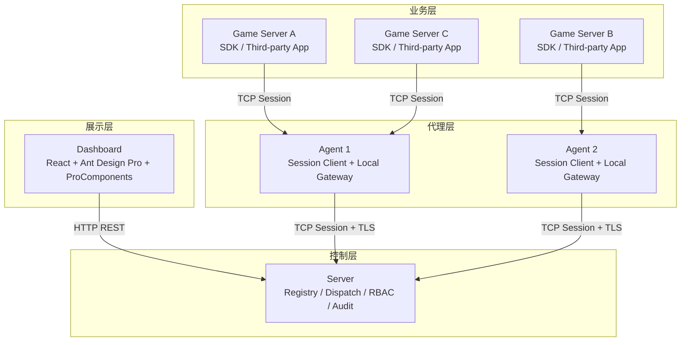

# 系统架构

> **状态**：Current — 当前实现/规范，架构导航中枢。

Croupier 当前的目标架构已经从"多条回拨链路 + 历史 旧传输/gRPC 混合模型"收敛到"统一 session 传输"：

- `Agent <-> Server`：默认采用 `TCP session`，默认启用 `TLS`
- `SDK <-> Agent`：默认采用 `TCP session`，默认不启用 `TLS`，按需开启
- 两条链路共享同一套 session 传输基座，只在首条握手消息和业务语义上区分子协议

在业务建模上，Croupier 同时采用单公司、多游戏、多环境的作用域模型：

- 标准业务边界是 `game_id + env`
- `env` 表达逻辑生命周期阶段，不直接表示物理部署位置
- `scope` 与 `target` 必须分离
- **数据库采用按游戏分库架构**
- **多服务可共享同一个 Agent**：一个 Agent 可接入多个 game service，函数路由按 `functionId → serviceId → Instance` 双层索引（Nacos 风格），invoke 可在 metadata 带 `service_id` 精确路由

## 总体拓扑



关键边界说明：

- `Server` 不再依赖反向直连 `Agent` 暴露的 `rpc_addr`
- `Agent` 本地监听只服务 `GameServer / SDK / 第三方应用`
- `Server -> Agent` 的 `Invoke / StartTask / CancelTask / Ops` 都应复用既有 `Agent-Server` session

## 核心结论

1. `Agent <-> Server` 不再以 `REQ/REP` 作为目标主模型，而是轻量双向 session。
2. `Server -> Agent` 的调用应复用既有 session，不再依赖 `rpc_addr` 反向回拨。
3. `Agent` 本地监听只服务 `GameServer / SDK / 第三方应用`。
4. `SDK <-> Agent` 与 `Agent <-> Server` 共享同一套 session 传输基座。
5. **每个游戏使用独立的数据库，实现物理隔离**。

## shared session runtime

这里的 `shared session runtime` 指共享的传输与会话基座，至少包括：

- `tcp`
- 可选 `tls`
- `4-byte frame length + 8-byte croupier header + protobuf body`
- 双向 request/response 复用
- request id 管理
- heartbeat
- reconnect
- drain
- backpressure

它不等于具体业务协议，只是通用运行时。

## subprotocol 说明

这里的 `subprotocol` 不是"个性化配置"，而是"运行在同一套 session runtime 上的不同应用层子协议"。

当前有两套主要 `subprotocol`：

- `sdk-agent subprotocol`
  - 首条消息是 `ProviderConnectRequest`
  - 默认不启用 `tls`
  - 面向 provider session
- `agent-server subprotocol`
  - 首条消息是 `AgentConnectRequest` 或其兼容注册消息
  - 默认启用 `tls`
  - 面向 agent session

二者共享底层机制，但握手、注册内容和路由语义不同。

## 为什么不再以 历史消息模式 为中心

问题不在于 `旧传输` 没有长连接能力，而在于当前使用的 `REQ/REP` pattern 不适合：

- 在已有连接上由双方主动发新请求
- 多个并发 in-flight 请求复用
- session 级别的重连、背压、drain 和路由治理

因此当前架构收敛为"轻量 session 协议"，而不是继续围绕某个 `历史消息模式` 修补。

## 数据库架构

Croupier 采用 **数据库-per-game 架构**：

```
croupier_meta (元数据库)
├─ user_accounts
├─ role_records
├─ user_role_records
├─ role_perm_records
├─ games (游戏注册表)
├─ game_envs (环境注册表)
└─ message_records

game_demo_prod (游戏数据库)
├─ events (游戏事件)
├─ payments (支付数据)
├─ game_metrics (游戏指标)
└─ server_id 索引支持 MMORPG 多服务器

game_demo_staging
└─ (同样的表结构)

game_rpg_prod
└─ ...
```

### 按游戏分库的优势

- ✅ 物理隔离，完全独立
- ✅ 独立的容量规划和扩展
- ✅ 简化查询（不需要 WHERE game_id = 'xxx' AND env = 'prod'）
- ✅ 便于游戏迁移和归档
- ✅ 符合"通用平台 + 独立游戏数据"的理念

### 数据库路由

Server 根据 `game_id + env` 路由到对应的数据库：

| game_id | env | database |
|---------|-----|----------|
| demo | prod | game_demo_prod |
| demo | staging | game_demo_staging |
| rpg | prod | game_rpg_prod |

存储层不需要 `game_id` 和 `env` 字段，这些信息已在数据库/表名称中体现。

## MMORPG 多服务器支持

对于 MMORPG 游戏，支持 `server_id` 字段区分不同服务器/大区：

```sql
-- events 表
server_id LowCardinality(String) -- 例如 "s1", "asia1", "us_west_1"
```

## 文档索引

当前目录同时包含当前规范、已接受设计、迁移提案和参考资料。阅读顺序应以导航分组为准：

- **当前规范**：可作为实现和评审依据。
- **决策与边界**：描述架构取舍、扩展边界和契约基线。
- **提案与迁移设计**：描述目标设计或迁移方案，不代表代码已全部实现。
- **参考资料**：调研、模板、历史背景，不作为规范入口。

- [分层设计](./layers.md)
- [游戏与环境作用域](./game-environment-scope.md)
- [术语与分层](./terms-and-layering.md)
- [数据流](./data-flow.md)
- [Dashboard Resource/Page 模型](./dashboard-page-model.md) — 函数注册、资源归一化、默认页面生成、PageSpec、动态菜单的权威模型
- [Dashboard 术语表](./dashboard-glossary.md) — FunctionContract、CapabilitySemantics、PageProposal 与 PageSpec 的统一定义
- [OpenAPI / SDK Descriptor v2](./openapi-sdk-descriptor-v2.md) — OpenAPI 扩展字段、SDK descriptor 与 PageSpec 生成之间的统一契约
- [UI Schema 与 PageSpec 规范](./ui-schema-spec.md) — JSON Schema 表单、强类型 PageSpec 与 typed selector 规范
- [ProComponents 页面生成与运行时](./ui-generation.md) — 能力语义、默认 Proposal、Page Studio 与运行时边界
- [运行控制台动态菜单](./console-dynamic-menu.md) — PublishedPageSpec 到 ConsoleMenuSpec 的菜单唯一来源与分类仲裁
- [SDK-Agent 传输重构设计](./sdk-agent-transport-redesign.md)
- [Agent-Server TCP Session 重构设计](./agent-server-session-transport-redesign.md)
- [Session 生命周期](./session-lifecycle.md)
- [SDK Wire Protocol](./sdk-wire-protocol.md)
- [Session Runtime 参考实现](./session-runtime-landscape.md)
- [核心与扩展边界映射](./core-extension-mapping.md)
