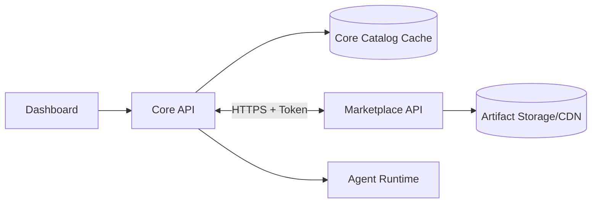

# 商店服务拆分方案（Core 与 Marketplace 解耦）

更新时间：2026-03-15

## 1. 目标与结论

目标是把“扩展商店”从 Croupier Core 中独立出来，形成单独在线服务，同时保持 Core 在离线场景可运行。

结论：

1. Core 继续拥有“安装与运行时主控权”。
2. Marketplace 负责“目录、版本、分发、签名、生态”。
3. Core 与 Marketplace 通过稳定 API 同步，不共享数据库。
4. 支持双模式：
   - Online：连接官方或私有商店。
   - Offline：仅使用本地导入/内置 catalog。

## 2. 职责边界

## 2.1 Core（保留）

- extension_installation / runtime_binding / health / event 主数据。
- 安装、启停、升级、回滚、卸载状态机。
- agent 同步与执行编排。
- 权限、审计、租户隔离。
- 本地缓存 catalog 快照（只读副本）。

## 2.2 Marketplace（拆出）

- 扩展目录（Catalog）与版本（Release）发布管理。
- artifact 元数据（下载地址、sha256、签名、大小）。
- 兼容矩阵（coreVersion/agentVersion/os/arch）。
- 渠道与可见性（stable/beta/internal/private）。
- 搜索、标签、评分、下载统计（后续）。

## 2.3 禁止交叉

- Marketplace 不直接操作 Core 安装实例。
- Core 不直接维护在线商店发布元数据。
- 两边不共享 GORM model 和数据库表。

## 3. 逻辑架构

读取链路：

1. Dashboard 调 Core 查询商店列表。
2. Core 优先返回本地缓存；按策略后台刷新 Marketplace。

安装链路：

1. 用户在 Dashboard 发起安装。
2. Core 校验权限、依赖、兼容性。
3. Core 向 Marketplace 拉 release 元数据与签名信息。
4. Core 下载/校验 artifact，写 installation 主数据并触发 runtime reconcile。

## 4. 数据所有权

## 4.1 Core DB（继续）

- `extension_installations`
- `extension_runtime_bindings`
- `extension_events`
- `extension_health`
- `extension_catalog_cache`（新增，缓存商店目录快照）

## 4.2 Marketplace DB（新增）

- `marketplace_extensions`
- `marketplace_releases`
- `marketplace_artifacts`
- `marketplace_compatibility_rules`
- `marketplace_channels`
- `marketplace_publish_audits`

## 5. API 设计

## 5.1 Marketplace 对 Core（服务到服务）

- `GET /v1/catalog/extensions?query=&tag=&channel=&cursor=`
- `GET /v1/catalog/extensions/{extensionId}`
- `GET /v1/catalog/extensions/{extensionId}/releases`
- `GET /v1/releases/{releaseId}/artifact`
- `POST /v1/releases/{releaseId}/verify`（可选，远端验签）

鉴权建议：

- `Authorization: Bearer <marketplace_access_token>`
- token 绑定租户/环境/可见频道。

## 5.2 Core 对 Dashboard（保持现有）

继续复用：

- `/api/v1/extensions/catalog`
- `/api/v1/extensions/catalog/:id`
- `/api/v1/extensions/catalog/:id/releases`
- `/api/v1/extensions/install*`

说明：Dashboard 无需感知 Marketplace 存在，仍只对 Core 编程。

## 6. 版本与兼容策略

Marketplace release 必须声明：

- `min_core_version`
- `max_core_version`（可选）
- `min_agent_version`（可选）
- `supported_os_arch`
- `requires_capabilities`

Core 安装前必须校验以上字段；不满足直接拒绝安装。

## 7. 安全与供应链

- artifact 必须具备 `sha256` 与签名。
- Core 本地验签后才允许落库安装。
- 支持“可信发布者白名单”（vendor allowlist）。
- Marketplace 发布流程必须记录审计与可回滚元数据。

## 8. 部署模型

最小生产拓扑：

1. `marketplace-api`（无状态，多副本）
2. `marketplace-db`（PostgreSQL/MySQL）
3. `artifact storage`（S3/OSS/COS + CDN）
4. `optional search`（后续）

Core 侧新增配置：

- `marketplace.enabled`
- `marketplace.endpoint`
- `marketplace.token`
- `marketplace.sync_interval`
- `marketplace.cache_ttl`
- `marketplace.mode`（`online` / `offline` / `hybrid`）

## 9. 迁移执行计划

Phase A（接口先行）

- 在 Core 增加 MarketplaceClient 抽象（port + adapter）。
- 现有 catalog repo 改为“本地缓存仓库 + 远端同步器”。

Phase B（双写过渡）

- 后台任务定时从 Marketplace 拉目录并写 `extension_catalog_cache`。
- Dashboard 继续读 Core，不改前端协议。

Phase C（安装切流）

- 安装流程改为优先用 Marketplace release 元数据。
- 保留离线导入路径作为兜底。

Phase D（彻底解耦）

- 删除 Core 内“在线发布管理”职责。
- Core 只保留安装运行时与缓存读取。

## 10. 中断恢复点

- 完成 Phase A 后可单独上线，不影响现网安装路径。
- 完成 Phase B 后可随时关闭远端同步，回到缓存模式。
- 完成 Phase C 后如 Marketplace 故障，可切 `offline/hybrid` 保底。

## 11. 验收标准

- 关闭 Marketplace 时，Core 仍可用本地已安装扩展正常运行。
- 开启 Marketplace 时，Catalog 查询和安装成功率满足目标 SLO。
- Dashboard 无需改协议即可展示线上商店内容。
- Core 不再持有在线发布管理逻辑与数据表。
