# Server 多实例高可用设计

> **状态**：Proposal — 设计建议，待其他功能完善后实施。当前代码为单实例模型，本文档不代表已实现能力。

本文档定义 Croupier Server 控制面从单实例演进为多实例高可用（HA）部署的目标设计，覆盖问题分析、方案选型、共享目录、实例互联、转发协议、故障语义与实施拆解。

## 1. 背景与问题

当前 Server 控制面是**单点**：

- Agent 会话、函数路由表存放在 `internal/platform/registry/store.go` 的进程内存 map（RWMutex 保护）
- Agent 与 Server 之间是一条物理绑定的 TCP session 长连接
- `dispatch` 层的 `NewDispatcherWithHA` 只解决"选哪个 Agent"的高可用，不解决 Server 自身的高可用

由此产生三个后果：

1. **宕机 = 全平台停摆**：Server 崩溃或升级重启期间，注册表丢失、所有 Agent 断连，GM 功能整体不可用
2. **无法水平扩容**：部署两台 Server 时，请求被负载均衡分到未持有目标 Agent 的实例上，会因内存注册表查无此 Agent 而调用失败（脑裂式错误）
3. **无滚动升级能力**：任何发版都伴随全平台中断窗口

## 2. 目标与非目标

### 目标

- Server 宕机影响面从"全平台瘫痪"收敛为"该局实例名下 Agent 秒级中断 + 自动故障转移"
- HTTP 读路径（权限、审计、数据浏览）在任意存活实例上全程可用
- 支持滚动重启/升级，全程业务无感
- 单实例部署体验不变：不强制引入任何新的外部组件

### 非目标

- 不追求"连接永不中断"——持有连接的进程死亡时 TCP 连接必断，HA 保证的是**局部影响 + 自动快速恢复 + 状态不丢**（与 Kafka/etcd/Sentinel 的 HA 语义同构）
- 不做 SaaS 多租户扩容，实例规模预期 2~5 台
- 不改变 Agent 出站连接模型（游戏网络"只出不进"的安全约束不变）

## 3. 方案选型

### 3.1 共享状态机制选型

多实例协同必须有一种"实例间共享状态/达成共识"的机制，候选路线：

| 路线                               | 新增依赖 | 评价                                                          |
| ---------------------------------- | -------- | ------------------------------------------------------------- |
| A. 复用现有 DB（MySQL/PG）存注册表 | 无       | 及格线方案；心跳写入需降频/批量                               |
| B. Redis 存注册表                  | Redis    | 业界标准做法，天然 TTL/pub-sub；仓库 cache/MQ 已有 Redis 实现 |
| C. 嵌入共识（Raft/gossip）         | 无       | 自研分布式逻辑成本过高，对本项目规模过度设计                  |
| D. L4 粘滞路由 + 重连重注册        | 无       | 改动最小但负载不均、故障切换有空窗，仅作过渡                  |

**结论**：`RegistryStore` 抽象 + 多实现，复用仓库既有的可插拔存储模式（cache 的 local/redis/null、MQ 的 redis/kafka/noop、RateLimitStore）。

### 3.1.1 业界模式对比：反向隧道 Agent + 多副本控制面

本问题在分布式系统中是经典难题："反向隧道型 Agent + 多副本控制面，请求如何找到持有连接的实例"。业界有五种成熟模式，均有开源项目背书：

**模式 1：消息总线做路由层（连接管理层独立化）**

代表：**Pitaya**（topfreegames，Go 游戏服务器框架）。

```text
GameServer ──► Edge（连接层，只持有连接）◄──► NATS（消息总线）◄──► Logic Server（业务层）
                      ▲                         ▲
                   etcd（服务发现）─────────────┘
```

前端服务器只持有连接，业务服务器经 NATS 发 RPC，总线把消息路由到订阅对应 subject 的连接持有者；服务发现用 etcd。无显式转发代码。

- **独特收益**：业务层重启/升级时 Agent 连接完全不掉（连接在 Edge 层，业务层无状态）
- **代价**：强制引入 NATS（自身需集群化，成为新的关键路径）+ etcd；所有调用流量过一遍总线（带宽放大、延迟加一跳）；排障多一个黑盒

**模式 2：Agent 连所有副本**

代表：**Teleport ≤ v10**。Agent 对每台 Proxy 维持一条反向隧道，任何 Proxy 都有直达通道，零转发。

- 优点：路由逻辑为零，延迟最低
- 缺点：N×M 连接、Agent 变重、单台 Proxy 重启引发全量 Agent 惊群重连
- **关键证据：Teleport 在 v11 亲手放弃了该模式**，转向模式 3（大规模集群下连接风暴不可承受）

**模式 3：共享目录 + 实例间转发**

代表：**Teleport v11+（Proxy Peering）**。Agent 只连一台，Proxy 之间互相转发。即本文档方案（见第 4、5 章）。

**模式 4：调用方侧路由**

代表：**Tailscale DERP**、**Kubernetes Konnectivity**。不转发，由控制面目录告诉调用方"目标连接在哪台实例"，调用方自己连到该实例投递（Konnectivity：apiserver 与所有 konnectivity-server 副本保持连接，按 agentID 哈希选目标副本，选错则重解析重试）。

- 对应到 Croupier：入口网关按 `game_id`/`agent_id` 一致性哈希路由 HTTP 请求到 owner 实例
- 优点：无转发代码、无跳跃延迟
- 缺点：复杂度转移到网关/LB 层；Agent 重连换实例后哈希映射需跟随；网关自身成为关键组件

**模式 5：单点隧道 + 外部兜底**

代表：**frp、rathole**。隧道服务器单点，靠 keepalived/多入口 + 客户端重连兜底。Croupier 现状本质即此类。

**五模式对比**：

| 维度                  | ① Pitaya 总线      | ② Agent 连所有  | ③ 目录+转发         | ④ 调用方路由       | ⑤ 单点兜底 |
| --------------------- | ------------------ | --------------- | ------------------- | ------------------ | ---------- |
| 新增基础设施          | NATS + etcd        | 无              | 无（复用 DB/Redis） | 智能网关           | 无         |
| Agent 改动            | 无                 | 大（多连接）    | 无                  | 无                 | 无         |
| Server 改动           | 拆 edge/logic 两层 | 小              | 中（转发协议）      | 小                 | 无         |
| 业务重启掉 Agent 连接 | 不掉               | 部分掉          | 只掉该实例名下      | 只掉该实例名下     | 全掉       |
| 调用延迟              | +1 跳（总线）      | 直达            | 可能 +1 跳          | 直达               | 直达       |
| 故障爆炸半径          | 总线故障 = 全局    | 1/M             | 1/M                 | 1/M                | 全局       |
| 规模天花板            | 高                 | 低（连接风暴）  | 中高                | 中                 | —          |
| 业界验证              | 游戏后端大规模实战 | Teleport 已弃用 | Teleport 现役       | Tailscale/K8s 现役 | 小团队     |

**选型结论**：

- **现阶段选模式 ③**：无新组件、Agent 零改动、Teleport 演进路径（②→③）提供了大规模实战背书
- **模式 ① 作为终态演进选项保留**：当实例规模上升、发版频率高到"秒级中断"不可接受时，升级为 edge/logic 两层 + 总线路由。届时模式 ③ 的共享目录与 fencing 设计**不会浪费**，总线模式下依然需要
- 模式 ② 已被 Teleport 否决；模式 ④ 意味着自研智能网关，投入产出不划算

### 3.2 关键设计决策：显式配置，不与数据库驱动联动

存储实现**不得**根据 `database.driver` 隐式切换（sqlite→memory、mysql→redis 之类的猜测），原因：

- 数据库类型 ≠ 部署形态：MySQL 单实例部署很常见，不应被强制要求 Redis
- 隐式切换产生"惊喜行为"：同一配置换驱动即改变运行时行为，排障困难
- 正确做法：显式配置 + 保守默认值 + 启动时 fail-fast 校验

```yaml
registry:
  store: memory # memory | db | redis，默认 memory
  redis:
    addr: localhost:6379
    keyPrefix: "croupier:registry:"
```

校验规则（接入既有 `config validate` 入口）：

- `store: memory`：启动打警告"单实例注册表，多副本部署将导致函数路由错误"
- `store: redis` 未配 `addr`：启动报错
- `store: db`：复用 `database.dataSource`，零新依赖

## 4. 总体架构

```mermaid
graph TB
  subgraph 共享层
    DIR[共享目录 DB/Redis<br/>instances 表 + agent 目录 + 函数路由]
  end
  subgraph 集群
    SA[Server A :8444]
    SB[Server B :8444]
    SC[Server C :8444]
  end
  LB[L4 负载均衡]
  AG1[Agent 1]
  AG2[Agent 2]
  AG3[Agent 3]

  SA <-->|心跳续租/目录读写| DIR
  SB <-->|心跳续租/目录读写| DIR
  SC <-->|心跳续租/目录读写| DIR
  SA <-->|实例互联 mTLS| SB
  SB <-->|实例互联 mTLS| SC
  AG1 -->|TCP session| LB
  AG2 -->|TCP session| LB
  AG3 -->|TCP session| LB
  LB --> SA
  LB --> SB
  LB --> SC
```



### 4.1 状态分层：什么能共享，什么必须留在本地

注册表中的状态分两类，必须拆开：

| 内容                                               | 位置                     |
| -------------------------------------------------- | ------------------------ |
| Agent 元数据（ID、game/env、健康分、心跳时间）     | 共享目录                 |
| 函数路由表（functionId → agentId → ownerInstance） | 共享目录                 |
| **TCP 连接句柄（net.Conn）**                       | **本进程内存，不可共享** |

共享的组件准确说是"**目录服务**"（谁在线、有什么能力、连在哪台实例上）；连接表永远留在本地。

### 4.2 为什么需要实例间转发（而非 Server 直连 Agent）

Agent 部署在游戏 VPC/内网，安全策略为"只出不进"，隧道方向是 Agent → Server。目录能记录 Agent 归属，但**变不出从其他实例直达 Agent 的网络通路**。因此非 owner 实例收到调用请求时，必须通过互联通道请 owner 代发——这是 reverse tunnel 架构（frp、konnectivity、Azure Relay）的标准解法。

被否决的替代方案：

- **Server 直连 Agent（Server → Agent 拨号）**：要求游戏网络开入站防火墙，推翻安全模型，Agent 还需处理多 Server 并发连接，改动量比转发大一个数量级
- **Agent 全连接网（连所有 Server）**：N×M 连接风暴、注册风暴，且任务取消/幂等/事件序号的多 session 一致性协调复杂度远超转发
- **纯粘滞路由**：仅作过渡，扩容再均衡和故障切换质量差

## 5. 实例互联设计

### 5.1 实例身份与发现

不引入独立服务发现组件（etcd/Consul），复用共享目录：

每台 Server 启动时写入 `instances` 记录并周期续租：

```json
{
  "instanceId": "server-a-7f3d",
  "advertiseAddr": "10.0.1.11:8444",
  "startedAt": "...",
  "leaseExpireAt": "...",
  "epoch": 42
}
```

- `instanceId`：可配置，空则启动时生成 UUID
- `epoch`：每次启动递增的任期号，充当 **fencing token**
- 租约 TTL 过期（建议 3 个心跳周期）即判定实例死亡

配置：

```yaml
cluster:
  enabled: true
  instanceId: ""
  advertiseAddr: "10.0.1.11:8444"
  heartbeatInterval: 5s
  leaseTtl: 15s
```

### 5.2 拓扑与传输

- **懒连接全互联（lazy mesh）**：首次需要转发时才建立到对端的连接，之后连接池复用；实例规模 2~5 台，mesh 足够
- **复用自研 session 传输基座**（`internal/transport/tcp`），新增第三种握手角色：

```text
握手消息: { role: "server", instanceId: "server-b", epoch: 17 }
```

- 不引入 gRPC（与 [传输层决策](./transport-no-grpc.md) 一致）
- 双向多路复用天然支持转发的任务事件流（progress/log 事件需穿过转发层回传给 SSE 调用方）
- **独立监听端口**（如 8444），与 Agent-facing 端口分离，防火墙只放行集群内网段

### 5.3 互联安全

- 复用既有 mTLS CA（devcert/tlsutil/证书监控）
- 互联端口只接受 `role = server` 的对端证书，Agent 证书连接直接拒绝
- 转发请求必须携带原始调用者上下文（adminID/roles/trace ID），**owner 实例重新执行权限校验**——内部通道不得绕过鉴权

### 5.4 转发协议与两条铁律

新增内部消息（复用 protobuf 信封）：

```protobuf
message ForwardInvoke {
  string agentId = 1;
  string functionId = 2;
  bytes payload = 3;
  string idempotencyKey = 4;
  int64 timeoutMs = 5;
  CallerContext caller = 6;   // adminID / roles / gameId / env / traceId
  bool forwarded = 7;         // 铁律一标记
}
```

**铁律一：最多一跳。** `forwarded: true` 的请求若 owner 发现自己也不是 owner（目录过期），**不得再次转发**，返回 `not_owner` 错误，由调用方重新解析目录重试。杜绝转发环路。

**铁律二：fencing 校验。** owner 执行前对比目录中的 epoch 与本地 epoch；若目录显示更新的实例已接管该 Agent，说明自身是网络分区恢复后的"僵尸 owner"，必须拒绝执行。防脑裂双写。

### 5.5 完整调用路径

```text
1. 运营人员请求落到任意 Server B
2. B 查共享目录: function X → agent-1 → owner = A, epoch = 42
3. B 懒建立/复用到 A 的互联连接，发 ForwardInvoke（携带 caller 上下文）
4. A 校验: 我是 owner 吗？epoch 匹配吗？caller 有权限吗？
5. A 走本地既有 dispatch 路径，通过隧道发给 agent-1
6. 结果/事件流经 A → 互联连接 → B → SSE 回运营人员浏览器
```

对调用方完全透明。

## 6. 故障语义

### 6.1 连接分布

多副本部署时 Agent 连接经 L4 LB **打散**到各实例，单实例故障只直接影响其名下 1/M 的 Agent。

### 6.2 故障转移时间线

```text
t=0s     Server A 宕机
t=0s     A 名下 Agent 心跳超时，检测到断连
t=1~3s   Agent 按退避策略重连 → LB 分发至存活的 B/C
t=3~5s   Agent 自动重新注册（机制已存在）→ 共享目录更新 owner
t≈5s     平台完全恢复，全程无人工干预
```

期间：

- HTTP 读路径全程无感（状态在 DB/共享目录）
- B/C 名下 Agent 的调用路径全程无感
- 仅 A 名下 Agent 有秒级调用中断；在途任务按既有状态机标记 `timed_out` / 失败

### 6.3 必须做对的工程细节

1. **重注册幂等**：Agent 重连重注册不得产生重复/过期目录条目（现有注册去重可复用）
2. **僵尸条目清理**：目录中 owner 记录依赖租约 TTL 过期 + 后台清扫协程，否则请求被转发到死实例
3. **在途任务对账**：实例死亡时其名下 running 任务需启动 reconciliation，标记失败/超时
4. **防脑裂**：fencing token（epoch）保证分区恢复的实例不再下发调用

### 6.4 与其他功能的协同

| 场景        | 单实例（现状）             | 多实例（本设计）             |
| ----------- | -------------------------- | ---------------------------- |
| Server 宕机 | 100% 功能不可用，人工重启  | 1/M Agent 秒级中断，自动恢复 |
| 升级发版    | 必然全平台中断             | 逐台滚动重启，全程可用       |
| 可用性量级  | ~99.9%（月停机约 43 分钟） | 99.99%+（月停机约 4 分钟）   |

## 7. 实施拆解

| 组件                                        | 工作量 | 说明                               |
| ------------------------------------------- | ------ | ---------------------------------- |
| `instances` 表 + 租约心跳                   | 小     | 模式照搬 agent session 的 TTL 管理 |
| `RegistryStore` 抽象 + memory/db/redis 实现 | 中     | 内存 map 操作语义平移到接口        |
| 互联端口 + `server` 握手角色                | 小     | 复用 session 基座                  |
| `ForwardInvoke` + 一跳限制 + fencing        | 中     | 协议简单，难在测试                 |
| 在途任务对账                                | 中     | 复用任务状态机 `timed_out`         |
| 多实例混沌/集成测试（模拟分区、宕机）       | 大     | 分布式 bug 只能靠故障注入暴露      |

## 8. 前置条件与排期

本设计依赖以下能力先达到稳定状态（当前均在完善中）：

- 任务系统补齐重试/死信后，在途任务对账语义才能定稿
- 共享目录的 DB 实现依赖 database-per-game 路由稳定
- 实施前应先补 K8s/Helm 部署形态，否则多实例缺少标准编排载体

## 9. 开放问题

- 转发调用是否参与限流/熔断计数（建议：按原始 caller 计入，owner 侧不再重复计数）
- 事件流回传的背压语义跨实例传递细则
- `store: db` 实现下心跳写入的降频/批量策略阈值
