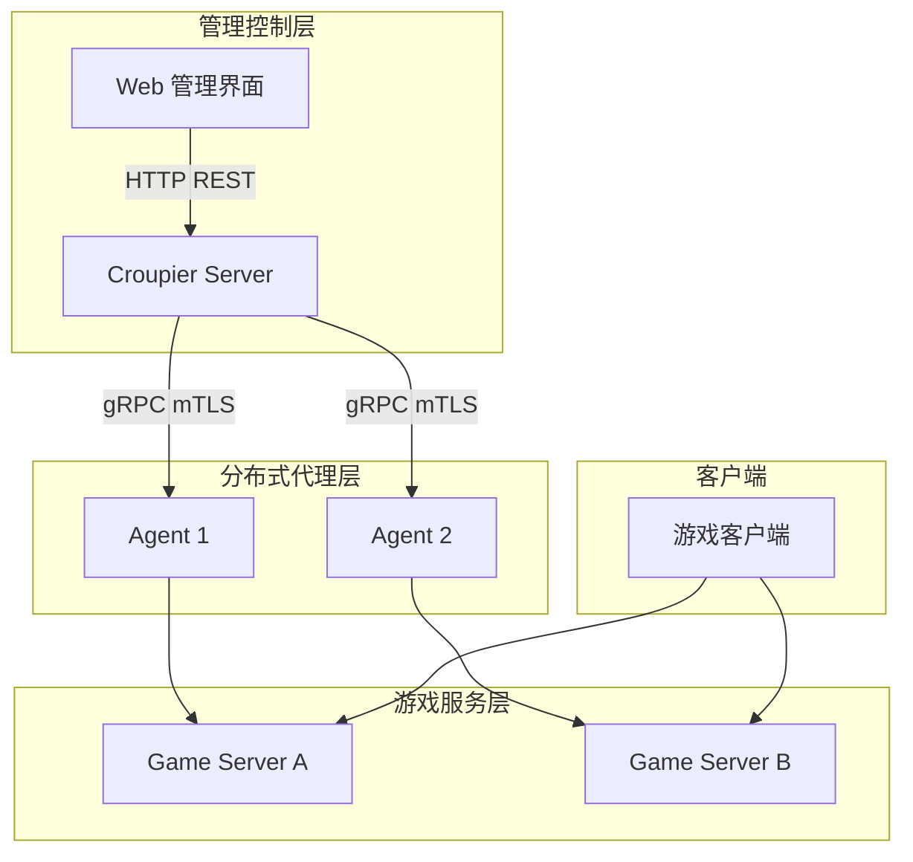

## 快速开始

::: tip 环境要求
- Go 1.25+
- Node.js 22+
- Docker (可选)
- CMake 3.20+ (C++ SDK)
:::

### 1. 克隆仓库

```bash
git clone https://github.com/cuihairu/croupier.git
cd croupier
git submodule update --init --recursive
```

### 2. 安装依赖并构建

```bash
# 安装依赖
go mod download

# 生成协议代码
make proto

# 构建所有组件
make build
```

### 3. 运行服务

```bash
# 启动 Server
./bin/croupier-server --config configs/server.example.yaml

# 启动 Agent
./bin/croupier-agent --config configs/agent.example.yaml
```

## 项目结构

```
croupier/
├── cmd/                 # 程序入口
├── proto/               # Protobuf 定义
├── internal/            # 内部实现
│   ├── server/          # 服务端核心逻辑
│   ├── agent/           # 代理实现
│   └── auth/            # 认证授权
├── sdks/                # 多语言 SDK
│   ├── go/
│   ├── cpp/
│   ├── java/
│   ├── js/
│   └── python/
├── dashboard/           # Web 管理界面
├── configs/             # 配置文件
├── examples/            # 示例代码
└── docs/                # 项目文档
```

## 系统架构



## 核心组件

| 组件 | 说明 | 仓库 |
|------|------|------|
| Server | 中央控制平面（HTTP + gRPC） | [cuihairu/croupier](https://github.com/cuihairu/croupier) |
| Agent | 分布式代理进程 | [cuihairu/croupier](https://github.com/cuihairu/croupier) |
| Edge | DMZ/边缘代理 | [cuihairu/croupier](https://github.com/cuihairu/croupier) |
| Dashboard | Web 管理界面 | [cuihairu/croupier-dashboard](https://github.com/cuihairu/croupier-dashboard) |

## 相关链接

- [GitHub 仓库](https://github.com/cuihairu/croupier)
- [问题跟踪](https://github.com/cuihairu/croupier/issues)
- [更新日志](https://github.com/cuihairu/croupier/releases)
