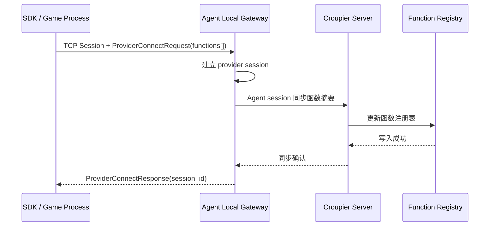
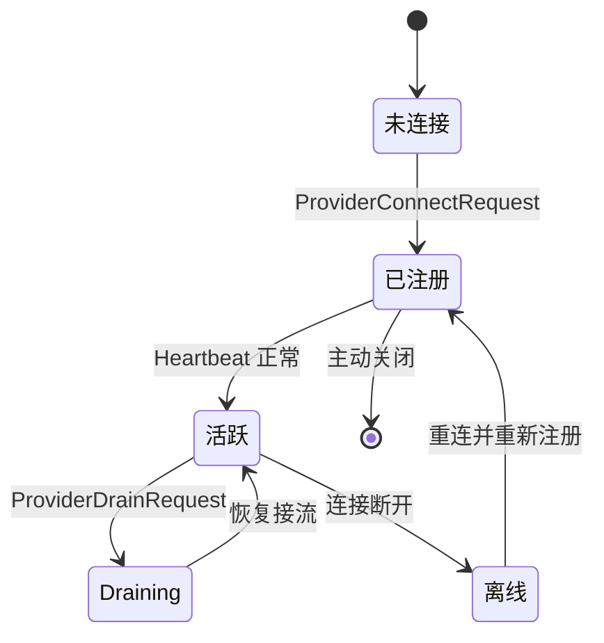

# 函数管理

Croupier 的核心模型仍然是“函数注册驱动”，但注册与调用链路已经收敛到统一 session 设计。

## 什么是函数

函数是平台上最小的可执行业务单元，通常包含：

- 唯一 `id`
- 版本 `version`
- 分类 `category`
- 资源 `entity`
- 操作语义 `operation` / `operationKind`
- 页面放置建议 `placement`
- 风险等级 `risk`
- 输入 `input_schema`
- 输出 `output_schema`

## 当前注册模型

当前注册模型采用 Provider Session 设计：

1. SDK 或本地进程主动连接 Agent 本地 gateway
2. 首帧发送 `ProviderConnectRequest`
3. 在 `functions[]` 中携带函数描述符
4. Agent 建立 provider session
5. Agent 再通过 `agent-server subprotocol` 将摘要同步到 Server



## 函数描述符

函数描述符应表达平台关心的通用字段，不应把治理字段藏到业务 payload 里。

典型字段：

```json
{
  "id": "player.ban",
  "version": "1.0.0",
  "category": "player",
  "risk": "high",
  "entity": "Player",
  "operation": "ban",
  "operationKind": "action",
  "placement": "rowAction",
  "tags": ["player", "moderation"],
  "summary": "封禁玩家",
  "description": "封禁指定玩家账号",
  "input_schema": {
    "type": "object",
    "properties": {
      "player_id": { "type": "string" },
      "duration": { "type": "integer" },
      "reason": { "type": "string" }
    },
    "required": ["player_id", "duration"]
  },
  "output_schema": {
    "type": "object",
    "properties": {
      "success": { "type": "boolean" },
      "ban_id": { "type": "string" }
    }
  }
}
```

**风险等级 (`risk`)：**

| 等级 | 说明 | 审批要求 | 允许角色 |
|------|------|----------|----------|
| `low` | 低风险操作 | 无需审批 | user, operator |
| `medium` | 中风险操作 | 无需审批，需审计 | operator |
| `high` | 高风险操作 | 单管理员审批 + 审计 | admin |
| `danger` | 危险操作 | 双人审批 + 审计 | super_admin |

函数注册时会根据风险等级自动创建对应的默认政策，也可以通过 API 覆盖。详见[权限控制](./permissions.md)文档。

## OpenAPI 与 JSON Schema

函数描述符可以吸收 OpenAPI 常见字段。OpenAPI 在这里是函数能力契约，不是 Dashboard 页面模型：

- 平台协议层：protobuf
- 业务 payload 层：UTF-8 JSON
- 参数和响应契约：JSON Schema / OpenAPI Schema
- 运行时函数表单：Formily Schema

这意味着 SDK 用户不需要先定义自己的 `.proto` 才能接入。

Server 根据 `input_schema`、OpenAPI request schema 或函数元信息生成单函数 Formily Schema 初稿。Dashboard 调用页只消费 `/api/v1/functions/:id/ui` 返回的 Formily Schema，不在运行时根据 JSON Schema 推断组件。

完整业务页面由 Page 工作台管理。Server 会先把函数归一化为 FunctionSpec / ResourceSpec / OperationSpec，再生成 PageSpec 建议。PageSpec 也是 Formily JSON Schema，负责分页、表格、详情、弹窗、任务状态和图表等页面级能力。

详见[函数注册与默认界面](./function-registration-ui.md)和[Dashboard Resource/Page 模型](../../architecture/dashboard-page-model.md)。

## 调用模型

函数注册完成后，调用同样复用既有 session：

- 同步调用
  - `InvokeRequest`
  - `InvokeResponse`
- 异步任务
  - `StartTaskRequest`
  - `StartTaskResponse`
  - `TaskEvent`
  - `CancelTaskRequest`

关键点：

- Agent 可以在同一条 session 上主动向 SDK 下发请求
- 不再依赖 Agent 回拨 SDK 本地地址

## 生命周期



## 设计边界

函数管理协议基于 Provider Session 设计：

- `ProviderConnectRequest` / `ProviderConnectResponse` - 建立会话并注册函数
- `ProviderHeartbeatRequest` / `ProviderHeartbeatResponse` - 会话保活
- `ProviderDrainRequest` / `ProviderDrainResponse` - 优雅关闭
- SDK 主动连接 Agent，携带函数描述符在 `functions[]` 中
- Agent 维护 provider session 并向 Server 同步函数摘要

## 最佳实践

1. 函数 ID 应稳定且可读，例如 `player.ban`
2. `summary`、`description`、`input_schema`、`output_schema` 建议补齐
3. 需要自动生成页面时必须补齐 `entity`、`operationKind` 和 `placement`
4. 需要动态菜单多语言时必须补齐分类、资源和页面 labels
5. 需要平台理解的字段必须放在协议层
6. 只属于具体业务的参数放到 JSON payload
7. 处理器应具备幂等与超时意识

## 相关文档

- [核心概念总览](./overview.md)
- [Page 工作台](./object-workspace.md)
- [函数注册与默认界面](./function-registration-ui.md)
- [Dashboard Resource/Page 模型](../../architecture/dashboard-page-model.md)
- [OpenAPI 函数注册](../integrations/openapi-registration.md)
- [SDK Wire Protocol](../../architecture/sdk-wire-protocol.md)
- [SDK 文档](../../sdks/)
