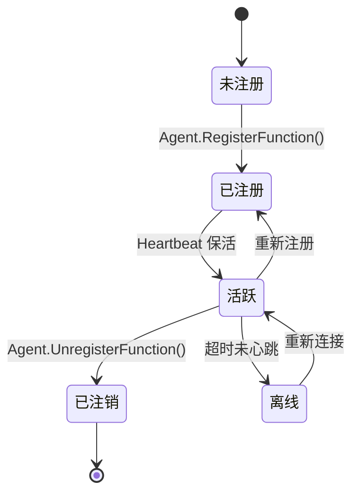
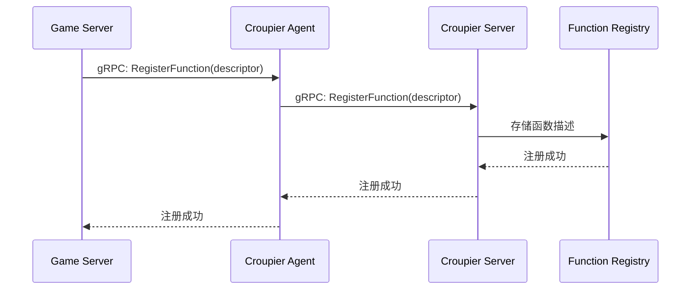
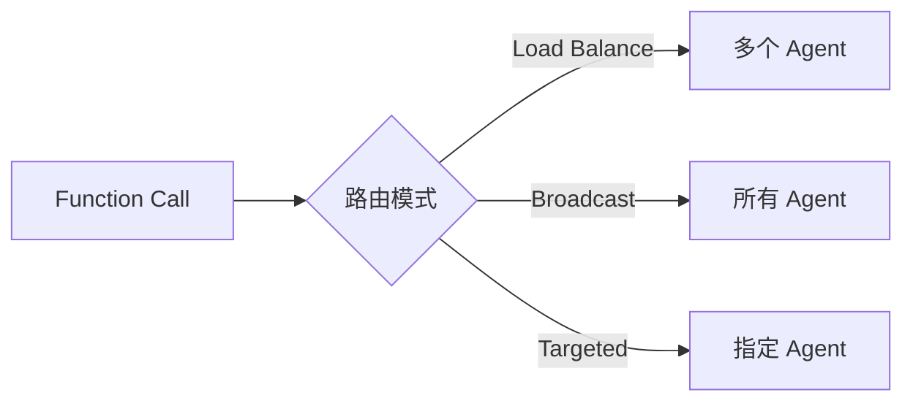

# 函数管理

Croupier 采用**函数注册驱动**的架构，游戏服务器通过 Agent 注册函数，控制面统一管理、路由和调用。

## 目录

[[toc]]

## 什么是函数

在 Croupier 中，**函数 (Function)** 是最小的可执行单元，代表一个具体的业务操作。

### 函数特性

| 特性 | 说明 |
|------|------|
| **自描述** | 通过 JSON Schema 描述输入输出 |
| **可发现** | 注册到控制面，可被查询和调用 |
| **可控制** | 支持权限、审批、限流等控制 |
| **可观测** | 调用记录审计日志 |

## 函数生命周期



## 函数描述符

函数通过 **描述符 (Descriptor)** 进行定义，包含完整的元数据。

### 完整描述符示例

```json
{
  "id": "player.ban",
  "name": "封禁玩家",
  "description": "封禁指定玩家账号",
  "category": "player",
  "version": "1.0.0",

  "params": {
    "type": "object",
    "properties": {
      "player_id": {
        "type": "string",
        "title": "玩家ID",
        "description": "要封禁的玩家唯一标识"
      },
      "duration": {
        "type": "integer",
        "title": "封禁时长（小时）",
        "minimum": 1,
        "maximum": 8760,
        "default": 24
      },
      "reason": {
        "type": "string",
        "title": "封禁原因",
        "minLength": 1,
        "maxLength": 500
      }
    },
    "required": ["player_id", "duration"]
  },

  "result": {
    "type": "object",
    "properties": {
      "success": {"type": "boolean"},
      "ban_id": {"type": "string"},
      "expires_at": {"type": "string", "format": "date-time"}
    }
  },

  "auth": {
    "permission": "player.ban",
    "approval": {
      "enabled": true,
      "threshold": 2
    }
  },

  "semantics": {
    "idempotent": false,
    "rate_limit": "10rps",
    "timeout": "30s"
  },

  "ui": {
    "risk_level": "high",
    "risk_warning": "高风险操作，封禁后玩家无法登录",
    "confirm_message": "确认封禁玩家 {player_id}？"
  }
}
```

## 函数注册

### 注册流程



### Go SDK 注册示例

```go
package main

import (
    "context"
    "github.com/cuihairu/croupier-sdk-go/client"
)

func main() {
    // 创建 Agent 客户端
    agent := client.NewAgent(client.Config{
        ServerAddr: "localhost:19090",
        GameID:     "my-game",
        Env:        "dev",
    })

    // 注册函数
    err := agent.RegisterFunction(context.Background(), &client.FunctionDescriptor{
        ID:          "player.ban",
        Name:        "封禁玩家",
        Category:    "player",
        Handler:     BanPlayer,
        ParamsSchema: paramsSchema,
        ResultSchema: resultSchema,
    })
    if err != nil {
        panic(err)
    }
}

func BanPlayer(ctx context.Context, input map[string]interface{}) (map[string]interface{}, error) {
    // 函数实现
    playerID := input["player_id"].(string)
    duration := int(input["duration"].(float64))

    // 执行封禁逻辑...

    return map[string]interface{}{
        "success": true,
        "ban_id":  "ban_123",
    }, nil
}
```

### C++ SDK 注册示例

```cpp
#include <croupier/sdk/client.h>

using namespace croupier;

class BanPlayerFunction : public Function {
public:
    Descriptor GetDescriptor() const override {
        return Descriptor{}
            .set_id("player.ban")
            .set_name("封禁玩家")
            .set_category("player");
    }

    Result Call(const Context& ctx, const nlohmann::json& params) override {
        std::string player_id = params["player_id"];
        int duration = params["duration"];

        // 执行封禁逻辑...

        return Result{
            {"success", true},
            {"ban_id", "ban_123"}
        };
    }
};

int main() {
    AgentClient agent(AgentConfig{}
        .set_server_addr("localhost:19090")
        .set_game_id("my-game")
        .set_env("dev"));

    agent.RegisterFunction(std::make_unique<BanPlayerFunction>());
    agent.Run();
}
```

## 函数调用

### 同步调用

```bash
curl -X POST http://localhost:18780/api/invoke \
  -H "Content-Type: application/json" \
  -H "Authorization: Bearer $TOKEN" \
  -H "X-Game-ID: my-game" \
  -H "X-Env: dev" \
  -d '{
    "function_id": "player.ban",
    "payload": {
      "player_id": "player_123",
      "duration": 24,
      "reason": "作弊"
    }
  }'
```

### 异步调用（作业）

```bash
curl -X POST http://localhost:18780/api/jobs \
  -H "Content-Type: application/json" \
  -H "Authorization: Bearer $TOKEN" \
  -d '{
    "function_id": "player.ban",
    "payload": {...}
  }'
```

### 作业事件流

```bash
# 获取作业状态
curl http://localhost:18780/api/jobs/{job_id}

# 流式获取事件
curl http://localhost:18780/api/jobs/{job_id}/events
```

## 函数路由

### 负载均衡策略

Server 支持多种负载均衡策略：

| 策略 | 说明 | 适用场景 |
|------|------|----------|
| **Round Robin** | 轮询 | 请求均匀分布 |
| **Consistent Hash** | 一致性哈希 | 需要会话亲和 |
| **Least Connection** | 最少连接 | 动态负载 |
| **Targeted** | 指定 Agent | 调试和测试 |

### 路由模式



## 函数控制

### 权限控制

```json
{
  "auth": {
    "permission": "player.ban",
    "allow_if": "has_role('admin') || has_role('gm')"
  }
}
```

### 审批流程

```json
{
  "auth": {
    "approval": {
      "enabled": true,
      "threshold": 2,
      "approvers": ["admin", "senior_gm"]
    }
  }
}
```

### 限流

```json
{
  "semantics": {
    "rate_limit": "10rps",
    "concurrency": 5
  }
}
```

## 函数包

函数可以打包成 `.tgz` 文件进行分发。

### 包结构

```
player-management-1.0.0.tgz
├── manifest.json
└── descriptors/
    ├── player.entity.json
    ├── player.resource.json
    ├── player.register.json
    ├── player.get.json
    ├── player.ban.json
    └── player.list.json
```

## 最佳实践

### 1. 函数命名

```
{entity}.{operation}

示例：
- player.register
- player.ban
- item.create
- item.delete
- guild.disband
```

### 2. 参数验证

```json
{
  "params": {
    "type": "object",
    "properties": {
      "player_id": {
        "type": "string",
        "pattern": "^[a-zA-Z0-9_]{3,32}$"
      },
      "duration": {
        "type": "integer",
        "minimum": 1,
        "maximum": 8760
      }
    },
    "required": ["player_id", "duration"]
  }
}
```

### 3. 错误处理

```go
return map[string]interface{}{
    "success": false,
    "error": {
        "code": "PLAYER_NOT_FOUND",
        "message": "玩家不存在",
        "details": {"player_id": playerID}
    }
}, nil
```

### 4. 幂等性

```json
{
  "semantics": {
    "idempotent": true,
    "idempotency_key": "player_id"
  }
}
```

## 相关文档

- [虚拟对象系统](./virtual-objects.md)
- [权限控制](./permissions.md)
- [gRPC API](../../api/grpc.md)
- [REST API](../../api/rest.md)
