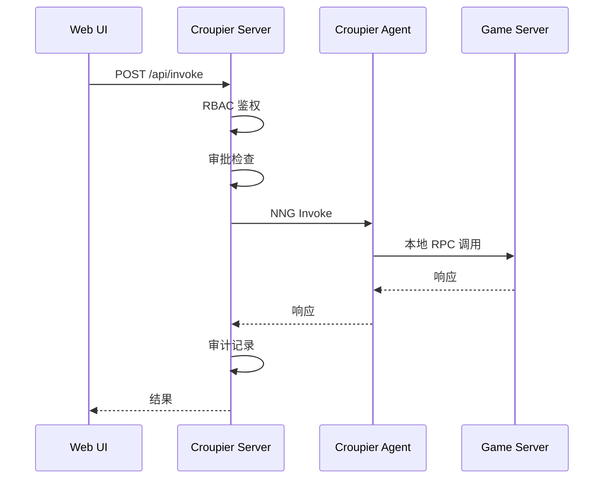

# 系统概览

Croupier 是一个现代化的**三层分布式 GM 后台系统**，专为游戏运营和管理而设计。

## 设计理念

### 三层架构

```
┌────────────────────────────────────────────────────────────┐
│                    可观测展示层                            │
│  描述符驱动 UI · 风控提示 · 敏感字段脱敏 · 进度追踪        │
└────────────────────────────────────────────────────────────┘
                              │
                              ▼
┌────────────────────────────────────────────────────────────┐
│                    函数控制层                              │
│  函数注册 · 调用路由 · 幂等处理 · 负载均衡                │
└────────────────────────────────────────────────────────────┘
                              │
                              ▼
┌────────────────────────────────────────────────────────────┐
│                    权限控制层                              │
│  RBAC/ABAC · 操作审批 · 审计日志 · 风控策略                │
└────────────────────────────────────────────────────────────┘
```

### 核心特性

| 特性 | 说明 |
|------|------|
| **零信任安全** | gRPC+mTLS、细粒度 RBAC/ABAC、操作审批与审计日志 |
| **函数注册驱动** | 游戏服务器通过 Agent 注册函数，控制面统一管理 |
| **Schema 驱动 UI** | Formily + JSON Schema 自动生成表单和界面 |
| **可观测性解耦** | 控制面与遥测面分离，支持实时事件处理 |
| **多语言 SDK** | Go / C++ / Java / JS / Python 全覆盖 |
| **协议优先** | 所有 API 通过 Protocol Buffers 定义 |

## 系统组件

### Server（控制平面）

中央控制平面，负责权限控制、函数路由和协调。

- **端口**: NNG 8443 (mTLS), HTTP 8080 (REST)
- **职责**:
  - Agent 注册与连接管理
  - 函数调用路由与负载均衡
  - RBAC/ABAC 权限校验
  - 审计日志记录
  - 操作审批工作流

### Agent（分布式代理）

部署在游戏内网的代理进程，负责游戏服务器与控制平面的通信。

- **端口**: NNG 19090 (本地监听)
- **职责**:
  - 连接 Server 并保持长连接
  - 注册游戏服务器函数
  - 转发函数调用请求
  - 执行异步作业
  - 支持双向隧道

### Dashboard（管理界面）

基于 React + Ant Design 的 Web 管理界面。

- **技术栈**: Umi Max + Ant Design + Formily
- **职责**:
  - 函数调用可视化
  - 审批流程管理
  - 实时日志查看
  - 权限配置界面

## 数据流模式

### 标准调用流程



## 虚拟对象系统

Croupier 采用**四层虚拟对象模型**：

### 1. Function（函数）

具体的业务操作实现。

```json
{
  "id": "player.ban",
  "name": "封禁玩家",
  "params": {
    "type": "object",
    "properties": {
      "player_id": {"type": "string"},
      "duration": {"type": "integer"}
    }
  }
}
```

### 2. Entity（实体）

业务对象的完整描述。

```json
{
  "id": "player",
  "name": "玩家",
  "schema": { /* JSON Schema */ },
  "operations": {
    "create": "player.register",
    "read": "player.get",
    "update": "player.update",
    "delete": "player.ban"
  }
}
```

### 3. Resource（资源）

UI 层面的操作集合。

```json
{
  "id": "player.resource",
  "type": "pro-table",
  "columns": [ /* 列定义 */ ],
  "actions": ["create", "edit", "delete"]
}
```

### 4. Component（组件）

功能模块的打包单位。

```json
{
  "id": "player-management",
  "functions": ["player.*"],
  "entities": ["player"],
  "resources": ["player.resource"]
}
```

## 安全模型

### RBAC/ABAC 权限控制

- **RBAC**: 基于角色的访问控制
- **ABAC**: 基于属性的访问控制
- **审批工作流**: 高风险操作需要双人审批
- **审计链**: 所有操作可追溯、防篡改

### mTLS 通信

- 服务间强制使用 mTLS
- 支持自定义 CA 签名
- 证书自动轮换（可选）

## 关键概念

| 概念 | 说明 |
|------|------|
| **Game ID** | 游戏标识，用于租户隔离 |
| **Env** | 环境标识（dev/staging/prod） |
| **Function ID** | 函数唯一标识 |
| **Idempotency Key** | 幂等键，防止重复执行 |
| **Job ID** | 异步作业标识 |
| **Pack** | 函数打包文件 (.tgz) |

## 相关文档

- [虚拟对象设计](../concepts/virtual-objects.md)
- [函数管理](../concepts/function-management.md)
- [权限控制](../concepts/permissions.md)
- [系统架构](../../architecture/README.md)
