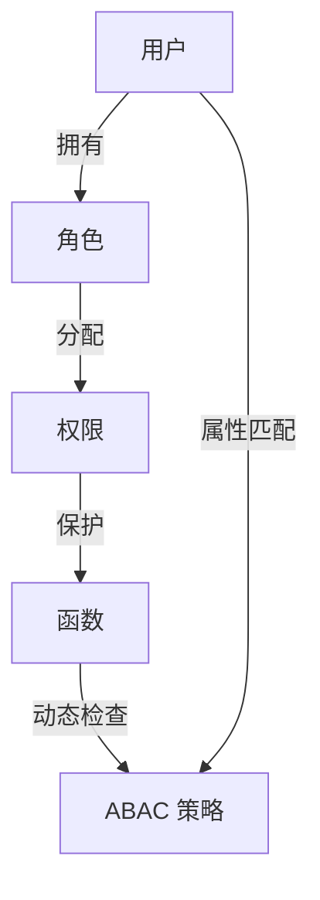
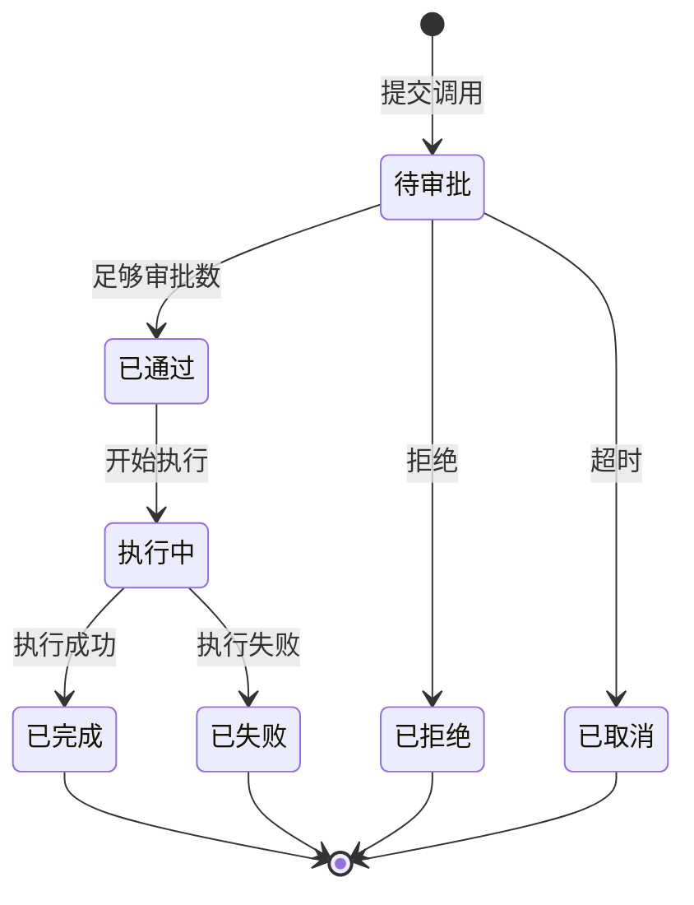

# 权限控制

Croupier 实现**零信任安全**模型，提供 RBAC/ABAC 混合权限控制、操作审批和完整审计链。

## 目录

[[toc]]

## 权限模型

### 整体架构



### RBAC 模型

RBAC (Role-Based Access Control) 基于角色的访问控制。

```
用户 (User)
  ↓ 拥有
角色 (Role)
  ↓ 分配
权限 (Permission)
  ↓ 保护
函数 (Function)
```

### ABAC 模型

ABAC (Attribute-Based Access Control) 基于属性的访问控制。

```javascript
// 评估表达式
user.roles.includes("admin") || (gameId === "my-game" && env === "dev");
```

## 用户和角色

### 用户定义

```json
{
  "user_id": "user_123",
  "username": "admin",
  "email": "admin@example.com",
  "roles": ["admin", "operator"],
  "attributes": {
    "department": "operations",
    "level": 5
  }
}
```

### 角色定义

```json
{
  "role_id": "admin",
  "name": "管理员",
  "permissions": [
    "*.*"  // 所有权限
  ]
}

{
  "role_id": "gm",
  "name": "游戏管理员",
  "permissions": [
    "player.*",
    "item.*",
    "guild.*"
  ]
}

{
  "role_id": "viewer",
  "name": "查看者",
  "permissions": [
    "player.view",
    "item.view"
  ]
}
```

## 权限定义

### 权限格式

```
{entity}.{operation}

示例：
- player.ban      # 封禁玩家
- player.view     # 查看玩家
- item.create     # 创建物品
- item.delete     # 删除物品
- *.*             # 所有权限（谨慎使用）
```

### 游戏作用域

权限可以限定到特定游戏：

```
game:{gameId}:{permission}

示例：
- game:my-game:player.ban    # 仅 my-game 的封禁权限
- game:test-game:*.*         # test-game 的所有权限
```

在实际请求中，Croupier 还会结合 `env` 做环境级治理，因此完整业务边界通常是 `gameId + env`（proto/DB 层为 `game_id`）。

## 函数权限配置

### 基础权限

```json
{
  "id": "player.ban",
  "auth": {
    "permission": "player.ban"
  }
}
```

### ABAC 表达式

```json
{
  "id": "player.ban",
  "auth": {
    "permission": "player.ban",
    "allow_if": "has_role('admin') || has_role('senior_gm')"
  }
}
```

### 可用表达式

| 函数                   | 说明     | 示例                                    |
| ---------------------- | -------- | --------------------------------------- |
| `has_role(role)`       | 检查角色 | `has_role('admin')`                     |
| `has_permission(perm)` | 检查权限 | `has_permission('player.view')`         |
| `==`                   | 等于     | `env == 'prod'`                         |
| `!=`                   | 不等于   | `env != 'dev'`                          |
| `&&`                   | 逻辑与   | `has_role('admin') && env == 'prod'`    |
| `\|\|`                 | 逻辑或   | `has_role('admin') \|\| has_role('gm')` |
| `()`                   | 分组     | `(a \|\| b) && c`                       |

### 可用变量

| 变量          | 类型   | 说明                        |
| ------------- | ------ | --------------------------- |
| `user`        | object | 当前用户信息                |
| `user.roles`  | array  | 用户角色列表                |
| `gameId`      | string | 目标游戏 ID                 |
| `env`         | string | 逻辑环境 (dev/staging/prod) |
| `functionId`  | string | 被调用的函数 ID             |

## 审批流程

### 双人规则

高风险操作需要双人审批：

```json
{
  "id": "player.ban",
  "auth": {
    "permission": "player.ban",
    "two_person_rule": true,
    "approval": {
      "enabled": true,
      "threshold": 2 // 需要两人审批
    }
  }
}
```

### 审批流程



### 审批 API

```bash
# 创建审批请求
POST /api/approvals
{
  "function_id": "player.ban",
  "payload": {...},
  "reason": "玩家使用外挂"
}

# 获取待审批列表
GET /api/approvals?state=pending

# 审批通过
POST /api/approvals/{id}/approve

# 审批拒绝
POST /api/approvals/{id}/reject
{
  "reason": "证据不足"
}
```

## 审计日志

### 审计事件

所有操作都会记录审计日志：

```json
{
  "audit_id": "audit_20241201_001",
  "timestamp": "2024-12-01T10:30:00Z",
  "user": {
    "user_id": "user_123",
    "username": "admin"
  },
  "action": "function.invoke",
  "game_id": "my-game",
  "env": "prod",
  "function_id": "player.ban",
  "payload_preview": {
    "player_id": "***",
    "duration": 24
  },
  "result": "success",
  "approval_id": "approval_123",
  "ip": "192.168.1.100",
  "ip_region": "中国 上海"
}
```

### 敏感字段脱敏

```yaml
# 配置脱敏字段
server:
  audit:
    sensitive_fields:
      - "password"
      - "token"
      - "secret"
      - "api_key"
```

### 审计链防篡改

每条审计记录包含哈希值：

```json
{
  "audit_id": "audit_001",
  "hash": "sha256(prev_hash + content)",
  "prev_hash": "sha256(...)"
}
```

## 风险等级

### 风险分级

| 等级     | 说明   | 审批要求     | 审计要求 | 允许角色       |
| -------- | ------ | ------------ | -------- | -------------- |
| `low`    | 低风险 | 无需审批     | 无需审计 | user, operator |
| `medium` | 中风险 | 无需审批     | 需要审计 | operator       |
| `high`   | 高风险 | 单管理员审批 | 需要审计 | admin          |
| `danger` | 危险   | 双人审批     | 需要审计 | super_admin    |

### 双层政策架构

Croupier 采用**双层政策架构**，结合配置文件默认策略和数据库覆盖策略：

```
┌─────────────────────────────────────────────────────────────┐
│                    函数调用请求                               │
└─────────────────────────────────────────────────────────────┘
                            │
                            ▼
┌─────────────────────────────────────────────────────────────┐
│  1. 检查数据库覆盖政策 (FunctionPolicy)                       │
│     ├─ 存在覆盖？使用覆盖政策                                │
│     └─ 不存在？使用默认风险等级政策                          │
└─────────────────────────────────────────────────────────────┘
                            │
                            ▼
┌─────────────────────────────────────────────────────────────┐
│  2. 应用政策检查                                              │
│     ├─ 角色权限检查 (AllowedRoles)                           │
│     ├─ 审批要求检查 (RequireApproval)                        │
│     └─ 审计要求检查 (RequireAudit)                           │
└─────────────────────────────────────────────────────────────┘
                            │
                            ▼
┌─────────────────────────────────────────────────────────────┐
│  3. 执行后续操作                                              │
│     ├─ 需要审批？创建审批请求                                 │
│     ├─ 需要审计？记录审计日志                                 │
│     └─ 满足条件？执行函数调用                                 │
└─────────────────────────────────────────────────────────────┘
```

**政策来源：**

| 来源      | 说明                                            | 优先级 | 修改方式      |
| --------- | ----------------------------------------------- | ------ | ------------- |
| `default` | 来自 `configs/default-policies.yaml` 的默认政策 | 低     | 修改配置文件  |
| `manual`  | 数据库中的覆盖政策                              | 高     | API 设置/删除 |

**默认政策配置** (`configs/default-policies.yaml`):

```yaml
low:
  require_approval: false
  require_audit: false
  allowed_roles: [user, operator]

medium:
  require_approval: false
  require_audit: true
  allowed_roles: [operator]

high:
  require_approval: true
  approval_workflow: single_admin
  require_audit: true
  allowed_roles: [admin]

danger:
  require_approval: true
  approval_workflow: two_person
  require_audit: true
  allowed_roles: [super_admin]
```

### 风险配置

```json
{
  "id": "player.ban",
  "ui": {
    "risk_level": "high",
    "risk_warning": "高风险操作，封禁后玩家无法登录",
    "confirm_message": "确认封禁玩家？"
  }
}
```

### 政策管理 API

```bash
# 获取函数有效政策
GET /api/v1/functions/:function_id/policy?risk_level=high

# 设置函数覆盖政策
PUT /api/v1/functions/:function_id/policy
{
  "require_approval": true,
  "approval_workflow": "single_admin",
  "require_audit": true,
  "allowed_roles": ["admin"]
}

# 删除函数覆盖政策（恢复默认）
DELETE /api/v1/functions/:function_id/policy

# 获取所有覆盖政策
GET /api/v1/policies/overrides

# 获取默认政策配置
GET /api/v1/policies/defaults

# 重新加载默认政策配置
POST /api/v1/policies/reload
```

### 自动政策创建

函数注册时，系统会自动根据函数的风险等级创建默认政策：

```
函数注册 → 读取 risk_level 字段 → 创建 FunctionPolicy 记录
```

如果函数未指定风险等级，默认使用 `medium` 级别。

## 限流保护

### 函数级限流

```json
{
  "id": "player.ban",
  "semantics": {
    "rate_limit": "10rps",
    "concurrency": 5
  }
}
```

### 用户级限流

```json
{
  "semantics": {
    "user_rate_limit": "5rps",
    "user_burst": 10
  }
}
```

## 最佳实践

### 1. 最小权限原则

```json
// ❌ 不推荐：过度授权
{
  "roles": ["admin"]  // 拥有所有权限
}

// ✅ 推荐：按需授权
{
  "roles": ["gm"],  // 仅游戏管理权限
  "permissions": ["player.ban", "player.view"]
}
```

### 2. 环境隔离

```json
{
  "auth": {
    "allow_if": "env == 'dev' || has_role('admin')"
  }
}
```

### 3. 审批配置

```json
{
  "auth": {
    "approval": {
      "enabled": true,
      "threshold": "has_role('admin') ? 1 : 2",
      "approvers": ["admin", "senior_gm"],
      "timeout": "24h"
    }
  }
}
```

### 4. 审计保留

```yaml
server:
  audit:
    enabled: true
    retention_days: 365
    backup_enabled: true
```

## 相关文档

- [函数管理](./function-management.md)
- [配置管理](../../operations/config-server.md)
- [安全配置](../../operations/security.md)
