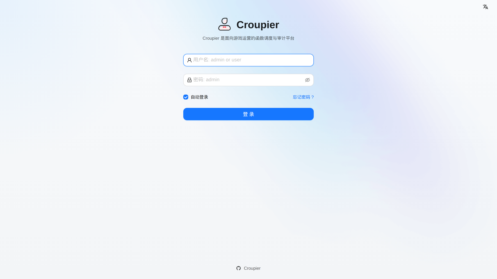
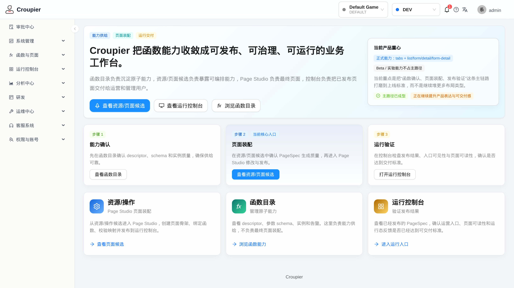
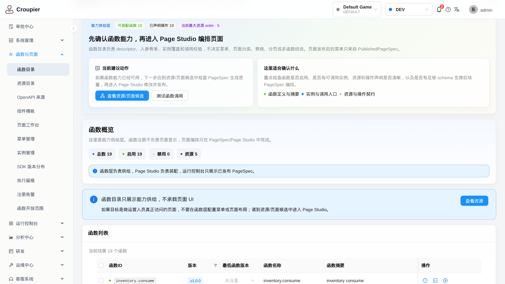
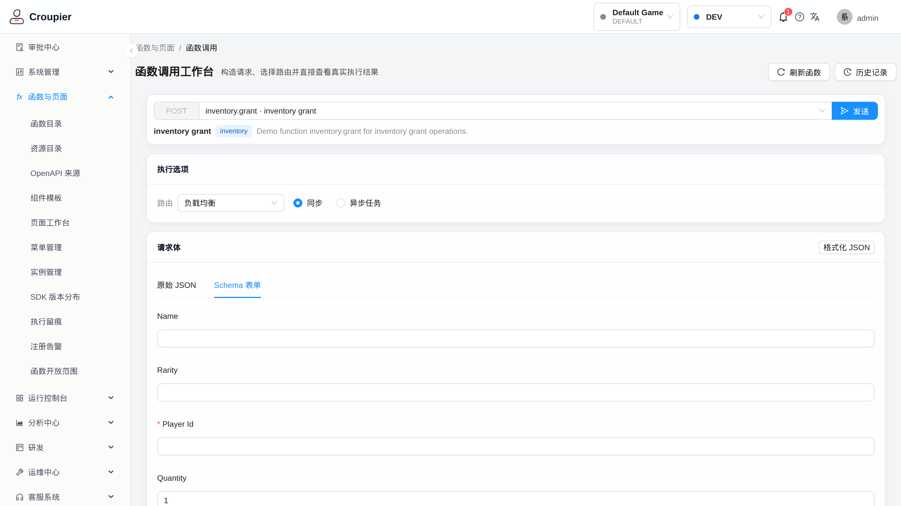
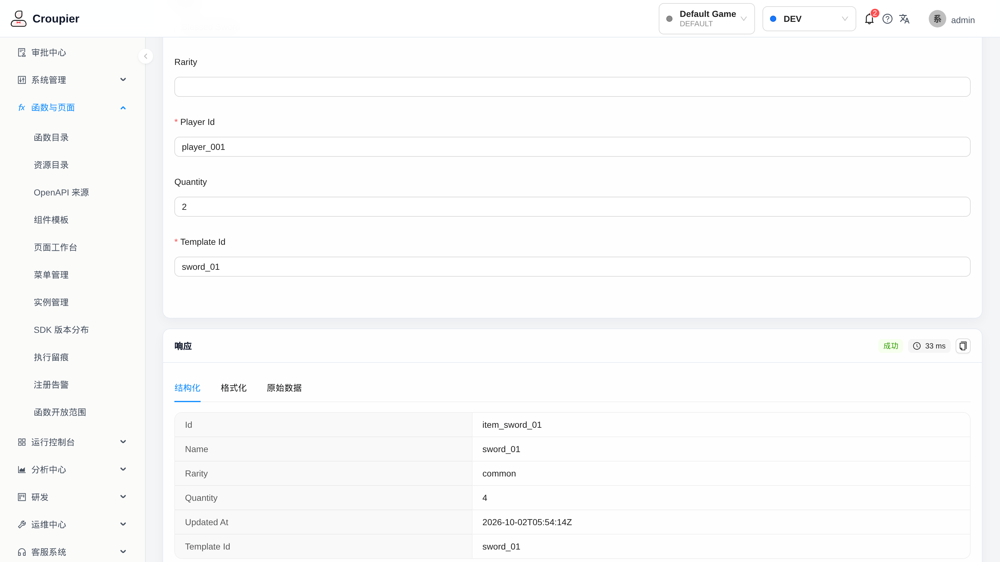
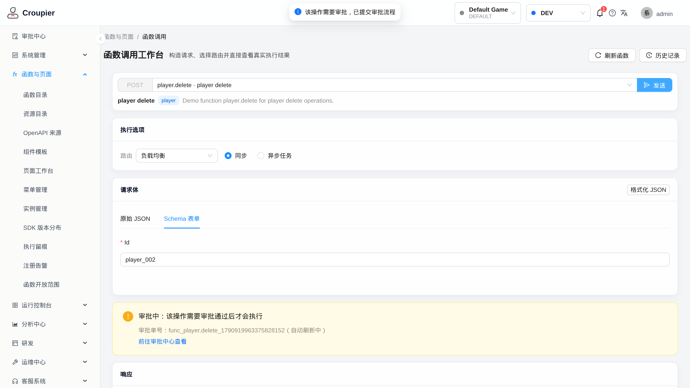
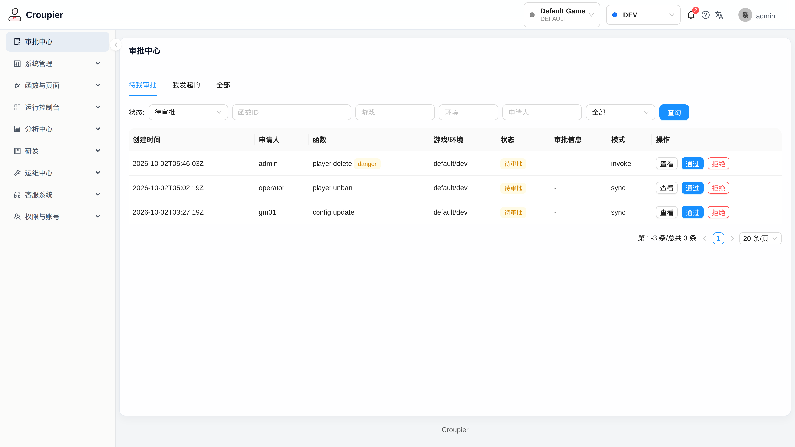
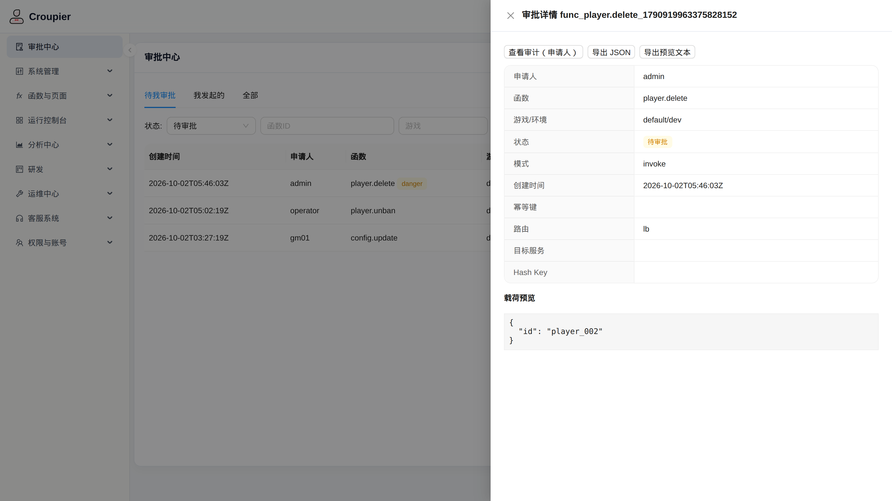
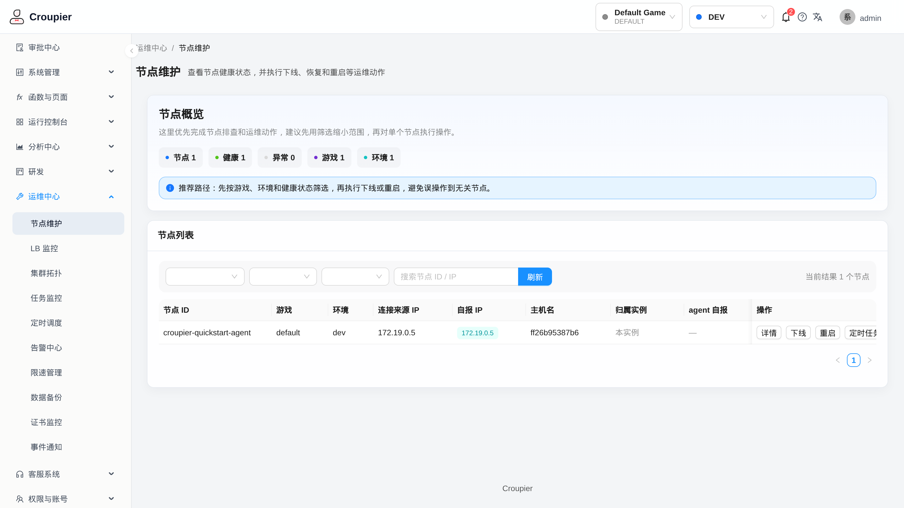
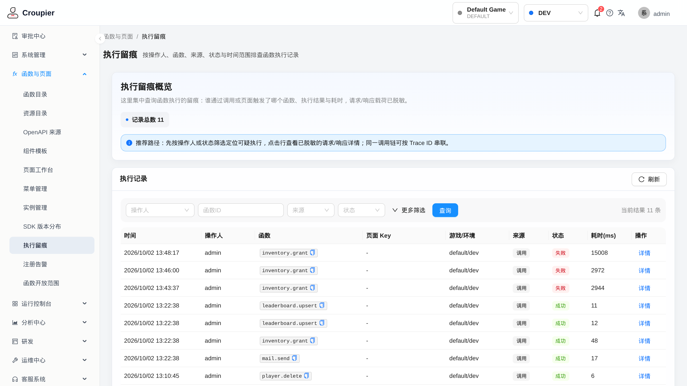

# 界面预览

以下截图均来自**真实运行的 Croupier 栈**（docker compose 快速启动栈，详见[快速开始](./quick-start)），非设计稿或效果图。

截图环境口径：

- 游戏/环境：`default` / `dev`，函数为 SDK 示例 demo 服务注册的 19 个函数
- 数据为演示数据；审批列表中的部分条目来自产品内置的演示审批种子（dev 模式自动播种，仅存内存，重启重建）
- 主题：**生产构建固定亮色主题**（暗色主题切换抽屉仅在 dev 模式提供，线上形态即下图所示）

## 登录

统一登录入口。管理员账号来源见[安装](./installation)（首次启动日志中的引导账号，quickstart 演示栈为 `admin`）。

## 控制台工作台

登录后的工作台首页：左侧为权限裁剪后的功能导航，主页汇总能力供给、页面装配与运行交付三条链路的入口状态。右上角为全局游戏/环境切换器，所有页面数据随 scope 联动。

## 函数目录（能力供给层）

函数目录是能力供给层：展示已注册函数的 descriptor、启停状态、实例覆盖与调用入口，不承载页面 UI——面向运营人员的页面在 Page Studio 中基于 PageSpec 装配发布。图中为示例 demo 注册的 19 个函数、5 个资源。

## 函数执行

Schema 表单由函数 descriptor 的 `inputSchema` 自动生成，含必填校验与枚举约束，无需为每个函数手写界面：

提交后即时返回结构化结果（可切换格式化 / 原始 JSON 视图），并附路由与耗时信息：

## 高危操作审批流

声明了审批策略的高危函数（图中 `player.delete`，danger 级）提交后**不会直接执行**——调用方收到审批单号，操作进入审批中心走两人复核：

审批中心按「待我审批 / 我已审批 / 全部」分页签展示，高危项带风险标识与来源（invoke 调用 / 页面触发）：

审批详情展示申请人、目标函数、游戏/环境、路由模式与脱敏后的载荷预览，支持通过 / 拒绝并落审计链：

## 运维 · 节点维护

运维中心提供 agent 节点的健康状态、注册函数数、连接信息与下线/重启操作，多游戏多环境按 scope 过滤：

## 执行留痕

每次函数调用（无论来自控制台、页面还是 SDK/API）都落执行留痕：操作人、函数、来源、状态与耗时，请求/响应载荷已脱敏，可按 Trace ID 串联同一次调用链：

