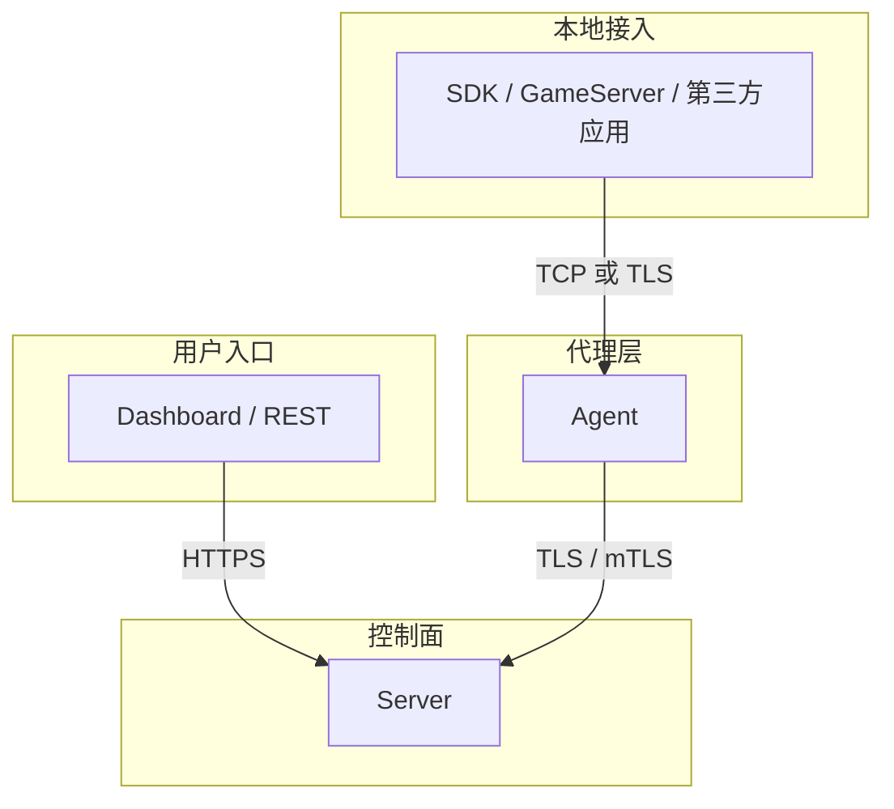

# 安全配置

本文档描述当前 session 架构下的安全边界与推荐配置。

## 安全边界



## 默认策略

### `Agent <-> Server`

- 默认启用 TLS
- 生产环境推荐 mTLS
- `19090` 应视为内部控制面端口

### `SDK <-> Agent`

- 默认可不开启 TLS
- 跨主机、跨网段或零信任环境时启用 TLS
- 是否启用 TLS 取决于部署边界，而不是协议本身要求

## 配置示例

### Server

`configs/server.yaml`：

```yaml
control:
  addr: ":19090"
  cert: "/etc/croupier/server.crt"
  key: "/etc/croupier/server.key"
  ca: "/etc/croupier/ca.crt"
```

### Agent 上行到 Server

`configs/agent.yaml`：

```yaml
server:
  addr: "server.example.com:19090"
  insecure: false
  serverName: "server.example.com"
  insecureSkipVerify: false
  tlsCertFile: "/etc/croupier/agent.crt"
  tlsKeyFile: "/etc/croupier/agent.key"
  caFile: "/etc/croupier/ca.crt"
```

### Agent 本地 gateway TLS

`configs/agent.yaml`：

```yaml
tls:
  enabled: true
  certFile: "/etc/croupier/agent-local.crt"
  keyFile: "/etc/croupier/agent-local.key"
  caFile: "/etc/croupier/ca.crt"
  insecureSkipVerify: false
```

## 证书建议

- 同一控制域可使用统一内部 CA
- `Agent <-> Server` 推荐双向证书校验
- `SDK <-> Agent` 若启用 TLS，可按需要决定是否要求客户端证书

## 防火墙建议

至少明确区分以下端口边界：

```bash
# REST / Dashboard
ufw allow 18780/tcp

# Agent -> Server session/control
ufw allow 19090/tcp

# SDK / GameServer -> Agent local gateway
ufw allow 19091/tcp
```

如果部署里仍保留历史兼容端口，应按过渡资产管理，避免把它们写成新的基线。

## 认证与授权

除了 TLS，还应继续保留：

- JWT / OIDC 鉴权
- RBAC / ABAC 授权
- 审计日志
- 高风险操作审批

TLS 只解决“谁在和谁通信”，不替代平台级权限控制。

## 最佳实践

1. 生产环境的 `Agent <-> Server` 默认启用 mTLS
2. `SDK <-> Agent` 根据网络边界决定是否启用 TLS
3. 不要把 `insecureSkipVerify` 带到生产环境
4. 证书、JWT secret、数据库凭据统一由 Secret Manager 管理
5. 审计日志与敏感字段脱敏必须持续开启

## 明确不再推荐的旧模型

- 把内部控制链路继续写成 `gRPC`
- 把 `19090` 写成 `控制链路` 固定语义
- 让 SDK 开本地端口给 Agent 回拨
- 使用 `rpc_addr` 作为长期运行时依赖
