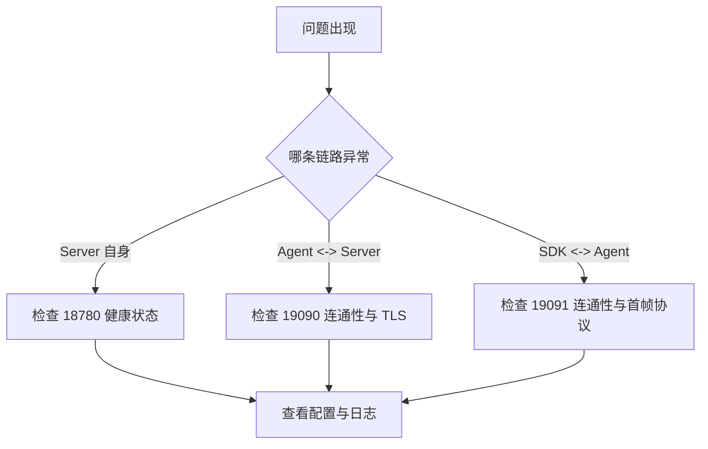

# 故障排查指南

本文档聚焦当前 session 架构下最常见的排障路径。

## 关键端口

- `18780`: Server REST API
- `19090`: Server session/control 入口
- `19091`: Agent 本地 gateway

## 快速诊断



## Server 无法启动

### 检查配置

```bash
python3 -c "import yaml; yaml.safe_load(open('configs/server.yaml'))"
```

### 检查端口

```bash
lsof -i :18780
lsof -i :19090
```

### 检查健康状态

```bash
curl http://localhost:18780/healthz
```

## Agent 无法连接到 Server

### 检查 Server 是否在线

```bash
curl http://server:18780/healthz
nc -zv server 19090
```

### 检查 TLS

```bash
openssl s_client -connect server:19090 \
  -cert agent.crt \
  -key agent.key \
  -CAfile ca.crt
```

### 常见原因

| 现象 | 原因 |
| --- | --- |
| `connection refused` | Server session/control 端口未监听 |
| TLS 握手失败 | 证书、CA、SNI 或 mTLS 配置错误 |
| 反复重连 | 目标地址错误、首帧校验失败、心跳超时 |

## SDK 无法连接到 Agent

### 检查本地 gateway

```bash
nc -zv 127.0.0.1 19091
```

### 关键确认项

- SDK 连接的是 `19091`，不是 `19090`
- SDK 首帧必须是 `ProviderConnectRequest`
- SDK 不应要求本地监听端口
- SDK 不应配置 `rpc_addr`

### 常见原因

| 现象 | 原因 |
| --- | --- |
| 建连后立即断开 | 首帧不是 `ProviderConnectRequest` 或 body 解码失败 |
| 连不上 Agent | 连接到了错误端口、Agent 未启动或 TLS 不匹配 |
| 断线后不恢复 | 重连策略未启用或 backoff 配置错误 |

## 调用失败

### 检查函数是否已注册

```bash
curl http://localhost:18780/api/v1/functions
curl http://localhost:18780/api/v1/functions/descriptors
```

### 检查调用超时

优先排查：

- SDK handler 是否阻塞
- `requestTimeoutMs` 是否过短
- session 是否处于 draining 状态
- Agent / Server 是否触发背压

## TLS 常见问题

### 证书不受信任

```text
x509: certificate signed by unknown authority
```

排查：

- `caFile` 是否指向正确 CA
- 客户端与服务端是否使用同一套信任链

### 主机名不匹配

```text
x509: certificate is not valid for any names
```

排查：

- `serverName` 是否与证书 SAN / CN 匹配
- 是否误把 IP 地址当成证书名使用

## 旧概念排查

如果你在日志、配置或文档中看到以下概念，优先怀疑走到了旧路径：

- `gRPC`
- `历史 REQ/REP`
- `LocalControlService`
- `RegisterLocal`
- `rpc_addr`
- SDK 本地监听

这些概念都不应再作为新的排障基线。
