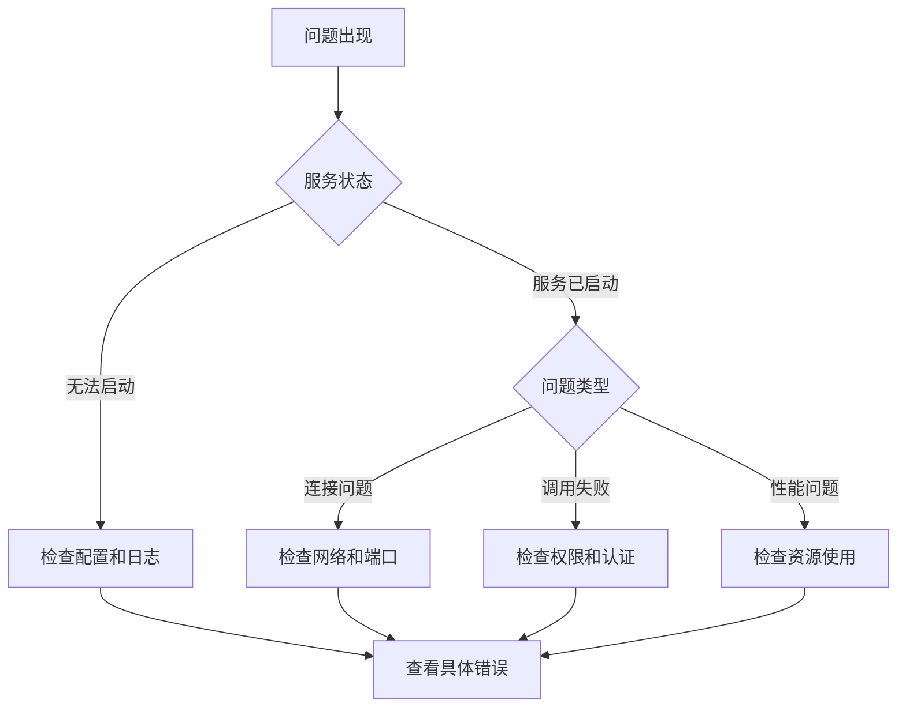

# 故障排查指南

本文档介绍 Croupier 常见问题的诊断和解决方法。

## 目录

[[toc]]

## 快速诊断流程



## 服务启动问题

### Server 无法启动

#### 症状

```bash
$ ./croupier-server --config configs/server.yaml
Error: failed to start server
```

#### 诊断步骤

1. **检查配置文件语法**

```bash
# 验证 YAML 语法
python3 -c "import yaml; yaml.safe_load(open('configs/server.yaml'))"

# 或使用 croupier 自带的配置验证
./croupier config test --config configs/server.yaml
```

2. **检查端口占用**

```bash
# 检查 gRPC 端口
lsof -i :8443

# 检查 HTTP 端口
lsof -i :8080

# 如果被占用，查看占用进程
netstat -tlnp | grep 8443
```

3. **检查 TLS 证书**

```bash
# 验证证书文件存在
ls -la data/server.crt data/server.key data/ca.crt

# 验证证书有效
openssl x509 -in data/server.crt -text -noout

# 验证证书与私钥匹配
openssl x509 -noout -modulus -in server.crt | openssl md5
openssl rsa -noout -modulus -in server.key | openssl md5
# 两个 MD5 值应该相同
```

#### 常见原因

| 错误信息 | 原因 | 解决方法 |
|---------|------|----------|
| `address already in use` | 端口被占用 | 关闭占用进程或修改配置端口 |
| `no such file or directory` | 证书文件不存在 | 生成或放置正确的证书文件 |
| `permission denied` | 没有文件访问权限 | 修改文件权限 |
| `invalid configuration` | YAML 配置错误 | 修复配置文件语法 |

### Agent 无法连接到 Server

#### 症状

```log
ERRO[0001] failed to connect to server: connection refused
```

#### 诊断步骤

1. **检查 Server 是否运行**

```bash
# 检查 Server 进程
ps aux | grep croupier-server

# 检查 Server 健康状态
curl http://server:8080/healthz
```

2. **检查网络连通性**

```bash
# 测试网络连接
telnet server 8443

# 或使用 nc
nc -zv server 8443
```

3. **检查 TLS 证书**

```bash
# 从 Agent 测试 Server TLS
openssl s_client -connect server:8443 \
  -cert data/agent.crt \
  -key data/agent.key \
  -CAfile data/ca.crt
```

4. **检查 Agent 配置**

```yaml
# agent.yaml
agent:
  server_addr: "server:8443"  # 确保地址正确
  tls:
    ca_file: "data/ca.crt"
    cert_file: "data/agent.crt"
    key_file: "data/agent.key"
    server_name: "server"  # 必须与证书 CN 匹配
```

## 函数调用问题

### 调用超时

#### 症状

```json
{
  "error": {
    "code": "DEADLINE_EXCEEDED",
    "message": "context deadline exceeded"
  }
}
```

#### 解决方法

1. **增加超时时间**

```json
{
  "function_id": "data.export",
  "options": {
    "timeout": 300  // 增加到 5 分钟
  }
}
```

2. **检查游戏服务器响应**

```bash
# 在 Agent 所在服务器检查
curl http://localhost:19090/healthz
```

3. **使用异步调用**

```bash
# 改为创建作业
POST /api/jobs
{
  "function_id": "data.export",
  "payload": {...}
}
```

### 权限被拒绝

#### 症状

```json
{
  "error": {
    "code": "PERMISSION_DENIED",
    "message": "没有权限执行该操作"
  }
}
```

#### 解决方法

1. **检查用户权限**

```bash
# 获取当前用户信息
GET /api/auth/me

# 响应包含用户权限
{
  "permissions": ["player.view", "item.view"]
}
```

2. **检查函数权限要求**

```bash
# 获取函数详情
GET /api/functions/player.ban

# 响应包含所需权限
{
  "auth": {
    "permission": "player.ban",
    "two_person_rule": true
  }
}
```

3. **添加权限或角色**

```json
// 通过用户管理界面或 API 添加权限
POST /api/users/{user_id}/roles
{
  "role_id": "gm"
}
```

### 函数未找到

#### 症状

```json
{
  "error": {
    "code": "NOT_FOUND",
    "message": "函数未注册"
  }
}
```

#### 解决方法

1. **检查函数是否注册**

```bash
# 列出所有函数
GET /api/functions?game_id=my-game&env=prod
```

2. **检查 Agent 状态**

```bash
# 列出所有 Agent
GET /api/agents?game_id=my-game&env=prod

# 检查 Agent 是否在线
{
  "status": "online",
  "functions": ["player.ban", "player.kick"]
}
```

3. **重新注册函数**

```bash
# 在游戏服务器端重启 SDK
# 或触发 Agent 重新注册
```

## 性能问题

### 高内存使用

#### 诊断

```bash
# 检查进程内存
top -p $(pgrep croupier-server)

# 或使用
ps aux | grep croupier-server
```

#### 解决方法

1. **调整日志配置**

```yaml
server:
  log:
    max_size: 50     # 减小日志文件大小
    max_backups: 2   # 减少备份数量
```

2. **配置内存限制**

```bash
# 使用 ulimit
ulimit -v 4194304  # 限制虚拟内存 4GB

# Docker 运行时限制
docker run -m 2g croupier-server
```

### 高 CPU 使用

#### 诊断

```bash
# 检查 CPU 使用
top -p $(pgrep croupier-server)

# 生成 CPU profile
curl http://localhost:8080/debug/pprof/profile > cpu.prof
```

#### 解决方法

1. **检查日志级别**

```yaml
server:
  log:
    level: warn  # 生产环境使用 warn 或 error
```

2. **启用缓存**

```yaml
server:
  cache:
    enabled: true
    backend: redis
    redis_addr: "localhost:6379"
```

### 数据库连接池耗尽

#### 症状

```log
ERRO[0001] failed to acquire database connection: connection pool exhausted
```

#### 解决方法

```yaml
server:
  db:
    max_open_conns: 100
    max_idle_conns: 10
    conn_max_lifetime: "1h"
```

## 审批流程问题

### 审批超时

#### 症状

```json
{
  "status": "pending",
  "error": "approval timeout"
}
```

#### 解决方法

1. **检查审批配置**

```yaml
server:
  audit:
    approval_timeout: "48h"  # 增加超时时间
```

2. **查看待审批列表**

```bash
GET /api/approvals?state=pending
```

3. **催办审批**

```bash
# 通过系统通知相关人员
```

## 数据一致性问题

### Agent 离线后函数调用失败

#### 解决方法

1. **配置负载均衡**

```yaml
server:
  loadbalancer:
    strategy: "least_conn"  # 使用最少连接策略
```

2. **配置健康检查**

```yaml
server:
  agent:
    heartbeat_interval: "30s"
    heartbeat_timeout: "2m"
```

### 作业状态不同步

#### 症状

```json
{
  "job_id": "job_123",
  "status": "running",
  "progress": 0.5
}
// 实际作业已完成，但状态未更新
```

#### 解决方法

1. **检查事件流**

```bash
# 手动获取事件
GET /api/jobs/job_123/events
```

2. **重启相关 Agent**

```bash
systemctl restart croupier-agent
```

## 日志分析

### 查看错误日志

```bash
# Server 错误日志
grep "ERRO" /var/log/croupier/server.log

# Agent 错误日志
grep "ERRO" /var/log/croupier/agent.log
```

### 查看特定函数调用日志

```bash
# 查找特定函数的调用
grep "player.ban" /var/log/croupier/server.log

# 查看特定时间范围
awk '/2024-12-01T10:00/,/2024-12-01T11:00/' /var/log/croupier/server.log
```

### JSON 日志查询

```bash
# 使用 jq 查询 JSON 日志
cat /var/log/croupier/server.log | jq 'select(.level=="error")'

# 查找特定用户操作
cat /var/log/croupier/server.log | jq 'select(.user_id=="user_123")'
```

## 常见错误码

| 错误码 | 说明 | 解决方法 |
|--------|------|----------|
| `INVALID_ARGUMENT` | 参数错误 | 检查请求参数格式 |
| `UNAUTHENTICATED` | 未认证 | 检查 Token 是否有效 |
| `PERMISSION_DENIED` | 权限不足 | 联系管理员添加权限 |
| `NOT_FOUND` | 资源不存在 | 检查函数/Agent 是否注册 |
| `ALREADY_EXISTS` | 资源已存在 | 使用更新而非创建 |
| `RESOURCE_EXHAUSTED` | 请求过多 | 等待后重试或增加限流 |
| `INTERNAL` | 内部错误 | 查看服务器日志 |
| `UNAVAILABLE` | 服务不可用 | 检查服务状态 |
| `DEADLINE_EXCEEDED` | 超时 | 增加超时时间 |

## 获取帮助

### 收集诊断信息

```bash
#!/bin/bash
# diagnostic.sh

echo "=== Croupier 诊断信息 ==="

echo ""
echo "=== 版本信息 ==="
./croupier-server --version

echo ""
echo "=== 配置文件 ==="
cat configs/server.yaml

echo ""
echo "=== 进程状态 ==="
ps aux | grep croupier

echo ""
echo "=== 网络连接 ==="
netstat -tlnp | grep croupier

echo ""
echo "=== 最近错误日志 ==="
tail -n 50 /var/log/croupier/server.log | grep ERRO

echo ""
echo "=== 磁盘使用 ==="
df -h

echo ""
echo "=== 内存使用 ==="
free -h
```

### 联系支持

收集以下信息后可以更快获得帮助：

1. Croupier 版本
2. 操作系统版本
3. 错误日志（去除敏感信息）
4. 配置文件（去除敏感信息）
5. 复现步骤

## 相关文档

- [监控指南](./monitoring.md)
- [安全配置](./security.md)
- [配置管理](../configuration.md)
