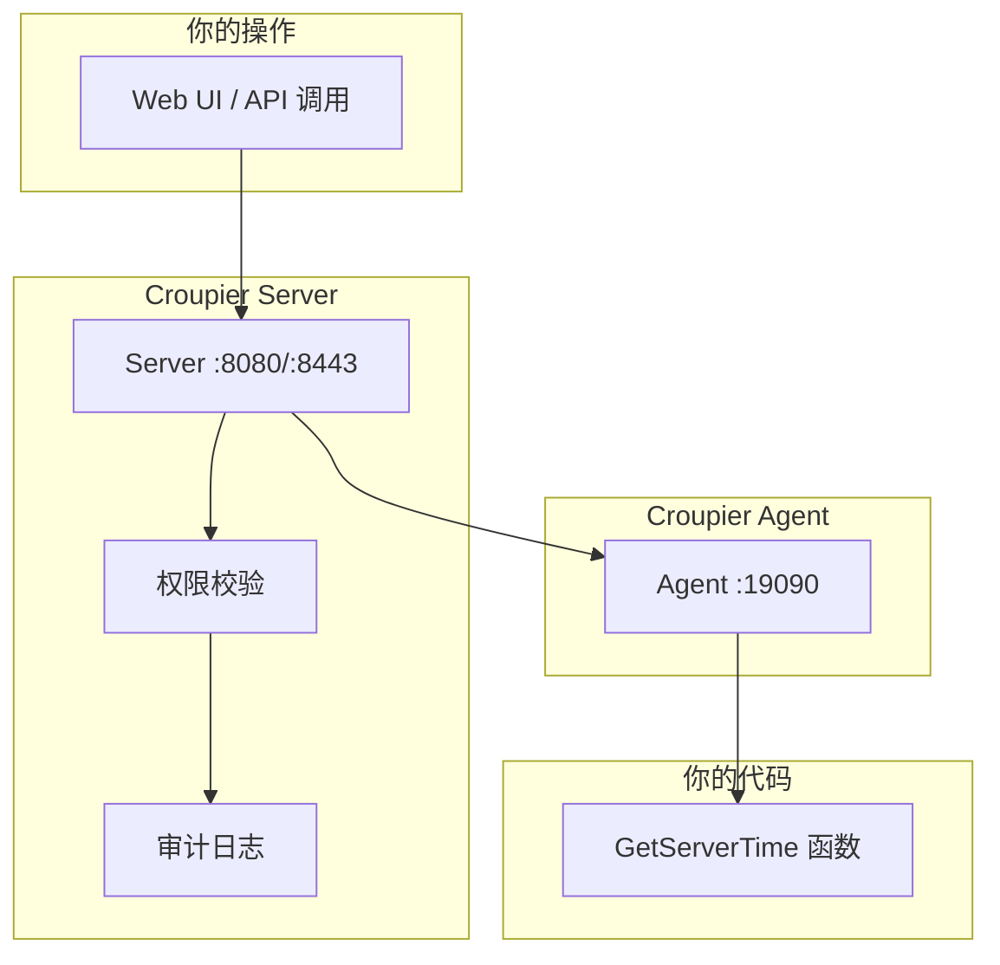

# 新手教程：10 分钟上手 Croupier

本教程将带你从零开始，逐步搭建一个完整的 Croupier 环境，并创建你的第一个函数。

## 目录

[[toc]]

## 准备工作

### 你将学到

通过本教程，你将学会：

1. ✅ 启动 Croupier Server 和 Agent
2. ✅ 创建第一个函数
3. ✅ 通过 Web 界面调用函数
4. ✅ 配置权限和审批流程

### 环境要求

确保已安装：

- **Go 1.25+** - [下载地址](https://go.dev/dl/)
- **Git** - 用于克隆代码

```bash
# 检查版本
go version
git --version
```

## 第一步：获取代码

```bash
# 1. 克隆仓库（包含子模块）
git clone --recursive https://github.com/cuihairu/croupier.git
cd croupier

# 2. 检查子模块
git submodule status
```

> **提示：** 如果子模块为空，执行：
> ```bash
> git submodule update --init --recursive
> ```

## 第二步：构建项目

```bash
# 1. 安装依赖
go mod download

# 2. 安装 buf 工具
go install github.com/bufbuild/buf/cmd/buf@latest

# 3. 生成协议代码
make proto

# 4. 编译二进制文件
make build

# 5. 验证构建产物
ls -la bin/
# 应该看到：croupier-server、croupier-agent、analytics-worker、ingest
```

## 第三步：生成证书

```bash
# 运行开发证书生成脚本
./scripts/dev-certs.sh

# 验证证书生成
ls -la data/dev-certs/
# 应该看到：ca.crt、server.crt、server.key、agent.crt、agent.key
```

## 第四步：启动 Server

```bash
# 1. 复制配置文件
cp configs/server.example.yaml configs/server.yaml

# 2. 启动 Server（新终端窗口）
./bin/croupier-server --config configs/server.yaml

# 3. 验证 Server 运行
curl http://localhost:8080/healthz
# 预期输出：{"status":"ok"}
```

**Server 启动成功后，你会看到：**

```
INFO[0000] Croupier Server starting...
INFO[0000] gRPC server listening on :8443
INFO[0000] HTTP server listening on :8080
```

## 第五步：启动 Agent

```bash
# 1. 新开一个终端窗口

# 2. 复制配置文件
cp configs/agent.example.yaml configs/agent.yaml

# 3. 启动 Agent
./bin/croupier-agent --config configs/agent.yaml

# Agent 启动成功后，你会看到：
# INFO[0000] Croupier Agent starting...
# INFO[0000] Connected to server at :8443
# INFO[0000] Registered successfully
```

## 第六步：创建测试函数

创建一个简单的测试文件 `test_function.go`：

```go
package main

import (
    "context"
    "fmt"
    "log"
    "net"

    "google.golang.org/grpc"
    "google.golang.org/grpc/credentials/insecure"
    "google.golang.org/protobuf/encoding/protojson"

    proto "croupier/proto/proto"
)

// 测试函数：获取服务器时间
func GetServerTime(ctx context.Context, payload map[string]interface{}) (map[string]interface{}, error) {
    return map[string]interface{}{
        "current_time": fmt.Sprintf("%v", ctx.Value("timestamp")),
        "message":      "Hello from Croupier!",
    }, nil
}

func main() {
    // 连接到本地 Agent
    conn, err := grpc.Dial("localhost:19090",
        grpc.WithTransportCredentials(insecure.NewCredentials()),
    )
    if err != nil {
        log.Fatal(err)
    }
    defer conn.Close()

    client := proto.NewFunctionServiceClient(conn)

    // 注册函数
    descriptor := &proto.FunctionDescriptor{
        Id:   "test.get_time",
        Name: "获取服务器时间",
        ParamsSchema: toProtoStruct(map[string]interface{}{
            "type": "object",
            "properties": map[string]interface{}{
                "timezone": map[string]interface{}{
                    "type":        "string",
                    "title":       "时区",
                    "default":     "UTC",
                    "description": "例如：Asia/Shanghai",
                },
            },
        }),
    }

    _, err = client.RegisterFunction(context.Background(), &proto.RegisterFunctionRequest{
        GameId:     "test-game",
        Env:        "dev",
        Descriptor: descriptor,
    })
    if err != nil {
        log.Fatal(err)
    }

    log.Println("函数注册成功: test.get_time")

    // 保持运行
    select {}
}

func toProtoStruct(m map[string]interface{}) *proto.Struct {
    b, _ := protojson.Marshal(m)
    s := &proto.Struct{}
    s.UnmarshalJSON(b)
    return s
}
```

## 第七步：调用函数

### 方式一：使用 REST API

```bash
# 1. 创建测试用户（首次使用）
# 通过 Server 默认创建的管理员账号

# 2. 获取 Token
curl -X POST http://localhost:8080/api/auth/login \
  -H "Content-Type: application/json" \
  -d '{"username":"admin","password":"admin123"}'

# 3. 调用函数
curl -X POST http://localhost:8080/api/invoke \
  -H "Content-Type: application/json" \
  -H "X-Game-ID: test-game" \
  -H "X-Env: dev" \
  -d '{
    "function_id": "test.get_time",
    "payload": {
      "timezone": "Asia/Shanghai"
    }
  }'
```

### 方式二：使用 Dashboard

```bash
# 1. 启动 Dashboard（可选）
cd dashboard
pnpm install
pnpm dev

# 2. 访问 http://localhost:8000

# 3. 登录后，在函数列表中找到 "test.get_time"

# 4. 点击调用，填写参数，提交
```

## 第八步：配置权限

### 创建角色

```bash
curl -X POST http://localhost:8080/api/roles \
  -H "Content-Type: application/json" \
  -H "Authorization: Bearer $TOKEN" \
  -d '{
    "role_id": "tester",
    "name": "测试人员",
    "permissions": ["test.*"]
  }'
```

### 为函数添加审批

修改函数描述，添加双人审批：

```go
descriptor := &proto.FunctionDescriptor{
    Id:   "test.get_time",
    Name: "获取服务器时间",
    Auth: &proto.AuthConfig{
        Permission:      "test.get_time",
        TwoPersonRule:   true,
        ApprovalEnabled: true,
        ApprovalThreshold: 2,
    },
    // ... 其他字段
}
```

## 第九步：查看审计日志

```bash
# 查询最近的操作日志
curl -X POST http://localhost:8080/api/audit/query \
  -H "Content-Type: application/json" \
  -H "Authorization: Bearer $TOKEN" \
  -d '{
    "game_id": "test-game",
    "env": "dev",
    "start_time": "2024-01-01T00:00:00Z",
    "page": 1,
    "size": 10
  }'
```

## 架构图理解

你刚刚部署的系统架构如下：



## 下一步

恭喜你完成了第一个 Croupier 函数！接下来可以：

1. 📖 阅读核心概念，了解架构设计
2. 🔧 查看配置指南，学习更多配置选项
3. 🚀 阅读部署指南，准备生产环境部署
4. 💻 查看示例代码，学习更多函数模式

## 常见问题

### Server 启动失败？

```bash
# 检查端口占用
lsof -i :8443
lsof -i :8080

# 如果被占用，修改配置文件中的端口
```

### Agent 连接失败？

```bash
# 1. 确认 Server 正在运行
curl http://localhost:8080/healthz

# 2. 检查配置文件中的 server_addr
# agent.yaml
agent:
  server_addr: "localhost:8443"
```

### 函数调用失败？

```bash
# 查看日志
tail -f logs/server.log
tail -f logs/agent.log

# 检查函数是否注册成功
curl http://localhost:8080/api/functions?game_id=test-game&env=dev
```

## 清理环境

```bash
# 停止所有进程
pkill croupier-server
pkill croupier-agent

# 删除测试数据
rm -rf data/
rm configs/server.yaml
rm configs/agent.yaml
```

## 相关文档

- [快速开始](./quick-start.md)
- [核心概念](./concepts/overview.md)
- [配置管理](./configuration.md)
- [常见问题](./faq.md)
