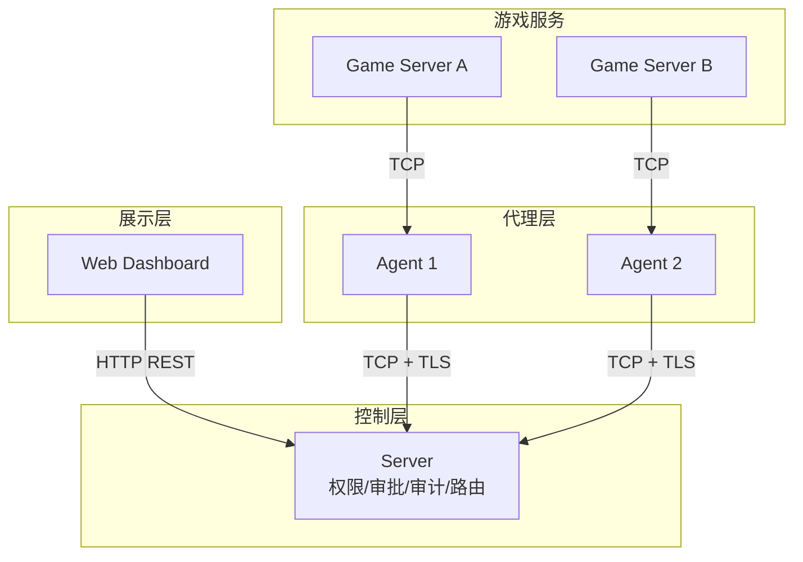

## 什么是 Croupier

Croupier 是一个**分布式游戏运营控制面系统**，为游戏运营提供统一的管理能力。通过控制面（Server）与代理（Agent）的协同架构，实现跨多游戏服务的管理、函数调用、权限控制和审计追踪。

## 系统架构



## 核心能力

### 函数管理
- **OpenAPI 驱动注册**：通过 OpenAPI 规范快速注册函数
- **UI 自动生成**：根据函数描述自动生成管理界面
- **多协议支持**：支持 REST、gRPC 等多种调用方式

### 权限与安全
- **RBAC/ABAC 混合模型**：基于角色和属性的灵活权限控制
- **双层政策架构**：YAML 默认策略 + 数据库覆盖策略
- **四级风险控制**：低、中、高、危险四级，自动触发审批流程
- **双人审批规则**：高风险操作需要多人审批

### 可观测性
- **完整审计链**：所有操作记录审计日志
- **哈希防篡改**：审计记录通过哈希链关联，确保数据完整性
- **敏感字段脱敏**：自动脱敏密码、token 等敏感信息

### 运维工具
- **工单系统**：玩家问题工单流转
- **反馈管理**：收集玩家反馈
- **公告系统**：游戏公告发布
- **数据分析**：玩家行为、留存、支付等数据分析

## 快速开始

### 安装

```bash
# 克隆仓库
git clone https://github.com/cuihairu/croupier.git
cd croupier

# 下载依赖
go mod download

# 构建服务
make build
```

### 启动服务

```bash
# 启动 Server
./bin/croupier-server --config configs/server.yaml

# 启动 Agent
./bin/croupier-agent --config configs/agent.yaml
```

### 验证安装

```bash
# 检查 Server 健康状态
curl http://localhost:18780/health

# 查看 API 文档
curl http://localhost:18780/api/v1/
```

## 文档导航

| 文档 | 说明 |
|------|------|
| [指南](/guide/) | 快速开始、安装配置、核心概念、运维指南 |
| [架构](/architecture/) | 系统分层、传输协议、扩展系统设计 |
| [API 参考](/api/) | REST API 接口文档 |
| [开发](/development/) | 仓库结构、开发约定、发布流程 |
| [SDK](/sdks/) | 多语言 SDK 文档与能力矩阵 |

## 技术栈

- **Go**：后端核心实现
- **gRPC**：内部服务通信
- **Protobuf**：接口定义与序列化
- **SQLite/PostgreSQL**：数据存储
- **React + Formily**：管理界面
- **VitePress**：文档站点

## 路线图

- [x] 基础函数注册与调用
- [x] RBAC 权限控制
- [x] 审批流程
- [x] 审计日志
- [x] 双层政策架构
- [ ] 插件市场
- [ ] 更多 SDK 语言支持

## 开源协议

Apache-2.0 License
