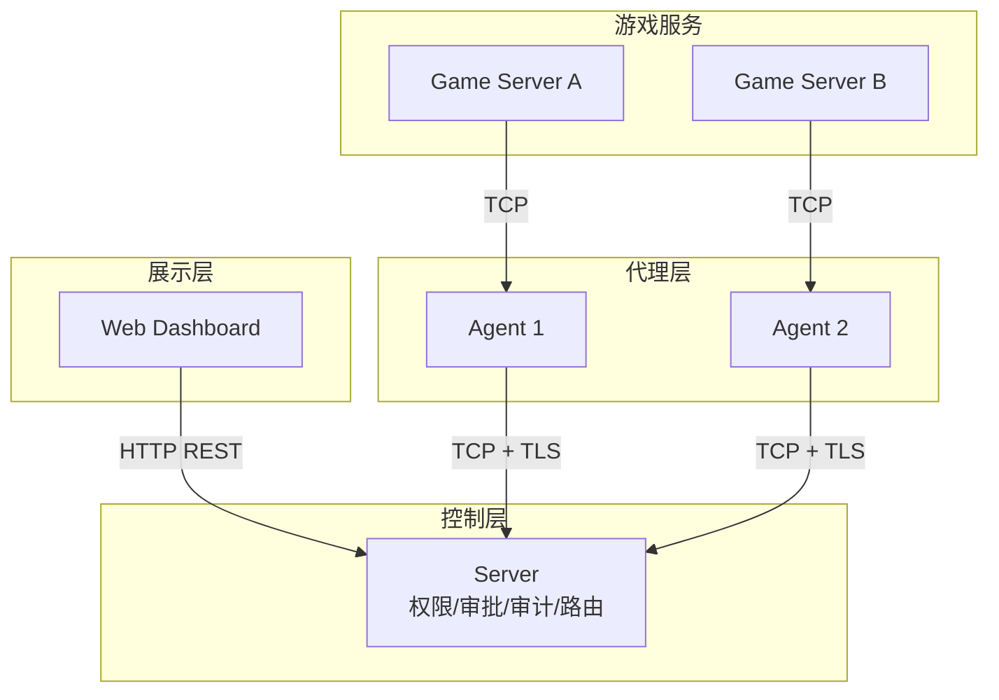

## 什么是 Croupier

Croupier 是一个**分布式游戏运营控制面系统**，为单一游戏公司内部的多游戏、多环境运营提供统一的管理能力。通过控制面（Server）、代理（Agent）与多语言 SDK 的协同，实现跨多游戏服务的管理、函数调用、权限控制、审计追踪和数据分析。

当前权威架构以统一 TCP session 为默认链路：

- `Dashboard <-> Server`：HTTP REST
- `Agent <-> Server`：TCP session，默认启用 TLS
- `SDK / GameServer / 第三方本地应用 <-> Agent`：Agent 本地 gateway，默认 TCP session

## 系统架构



## 核心能力

### 函数管理

- **OpenAPI 驱动注册**：通过 OpenAPI 规范快速注册函数
- **Formily 函数表单**：根据函数契约生成 Formily Schema，调用页只消费这一种 UI 协议
- **Dashboard Page 编排**：对象管理、分页表格、报表和任务页由 Page 模型组合多个函数
- **统一调用链路**：控制面通过 Agent session 路由调用，本地接入通过 Agent gateway 完成

### 权限与安全

- **RBAC/ABAC 混合模型**：基于角色和属性的灵活权限控制
- **双层政策架构**：YAML 默认策略 + 数据库覆盖策略
- **四级风险控制**：低、中、高、危险四级，自动触发审批流程
- **双人审批规则**：高风险操作需要多人审批

### 作用域模型

- **单公司多游戏**：不引入 SaaS 多租户抽象，标准业务边界是 `game_id`
- **多环境治理**：`env` 表达 `dev/test/staging/prod` 等逻辑环境
- **归属与部署分离**：`scope` 表达业务归属，`target` 表达运行位置

### 可观测性

- **完整审计链**：所有操作记录审计日志
- **哈希防篡改**：审计记录通过哈希链关联，确保数据完整性
- **敏感字段脱敏**：自动脱敏密码、token 等敏感信息

### 运维工具

- **工单系统**：玩家问题工单流转
- **反馈管理**：收集玩家反馈
- **公告系统**：游戏公告发布
- **数据分析**：玩家行为、留存、支付等数据分析

## 快速开始

### 安装

```bash
# 克隆仓库
git clone https://github.com/cuihairu/croupier.git
cd croupier

# 下载依赖
go mod download

# 构建服务
make build
```

### 启动服务

```bash
# 启动 Server
./bin/croupier-server --config configs/server.yaml

# 启动 Agent
./bin/croupier-agent --config configs/agent.yaml
```

### 验证安装

```bash
# 检查 Server 健康状态
curl http://localhost:18780/health

# 查看 API 文档
curl http://localhost:18780/api/v1/
```

## 文档导航

按使用路径组织：

| 路径 | 入口 | 说明 |
|------|------|------|
| **快速开始** | [指南](/guide/) · [快速开始](/guide/quick-start) | 安装、配置、Server + Agent 启动、最小闭环 |
| **SDK** | [SDK 概览](/sdks/) | Provider / Invoker / 配置 / 能力矩阵，6 种语言 |
| **API** | [API 参考](/api/) | REST 契约、鉴权、game/env scope、各资源 API |
| **运维** | [监控](/guide/operations/monitoring) · [数据分析](/analytics/) | 部署、监控、备份、分析、故障排除 |
| **开发** | [开发](/development/) · [架构](/architecture/) | 架构、代码规范、扩展策略、发布规则 |

历史设计与迁移文档归入 [架构 - 提案与迁移](/architecture/)（侧栏已折叠），不作为接入主路径。

## 技术栈

- **Go**：后端核心实现
- **TCP Session**：Agent/SDK 内部主链路
- **Protobuf**：接口定义与信封序列化
- **SQLite/PostgreSQL**：数据存储
- **React + Formily**：管理界面
- **VitePress**：文档站点

## 路线图

- [x] 基础函数注册与调用
- [x] RBAC 权限控制
- [x] 审批流程
- [x] 审计日志
- [x] 双层政策架构
- [ ] 插件市场
- [ ] 更多 SDK 语言支持

## 开源协议

Apache-2.0 License
