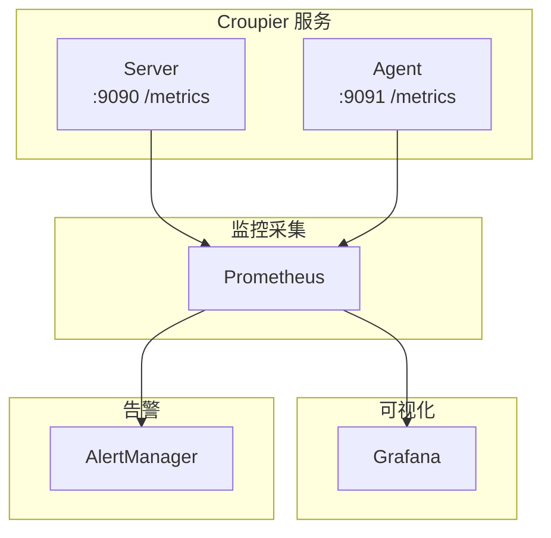

# 监控指南

本文档介绍 Croupier 的监控、日志和告警配置。

## 目录

[[toc]]

## 监控架构



## Prometheus 指标

### Server 指标

| 指标名称                                  | 类型      | 说明            |
| ----------------------------------------- | --------- | --------------- |
| `croupier_server_requests_total`          | Counter   | 请求总数        |
| `croupier_server_request_duration`        | Histogram | 请求延迟        |
| `croupier_server_functions_invoked_total` | Counter   | 函数调用总数    |
| `croupier_server_agents_connected`        | Gauge     | 已连接 Agent 数 |
| `croupier_server_jobs_active`             | Gauge     | 活跃作业数      |
| `croupier_server_approvals_pending`       | Gauge     | 待审批数        |

### Agent 指标

| 指标名称                              | 类型      | 说明           |
| ------------------------------------- | --------- | -------------- |
| `croupier_agent_connected`            | Gauge     | Agent 连接状态 |
| `croupier_agent_functions_registered` | Gauge     | 已注册函数数   |
| `croupier_agent_jobs_executed_total`  | Counter   | 执行作业总数   |
| `croupier_agent_jobs_duration`        | Histogram | 作业执行时长   |

### 配置指标采集

```yaml
# prometheus.yml
scrape_configs:
  - job_name: "croupier-server"
    static_configs:
      - targets: ["server1:9090", "server2:9090", "server3:9090"]

  - job_name: "croupier-agent"
    static_configs:
      - targets: ["agent1:9091", "agent2:9091", "agent3:9091"]
```

## Grafana 面板

### Server 面板

导入 JSON 配置创建仪表盘：

```json
{
  "dashboard": {
    "title": "Croupier Server",
    "panels": [
      {
        "title": "请求速率",
        "targets": [
          {
            "expr": "rate(croupier_server_requests_total[5m])"
          }
        ]
      },
      {
        "title": "请求延迟 (P99)",
        "targets": [
          {
            "expr": "histogram_quantile(0.99, rate(croupier_server_request_duration_bucket[5m]))"
          }
        ]
      },
      {
        "title": "函数调用 Top 10",
        "targets": [
          {
            "expr": "topk(10, sum by (function_id) (croupier_server_functions_invoked_total))"
          }
        ]
      }
    ]
  }
}
```

## 日志配置

### 日志格式

Croupier 使用结构化 JSON 日志：

```json
{
  "timestamp": "2024-12-01T10:30:00Z",
  "level": "info",
  "component": "server",
  "msg": "Function invoked",
  "game_id": "my-game",
  "env": "prod",
  "function_id": "player.ban",
  "user_id": "user_123",
  "duration_ms": 123
}
```

### 日志配置

```yaml
server:
  log:
    level: info # debug | info | warn | error
    format: json # console | json
    file: logs/server.log
    max_size: 100 # MB
    max_backups: 3
    max_age: 7 # days
```

### 日志收集 (Loki)

```yaml
# promtail-config.yml
server:
  http_listen_port: 9080

positions:
  filename: /tmp/positions.yaml

clients:
  - url: http://loki:3100/loki/api/v1/push

scrape_configs:
  - job_name: croupier
    static_configs:
      - targets:
          - localhost
        labels:
          job: croupier-server
          __path__: /var/log/croupier/*.log
```

## 告警规则

### Prometheus 告警规则

```yaml
# alerts.yml
groups:
  - name: croupier
    interval: 30s
    rules:
      # 服务可用性
      - alert: CroupierServerDown
        expr: up{job="croupier-server"} == 0
        for: 1m
        labels:
          severity: critical
        annotations:
          summary: "Croupier Server 宕机"
          description: "{{ $labels.instance }} 已宕机超过 1 分钟"

      # Agent 离线
      - alert: CroupierAgentDisconnected
        expr: croupier_agent_connected == 0
        for: 5m
        labels:
          severity: warning
        annotations:
          summary: "Croupier Agent 离线"
          description: "{{ $labels.instance }} 已离线超过 5 分钟"

      # 高错误率
      - alert: HighErrorRate
        expr: |
          rate(croupier_server_requests_total{status="error"}[5m])
          /
          rate(croupier_server_requests_total[5m]) > 0.05
        for: 5m
        labels:
          severity: warning
        annotations:
          summary: "错误率过高"
          description: "错误率超过 5%"

      # 高延迟
      - alert: HighLatency
        expr: |
          histogram_quantile(0.99,
            rate(croupier_server_request_duration_bucket[5m])
          ) > 1
        for: 5m
        labels:
          severity: warning
        annotations:
          summary: "请求延迟过高"
          description: "P99 延迟超过 1 秒"

      # 待审批积压
      - alert: ApprovalBacklog
        expr: croupier_server_approvals_pending > 50
        for: 1h
        labels:
          severity: warning
        annotations:
          summary: "审批积压"
          description: "待审批数量超过 50"
```

### AlertManager 配置

```yaml
# alertmanager.yml
global:
  resolve_timeout: 5m

route:
  group_by: ["alertname", "cluster", "service"]
  group_wait: 10s
  group_interval: 10s
  repeat_interval: 12h
  receiver: "default"

  routes:
    - match:
        severity: critical
      receiver: "pagerduty"

    - match:
        severity: warning
      receiver: "slack"

receivers:
  - name: "default"
    webhook_configs:
      - url: "http://webhook:8080/webhook"

  - name: "pagerduty"
    pagerduty_configs:
      - service_key: "<PAGERDUTY_SERVICE_KEY>"

  - name: "slack"
    slack_configs:
      - api_url: "<SLACK_WEBHOOK_URL>"
        channel: "#alerts"
```

## 分布式追踪

### OpenTelemetry 集成

```go
import (
    "go.opentelemetry.io/otel"
    "go.opentelemetry.io/otel/exporters/jaeger"
    "go.opentelemetry.io/otel/sdk/trace"
)

func initTracer() error {
    exporter, err := jaeger.New(jaeger.WithCollectorEndpoint(
        jaeger.WithEndpoint("http://jaeger:14268/api/traces"),
    ))
    if err != nil {
        return err
    }

    tp := trace.NewTracerProvider(
        trace.WithBatcher(exporter),
        trace.WithResource(resources.NewWithAttributes(
            semconv.SchemaURL,
            semconv.ServiceName("croupier-server"),
        )),
    )

    otel.SetTracerProvider(tp)
    return nil
}
```

### 追踪调用

```go
import (
    "go.opentelemetry.io/otel"
)

func (s *Server) InvokeFunction(ctx context.Context, req *Request) (*Response, error) {
    tracer := otel.Tracer("server")
    ctx, span := tracer.Start(ctx, "InvokeFunction")
    defer span.End()

    span.SetAttributes(
        attribute.String("function_id", req.FunctionId),
        attribute.String("game_id", req.GameId),
    )

    // 调用 Agent
    resp, err := s.agent.InvokeFunction(ctx, req)
    if err != nil {
        span.RecordError(err)
        return nil, err
    }

    return resp, nil
}
```

## 健康检查

### HTTP 健康检查

```bash
# 健康检查
curl http://localhost:18780/healthz

# 就绪检查
curl http://localhost:18780/readyz
```

### 响应示例

```json
{
  "status": "ok",
  "checks": {
    "database": "ok",
    "redis": "ok",
    "agents": {
      "total": 5,
      "online": 5
    }
  }
}
```

## 性能监控

### 数据库性能

```sql
-- 慢查询
SELECT query, mean_exec_time, calls
FROM pg_stat_statements
WHERE mean_exec_time > 100
ORDER BY mean_exec_time DESC
LIMIT 10;

-- 连接数
SELECT count(*) FROM pg_stat_activity;
```

### Redis 性能

```bash
# Redis 信息
redis-cli INFO stats

# 慢日志
redis-cli SLOWLOG GET 10
```

## 最佳实践

### 1. 指标命名规范

```
croupier_<component>_<metric>_<unit>

示例：
- croupier_server_requests_total
- croupier_agent_functions_registered
- croupier_job_duration_seconds
```

### 2. 标签使用

```go
// 添加标签
counter.WithLabelValues(
    "player.ban",  // function_id
    "my-game",     // game_id
    "prod",        // env
    "success",     // status
).Inc()
```

### 3. 日志级别

| 级别    | 用途         |
| ------- | ------------ |
| `debug` | 开发调试信息 |
| `info`  | 正常操作日志 |
| `warn`  | 警告信息     |
| `error` | 错误信息     |

### 4. 敏感信息脱敏

```yaml
server:
  audit:
    sensitive_fields:
      - "password"
      - "token"
      - "secret"
```

## 相关文档

- [部署指南](./deploy-docker.md)
- [安全配置](./security.md)
- [故障排查](./troubleshooting.md)
