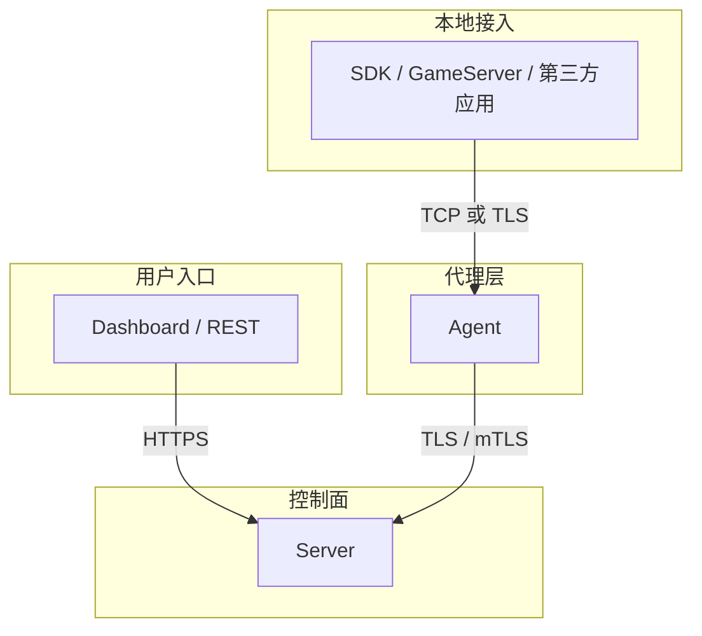

# 安全配置

本文档描述当前 session 架构下的安全边界与推荐配置。

## 安全边界



## 默认策略

### `Agent <-> Server`

- 默认启用 TLS
- 生产环境推荐 mTLS
- `19090` 应视为内部控制面端口

### `SDK <-> Agent`

- 默认可不开启 TLS
- 跨主机、跨网段或零信任环境时启用 TLS
- 是否启用 TLS 取决于部署边界，而不是协议本身要求

## 配置示例

### Server

`configs/server.yaml`：

```yaml
control:
  addr: ":19090"
  cert: "/etc/croupier/server.crt"
  key: "/etc/croupier/server.key"
  ca: "/etc/croupier/ca.crt"
```

### Agent 上行到 Server

`configs/agent.yaml`：

```yaml
server:
  addr: "server.example.com:19090"
  insecure: false
  serverName: "server.example.com"
  insecureSkipVerify: false
  tlsCertFile: "/etc/croupier/agent.crt"
  tlsKeyFile: "/etc/croupier/agent.key"
  caFile: "/etc/croupier/ca.crt"
```

### Agent 本地 gateway TLS

`configs/agent.yaml`：

```yaml
tls:
  enabled: true
  certFile: "/etc/croupier/agent-local.crt"
  keyFile: "/etc/croupier/agent-local.key"
  caFile: "/etc/croupier/ca.crt"
  insecureSkipVerify: false
```

## 证书建议

- 同一控制域可使用统一内部 CA
- `Agent <-> Server` 推荐双向证书校验
- `SDK <-> Agent` 若启用 TLS，可按需要决定是否要求客户端证书

## 防火墙建议

至少明确区分以下端口边界：

```bash
# REST / Dashboard
ufw allow 18780/tcp

# Agent -> Server session/control
ufw allow 19090/tcp

# SDK / GameServer -> Agent local gateway
ufw allow 19091/tcp
```

如果部署里仍保留历史兼容端口，应按过渡资产管理，避免把它们写成新的基线。

## 认证与授权

除了 TLS，还应继续保留：

- JWT / OIDC 鉴权
- RBAC / ABAC 授权
- 审计日志
- 高风险操作审批

TLS 只解决“谁在和谁通信”，不替代平台级权限控制。

## 外部身份源（LDAP / OIDC）

平台默认仅使用本地账号（`admins` 表 + bcrypt + TOTP）。如有企业身份源，可在 `auth.providers` 中按需开启，默认全部关闭：

```yaml
auth:
  providers:
    ldap:
      enabled: true
      addr: "ldap://ldap.example.com:389"
      baseDn: "dc=example,dc=com"
      bindDn: "uid=svc-croupier,ou=system,dc=example,dc=com"
      bindPassword: "${LDAP_BIND_PASSWORD}"
      userFilter: "(uid=%s)"
      startTls: true
      defaultRoles: ["viewer"]
    oidc:
      enabled: true
      issuer: "https://keycloak.example.com/realms/main"
      clientId: "croupier"
      clientSecret: "${OIDC_CLIENT_SECRET}"
      redirectUrl: "https://croupier.example.com/api/auth/oidc/callback"
      defaultRoles: ["viewer"]
      loginSuccessUrl: "https://croupier.example.com/login"
```

完整字段说明见 `configs/auth-providers.example.yaml`。行为约定：

- **登录级联**：密码登录按 `local → ldap` 顺序尝试；本地失败且 LDAP 启用时自动回落到 LDAP，登录框无需区分。
- **JIT 建号**：外部身份首次登录自动创建本地影子账号（密码为随机值，不能本地登录），并按 `defaultRoles` 赋予本地角色；角色与权限始终由本地 RBAC 裁决，外部身份只负责"证明你是谁"。
- **OIDC 流程**：登录页通过 `GET /api/v1/auth/providers` 获取已启用方式；`GET /api/v1/auth/oidc/login` 跳转身份源，回调 `GET /api/v1/auth/oidc/callback` 换取身份并签发平台 JWT（与密码登录同一 token 体系，后续请求无差别）。
- **失效降级**：OIDC 身份源在 Server 启动时不可达只会禁用 OIDC 登录（告警日志），不影响本地与 LDAP 登录；LDAP 拨号发生在认证时，目录故障表现为"认证服务暂时不可用"。
- **审计**：登录审计记录携带 `provider` 字段，可区分 `local` / `ldap` / `oidc` 来源。

## 最佳实践

1. 生产环境的 `Agent <-> Server` 默认启用 mTLS
2. `SDK <-> Agent` 根据网络边界决定是否启用 TLS
3. 不要把 `insecureSkipVerify` 带到生产环境
4. 证书、JWT secret、数据库凭据统一由 Secret Manager 管理
5. 审计日志与敏感字段脱敏必须持续开启

## 明确不再推荐的旧模型

- 把内部控制链路继续写成 `gRPC`
- 把 `19090` 写成 `控制链路` 固定语义
- 让 SDK 开本地端口给 Agent 回拨
- 使用 `rpc_addr` 作为长期运行时依赖

## 数据库备份与恢复

### 备份（自动执行）

`POST /api/v1/backups` 创建备份记录后会**真实执行**导出（异步）：

1. 按当前 `database.driver` 选择工具：mysql → `mysqldump`、postgres → `pg_dump`、sqlite → 文件复制
2. 导出到临时文件 → 计算 sha256 → 上传对象存储（`storage.*` 配置；file driver 即本地 `backups/` 目录）
3. 更新记录为 `succeeded`（含 location/size/checksum）或 `failed`（含错误信息）

要求：Server 运行环境内需安装 `mysqldump`/`pg_dump`（容器镜像可加 `default-mysql-client`/`postgresql-client`）。密码通过 `MYSQL_PWD`/`PGPASSWORD` 环境变量传递，不出现在命令行与进程列表。

建议配合定时任务（`/api/v1/schedules`）每日触发备份，并对高价值备份将 `location` 归档到外部存储。

### 恢复（runbook）

```bash
# 1. 从对象存储/本地目录取回备份文件
ls data/uploads/backups/           # file driver
# 或从 S3/OSS/COS 按记录中的 location 下载

# 2. 校验完整性（与记录中 checksum 比对）
sha256sum <backup-file>

# 3. 恢复（在目标库执行；生产恢复前先在影子库演练）
mysql -h <host> -u <user> -p <db> < backup.sql          # mysql
psql -h <host> -U <user> -d <db> -f backup.sql          # postgres
# sqlite：停服后替换文件
cp <backup-file> /path/to/croupier.db

# 4. 重启 Server 并抽查关键表（admins/audit_records/task_runs 行数与时间戳）
```

注意：恢复属高危操作，必须走两人规则审批并全程留存操作记录。
