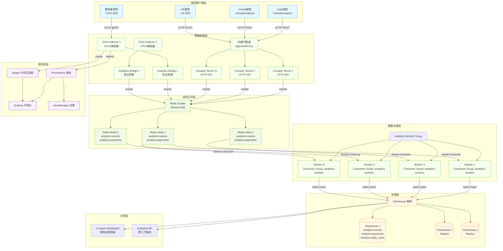
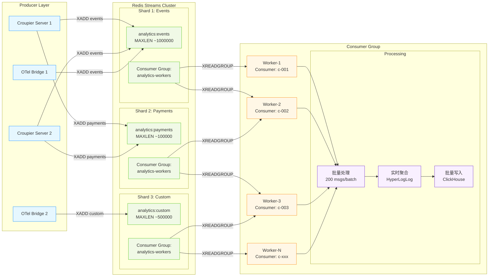
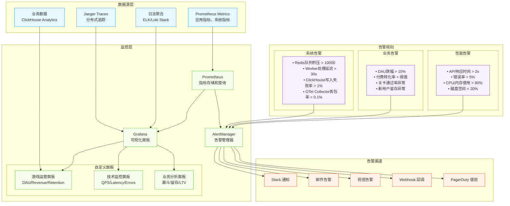

# 🏗️ OpenTelemetry + Croupier 完整架构图

## 📊 数据流架构总览



## 🔄 消息队列详细架构



## ⚙️ 扩容和容错设计

```mermaid
graph TB
    subgraph "负载均衡层"
        direction TB
        ALB[Application Load Balancer<br/>支持健康检查]
        NLB[Network Load Balancer<br/>TCP层负载均衡]
    end

    subgraph "应用层高可用"
        direction LR
        subgraph "Region A"
            ServerA1[Croupier Server A1<br/>Primary]
            ServerA2[Croupier Server A2<br/>Primary]
            CollectorA1[OTel Collector A1]
            CollectorA2[OTel Collector A2]
        end

        subgraph "Region B (DR)"
            ServerB1[Croupier Server B1<br/>Standby]
            CollectorB1[OTel Collector B1]
        end
    end

    subgraph "消息队列高可用"
        direction LR
        subgraph "Redis Cluster - Master/Slave"
            subgraph "Master Nodes"
                RM1[Redis Master 1<br/>Slot: 0-5461]
                RM2[Redis Master 2<br/>Slot: 5462-10922]
                RM3[Redis Master 3<br/>Slot: 10923-16383]
            end

            subgraph "Slave Nodes"
                RS1[Redis Slave 1<br/>Replica of M1]
                RS2[Redis Slave 2<br/>Replica of M2]
                RS3[Redis Slave 3<br/>Replica of M3]
            end
        end

        subgraph "Sentinel Monitor"
            Sentinel1[Redis Sentinel 1]
            Sentinel2[Redis Sentinel 2]
            Sentinel3[Redis Sentinel 3]
        end
    end

    subgraph "处理层自动扩容"
        direction TB
        subgraph "Kubernetes Deployment"
            HPA[HPA Controller<br/>基于队列长度扩容]
            WorkerDeployment[Analytics Worker<br/>Deployment: 3-20 Pods]

            subgraph "Worker Pods"
                WP1[Worker Pod 1<br/>Consumer: pod-1]
                WP2[Worker Pod 2<br/>Consumer: pod-2]
                WP3[Worker Pod 3<br/>Consumer: pod-3]
                WPN[Worker Pod N<br/>Consumer: pod-N]
            end
        end
    end

    subgraph "存储层高可用"
        direction LR
        subgraph "ClickHouse Cluster"
            subgraph "Shard 1"
                CH1A[ClickHouse 1A<br/>Replica 1]
                CH1B[ClickHouse 1B<br/>Replica 2]
            end

            subgraph "Shard 2"
                CH2A[ClickHouse 2A<br/>Replica 1]
                CH2B[ClickHouse 2B<br/>Replica 2]
            end

            ZK[ZooKeeper Ensemble<br/>Coordination]
        end
    end

    %% 连接关系
    ALB --> ServerA1
    ALB --> ServerA2
    NLB --> CollectorA1
    NLB --> CollectorA2

    ServerA1 --> RM1
    ServerA2 --> RM2
    CollectorA1 --> RM1
    CollectorA2 --> RM3

    RM1 --> RS1
    RM2 --> RS2
    RM3 --> RS3

    Sentinel1 -.->|monitor| RM1
    Sentinel2 -.->|monitor| RM2
    Sentinel3 -.->|monitor| RM3

    RM1 --> WP1
    RM2 --> WP2
    RM3 --> WP3
    RM1 --> WPN

    HPA -.->|scale| WorkerDeployment
    WorkerDeployment --> WP1
    WorkerDeployment --> WP2
    WorkerDeployment --> WP3
    WorkerDeployment --> WPN

    WP1 --> CH1A
    WP2 --> CH2A
    WP3 --> CH1B
    WPN --> CH2B

    ZK -.->|coordinate| CH1A
    ZK -.->|coordinate| CH1B
    ZK -.->|coordinate| CH2A
    ZK -.->|coordinate| CH2B

    classDef lb fill:#e6f7ff,stroke:#1890ff
    classDef app fill:#f6ffed,stroke:#52c41a
    classDef redis fill:#f0f9e6,stroke:#52c41a
    classDef worker fill:#fff7e6,stroke:#fa8c16
    classDef storage fill:#f9f0ff,stroke:#722ed1

    class ALB,NLB lb
    class ServerA1,ServerA2,ServerB1,CollectorA1,CollectorA2,CollectorB1 app
    class RM1,RM2,RM3,RS1,RS2,RS3,Sentinel1,Sentinel2,Sentinel3 redis
    class HPA,WorkerDeployment,WP1,WP2,WP3,WPN worker
    class CH1A,CH1B,CH2A,CH2B,ZK storage
```



## 📊 监控和告警架构



## 🔐 安全架构

```mermaid
graph TB
    subgraph "网络安全层"
        WAF[Web应用防火墙<br/>SQL注入/XSS防护]
        CDN[CDN + DDoS防护<br/>CloudFlare/AWS Shield]
        VPN[VPN网关<br/>内网访问控制]
    end

    subgraph "认证授权层"
        OAuth[OAuth 2.0 / OIDC<br/>统一身份认证]
        RBAC[RBAC权限控制<br/>角色基础访问控制]
        JWT[JWT Token<br/>API访问令牌]
        mTLS[mTLS证书<br/>服务间通信加密]
    end

    subgraph "数据安全层"
        Encryption[数据加密<br/>传输加密(TLS) + 存储加密(AES)]
        Anonymization[数据脱敏<br/>PII数据匿名化]
        Backup[数据备份<br/>增量备份 + 异地容灾]
        Audit[审计日志<br/>操作审计 + 数据访问审计]
    end

    subgraph "运维安全层"
        Secrets[密钥管理<br/>Vault/K8s Secrets]
        SIEM[安全信息事件管理<br/>异常行为检测]
        Compliance[合规检查<br/>GDPR/SOC2合规]
        Monitoring[安全监控<br/>入侵检测 + 威胁情报]
    end

    CDN --> WAF
    WAF --> OAuth
    OAuth --> RBAC
    RBAC --> JWT
    JWT --> mTLS

    mTLS --> Encryption
    Encryption --> Anonymization
    Anonymization --> Backup
    Backup --> Audit

    Audit --> Secrets
    Secrets --> SIEM
    SIEM --> Compliance
    Compliance --> Monitoring

    classDef network fill:#e6f7ff,stroke:#1890ff
    classDef auth fill:#f6ffed,stroke:#52c41a
    classDef data fill:#fff7e6,stroke:#fa8c16
    classDef ops fill:#f9f0ff,stroke:#722ed1

    class WAF,CDN,VPN network
    class OAuth,RBAC,JWT,mTLS auth
    class Encryption,Anonymization,Backup,Audit data
    class Secrets,SIEM,Compliance,Monitoring ops
```

---

*这些架构图展示了从简单到复杂的完整OTel+Croupier集成方案，涵盖了数据流、扩容、监控和安全等各个方面。*