# 🚀 OpenTelemetry 部署指南

## 📊 架构概述

Croupier 现在提供三层 OTel 集成架构，从简单到高级，满足不同场景的需求：

```mermaid
graph TB
    subgraph "Level 1: 极简集成（HTTP直推）"
        Game1[游戏服务器] -->|HTTP POST| Server[Croupier Server]
        Server -->|events| Redis1[Redis Streams]
        Redis1 -->|consume| Worker1[Analytics Worker]
        Worker1 -->|store| CH1[(ClickHouse)]
    end

    subgraph "Level 2: OTel标准集成"
        Game2[游戏服务器<br/>+OTel SDK] -->|OTLP| Collector[OTel Collector]
        Collector -->|process| Bridge[Analytics Bridge]
        Bridge -->|events| Redis2[Redis Streams]
        Redis2 -->|consume| Worker2[Analytics Worker]
        Worker2 -->|store| CH2[(ClickHouse)]

        Game2 -->|traces| Jaeger[Jaeger]
        Collector -->|metrics| Prometheus[Prometheus]
    end

    subgraph "Level 3: 企业级部署"
        Game3[游戏服务器<br/>+OTel SDK] -->|OTLP| LB[负载均衡器]
        LB --> Collector1[OTel Collector 1]
        LB --> Collector2[OTel Collector 2]
        LB --> Collector3[OTel Collector N]

        Collector1 --> Bridge1[Analytics Bridge 1]
        Collector2 --> Bridge2[Analytics Bridge 2]
        Collector3 --> Bridge3[Analytics Bridge N]

        Bridge1 -->|events| RedisCluster[Redis Cluster]
        Bridge2 -->|events| RedisCluster
        Bridge3 -->|events| RedisCluster

        RedisCluster -->|consume| WorkerGroup[Worker Group<br/>多消费者实例]
        WorkerGroup -->|store| CHCluster[(ClickHouse 集群)]

        subgraph "监控观测"
            Jaeger2[Jaeger 集群]
            Prometheus2[Prometheus 集群]
            Grafana[Grafana]
        end

        Collector1 -->|traces| Jaeger2
        Collector1 -->|metrics| Prometheus2
        Prometheus2 --> Grafana
        Jaeger2 --> Grafana
    end

    classDef game fill:#e6f7ff,stroke:#1890ff
    classDef server fill:#f6ffed,stroke:#52c41a
    classDef storage fill:#fff7e6,stroke:#fa8c16
    classDef monitor fill:#f9f0ff,stroke:#722ed1

    class Game1,Game2,Game3 game
    class Server,Collector,Bridge1,Bridge2,Bridge3,Worker1,Worker2,WorkerGroup server
    class Redis1,Redis2,RedisCluster,CH1,CH2,CHCluster storage
    class Jaeger,Jaeger2,Prometheus,Prometheus2,Grafana monitor
```



## 🎯 集成方案选择

### Level 1: 极简 HTTP 直推（5分钟集成）

**适用场景：**
- 快速验证和原型开发
- 小型游戏（<10万DAU）
- 不需要复杂的可观测性功能

**优势：**
✅ 零依赖，只需要HTTP客户端
✅ 5分钟集成，修改最少
✅ 复用现有Analytics基础设施

**集成代码：**
```go
// 游戏服务器中添加
func sendGameEvent(eventType string, userID string, data map[string]interface{}) {
    event := map[string]interface{}{
        "game_id":     "your-game-id",
        "user_id":     userID,
        "event":       eventType,
        "ts":          time.Now().Format(time.RFC3339),
        "platform":    "ios", // or android, pc, web
        "region":      "cn-north",
        "props":       data,
    }

    payload := []map[string]interface{}{event}
    http.Post("http://croupier-server:8080/api/analytics/ingest", payload)
}

// 使用示例
sendGameEvent("level_start", "user123", map[string]interface{}{
    "level": "1-1",
    "episode": "tutorial",
})
```

### Level 2: OTel 标准集成（完整功能）

**适用场景：**
- 中大型游戏（>10万DAU）
- 需要分布式追踪和性能分析
- 团队有运维经验

**优势：**
✅ 行业标准OTel协议
✅ 完整的可观测性三支柱
✅ 强大的数据处理能力
✅ 易于扩展和集成第三方工具

**部署命令：**
```bash
# 启动完整OTel环境（包含collector、jaeger、prometheus）
cd examples/otel-integration
make start

# 游戏服务器集成OTel SDK（Go示例）
go get go.opentelemetry.io/otel
go get go.opentelemetry.io/otel/exporters/otlp/otlptrace/otlptracehttp
```

### Level 3: 企业级部署（生产级别）

**适用场景：**
- 大型游戏（>100万DAU）
- 多游戏多环境管理
- 严格的SLA要求

**优势：**
✅ 高可用和故障容错
✅ 水平扩展能力
✅ 企业级监控和告警
✅ 多租户隔离

## 📦 部署模式详解

### 模式一：单机开发环境

```bash
# 1. 启动Croupier Server（已包含Analytics）
./croupier server --config configs/server.example.yaml

# 2. 配置环境变量启用Redis MQ
export ANALYTICS_MQ_TYPE=redis
export REDIS_URL=redis://localhost:6379/0

# 3. 启动Analytics Worker
./analytics-worker

# 4. 游戏服务器直接HTTP推送事件
curl -X POST http://localhost:8080/api/analytics/ingest \
  -H "Content-Type: application/json" \
  -H "X-Game-ID: my-game" \
  -d '[{"event": "level_start", "user_id": "user123", "props": {"level": "1-1"}}]'
```

### 模式二：OTel标准部署

```bash
# 1. 启动完整监控栈
cd examples/otel-integration
docker-compose up -d

# 2. 验证服务状态
make health-check

# 3. 运行示例游戏客户端
make demo

# 4. 访问监控界面
# Grafana: http://localhost:3000 (admin/admin)
# Jaeger: http://localhost:16686
# Prometheus: http://localhost:9090
```

### 模式三：Kubernetes生产部署

```yaml
# k8s-deployment.yaml
apiVersion: apps/v1
kind: Deployment
metadata:
  name: croupier-server
spec:
  replicas: 3
  selector:
    matchLabels:
      app: croupier-server
  template:
    metadata:
      labels:
        app: croupier-server
    spec:
      containers:
      - name: server
        image: croupier/server:latest
        env:
        - name: ANALYTICS_MQ_TYPE
          value: "redis"
        - name: REDIS_URL
          value: "redis://redis-cluster:6379/0"
        - name: CLICKHOUSE_DSN
          value: "clickhouse://clickhouse-cluster:9000/analytics"
        ports:
        - containerPort: 8080
        - containerPort: 8443
        resources:
          requests:
            memory: "256Mi"
            cpu: "200m"
          limits:
            memory: "512Mi"
            cpu: "500m"
---
apiVersion: apps/v1
kind: Deployment
metadata:
  name: analytics-worker
spec:
  replicas: 5  # 多消费者实例
  selector:
    matchLabels:
      app: analytics-worker
  template:
    metadata:
      labels:
        app: analytics-worker
    spec:
      containers:
      - name: worker
        image: croupier/analytics-worker:latest
        env:
        - name: REDIS_URL
          value: "redis://redis-cluster:6379/0"
        - name: CLICKHOUSE_DSN
          value: "clickhouse://clickhouse-cluster:9000/analytics"
        - name: WORKER_GROUP
          value: "analytics-worker-group"
        resources:
          requests:
            memory: "128Mi"
            cpu: "100m"
          limits:
            memory: "256Mi"
            cpu: "300m"
```

## 🔧 Redis Streams 多消费者配置

### 消费者组设置

```bash
# Redis中创建消费者组
redis-cli XGROUP CREATE analytics:events analytics-worker-group 0 MKSTREAM
redis-cli XGROUP CREATE analytics:payments analytics-worker-group 0 MKSTREAM

# 启动多个Worker实例（自动加入消费者组）
./analytics-worker --worker-group analytics-worker-group --worker-consumer worker-1 &
./analytics-worker --worker-group analytics-worker-group --worker-consumer worker-2 &
./analytics-worker --worker-group analytics-worker-group --worker-consumer worker-3 &
```

### 性能调优参数

```yaml
# configs/analytics.yaml
analytics:
  redis:
    streams:
      events: "analytics:events"
      payments: "analytics:payments"
    consumer_group: "analytics-worker-group"
    batch_size: 200           # 每次读取批量大小
    block_time: "2s"         # 阻塞等待时间
    max_len: 1000000         # Stream最大长度
    max_len_approx: true     # 近似长度限制（性能更好）

  worker:
    flush_interval: "15s"    # 聚合数据刷新间隔
    clickhouse_batch: 1000   # ClickHouse批量插入大小
    concurrency: 4           # 并发处理协程数
```

## 📊 监控和告警

### 关键指标监控

```yaml
# prometheus rules
groups:
- name: croupier-analytics
  rules:
  - alert: AnalyticsWorkerLag
    expr: redis_stream_lag{stream=~"analytics:.*"} > 10000
    for: 2m
    labels:
      severity: warning
    annotations:
      summary: "Analytics stream lag is high"
      description: "Stream {{ $labels.stream }} has {{ $value }} unprocessed messages"

  - alert: AnalyticsWorkerDown
    expr: up{job="analytics-worker"} == 0
    for: 1m
    labels:
      severity: critical
    annotations:
      summary: "Analytics worker is down"
      description: "Analytics worker instance {{ $labels.instance }} is not responding"
```

### 实时性能监控

```bash
# 监控Redis Stream状态
redis-cli XLEN analytics:events        # 事件队列长度
redis-cli XLEN analytics:payments      # 支付队列长度

# 监控消费者组状态
redis-cli XINFO GROUPS analytics:events

# 监控ClickHouse写入性能
echo "SELECT count() FROM analytics.events WHERE event_time > now() - interval 1 minute" | clickhouse-client
```

## 🚀 快速开始检查清单

### Level 1 集成（5分钟）
- [ ] Croupier Server 运行中
- [ ] Redis 运行中
- [ ] 设置 `ANALYTICS_MQ_TYPE=redis`
- [ ] Analytics Worker 运行中
- [ ] 游戏服务器添加HTTP事件推送代码
- [ ] 验证：`curl` 测试事件推送接口

### Level 2 集成（30分钟）
- [ ] Docker/Docker-Compose 安装
- [ ] 克隆代码：`git clone examples/otel-integration`
- [ ] 启动环境：`make start`
- [ ] 健康检查：`make health-check`
- [ ] 游戏服务器集成OTel SDK
- [ ] 验证：访问 Grafana/Jaeger 界面查看数据

### Level 3 集成（1-2天）
- [ ] Kubernetes 集群准备
- [ ] Helm Charts 或 Kustomize 配置
- [ ] Redis/ClickHouse 集群部署
- [ ] OTel Collector 集群部署
- [ ] 监控和告警配置
- [ ] 负载测试和性能调优

## 🔍 故障排除

### 常见问题

1. **事件丢失**
```bash
# 检查Redis Stream长度
redis-cli XLEN analytics:events

# 检查Worker日志
journalctl -u analytics-worker -f

# 检查ClickHouse连接
echo "SELECT 1" | clickhouse-client
```

2. **性能问题**
```bash
# 监控Redis内存使用
redis-cli INFO memory

# 监控ClickHouse查询性能
echo "SHOW PROCESSLIST" | clickhouse-client

# 调整Worker并发数
export WORKER_CONCURRENCY=8
```

3. **网络连接问题**
```bash
# 测试OTel Collector连接
curl http://localhost:4318/v1/traces

# 测试Croupier API
curl http://localhost:8080/health

# 测试Redis连接
redis-cli ping
```

## 📈 扩展建议

### 短期（1-3个月）
1. 实现游戏特定的OTel语义约定
2. 添加自动化的SLI/SLO监控
3. 集成更多游戏引擎SDK

### 中期（3-6个月）
1. 实现智能采样和数据压缩
2. 添加实时异常检测
3. 集成游戏业务指标预警

### 长期（6个月以上）
1. 实现多云部署支持
2. 添加机器学习驱动的性能优化
3. 构建游戏行业OTel生态

---

*这个部署指南涵盖了从简单到复杂的所有集成场景，选择适合你的方案开始使用！*