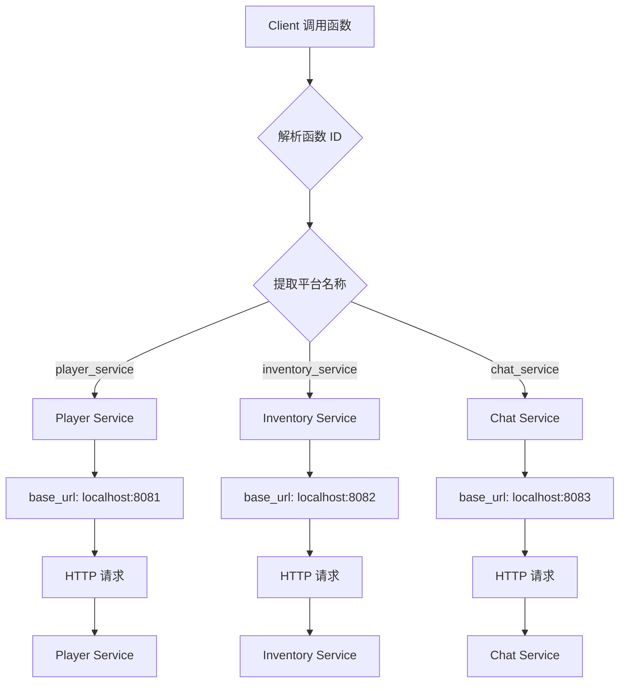

# 🔄 多服务配置指南

## 📋 场景对比

### 场景 A: 单服务多文件（同一端口）

**适用情况**：所有函数指向**同一个后端服务**

```yaml
providers:
  game_functions:
    enabled: true
    type: openapi
    config:
      # ✅ 多个文件，但指向同一个服务
      openapi_specs:
        - ./etc/player-functions.yaml
        - ./etc/inventory-functions.yaml
        - ./etc/chat-functions.yaml

      # ⭐ 单一服务端口
      base_url: http://localhost:18780
```

**注册的函数**：
- `game_functions.player.create` → http://localhost:18780/player/create
- `game_functions.inventory.get` → http://localhost:18780/inventory/get
- `game_functions.chat.send` → http://localhost:18780/chat/send

**架构图**：
```
Agent
  └─ game_functions (base_url: localhost:18780)
       ├─ player functions
       ├─ inventory functions
       └─ chat functions

         ↓

Server (localhost:18780)
  ├─ /player/*
  ├─ /inventory/*
  └─ /chat/*
```

---

### 场景 B: 多服务独立配置（不同端口）⭐

**适用情况**：函数指向**不同的后端服务**

```yaml
providers:
  # 服务 1: 玩家服务 (端口 8081)
  player_service:
    enabled: true
    type: openapi
    config:
      openapi_specs:
        - ./etc/player-functions.yaml
      base_url: http://localhost:8081  # ⭐ 端口 8081

  # 服务 2: 物品服务 (端口 8082)
  inventory_service:
    enabled: true
    type: openapi
    config:
      openapi_specs:
        - ./etc/inventory-functions.yaml
      base_url: http://localhost:8082  # ⭐ 端口 8082

  # 服务 3: 聊天服务 (端口 8083)
  chat_service:
    enabled: true
    type: openapi
    config:
      openapi_specs:
        - ./etc/chat-functions.yaml
      base_url: http://localhost:8083  # ⭐ 端口 8083
```

**注册的函数**：
- `player_service.player.create` → http://localhost:8081/player/create
- `inventory_service.inventory.get` → http://localhost:8082/inventory/get
- `chat_service.chat.send` → http://localhost:8083/chat/send

**架构图**：
```
Agent
  ├─ player_service (base_url: localhost:8081)
  │   └─ player functions
  ├─ inventory_service (base_url: localhost:8082)
  │   └─ inventory functions
  └─ chat_service (base_url: localhost:8083)
      └─ chat functions

        ↓ 分发

Player Service (8081)  Inventory Service (8082)  Chat Service (8083)
      /player/*                 /inventory/*               /chat/*
```

---

## 🎯 如何选择

| 条件 | 场景 A（单服务） | 场景 B（多服务） |
|------|----------------|----------------|
| **后端服务数量** | 1 个 | 多个（2+） |
| **端口数量** | 1 个端口 | 多个端口 |
| **认证方式** | 统一认证 | 独立认证 |
| **速率限制** | 统一限制 | 分别限制 |
| **故障隔离** | ❌ 一个故障全部影响 | ✅ 隔离故障 |
| **配置复杂度** | 简单 | 稍复杂 |

**决策树**：
```
是否只有一个后端服务？
├─ 是 → 使用场景 A（单服务多文件）
└─ 否 → 使用场景 B（多服务独立配置）
```

---

## 📝 实际配置示例

### 示例 1: 微服务架构

**架构**：
- Player Service (8081)
- Inventory Service (8082)
- Chat Service (8083)
- Match Service (8084)

**配置**：
```yaml
providers:
  player_ms:
    enabled: true
    type: openapi
    config:
      openapi_specs: [./etc/player.yaml]
      base_url: http://localhost:8081
      auth:
        type: bearer
        token: "${PLAYER_TOKEN}"

  inventory_ms:
    enabled: true
    type: openapi
    config:
      openapi_specs: [./etc/inventory.yaml]
      base_url: http://localhost:8082
      auth:
        type: bearer
        token: "${INVENTORY_TOKEN}"

  chat_ms:
    enabled: true
    type: openapi
    config:
      openapi_specs: [./etc/chat.yaml]
      base_url: http://localhost:8083
      timeout: 10s  # 聊天需要更快
      auth:
        type: bearer
        token: "${CHAT_TOKEN}"

  match_ms:
    enabled: true
    type: openapi
    config:
      openapi_specs: [./etc/match.yaml]
      base_url: http://localhost:8084
      timeout: 60s  # 匹配需要更长时间
      auth:
        type: bearer
        token: "${MATCH_TOKEN}"
```

### 示例 2: 第三方服务集成

**集成多个外部服务**：
- Prometheus (9090)
- Grafana (3000)
- Alertmanager (9093)
- 外部 API (https://api.example.com)

**配置**：
```yaml
providers:
  prometheus:
    enabled: true
    type: openapi
    config:
      openapi_specs: [../packs/prom/openapi.yaml]
      base_url: http://localhost:9090
      auth:
        type: basic
        username: "${PROM_USER}"
        password: "${PROM_PASS}"

  grafana:
    enabled: true
    type: openapi
    config:
      openapi_specs: [../packs/grafana/openapi.yaml]
      base_url: http://localhost:3000
      auth:
        type: bearer
        token: "${GRAFANA_TOKEN}"

  alertmanager:
    enabled: true
    type: openapi
    config:
      openapi_specs: [../packs/alertmanager/openapi.yaml]
      base_url: http://localhost:9093

  external_api:
    enabled: true
    type: openapi
    config:
      openapi_spec: https://api.example.com/openapi.yaml
      base_url: https://api.example.com
      auth:
        type: api_key
        api_key:
          name: X-API-Key
          value: "${EXT_API_KEY}"
          in: header
```

### 示例 3: 混合架构

**部分本地服务 + 部分外部服务**：

```yaml
providers:
  # 本地游戏服务（单服务多文件）
  game_services:
    enabled: true
    type: openapi
    config:
      openapi_specs:
        - ./etc/player.yaml
        - ./etc/inventory.yaml
        - ./etc/chat.yaml
      base_url: http://localhost:18780

  # 外部监控服务（独立配置）
  prometheus:
    enabled: true
    type: openapi
    config:
      openapi_specs: [../packs/prom/openapi.yaml]
      base_url: http://localhost:9090
      auth:
        type: basic
        username: "${PROM_USER}"
        password: "${PROM_PASS}"
```

---

## 🔍 路由机制

### 函数调用流程



### 函数 ID 解析

**函数 ID 格式**：`{platform_name}.{method_name}`

| 函数 ID | 平台名称 | 方法名称 | 路由到 |
|---------|---------|---------|--------|
| `player_service.player.get` | `player_service` | `player.get` | `localhost:8081` |
| `inventory_service.item.add` | `inventory_service` | `item.add` | `localhost:8082` |
| `chat_service.message.send` | `chat_service` | `message.send` | `localhost:8083` |

---

## ⚙️ 高级配置

### 1. 不同服务的认证

```yaml
providers:
  service_a:
    enabled: true
    type: openapi
    config:
      base_url: http://localhost:8081
      auth:
        type: bearer
        token: "${SERVICE_A_TOKEN}"  # ⭐ 服务 A 的 token

  service_b:
    enabled: true
    type: openapi
    config:
      base_url: http://localhost:8082
      auth:
        type: basic                 # ⭐ 服务 B 使用 basic auth
        username: "${SERVICE_B_USER}"
        password: "${SERVICE_B_PASS}"

  service_c:
    enabled: true
    type: openapi
    config:
      base_url: http://localhost:8083
      auth:
        type: api_key               # ⭐ 服务 C 使用 API key
        api_key:
          name: X-API-Key
          value: "${SERVICE_C_KEY}"
          in: header
```

### 2. 不同服务的超时

```yaml
providers:
  # 即时服务（查询）
  query_service:
    enabled: true
    type: openapi
    config:
      base_url: http://localhost:8081
      timeout: 5s                    # ⭐ 5 秒超时

  # 普通服务（CRUD）
  crud_service:
    enabled: true
    type: openapi
    config:
      base_url: http://localhost:8082
      timeout: 30s                   # ⭐ 30 秒超时

  # 长时间服务（批量处理）
  batch_service:
    enabled: true
    type: openapi
    config:
      base_url: http://localhost:8083
      timeout: 120s                  # ⭐ 120 秒超时
```

### 3. 不同服务的速率限制

```yaml
providers:
  # 低频服务
  low_freq_service:
    enabled: true
    type: openapi
    config:
      base_url: http://localhost:8081
      rate_limit:
        requests_per_minute: 10      # ⭐ 每分钟 10 次
        burst_size: 5

  # 中频服务
  mid_freq_service:
    enabled: true
    type: openapi
    config:
      base_url: http://localhost:8082
      rate_limit:
        requests_per_minute: 100     # ⭐ 每分钟 100 次
        burst_size: 20

  # 高频服务
  high_freq_service:
    enabled: true
    type: openapi
    config:
      base_url: http://localhost:8083
      rate_limit:
        requests_per_minute: 1000    # ⭐ 每分钟 1000 次
        burst_size: 100
```

### 4. 不同服务的重试策略

```yaml
providers:
  # 不重试（幂等性要求）
  no_retry_service:
    enabled: true
    type: openapi
    config:
      base_url: http://localhost:8081
      retry_count: 0                  # ⭐ 不重试

  # 少量重试
  low_retry_service:
    enabled: true
    type: openapi
    config:
      base_url: http://localhost:8082
      retry_count: 2                  # ⭐ 重试 2 次

  # 大量重试（容错要求）
  high_retry_service:
    enabled: true
    type: openapi
    config:
      base_url: http://localhost:8083
      retry_count: 5                  # ⭐ 重试 5 次
```

---

## 🧪 测试和验证

### 1. 测试单个服务

```bash
# 测试 Player Service
curl -X POST http://localhost:18780/api/v1/functions/invoke \
  -H "Content-Type: application/json" \
  -d '{
    "function_id": "player_service.player.get",
    "payload": {"playerId": "ply_1234567890"}
  }'

# 预期：请求路由到 localhost:8081
```

### 2. 测试多个服务

```bash
# Player Service (8081)
curl -X POST http://localhost:18780/api/v1/functions/invoke \
  -d '{"function_id": "player_service.player.get", ...}'

# Inventory Service (8082)
curl -X POST http://localhost:18780/api/v1/functions/invoke \
  -d '{"function_id": "inventory_service.item.get", ...}'

# Chat Service (8083)
curl -X POST http://localhost:18780/api/v1/functions/invoke \
  -d '{"function_id": "chat_service.message.send", ...}'
```

### 3. 验证路由

查看 Agent 日志，确认请求路由到正确的服务：

```bash
tail -f /var/log/croupier-agent.log | grep "calling"
```

**期望输出**：
```
INFO calling provider service=player_service method=player.get url=http://localhost:8081/player/get
INFO calling provider service=inventory_service method=item.get url=http://localhost:8082/item/get
INFO calling provider service=chat_service method=message.send url=http://localhost:8083/message/send
```

---

## 🐛 故障排查

### 问题 1: 函数调用到错误的端口

**症状**：
- 调用 `player_service.player.get`，但请求发到了 8082 而不是 8081

**原因**：
- `base_url` 配置错误

**解决**：
```bash
# 检查配置
grep -A 5 "player_service:" services/agent/etc/providers.multi-service.example.yaml

# 确认 base_url
base_url: http://localhost:8081  # ⭐ 应该是 8081
```

### 问题 2: 认证失败

**症状**：
- 某个服务的所有请求都返回 401

**原因**：
- 环境变量未设置
- Token 错误

**解决**：
```bash
# 检查环境变量
echo $PLAYER_SERVICE_TOKEN
echo $INVENTORY_SERVICE_TOKEN

# 重新设置
export PLAYER_SERVICE_TOKEN="correct-token"
./bin/croupier-agent -config ./services/agent/etc/agent.yaml
```

### 问题 3: 连接被拒绝

**症状**：
- `connection refused` 错误

**原因**：
- 对应端口的服务未启动

**解决**：
```bash
# 检查端口监听
lsof -i :8081
lsof -i :8082
lsof -i :8083

# 启动对应的服务
```

---

## 📊 性能考虑

### 连接池

每个平台都会创建独立的 HTTP 连接池：

```yaml
providers:
  service_a:
    config:
      base_url: http://localhost:8081
      # 连接池 1

  service_b:
    config:
      base_url: http://localhost:8082
      # 连接池 2（独立）
```

**优势**：
- ✅ 隔离故障
- ✅ 独立限流
- ✅ 不同的超时

**劣势**：
- ❌ 更多连接数
- ❌ 更多内存占用

### 建议

- **少量服务（< 10）**：每个服务一个平台
- **大量服务（10+）**：考虑合并相似服务

---

## 🎓 最佳实践

### 1. 命名规范

✅ **推荐**：使用描述性名称
```yaml
player_service:
inventory_service:
chat_service:
```

❌ **不推荐**：使用无意义名称
```yaml
service1:
service2:
service3:
```

### 2. 环境变量管理

```bash
# 使用 .env 文件
cat > .env << EOF
PLAYER_SERVICE_TOKEN=xxx
INVENTORY_SERVICE_TOKEN=yyy
CHAT_SERVICE_TOKEN=zzz
EOF

# 启动时加载
source .env
./bin/croupier-agent -config ./services/agent/etc/agent.yaml
```

### 3. 配置模板

**开发环境**：`providers.dev.yaml`
```yaml
providers:
  player_service:
    enabled: true
    config:
      base_url: http://localhost:8081
      auth:
        token: "${DEV_TOKEN}"
```

**生产环境**：`providers.prod.yaml`
```yaml
providers:
  player_service:
    enabled: true
    config:
      base_url: http://player-service.prod:8081
      auth:
        token: "${PROD_TOKEN}"
```

### 4. 监控

为每个平台添加独立的监控指标：

```go
// 伪代码示例
metrics.Counter("platform_requests_total",
    "platform", "player_service",
    "method", "player.get",
    "status", "200"
)
```

---

## 📖 相关文档

- [快速开始](./QUICKSTART.md)
- [完整指南](./README-OPENAPI.md)
- [多服务配置示例](./providers.multi-service.example.yaml)

---

**最后更新**: 2024-02-07
**版本**: v1.0
