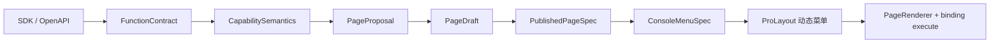

# Croupier Dashboard

`croupier-dashboard` 是 Croupier 的前端管理台。当前 Dashboard 只有一套模型：

```text
SDK / OpenAPI 注册 FunctionContract
  -> 服务端识别 CapabilitySemantics
  -> 生成 PageProposal
  -> 用户预览并接受/发布
  -> PublishedPageSpec 生成 ConsoleMenuSpec
  -> 运行控制台按动态菜单执行
```

函数注册只描述能力，不描述页面。SDK/OpenAPI 不允许提交菜单、分类 labels、页面标题、表格列、按钮位置、布局、mapping 或组件配置。默认页面由平台生成；用户只有在默认页面不满足运营需求时才进入 Page Studio 编辑。

## 快速开始

要求：

- Node.js `>= 24`
- pnpm `>= 9`

常用命令：

```bash
pnpm install
pnpm dev
pnpm build
pnpm test
pnpm lint
pnpm tsc
```

默认访问：`http://localhost:8000`

## 当前模块

- 函数目录：查看已注册函数的契约、语义、风险、权限、实例和调用入口。
- OpenAPI Sources：上传 OpenAPI 文档，绑定 provider，并触发能力识别。
- Resource Catalog：展示资源、能力语义、来源、诊断和人工语义补充入口。
- Proposals：展示默认页面候选，支持预览、接受和发布。
- Page Studio：编辑强类型 `PageSpec` 草稿，处理 needs_review 与契约变更。
- 运行控制台：只读取当前 scope 的 `PublishedPageSpec` 与 `ConsoleMenuSpec`。

## 架构主线



## 页面与路由

- 函数目录：`/system/functions/catalog`
- Resource Catalog：`/system/functions/resource-catalog`
- Proposals：`/system/functions/proposals`
- Page Studio：`/system/functions/pages`
- OpenAPI Sources：`/system/functions/openapi-sources`
- 函数调用测试：`/system/functions/invoke`
- 运行控制台首页：`/console`
- 运行控制台分类页：`/console/:categoryKey`
- 运行控制台页面：`/console/:categoryKey/:pageKey`

## 目录结构

```text
src/
  components/
    PageRenderer/
    SchemaFormRenderer/
  pages/
    Functions/
    ResourceCatalog/
    Proposals/
    PageStudio/
    Console/
    OpenAPISources/
  services/
    api/
      functions.ts
      pages.ts
      resources.ts
      openapi.ts
    console.ts
  types/
    dashboard.ts
  utils/
    consoleMenu.ts
```

## 核心边界

- 表单唯一 runtime：`SchemaFormRenderer`，内部 adapter 固定为 `@rjsf/antd + @rjsf/validator-ajv8`。
- `FormPresentationSpec` 是持久化协议；rjsf `uiSchema` 只能在 renderer 内存派生，不进入 SDK/OpenAPI/PageSpec。
- `PageSpec` 是强类型业务 DSL，不保存 React props、组件树或 ProComponents 名称。
- 动态菜单唯一来源：`PublishedPageSpec[] -> ConsoleMenuSpec -> ProLayout`。
- 动态 labels 只来自 PublishedPageSpec，不写入静态 locale 或字典。
- Scope 唯一来自全局 `game_id + env`，页面内不得二次选择。
- 执行唯一入口是 PublishedPageSpec binding execute API，浏览器不得提交 functionId、target、game/env 覆盖。
- 不提供旧页面或旧表单的自动转换桥；历史数据只允许备份和人工重建。

## 参考文档

- `../docs/architecture/dashboard-page-model.md`
- `../docs/architecture/openapi-sdk-descriptor-v2.md`
- `../docs/architecture/ui-schema-spec.md`
- `../docs/architecture/ui-generation.md`
- `../docs/architecture/console-dynamic-menu.md`
- `../todo.md`

## License

Apache-2.0
