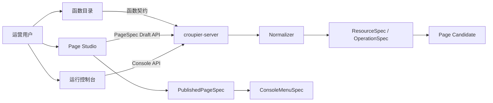
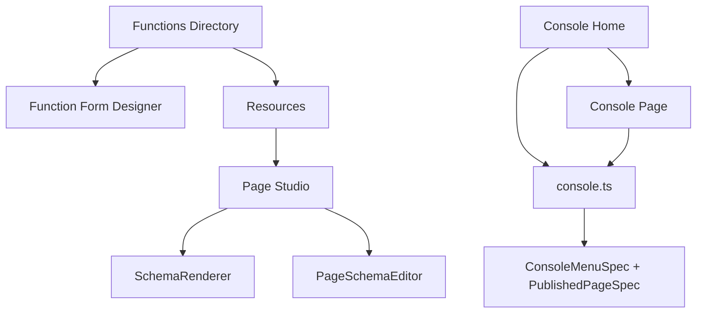

# Croupier Dashboard

<p align="left">
  <a href="https://github.com/cuihairu/croupier">
    
  </a>
  <a href="https://github.com/cuihairu/croupier-dashboard/tree/main">
    
  </a>
  
  
  <a href="https://github.com/cuihairu/croupier-dashboard/actions/workflows/dashboard-quality.yml">
    
  </a>
  <a href="https://github.com/cuihairu/croupier-dashboard/actions/workflows/docker.yml">
    
  </a>
  
  
  
  
</p>

`croupier-dashboard` 是 Croupier 的前端管理台，当前主线已经收敛为：

```text
函数目录 / OpenAPI Source
  -> ResourceSpec / OperationSpec
  -> Page Studio 草稿
  -> PublishedPageSpec
  -> ConsoleMenuSpec
  -> 运行控制台
```

函数注册不负责菜单、页面标题、分类、表格列或布局。页面 UI 只在 Function Form Designer 和 Page Studio 中确定，运行控制台只消费已发布 Page。

## 在线 Demo

- 地址：<https://croupier.cuihairu.site>
- 账号：`admin`
- 密码：`admin123`
- 提示：该账号仅用于演示环境，请勿在生产环境使用默认凭据。

## 当前能力

- 函数目录：查看函数能力、说明、输入/输出契约、调用历史与风险。
- Function Form Designer：管理单函数 Formily Schema override。
- Resources：查看归一化后的 `ResourceSpec` 与 `OperationSpec`。
- Page Studio：生成页面候选、编辑 PageSpec 草稿、预览、校验、发布、回滚。
- 运行控制台：只渲染当前 scope 的 `PublishedPageSpec`，左侧菜单只来自 `ConsoleMenuSpec`。
- OpenAPI Sources：上传 OpenAPI 文档、做 provider binding、产出 page candidate diagnostics。

## 快速开始

- Node.js `>= 22`
- pnpm `>= 9`

安装与启动：

```bash
pnpm install
pnpm dev
```

默认访问：`http://localhost:8000`

常用命令：

```bash
pnpm dev
pnpm build
pnpm test
pnpm lint
pnpm tsc
```

## 架构主线



前端模块关系：



## 页面与路由

- 函数目录：`/system/functions`
- 资源视图：`/system/functions/resources`
- 页面工作台：`/system/functions/pages`
- 函数表单设计器：`/system/functions/:functionId/form-designer`
- OpenAPI Sources：`/system/functions/openapi-sources`
- 运行控制台首页：`/console`
- 运行控制台分类页：`/console/:categoryKey`
- 运行控制台页面：`/console/:categoryKey/:pageKey`

## 目录结构

```text
src/
  app.tsx
  access.ts
  components/
    formily/
    FunctionFormManager/
  pages/
    Functions/
    Resources/
    PageStudio/
    Console/
  services/
    api/
      functions.ts
      resources.ts
      pages.ts
      openapi.ts
    console.ts
  utils/
    consoleMenu.ts
```

## 核心协议

前端只接受下面几类运行协议：

- `Function Form`：单函数 Formily JSON Schema。
- `PageSpec`：草稿态页面协议，包含分类、多语言、binding、页面组件树。
- `PublishedPageSpec`：发布快照，运行控制台只读取它。
- `ConsoleMenuSpec`：左侧动态菜单来源。

边界约束：

- 函数注册字段不进入动态菜单、页面标题或按钮文案。
- 运行控制台不再读取旧 `workspace_configs`、`entity` 或静态 locale 生成动态菜单。
- 所有页面和函数表单 UI 都必须是 Formily JSON Schema。
- 非 Formily Schema 必须直接报错，不允许降级成第二套 UI 协议。
- 页面执行只能通过 `PublishedPageSpec` 中的 binding 调用后端。

## 前端 API

函数与资源：

- `GET /api/v1/functions`
- `GET /api/v1/functions/:id`
- `GET /api/v1/functions/:id/form`
- `PUT /api/v1/functions/:id/form`
- `GET /api/v1/resources`
- `GET /api/v1/resources/:resourceKey/generated-pages`

Page Studio：

- `GET /api/v1/pages`
- `GET /api/v1/pages/:pageKey`
- `PUT /api/v1/pages/:pageKey`
- `POST /api/v1/pages/:pageKey/validate`
- `POST /api/v1/pages/:pageKey/preview`
- `POST /api/v1/pages/:pageKey/publish`
- `POST /api/v1/pages/:pageKey/unpublish`
- `GET /api/v1/pages/:pageKey/versions`
- `POST /api/v1/pages/:pageKey/rollback`

运行控制台：

- `GET /api/v1/console/menu`
- `GET /api/v1/console/pages`
- `GET /api/v1/console/pages/:pageKey`
- `POST /api/v1/console/pages/:pageKey/bindings/:bindingId/execute`

## 权限与访问

- 资源页：`resources:*`
- 页面工作台：`pages:read/edit/publish/rollback`
- 运行控制台：`console:read`
- OpenAPI Sources：`openapi_sources:*`
- 父级“函数与页面”入口按子权限聚合显示，不再绑定旧 `workspaces:*` 权限。

## 开发约束

- 动态分类和页面标题必须来自 `PageSpec` / `PublishedPageSpec`，不要往 `web/src/locales/*/menu.ts` 里加动态键。
- 不要恢复 `WorkspaceEditor`、`workspaceConfig service`、`Entity API`、旧 renderer 协议或旧 mock。
- 不要在浏览器里根据函数名重新推断页面类型、分类或分页字段。
- 新增页面组件时，必须同时补齐：
  - Page 组件 ABI 定义
  - 服务端校验
  - Formily 渲染支持
  - Page Studio 编辑能力
  - 运行控制台验收

## 参考文档

- `docs/architecture/dashboard-page-model.md`
- `docs/architecture/ui-schema-spec.md`
- `docs/api/page.md`
- `docs/api/resource.md`
- `docs/api/function.md`

## 与主仓库关系

- 主仓库：`https://github.com/cuihairu/croupier`
- 本仓库负责前端管理台，不负责业务函数实现

## License

Apache-2.0
